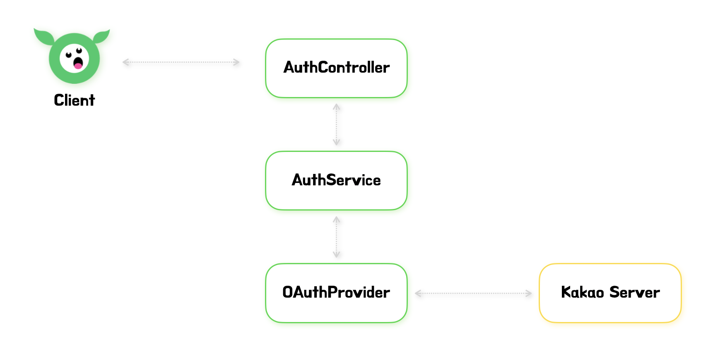

> 이 글은 우테코 피움팀 크루 '[조이](https://github.com/yeonkkk)'가 작성했습니다.  


## 시작하기 전에
---
피움 프로젝트에서는 OAuth 2.0을 이용해 로그인을 구현하였습니다.   
즉, 로그인 과정이 외부 API에 의존적이라고 볼 수 있는 것이죠.

서비스를 제공할 때 문제가 되는 부분은 아니지만, 로그인에 대한 테스트 코드를 작성할 때는 문제가 될 수 있습니다.

그렇다면 어떻게 외부 API에 의존하지 않고 테스트 코드를 작성할 수 있을까요?
피움 프로젝트를 통해서 그 방법을 살펴보겠습니다.

글을 읽기 전에 몇 가지 사항들을 체크해 봅시다.

<br><br>

### 1.  테스트
> 이 글은 테스트 방법에 대해서 다루지만, 특정 테스트 종류들에 대해서 설명하지 않습니다.   
> 특정 테스트에 대한 지식이 필요하시거나 궁금하시다면 아래 자료들을 참고해주시면 감사하겠습니다.

- [단위 테스트 vs 통합 테스트 vs 인수 테스트](https://tecoble.techcourse.co.kr/post/2021-05-25-unit-test-vs-integration-test-vs-acceptance-test/)
- [Spring Boot 슬라이스 테스트](https://tecoble.techcourse.co.kr/post/2021-05-18-slice-test/)

<br><br>

### 2. 개발 환경
> 이 글은 아래와 같은 환경에서 진행한 내용을 다룹니다.

- spring boot 3.1.1

- java 17


<br><br><br><br>

## 테스트할 코드 파악하기
---
> 이 글은 OAuth 2.0을 이용한 로그인 구현 방법이 아닌 테스트 방법에 대해서만 설명합니다.    
> 그렇기 때문에 테스트 코드와 밀접한 관련이 있는 코드만 가볍게 확인하고 넘어가겠습니다.  
> 만약 자세한 구현 과정에 대해 알고 싶다면 아래 자료를 참고해주세요!

- [피움블로그 - OAuth 2.0 로그인 구현하기 (카카오)](https://blog.pium.life/OAuth2.0-backend/)

- [피움 깃허브 레포지토리](https://github.com/woowacourse-teams/2023-pium)

<br><br><br><br>




그림을 통해 코드의 흐름을 먼저 생각해보겠습니다.

로그인 요청이 들어오면 `AuthController`가 요청을 확인한 후 `AuthService`를 호출합니다.

`AuthService`에서는 `OAuthProvider`를 호출하여 `Kakao server`로 필요한 정보를 요청합니다.

`OAuthProvider`는 `Kakao server`에 액세스 토큰 발급을 요청하고 사용자 정보를 요청합니다.

흐름을 파악했다면 코드를 간단히 확인한 후 테스트 방법에 대해 알아봅시다!  
<br><br>

### AuthController


```java
@Validated
@RestController
@RequiredArgsConstructor
public class AuthController {

	// ...
    
    private final AuthService authService;

    @PostMapping("/login")
    public ResponseEntity<Void> login(
            @RequestParam(name = "code") @NotBlank String code,
            HttpServletRequest request) {
        Member loginMember = authService.login(code);

		// ...
    }
	// ...
}
```

<br><br>

### AuthService

```java
@Service
@Transactional(readOnly = true)
@RequiredArgsConstructor
public class AuthService {

    private final MemberRepository memberRepository;
    private final OAuthProvider provider;

    @Transactional
    public Member login(String authorizationCode) {
        KaKaoAccessTokenResponse accessTokenResponse = provider.getAccessToken(authorizationCode);
        String accessToken = accessTokenResponse.getAccessToken();

        KakaoMemberResponse kakaoMemberResponse = provider.getMemberInfo(accessToken);
        Long kakaoId = kakaoMemberResponse.getId();
		
        // ...
    }
}

```

<br><br>

### OAuthProvider

```java
@Component
@RequiredArgsConstructor
public class OAuthProvider {

    public static final String AUTHORIZATION_HEADER = "Authorization";
    public static final String GRANT_TYPE = "authorization_code";
    public static final String TOKEN_TYPE = "Bearer ";

    @Value("${auth.kakao.token-request-uri}")
    private String tokenRequestUri;

    @Value("${auth.kakao.member-info-request-uri}")
    private String memberInfoRequestUri;

    @Value("${auth.kakao.client-id}")
    private String clientId;

    @Value("${auth.kakao.admin-id}")
    private String adminId;

    @Value("${auth.kakao.redirect-uri}")
    private String redirectUri;

    @Value("${auth.kakao.unlink-uri}")
    private String unLinkUri;

    private final RestTemplate restTemplate;

    public KakaoMemberResponse getMemberInfo(String accessToken) {
        try {
            HttpHeaders httpHeaders = new HttpHeaders();
            httpHeaders.set(AUTHORIZATION_HEADER, TOKEN_TYPE + accessToken);
            httpHeaders.setContentType(MediaType.APPLICATION_FORM_URLENCODED);

            HttpEntity<Object> request = new HttpEntity<>(httpHeaders);

            return restTemplate.postForEntity(memberInfoRequestUri, request, KakaoMemberResponse.class)
                    .getBody();
        } catch (HttpClientErrorException e) {
            throw new KaKaoMemberInfoRequestException(e.getMessage());
        } catch (HttpServerErrorException e) {
            throw new KakaoServerException(e.getMessage());
        }
    }

    public KaKaoAccessTokenResponse getAccessToken(String authorizationCode) {
        try {
            HttpHeaders httpHeaders = new HttpHeaders();
            httpHeaders.setContentType(MediaType.APPLICATION_FORM_URLENCODED);

            MultiValueMap<String, String> body = new LinkedMultiValueMap<>();
            body.add("grant_type", GRANT_TYPE);
            body.add("client_id", clientId);
            body.add("redirect_uri", redirectUri);
            body.add("code", authorizationCode);

            HttpEntity<MultiValueMap<String, String>> request = new HttpEntity<>(body, httpHeaders);

            return restTemplate.postForEntity(
                    tokenRequestUri, request, KaKaoAccessTokenResponse.class).getBody();
        } catch (HttpClientErrorException e) {
            throw new KakaoTokenRequestException(e.getMessage());
        } catch (HttpServerErrorException e) {
            throw new KakaoServerException(e.getMessage());
        }
    }
	// ...
}
```

<br><br><br><br>


## Mockito, MockMvc 이용하기
---
> 먼저 `Mockito`, `MockMvc` 등을 통한 mocking을 생각해볼 수 있습니다.

`AuthController`에 대한 슬라이스 테스트에 적용한 코드를 통해 그 방법을 알아보겠습니다.

`AuthService`를 `MockBean`으로 주입한 후 카카오 서버에 요청을 하는 로직이 담긴 service를 mocking 하고, 예상한 대로 작업이 수행되었는지 테스트합니다.

service 레이어에서도 `OAuthProvider`를 동일한 방법으로 mocking 하여 테스트할 수 있습니다.


### AuthControllerTest

```java
@WebMvcTest(controllers = AuthController.class)
class AuthControllerTest extends UITest {

    @Autowired
    private MockMvc mockMvc;

    @MockBean
    private AuthService authService;

    @Nested
    class 로그인_ {

        @Test
        void 정상_요청_시_200_반환() throws Exception {

           given(authService.login(anyString())).willReturn(Member.builder()
                    .kakaoId(12345L)
                    .build()); 

            mockMvc.perform(post("/login")
                            .queryParam("code", "authorization code")
                            .contentType(MediaType.APPLICATION_JSON_VALUE))
                    .andExpect(status().isOk())
                    .andDo(print());
        }

		// ...
    }
    // ...
}

```

<br><br>


### 한계점
이 방법은 특정 레이어에 대한 테스트를 수행하기에 적합하고 효율적일 수 있습니다.
하지만 실제 운영 환경과 같은 조건에서 사용자 시나리오를 테스트해야하는 인수테스트를 진행하는 경우 적합하지 않을 수 있습니다.


<br><br><br><br>


## MockRestServiceServer 이용하기
---
> 두번째 방법으로는 Http 통신을 가능하게 하는 `RestTemplate`를 mocking 하는 방법입니다.  
> `RestTemplate`을 mocking하기 위해 `MockRestServiceServer`를 이용할 수 있습니다.  
> [MockRestServiceServer](https://docs.spring.io/spring-framework/docs/current/javadoc-api/org/springframework/test/web/client/MockRestServiceServer.html)는 `RestTemplate`를 테스트 하기 위한 Spring에서 제공하는 테스트 라이브러리입니다.


### OAuthProviderTest

`OAuthProvider` 테스트를 통해 그 방법을 알아보겠습니다.  
전체 코드를 확인 후 세부적인 내용을 확인해보겠습니다.

```java
@SpringBootTest
class OAuthProviderTest {

    @Value("${auth.kakao.token-request-uri}")
    private String TOKEN_REQUEST_URI;

    @Value("${auth.kakao.member-info-request-uri}")
    private String MEMBER_INFO_REQUEST_URI;

    @Autowired
    private OAuthProvider supporter;

    @Autowired
    private RestTemplate restTemplate;

    private MockRestServiceServer mockServer;

    @BeforeEach
    void setUp() {
        mockServer = MockRestServiceServer.createServer(restTemplate);
    }

    @Test
    void 사용자_정보_조회() {
        String accessToken = "access token";
        Long kakaoId = 12345L;

        String response = String.format("{\"id\":\"%d\"}", kakaoId);

        mockServer.expect(requestTo(MEMBER_INFO_REQUEST_URI))
                .andExpect(content().contentType("application/x-www-form-urlencoded"))
                .andExpect(method(HttpMethod.POST))
                .andExpect(header(AUTHORIZATION_HEADER, TOKEN_TYPE + accessToken))
                .andRespond(withSuccess(response, MediaType.APPLICATION_JSON));

        KaKaoMemberInfoResponse memberInfoResponse = supporter.getMemberInfo(accessToken);

        assertThat(memberInfoResponse.getId()).isEqualTo(kakaoId);
    }

    @Test
    void 액세스_토큰_조회() {
        String authorizationCode = "authorization code";
        String accessToken = "access token";
        String response = String.format("{\"access_token\":\"%s\"}", accessToken);

        mockServer.expect(requestTo(TOKEN_REQUEST_URI))
                .andExpect(content().contentType("application/x-www-form-urlencoded;charset=utf-8"))
                .andExpect(method(HttpMethod.POST))
                .andRespond(withSuccess(response, MediaType.APPLICATION_JSON));

        KaKaoAccessTokenResponse tokenResponse = supporter.getAccessToken(authorizationCode);

        assertThat(tokenResponse.getAccessToken()).isEqualTo(accessToken);
    }
}

```

<br><br>


- 동일한 URL에 대한 응답 값이 다를 경우를 고려해 서버를 새로 생성해주도록 합니다.
```java
@SpringBootTest
class OAuthProviderTest {
    // ... 
    @BeforeEach
    void setUp() {
        mockServer = MockRestServiceServer.createServer(restTemplate);
    }
    // ... 
}
```

<br><br>

- 요청 조건과 응답 값을 설정해줍니다.

    - `requestTo(String URI)` : 요청할 URI를 설정합니다.
    - `method(HttpMethod method)`: 요청할 메서드를 설정합니다. 기본 값은 `GET` 입니다.
    - `header()`: 요청 시 보내야하는 헤더를 설정합니다. key-value 순서로 작성합니다.
    - `andRespond()`: 돌아와야하는 응답 값을 설정합니다. 응답은 아래와 같이 String으로 작성합니다.
    - 이외에도 status code, contentType 등도 설정할 수 있습니다.

```java
@SpringBootTest
class OAuthProviderTest {
    // ... 
    @Test
    void 사용자_정보_조회() {
        // ...
        
        String response = String.format("{\"id\":\"%d\"}", kakaoId);

        mockServer.expect(requestTo(MEMBER_INFO_REQUEST_URI))
                .andExpect(content().contentType("application/x-www-form-urlencoded"))
                .andExpect(method(HttpMethod.POST))
                .andExpect(header(AUTHORIZATION_HEADER, TOKEN_TYPE + accessToken))
                .andRespond(withSuccess(response, MediaType.APPLICATION_JSON));
        // ...
    }
    // ... 
}
```

<br><br>

이렇게 직접 `MockRestServiceServer`를 생성해주지 않고 `@RestClientTest`를 사용하는 방법도 있습니다.

자세한 내용은 [기억보단 기록을(이동욱님) - Spring Boot에서 외부 API 테스트하기](https://jojoldu.tistory.com/341) 를 참고하시면 좋을 것 같습니다.


<br><br>


### 한계점
이 방법은 mock server를 이용하기 때문에 앞선 방법과 다르게 인수테스트에서도 사용이 가능합니다.  
하지만 테스트 시 `RestTemplate`과 `MockRestServiceServer`를 매번 생성해주어야 하고, 적용되는 테스트들에 다수의 중복 코드가 발생할 수 있습니다.  
뿐만 아니라 응답 값을 문자열로 작성해주어야 하기 때문에 가독성이 떨어집니다.


<br><br><br><br>


## Kakao Server Mocking하기
---
> 마지막 방법으로 가짜 카카오 서버를 만들어서 mocking하는 방법입니다.  
> 즉, 카카오 서버 대신 요청을 수행해줄 controller를 생성하는 것입니다.

### AuthApiTest
아래와 같이 로그인 요청을 테스트하는 코드를 작성합니다.  
이 때, `@SpringBootTest(webEnvironment = WebEnvironment.DEFINED_PORT)` 를 사용하여 원하는 포트에서 테스트가 진행되도록 설정해주어야 합니다.

그 이유는 카카오 서버를 대신해 요청을 수행해줄 controller로 우리가 요청을 보낼 때 해당 포트를 기재해주어야 하기 때문입니다.

(아래 `application.properties`의 `auth.kakao.token-request-uri`와 `auth.kakao.member-info-request-uri` 참고)


```java
@SpringBootTest(webEnvironment = WebEnvironment.DEFINED_PORT)
public class AuthApiTest {

    @Test
    void 로그인_정상_요청_시_200_반환() {
        ExtractableResponse<Response> response = RestAssured
                .given()
                .log().all()
                .queryParam("code", "authorizationCode")
                .when()
                .post("/login")
                .then()
                .log().all()
                .statusCode(HttpStatus.OK.value())
                .extract();

        // ...
    }
    
    // ...
}
```

<br><br>

### application.properties
main의 `application.properties` 와 동일하게 카카오 서버에 정보를 요청하기 위한 정보들(redirect uri, client id 등)을 test 시 사용되는 `application.properties`에 작성해줍니다.

여기서 = `server.port`로 지정한 포트에서 `@SpringBootTest(webEnvironment = WebEnvironment.DEFINED_PORT)` 테스트가 진행됩니다.

이 때, `server.port`로 지정한 포트와 요청 URI(`auth.kakao.token-request-uri`, `auth.kakao.member-info-request-uri`) 의 포트가 동일해야 요청이 정상적으로 수행됩니다.

```properties
server.port=8888
auth.kakao.token-request-uri=http://localhost:8888/oauth/token
auth.kakao.member-info-request-uri=http://localhost:8888/user/me
auth.kakao.redirect-uri=http://localhost:8888/authorization
auth.kakao.client-id=clientId

```

<br><br>


### MockKakaoServerController
카카오 서버 대신 요청을 처리해 줄 컨트롤러를 작성하여, 요청 조건과 원하는 응답을 설정해줍니다.

```java
@RestController
public class MockKakaoServerController {

// ...

    @PostMapping(path = "/oauth/token", consumes = MediaType.APPLICATION_FORM_URLENCODED_VALUE)
    public ResponseEntity<KaKaoAccessTokenResponse> getAccessToken(HttpEntity<String> request) {
    
		// ...
        
        KaKaoAccessTokenResponse response = KaKaoAccessTokenResponse.builder()
                .accessToken("access token")
                .build();

        return ResponseEntity.ok(response);
    }

    @PostMapping(path = "/user/me", consumes = MediaType.APPLICATION_FORM_URLENCODED_VALUE)
    public ResponseEntity<KakaoMemberResponse> getMemberInfo(@RequestHeader(HttpHeaders.AUTHORIZATION) String token) {
 		
        // ...

        KakaoMemberResponse response = KakaoMemberResponse.builder()
                .id(54321L)
                .build();

        return ResponseEntity.ok(response);
    }
}

```


<br><br><br><br>


## 참고 자료
---

[PROLOG - OAuth를 사용하는 로직의 테스트를 외부 API에 의존하지 않게 해보자](https://prolog.techcourse.co.kr/studylogs/2500)

[외부 API Mocking하여 테스트하기](https://velog.io/@jurlring/%EC%99%B8%EB%B6%80-API-Mocking%ED%95%98%EC%97%AC-%ED%85%8C%EC%8A%A4%ED%8A%B8%ED%95%98%EA%B8%B0#%EC%8B%9C%EB%8F%84-2---resttemplate-mocking)  
