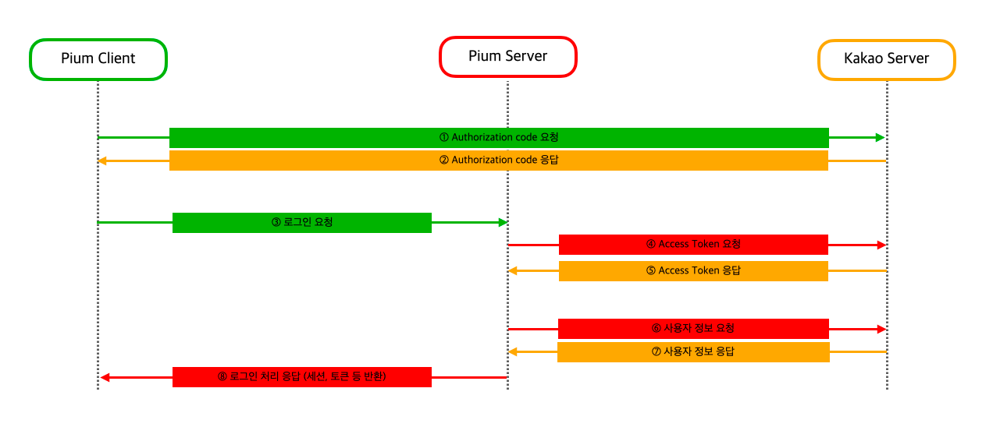

> 이 글은 우테코 피움팀 크루 '[조이](https://github.com/yeonkkk)'가 작성했습니다.

## 시작하기 전에

피움 프로젝트에서 **OAuth 2.0**을 이용해 **카카오 로그인**을 구현하여 그 과정을 기록해보려 합니다.

그럼 본격적으로 글을 읽기 전에 몇 가지 사항들을 체크해 봅시다.

<br><br>

### 1.  OAuth 2.0 기초 개념
> 이 글은 **독자가 OAuth 2.0 개념을 알고 있다는 가정 하**에 작성 되었습니다.  
> 만약 OAuth 2.0에 대한 기본적인 개념을 파악하고 싶다면 아래 자료를 참고해주세요.


- [Tecoble - OAuth 개념 및 동작 방식 이해하기](https://tecoble.techcourse.co.kr/post/2021-07-10-understanding-oauth/)
- [Tecoble - OpenID와 OAuth2.0](https://tecoble.techcourse.co.kr/post/2022-10-24-openID-Oauth/)

<br><br>

### 2. 개발 환경
> 이 글은 아래와 같은 환경에서 구현한 내용을 설명하고 있습니다.

- spring boot 3.1.1

- java 17


<br><br>

### 3. 설정하기
> 카카오 로그인 흐름을 이해하기 위해 카카오에서 제공하는 공식 문서를 숙지합니다.  
> 카카오 공식 문서를 참고하여 서비스 애플리케이션을 생성 및 설정 합니다.  
> 원하는 정보를 요청하기 위해 API를 파악합니다.

- 카카오 로그인 이해하기: [Kakao Developers - 카카오 로그인 이해하기](https://developers.kakao.com/docs/latest/ko/kakaologin/common)

- 카카오 애플리케이션 생성 및 설정하기: [Kakao Developers - 카카오 로그인 설정하기](https://developers.kakao.com/docs/latest/ko/kakaologin/prerequisite)

- 카카오 REST API 확인하기: [Kakao Developers - 카카오 로그인 REST API](https://developers.kakao.com/docs/latest/ko/kakaologin/rest-api)

<br><br><br><br>


## 환경 구성하기
>우리는 클라이언트의 입장으로 카카오 서버에 요청을 보내야 합니다.  
> 이를 위해 먼저 내부에서 요청을 보낼 클라이언트 객체를 생성해 줍니다.

<br><br>

### RestTemplate
> 스프링 어플리케이션에서 HTTP 요청할 때 사용하는 방법으로 `RestTemplate`과 `WebClient`가 있습니다.  
> 우리는 그 중 `RestTemplate`를 이용할 것입니다.   
> 관련 내용은 글의 마지막에 다루도록 하겠습니다.

기본 스프링 부트 의존성을 추가하면 `RestTemplate` 관련 의존성은 자동으로 추가됩니다.

```groovy
implementation 'org.springframework.boot:spring-boot-starter-web'
```


<br><br>

`RestTemplate`은 자동으로 빈 등록이 되지 않기 때문에 아래와 같이 직접 등록해주어야 합니다.

```java
@Configuration
public class AuthConfig {

    @Bean
    public RestTemplate restTemplate(RestTemplateBuilder restTemplateBuilder) {
        return restTemplateBuilder.build();
    }
}
```

<br><br>


### 클라이언트 객체 생성하기

HTTP 통신을 위한 `RestTemplate` 세팅이 끝났으니 클라이언트 역할을 할 객체를 생성합니다.  
우리는 이 클라이언트 객체를 이용하여 액세스 토큰 요청, 사용자 정보 요청, 회원 탈퇴 요청 등 카카오 서버로 다양한 요청을 보낼 것입니다.

```java
@Component
@RequiredArgsConstructor
public class OAuthProvider {

    public static final String AUTHORIZATION_HEADER = "Authorization";
    public static final String GRANT_TYPE = "authorization_code";
    public static final String TOKEN_TYPE = "Bearer ";

    @Value("${auth.kakao.token-request-uri}")
    private String tokenRequestUri;

    @Value("${auth.kakao.member-info-request-uri}")
    private String memberInfoRequestUri;
    
    @Value("${auth.kakao.redirect-uri}")
    private String redirectUri;

    @Value("${auth.kakao.client-id}")
    private String clientId;

    private final RestTemplate restTemplate;

}

```


- 액세스 토큰 요청, 사용자 정보 요청, 회원 탈퇴 요청 등의 요청 시 `RestTemplate`을 반복적으로 사용해야하기 때문에 필드로 두었습니다.

- 카카오 서버로 요청을 보낼 때 반복적으로 사용되는 정보들을 필드로 두었습니다.

<br><br>


### 민감 정보 관리
> 요청에 사용되는 정보들 중 REST API 키나 SECRET과 같은 민감한 정보들은 `@Value` 애너테이션과 `application.properties` 파일을 이용해서 분리하여 관리할 수 있습니다.


`application.properties`는 아래와 같이 작성할 수 있습니다.  
(피움 프로젝트에서는 `properties` 파일을 사용하였지만, `yml` 파일도 동일한 방식으로 사용할 수 있습니다)

```properties
auth.kakao.token-request-uri= 액세스 토큰을 요청할 카카오 URI
auth.kakao.member-info-request-uri= 사용자 정보를 요청할 카카오 URI
auth.kakao.redirect-uri= kakao developers에서 설정한 리다이렉트 URI
auth.kakao.client-id= kakao developers에서 애플리케이션 생성 시 발급 받은 REST API 키
```


해당 내용에 대해 더 알아보고 싶으시다면 아래 글을 참고하시면 좋을 것 같습니다.

- [Tecoble - Spring Boot에서 properties 값 주입받기](https://tecoble.techcourse.co.kr/post/2020-09-29-spring-properties-binding/)


<br><br><br><br>


## 로그인 구현하기
카카오 로그인은 OAuth 2.0 프로토콜 중 `Authorization Code Grant` 방식을 사용합니다.  
그렇기 때문에 우리가 수행해야 할 요청은 아래와 같이 3개로 나눠볼 수 있습니다.

- `authorization code` 요청

- `access token` 요청

- 사용자 정보 요청

<br><br>

### 동작 과정
> 피움 서비스에서 구현한 로그인은 아래와 같이 동작합니다.  
> 피움의 경우 사용자 인증 방식으로 세션을 사용하고 있습니다.  
> 이 글에서는 OAuth 2.0에 대해 다루고 있으므로 관련 내용은 생략합니다.

 



위 그림과 같이 카카오 서버에 요청해야하는 정보 중 하나인 `authorization code`는 피움의 클라이언트에서 카카오 서버에 요청한 후 피움 서버로 로그인 요청 시 사용합니다.   
즉, **피움 서버에서는 카카오 서버로 액세스 토큰 요청과 사용자 정보 요청만 진행**할 것입니다.

<br><br>

### 액세스 토큰 요청하기
> [KAKAO REST API - 토큰받기](https://developers.kakao.com/docs/latest/ko/kakaologin/rest-api#request-token)를 참고하여 액세스 토큰을 요청합니다.

#### 요청

```
curl -v -X POST "https://kauth.kakao.com/oauth/token" \
 -H "Content-Type: application/x-www-form-urlencoded" \
 -d "grant_type=authorization_code" \
 -d "client_id=${REST_API_KEY}" \
 --data-urlencode "redirect_uri=${REDIRECT_URI}" \
 -d "code=${AUTHORIZE_CODE}"
```

#### 응답

```
HTTP/1.1 200 OK
Content-Type: application/json;charset=UTF-8
{
    "token_type":"bearer",
    "access_token":"${ACCESS_TOKEN}",
    "expires_in":43199,
    "refresh_token":"${REFRESH_TOKEN}",
    "refresh_token_expires_in":5184000,
    "scope":"account_email profile"
}
```

<br><br>

#### KaKaoAccessTokenResponse Dto

액세스 토큰만 받을 것이기 때문에 `String`으로 받을수도 있으나, 이후에 추가적인 정보를 받는 것으로 명세가 변경될 수 있기에 DTO를 작성하였습니다.

```java
@Getter
@Builder
@NoArgsConstructor(access = AccessLevel.PRIVATE)
@AllArgsConstructor(access = AccessLevel.PRIVATE)
public class KaKaoAccessTokenResponse {

    @JsonProperty("access_token")
    private String accessToken;
}
```

<br><br>

#### 카카오 서버로 액세스 토큰 요청하기

```java
@Component
@RequiredArgsConstructor
public class OAuthProvider {

    // ...

    public KaKaoAccessTokenResponse getAccessToken(String authorizationCode) {
        try {
            HttpHeaders httpHeaders = new HttpHeaders();
            httpHeaders.setContentType(MediaType.APPLICATION_FORM_URLENCODED);

            MultiValueMap<String, String> body = new LinkedMultiValueMap<>();
            body.add("grant_type", GRANT_TYPE);
            body.add("client_id", clientId);
            body.add("redirect_uri", redirectUri);
            body.add("code", authorizationCode);

            HttpEntity<MultiValueMap<String, String>> request = new HttpEntity<>(body, httpHeaders);

            return restTemplate.postForEntity(
                    tokenRequestUri, request, KaKaoAccessTokenResponse.class).getBody();
        } catch (HttpClientErrorException e) {
            throw new KakaoTokenRequestException(e.getMessage());
        } catch (HttpServerErrorException e) {
            throw new KakaoServerException(e.getMessage());
        }
    }

    // ...
}

```

- 헤더 생성

    - 카카오 REST API 명세에 따라 `HttpHeaders`를 이용해 header를 생성하여 Content Type을 `application/x-www-form-urlencoded` 로 설정합니다.

- 바디 생성

    - `MultiValueMap`을 이용하여 요청 시 사용될 body 를 `key-value` 형태로 만들어줍니다.
    - 카카오 REST API 명세에 따라 grant_type, client_id, redirect_uri, code 를 파라미터로 넣어줍니다.

- 리퀘스트 생성

    - 앞서 설정한 header와 body로 `HttpEntity`를 생성합니다.

- 카카오 서버에 요청하기

    - 카카오 REST API 명세에 따라 POST 메서드를 이용해서 요청을 보낼 것 입니다.
    - [RestTemplate](https://docs.spring.io/spring-framework/docs/current/javadoc-api/org/springframework/web/client/RestTemplate.html)에서 제공하는 POST 메서드는 총 3가지로 목적에 따라 `postForObject()`, `postForEntity()`, `postForLocation()` 중에 선택해서 사용할 수 있습니다.
    - 우리는 응답 값을 `ResponseEntity`로 받을 것이므로`RestTemplate`의 `postForEntity()` 메서드를 이용하여 요청을 보냈습니다.
    - 인자 값으로는 `URI`, `Request`, `ResponseType` 을 넣어줍니다.

<br><br>


### 사용자 정보 요청하기
> [KAKAO REST API - 사용자 정보 가져오기](https://developers.kakao.com/docs/latest/ko/kakaologin/rest-api#req-user-info)를 참고하여 응답으로 받은 액세스 토큰으로 사용자 정보를 요청합니다.

#### 요청

```
curl -v -X POST "https://kapi.kakao.com/v2/user/me" \
  -H "Content-Type: application/x-www-form-urlencoded" \
  -H "Authorization: Bearer ${ACCESS_TOKEN}" \
```

#### 응답
응답 값은 수집 항목에 따라 달라질 수 있습니다.  
피움 프로젝트의 경우 사용자의 회원 ID만 수집하므로 다른 정보는 생략하였습니다.

```
HTTP/1.1 200 OK
{
    "id":123456789,
    "connected_at": "2022-04-11T01:45:28Z"
    ...
}
```

<br><br>

#### KakaoMemberResponse Dto

회원 ID 역시 Long으로 바로 받을수도 있으나, 이후에 추가적인 정보를 받는 것으로 명세가 변경될 수 있기에 DTO를 작성하였습니다.

```java
@Getter
@Builder
@NoArgsConstructor(access = AccessLevel.PRIVATE)
@AllArgsConstructor(access = AccessLevel.PRIVATE)
public class KakaoMemberResponse {

    private Long id;
}
```

<br><br>

#### 카카오 서버로 사용자 정보 요청하기

```java
@Component
@RequiredArgsConstructor
public class OAuthProvider {

    // ...

    public KakaoMemberResponse getMemberInfo(String accessToken) {
        try {
            HttpHeaders httpHeaders = new HttpHeaders();
            httpHeaders.set(AUTHORIZATION_HEADER, TOKEN_TYPE + accessToken);
            httpHeaders.setContentType(MediaType.APPLICATION_FORM_URLENCODED);

            HttpEntity<Object> request = new HttpEntity<>(httpHeaders);

            return restTemplate.postForEntity(memberInfoRequestUri, request, KakaoMemberResponse.class)
                    .getBody();
        } catch (HttpClientErrorException e) {
            throw new KaKaoMemberInfoRequestException(e.getMessage());
        } catch (HttpServerErrorException e) {
            throw new KakaoServerException(e.getMessage());
        }
    }

    public KaKaoAccessTokenResponse getAccessToken(String authorizationCode) {
        // ...
    }

    // ...
}

```


- 헤더 생성

    - 카카오 REST API 명세에 따라 `HttpHeaders`를 이용해 header를 생성하여 Content Type을 `application/x-www-form-urlencoded` 로 설정합니다.
    - 카카오 REST API 명세에 따라 authorization 헤더를 추가하여 액세스 토큰 값을 넣어줍니다.

- 리퀘스트 생성

    - 앞서 설정한 header로 `HttpEntity`를 생성합니다.

- 카카오 서버에 요청하기

    - 이번에도 카카오 REST API 명세에 따라 POST 메서드를 이용해서 요청을 보낼 것 입니다.
    - 이번에도 응답을`ResponseEntity`로 받을 것이므로`RestTemplate`의 `postForEntity()` 메서드를 이용하여 요청을 보냅니다.
    - 인자 값으로는 `URI`, `Request`, `ResponseType` 을 넣어줍니다.

<br><br>


### controller 구현하기
> 피움 클라이언트에서 로그인 요청을 보낼 수 있도록 controller 및 api를 구현합니다.  
> controller의 경우 각 서비스의 명세에 맞게 작성하시면 됩니다.

#### 요청

```
POST "https://pium.life/login?code={AUTHORIZATION_CODE}"
```

#### 응답

```
HTTP/1.1 200 OK
```

<br><br>

#### controller
```java
@Validated
@RestController
@RequiredArgsConstructor
public class AuthController {

    private final AuthService authService;

    @PostMapping("/login")
    public ResponseEntity<Void> login(
            @RequestParam(name = "code") @NotBlank String code) {
        Member loginMember = authService.login(code);
        
        // ...
        
        return ResponseEntity.ok().build();
    }
}

```

<br><br>


### service 구현하기
> 앞서 구현한 `OAuthProvider`를 호출하여 로그인을 처리합니다.
> 해당 레이어에서 각 서비스의 규정에 따라 서비스 내 인증 방식(토큰, 세션 등)을 적용할 수 있습니다.   
> (이 글에서는 OAuth 2.0를 이용한 로그인만 다루고 있기 때문에 해당 내용은 생략합니다)


```java
@Service
@Transactional(readOnly = true)
@RequiredArgsConstructor
public class AuthService {

    private final OAuthProvider provider;

    @Transactional
    public Member login(String authorizationCode) {
        KaKaoAccessTokenResponse accessTokenResponse = provider.getAccessToken(authorizationCode);
        String accessToken = accessTokenResponse.getAccessToken();

        KakaoMemberResponse kakaoMemberResponse = provider.getMemberInfo(accessToken);
        
        // ...
    }
}
```

<br><br><br><br>

## 추가로 고려해 볼 사항

### RestTemplate vs WebClient
스프링 어플리케이션에서 HTTP 요청할 때 사용하는 방법으로 [RestTemplate과 WebClient](https://tecoble.techcourse.co.kr/post/2021-07-25-resttemplate-webclient/)가 있습니다.

현재 스프링 부트를 사용하고 있기 때문에 RestTemplate을 사용한다면 별도의 의존성 추가가 필요하지 않습니다. 하지만 WebClient를 사용하기 위해서는 webflux 의존성을 추가해주어야 합니다.
또한 로그인 처리를 위해 카카오 서버의 응답이 필수적이기 때문에 WebClient의 특징이 큰 이점이 되지 않는다고 느껴 `RestTemplate`을 사용하였습니다.

만약 이후 서비스 규모가 커지고, deprecated 소식이 있다면 `WebClient`로의 대체를 고려할 수도 있을 것 같습니다.

다른 대체 방안으로 Spring Boot3.2에 새롭게 추가될 [RestClient](https://github.com/spring-projects/spring-boot/wiki/Spring-Boot-3.2.0-M1-Release-Notes) 도 고려해볼 수 있겠습니다.

<br><br>

### 다수의 Provider 고려하기
현재 피움 서비스에서는 카카오 로그인만을 제공하고 있습니다.
만약 이후에 구글 로그인, 네이버 로그인 등 다른 provider를 이용하게 된다면 현재의 코드로는 적용이 불가합니다.  
이 점을 고려하여 추상화를 통해 유연한 로그인 서비스를 제공하는 방법을 생각해볼 수 있겠습니다.

<br><br><br><br>

## 끝으로

OAuth 2.0 을 통해 카카오 로그인을 구현하는 방법을 알아보았습니다.  
다음 글에서는 구현한 로그인에 대한 테스트 방법을 다뤄보도록 하겠습니다.  
글을 읽어주셔서 감사합니다!  


