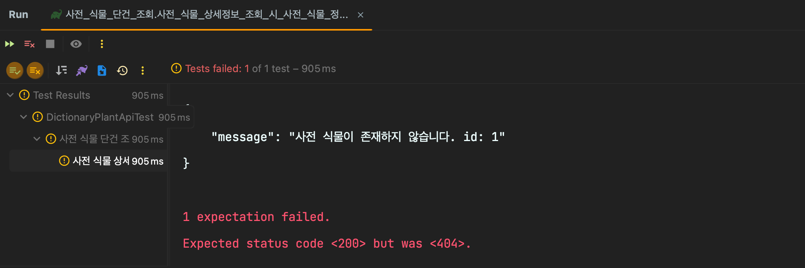
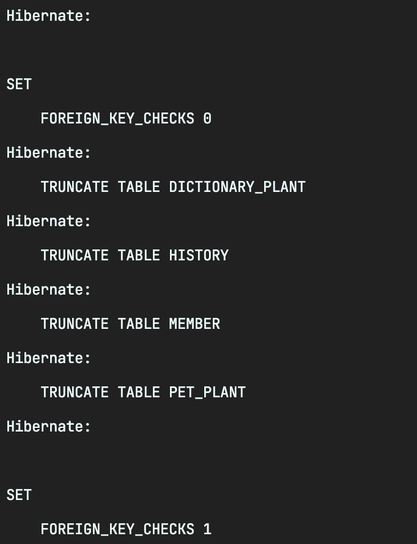
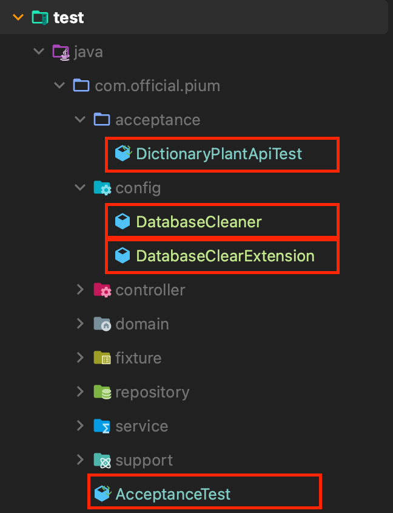

> 이 글은 우테코 피움팀 크루 '[주노](https://github.com/Choi-JJunho)'가 작성했습니다.

## 서론

인수테스트를 작성하면서 다음과 같은 문제가 발생했다.

- RestAssured를 사용하고 있다.
- 각 테스트별로 (DB)데이터가 격리된 테스트를 수행하고 싶다.

이에 다음과 같은 시행착오를 거쳤다.

> 최종적으로 작성된 코드를 보고싶다면 최종코드를 확인해주세요.

## 시행착오


```java
@Transactional
@SpringBootTest(webEnvironment = SpringBootTest.WebEnvironment.RANDOM_PORT)
class DictionaryPlantApiTest {
  ...
}
```

JPA를 사용하고 있는 현 시점에서`@Transactional`을 이용해서 하나의 테스트(트랜잭션)이 끝날 때 데이터가 롤백되는 현상을 기대했다.

```java
@Test
void 사전_식물_상세정보_조회_시_사전_식물_정보_반환() {

    // dictionaryPlantRepository.save() 에 대한 Fixture
    DictionaryPlant REQUEST = dictionaryPlantSupport.builder().build();

    DictionaryPlantResponse RESPONSE = RestAssured
            .given().log().all()
            .when()
            .get("/dictionary-plants/{id}", REQUEST.getId())
            .then()
            .log().all()
            .statusCode(HttpStatus.OK.value())
            .extract().as(DictionaryPlantResponse.class);
    );
    
    ...
}
```



하지만 테스트를 수행할 때 JPARepository로 save한 값을 RestAssured를 이용해 조회하면 데이터가 반영되지 않는 문제가 발생했다.

### 문제 인식

[Stack Overflow](https://stackoverflow.com/questions/41763417/api-test-transactional-rollback)의 다음 글을 읽어본 뒤 다음과 같은 지식을 얻었다.

> @Transactional only works within the same thread, and as such the rollback provided by Spring will only work on the objects that were persisted on the thread where the transaction was started.
Your rest-assured test will perform an integration test and will hit your Spring context on another thread. So although your rest-assured test would be able to see the objects persisted in your test setup, Spring will never be able to cleanup resources persisted in your rest-assured test automatically.
The only way to tackle this is to delete the entities yourself in your test (Using an Junit Rule, or cleaning up any state in your test setup).

요약하면 다음과 같다.

> 트랜잭션은 동일한 스레드 내에서 동작한다.
Spring에서 제공하는 롤백은 트랜잭션이 시작된 스레드 내에서 생긴 객체에 대해서만 동작한다.
RestAssured는 별도의 스레드를 통해 Spring 컨텍스트를 이용한다.
이 때문에 RestAssured는 전역적으로 설정된 데이터 (Data.sql과 같은 설정으로 생긴 데이터)에는 접근할 수 있으나 Transaction과 같이 별도의 스레드에서만 제공되는 값에 대해서는 접근할 수 없다.
... (해결방법 후략)

위와 같이 별도의 RestAssured의 요청이 스레드로 동작하기 때문에 하나의 트랜잭션에서 별개로 저장한 값에 접근할 수 없다는 결론이 나왔다.

> 자세한 내용은 [하마드의 트러블슈팅 글](https://pium-official.github.io/transactional-not-in-restassured/)을 참고해주세요~

## 해결방법

이 문제에 대해서 다양한 해결방법이 존재하고 각각의 장단점을 비교한 뒤 최종적으로 어떤 방식을 선택할지 고민해보자.

### 1️⃣ DirtiesContext 사용하기

매 테스트마다 Context를 새롭게 띄워서 데이터를 매번 초기화하는 방법을 생각해볼 수 있다.

#### 장점

컨텍스트를 다시 로드하면서 테스트간 격리 환경을 명확하게 구분할 수 있다.

#### 단점

- 매 테스트마다 컨텍스트를 다시 로드하기 때문에 속도가 상대적으로 느리다.
- @Nested 내부에 정의되어있는 테스트에 대해 DirtiesContext가 적용되지 않는 문제가 있다.
  [Spring @Nested 관련 공식 문서](https://docs.spring.io/spring-framework/reference/testing/testcontext-framework/support-classes.html#testcontext-junit-jupiter-nested-test-configuration)
  @Nested 내부에 정의된 테스트에 DirtiesContext를 전파하기 위해 아래 설정을 추가해줘야한다.

```java
// 클래스레벨에 다음 어노테이션을 추가해주거나
@NestedTestConfiguration(value = NestedTestConfiguration.EnclosingConfiguration.OVERRIDE)
```

혹은 properteis 설정을 변경해주는 방식도 존재한다.

```properties
# properties 파일에 다음 설정을 추가해주어 전역적으로 @Nested 기본 전략을 설정할 수 있다.
spring.test.enclosing.configuration=OVERRIDE
```
> 참고 문서 : [Changing the default enclosing configuration inheritance mode](https://docs.spring.io/spring-framework/reference/testing/annotations/integration-junit-jupiter.html#integration-testing-annotations-nestedtestconfiguration)

### 2️⃣ @SQL 사용하기

@SQL 어노테이션을 사용하여 매 테스트 실행 전 SQL 스크립트를 실행하여 테이블을 다시 만들 수 있다.

```java
@Sql("classpath:init.sql")
@SpringBootTest(webEnvironment = SpringBootTest.WebEnvironment.RANDOM_PORT)
class DictionaryPlantApiTest {
  ...
}
```

#### 장점

- 여러 스크립트를 수행할 수 있다.
- 스키마 초기화 후 테이터도 함께 넣을 수 있다.

#### 단점

- 테스트에 사용하는 DB가 변경되었을 때 해당 벤더사의 Dialect에 맞게 SQL문을 고쳐줘야한다.
- 쿼리를 텍스트로 관리하다보니 컴파일타임에 오류를 잡기 어렵다.
- 테이블 연관관계가 존재하는 경우 쿼리문 작성 순서에 신경을 많이 써야한다.

### 3️⃣ InitializingBean 사용하기

`InitializingBean`을 이용하여 스프링 Bean이 초기화, 소멸 될 때 행위를 추가할 수 있다.

```java
// InitializingBean의 생김새
public interface InitializingBean {
	void afterPropertiesSet() throws Exception;
}
```

이를 이용해 @Test 어노테이션으로 Bean이 등록될 때 마다 DB을 초기화하는 상황을 기대할 수 있다.

**Entity Manager를 이용해 DB 초기화하기**

JPA를 사용하는 입장으로 SQL문을 작성하기 보다는 EntityManager를 이용해보는것이 정적인 쿼리 관리에 들이는 소요가 적을 것이라고 생각된다.

이에 EntityManager를 이용하여 DB를 초기화하는 방법을 알아보자.

> 아래부터는 https://ttl-blog.tistory.com/1407 를 참고하여 진행된 글입니다.

#### table 이름 조회하기

```java
@Component
@Profile("test")
public class DatabaseCleaner implements InitializingBean {

	// 테이블 이름들을 저장할 List
    private final List<String> tables = new ArrayList<>();

	// 엔티티 매니저를 선언한다
    @PersistenceContext
    private EntityManager entityManager;

    @SuppressWarnings("unchecked")
    @PostConstruct
    public void findDatabaseTableNames() {
        List<Object[]> tableInfos = entityManager.createNativeQuery("SHOW TABLES").getResultList();
        for (Object[] tableInfo : tableInfos) {
            String tableName = (String) tableInfo[0];
            tableNames.add(tableName);
        }
    }
}
```

EntityManager를 이용하여 모든 테이블의 이름을 가져온다.

#### 테이블 초기화하기 & 실행하기

```java
@Component
@Profile("test")
public class DatabaseCleaner implements InitializingBean {

	// 테이블 이름들을 저장할 List
    private final List<String> tables = new ArrayList<>();

	// 엔티티 매니저를 선언한다
    @PersistenceContext
    private EntityManager entityManager;

	// 테이블 이름을 조회한다
    @SuppressWarnings("unchecked")
    @PostConstruct
    public void findDatabaseTableNames() {
        ...
    }
    
    // 테이블을 초기화한다
    private void truncate() {
        entityManager.createNativeQuery(String.format("SET FOREIGN_KEY_CHECKS %d", 0)).executeUpdate();
        for (String tableName : tableNames) {
            entityManager.createNativeQuery(String.format("TRUNCATE TABLE %s", tableName)).executeUpdate();
        }
        entityManager.createNativeQuery(String.format("SET FOREIGN_KEY_CHECKS %d", 1)).executeUpdate();
    }

    @Override
    public void afterPropertiesSet() throws Exception {
        findDatabaseTableNames();
    }

    @Transactional
    public void clear() {
        entityManager.clear();
        truncate();
    }
}
```
truncate를 수행하여 모든 테이블의 데이터를 초기화하고 실행한다.

결과적으로 봤을 때 다음과 같은 흐름으로 데이터베이스 초기화가 수행된다.

- Bean이 생성된 이후 Table 이름을 찾는다.
- 영속성 컨텍스트의 1차 캐시를 비우고 테이블을 초기화한다.

#### 테스트코드에 적용하기

인수테스트를 `AcceptanceTest`로 분리하고 상속받는 구조로 변경했다.

```java
@SpringBootTest(webEnvironment = SpringBootTest.WebEnvironment.RANDOM_PORT)
public class AcceptanceTest {

    @LocalServerPort
    int port;

    @Autowired
    private DatabaseCleaner databaseCleaner;

    @BeforeEach
    void setUp() {
        RestAssured.port = port;
        databaseCleaner.clear();
    }
}
```

작업한 내용을 적용하면 위와 같이 코드를 작성할 수 있다.

#### 장점

- 테스트 코드가 쿼리에 의존적이지 않다.
- 설정을 분리하여 관리할 수 있다.

#### 단점

- JPA에 종속적인 설정이기 때문에 JPA를 사용하지 않거나 ORM을 제외하는 상황을 고려한다면 해당 방식의 도입을 생각해볼 필요가 있다.
- AcceptenceTest 이외에 다른 통합테스트에서 사용하려면 중복된 코드를 작성해야한다.
- Bean 생성 주기에 대한 설정이기 때문에 해당 클래스를 프로덕션에 남용할 수 있는 가능성이 존재한다.
    - 테스트 코드지만 프로덕션에도 적용될 수 있는 설정이 그닥 마음에 들진 않는다.

### 4️⃣ JUnit5 Extension 사용하기

현재 코드는 AcceptenceTest를 사용하는 코드에 대해서만 DB 초기화를 진행하고있다.

RestAssured가 별도의 스레드에서 동작하기 때문에 위와같이 구성했지만 별도의 통합 테스트에서도 DB 초기화 설정이 필요할 수 있다.

@BeforeEach 내부에 clear를 선언하지 않고도 간단한 설정만으로 DB 초기화 로직을 적용하도록 개선해보자.

이를 위해 JUnit5의 Extension을 사용하여 해당 설정을 리팩터링해볼 것이다.

#### JUnit5 Extension이란?

Junit5에서 제공하는 테스트의 생명주기에 대해 각각의 환경에 대해 확장할 수 있도록 제공하는 인터페이스다.

다음과 같은 생성주기에 대한 확장을 제공한다.


- BeforeAllCallback - @BeforeAll 실행 전에 실행된다.
- BeforeEachCallback - @BeforeEach 실행 전에 실행된다.
- BeforeTestExecutionCallback - 각 테스트가 실행되기 직전에 실행된다.
- AfterTestExecutionCallback : 각 테스트가 종료된 후 실행된다.
- AfterEachCallback : @AfterEach 실행 이후에 실행된다.
- AfterAllCallback : @AfterAll 실행 이후에 실행된다.


> Referenced By https://ttl-blog.tistory.com/1407

#### BeforeEachCallback 이용하기

현재 `@BeforeEach`에서 DatabaseCleaner가 수행되고 있으므로 `@BeforeEach` 이전에 실행될 수 있도록 `BeforeEachCallback`을 이용해보자.

Extension을 이용하기 위해 기존에 DatabaseCleaner에 붙어있던 `implements InitializingBean`은 제거해줬다.

```java
@Component
public class DatabaseCleaner {

    private final List<String> tableNames = new ArrayList<>();

    @PersistenceContext
    private EntityManager entityManager;

	// 바뀐부분 : 의존성 주입이후 초기화 수행 시 Table을 조회한다.
    @PostConstruct
    @SuppressWarnings("unchecked")
    private void findDatabaseTableNames() {
        List<Object[]> tableInfos = entityManager.createNativeQuery("SHOW TABLES").getResultList();
        for (Object[] tableInfo : tableInfos) {
            String tableName = (String) tableInfo[0];
            tableNames.add(tableName);
        }
    }

    private void truncate() {
        entityManager.createNativeQuery(String.format("SET FOREIGN_KEY_CHECKS %d", 0)).executeUpdate();
        for (String tableName : tableNames) {
            entityManager.createNativeQuery(String.format("TRUNCATE TABLE %s", tableName)).executeUpdate();
        }
        entityManager.createNativeQuery(String.format("SET FOREIGN_KEY_CHECKS %d", 1)).executeUpdate();
    }

    @Transactional
    public void clear() {
        entityManager.clear();
        truncate();
    }
}
```

이후 `DatabaseClearExtension` 클래스를 다음과 같이 생성해준다.

```java
public class DatabaseClearExtension implements BeforeEachCallback {

    @Override
    public void beforeEach(ExtensionContext context) throws Exception {
        DatabaseCleaner databaseCleaner = getDataCleaner(context);
        databaseCleaner.clear();
    }

    private DatabaseCleaner getDataCleaner(ExtensionContext extensionContext) {
        return SpringExtension.getApplicationContext(extensionContext)
                .getBean(DatabaseCleaner.class);
    }
}
```

#### 간결해진 테스트코드

```java
@ExtendWith(DatabaseClearExtension.class)
@SpringBootTest(webEnvironment = SpringBootTest.WebEnvironment.RANDOM_PORT)
public class AcceptanceTest {

    @LocalServerPort
    int port;

    @BeforeEach
    void setUp() {
        RestAssured.port = port;
    }
}
```

이제 `@ExtendWith(DatabaseClearExtension.class)` 어노테이션만 붙여주면 테스트별로 DB를 초기화할 수 있다.

각 테스트별로 truncate 문도 잘 수행되는 것을 확인할 수 있다.


## 🚀 정리

다양한 방법을 시도해보면서 결론적으로 BeforeEachCallback을 사용하는 방식까지 적용해봤다.
깔끔하게 정리된 테스트를 보니 기분이 좋다. 👍

### 최종 코드



패키지 구조는 위와 같이 구성되었고 각각의 코드는 다음과 같다.

```java
// DatabaseCleaner.java
@Component
public class DatabaseCleaner {

    private final List<String> tableNames = new ArrayList<>();

    @PersistenceContext
    private EntityManager entityManager;

    @SuppressWarnings("unchecked")
    @PostConstruct
    private void findDatabaseTableNames() {
        List<Object[]> tableInfos = entityManager.createNativeQuery("SHOW TABLES").getResultList();
        for (Object[] tableInfo : tableInfos) {
            String tableName = (String) tableInfo[0];
            tableNames.add(tableName);
        }
    }

    private void truncate() {
        entityManager.createNativeQuery(String.format("SET FOREIGN_KEY_CHECKS %d", 0)).executeUpdate();
        for (String tableName : tableNames) {
            entityManager.createNativeQuery(String.format("TRUNCATE TABLE %s", tableName)).executeUpdate();
        }
        entityManager.createNativeQuery(String.format("SET FOREIGN_KEY_CHECKS %d", 1)).executeUpdate();
    }

    @Transactional
    public void clear() {
        entityManager.clear();
        truncate();
    }
}

// DatabaseClearExtension.java
public class DatabaseClearExtension implements BeforeEachCallback {

    @Override
    public void beforeEach(ExtensionContext context) throws Exception {
        DatabaseCleaner databaseCleaner = getDataCleaner(context);
        databaseCleaner.clear();
    }

    private DatabaseCleaner getDataCleaner(ExtensionContext extensionContext) {
        return SpringExtension.getApplicationContext(extensionContext)
                .getBean(DatabaseCleaner.class);
    }
}

// AcceptanceTest.java
@ExtendWith(DatabaseClearExtension.class)
@SpringBootTest(webEnvironment = SpringBootTest.WebEnvironment.RANDOM_PORT)
public class AcceptanceTest {

    @LocalServerPort
    int port;

    @BeforeEach
    void setUp() {
        RestAssured.port = port;
    }
}


// DictionaryPlantApiTest.java

class DictionaryPlantApiTest extends AcceptanceTest {
	...
}
```

## Reference

https://ttl-blog.tistory.com/1407
https://mangkyu.tistory.com/264
https://stackoverflow.com/questions/41763417/api-test-transactional-rollback
https://stackoverflow.com/questions/62142428/dirtiescontext-does-not-work-with-nested-tests
https://unluckyjung.github.io/testcode/2021/05/08/Independent-Test-Mehod/
https://www.baeldung.com/junit-5-extensions