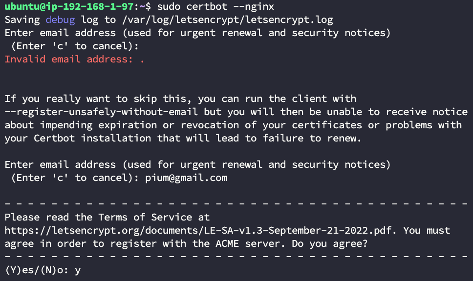
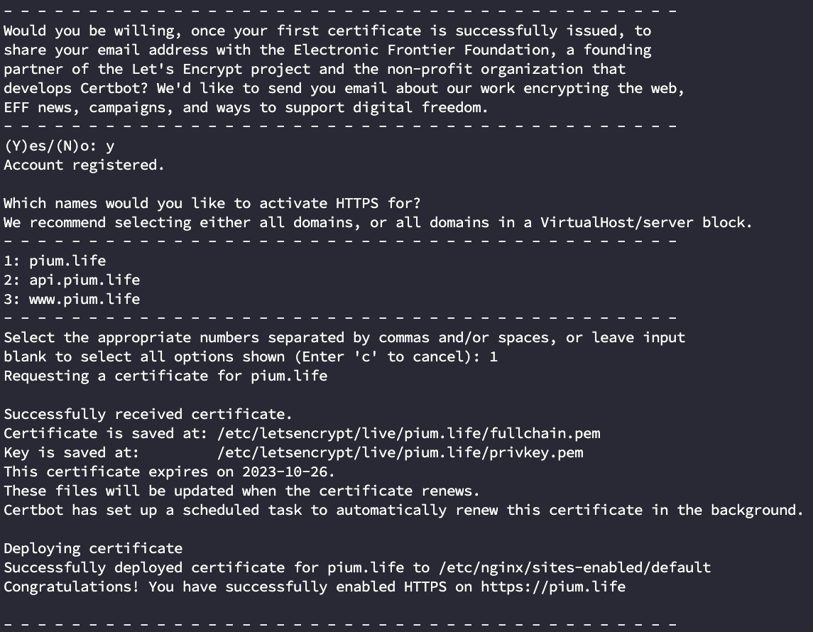
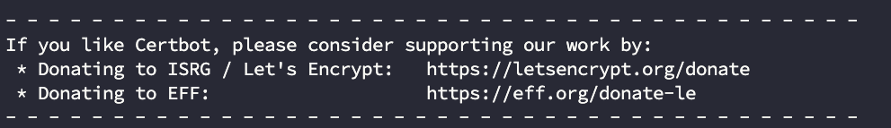
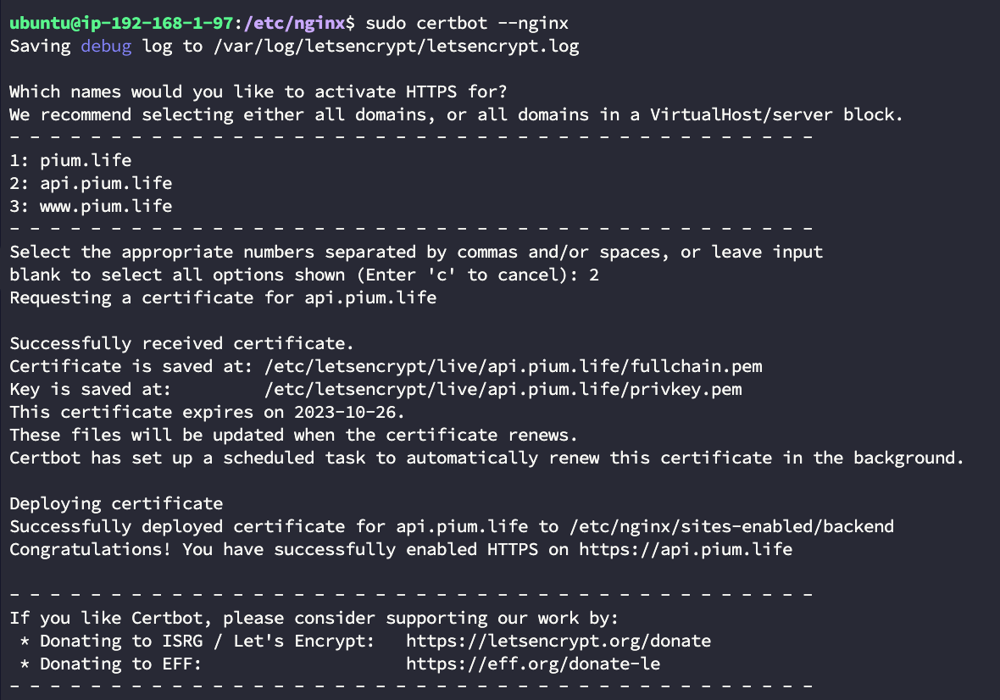
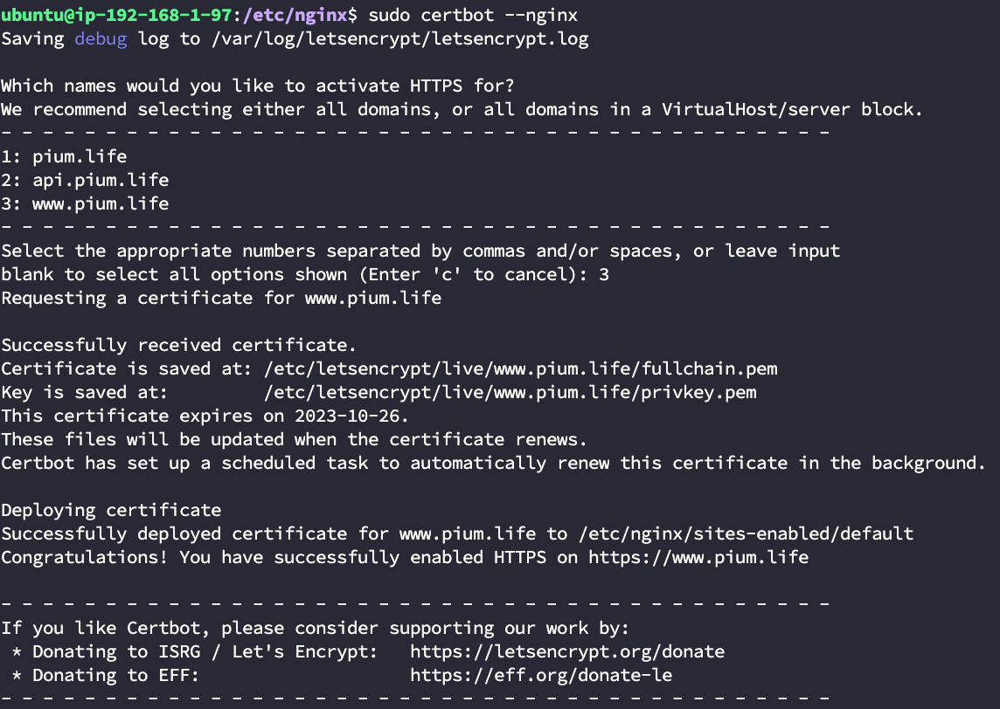

> 이 글은 우테코 피움팀 크루 '[주노](https://github.com/Choi-JJunho)', '[그레이](https://github.com/kim0914)', '[조이](https://github.com/yeonkkk)', '[하마드](https://github.com/rawfishthelgh)'가 작성했습니다.


## 서론

현재 HTTP 요청으로 이뤄져있다.

## Certbot 설치

서버에 HTTPS 설정을 해보자
[Certbot 공식문서](https://certbot.eff.org/)

> 공식문서의 가이드를 따라 작성된 문서입니다.
> https://certbot.eff.org/instructions


```shell
# certbot을 설치하기 위한 snap을 설치한다.
sudo snap install hello-world

# 이미 설치되어있는 certbot을 제거한다.
sudo apt-get remove certbot

# certbot을 설치한다.
sudo snap install --classic certbot

# certbot이 잘 설치되어있는지 확읺나다.
sudo ln -s /snap/bin/certbot /usr/bin/certbot

# certbot을 nginx에 연결하기
sudo certbot --nginx
```
## HTTPS 설정

### pium.life 추가







### api.pium.life 추가



### www.pium.life 추가


```shell
# certbot이 SSL 인증서를 자동 갱신하는 cron을 등록한다
sudo certbot renew --dry-run
```

## NGINX 설정 확인

NGINX 설정에 다음과 같이 certbot이 HTTPS 설정을 추가한 것을 확인할 수 있다.


## Let's Encrypt와 Certbot

Let's Encrypt와 Certbot으로 SSL 인증서를 적용해보자.


