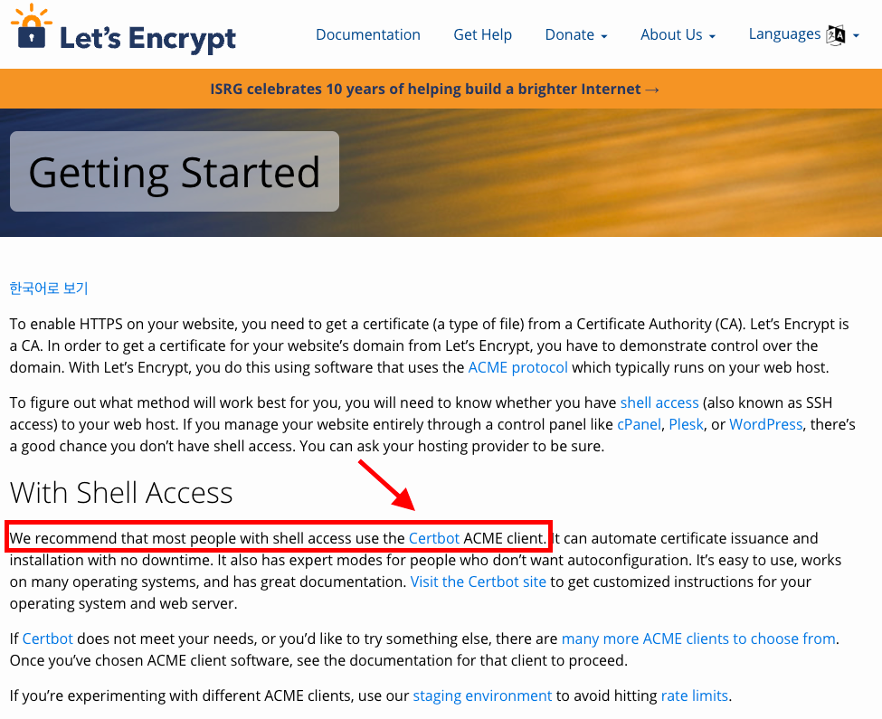
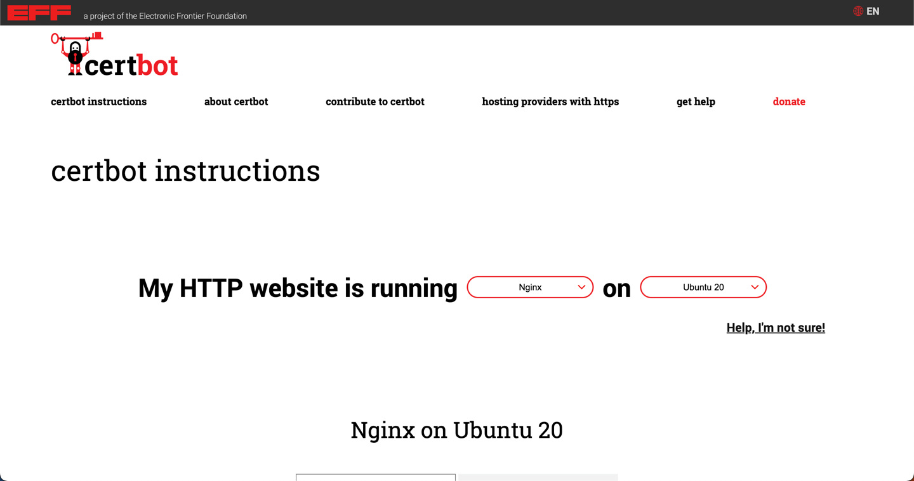
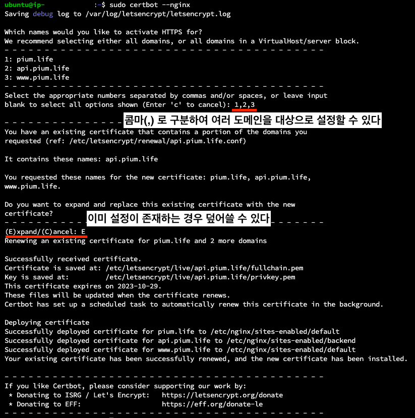
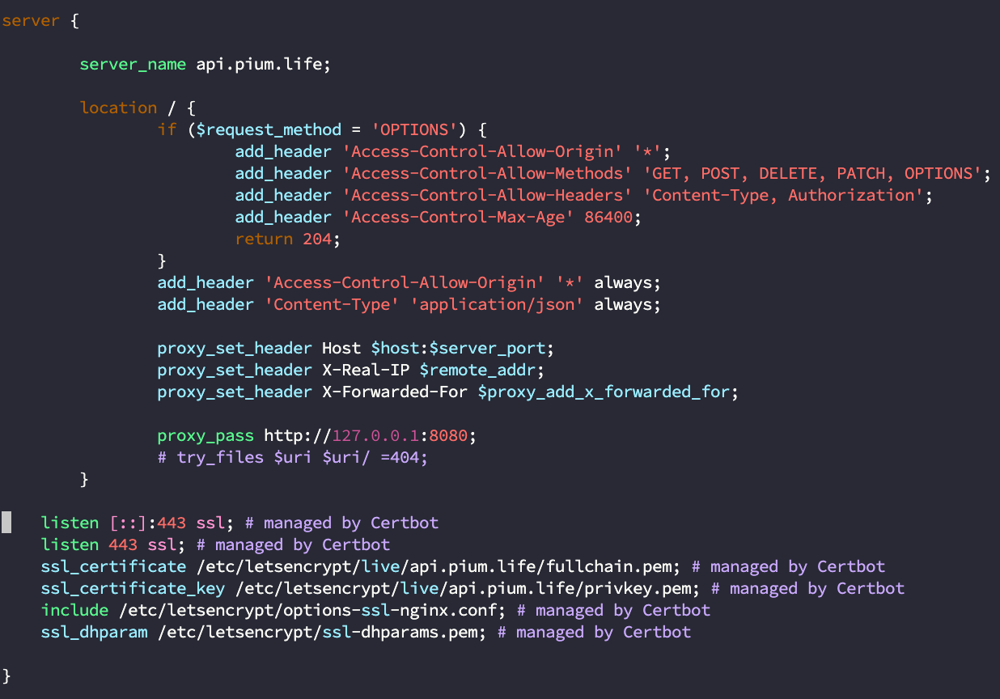

> 이 글은 우테코 피움팀 크루 '[주노](https://github.com/Choi-JJunho)', '[그레이](https://github.com/kim0914)', '[조이](https://github.com/yeonkkk)', '[하마드](https://github.com/rawfishthelgh)'가 작성했습니다.


## 서론

현재 피움팀 서버는 `HTTP` 요청으로 이뤄져있다.
`HTTP`는 WWW 상에서 정보를 주고 받는 프로토콜인데, 누군가 네트워크에서 신호를 가로채면 내용이 노출되는 문제가 발생할 수 있다.
이를 해결해주는 프로토콜이 바로 `HTTPS`이다.

`HTTPS`는 정보를 암호화하는 SSL을 이용한 프로토콜이다. 
현재는 TLS 방식도 사용되는데 여기에서 **핵심은 보안 문제를 해결하기 위해 암호화**를 한다는 것이다.

대칭키와 공개키, 인증서와 같은 방식을 사용해 HTTPS를 적용할 수 있다.
이번 글에서는 `Certbots`을 이용해 `HTTPS`를 nginx에 쉽게 설치하고 적용하는 방법을 다뤄본다.

HTTP, HTTPS에 대한 자세한 내용은 별도의 글에서 다룰 예정이다.

`Let's Encrypt`에서는 인증서를 무료로 발급해주고 있고 `Certbots`과 함께 사용하기를 권장하기 때문에 `Certbots`을 사용하기로 결정했다.  

이 내용은 아래 이미지에서 확인할 수 있다.  



## Certbot 설치

서버에 HTTPS 설정을 해보자
[Certbot 공식문서](https://certbot.eff.org/)

> 공식문서의 가이드를 따라 작성된 문서입니다.
> https://certbot.eff.org/instructions



```shell
# certbot을 설치하기 위한 snap을 설치한다.
sudo apt update
sudo apt install snapd

# 이미 설치되어있는 certbot을 제거한다.
sudo apt-get remove certbot

# certbot을 설치한다.
sudo snap install --classic certbot

# certbot이 잘 설치되어있는지 확인한다.
sudo ln -s /snap/bin/certbot /usr/bin/certbot

# certbot을 nginx에 연결하기
sudo certbot --nginx
```
## HTTPS 설정



## NGINX 설정 확인

NGINX 설정에 다음과 같이 certbot이 HTTPS 설정을 추가한 것을 확인할 수 있다.



## Reference

- https://certbot.eff.org/instructions
