> 이 글은 우테코 피움팀 크루 '[주노](https://github.com/Choi-JJunho)'가 작성했습니다.
 

## 서론

피움팀의 기술블로그를 만들기까지의 험난한 과정을 정리해보려고 한다.

## 플랫폼 선정

팀 블로그를 작성하기 위해 다양한 플랫폼들을 고려해봤다.

### 티스토리

티스토리는 팀 블로그 기능을 통해 다양한 작성자 및 관리자를 지정할 수 있다.

하지만 UI를 직접 수정할 수 없을 뿐더러 제공되어있는 스킨들이 대부분 마음에 들지 않았다.

UI 선정과정에 너무많은 힘을 들일 것 같아서 티스토리는 사용하지 않았다.

### Notion

현재 팀 문서 정리를 Notion으로 관리하고있다.

자유롭게 템플릿을 관리할 수 있어서 가장 매력적으로 다가온 툴이였지만 SEO를 적용하지 못하고, 도메인을 별도로 지정해야한다는 단점이 있어 선택하지 않았다.

> 중간에 vercel에서 제공하는 notion 배포기능을 사용하는 방식이 있었지만 Organizaiton으로 레포지토리를 관리하고 있는 현재 상황에서 해당 서비스를 이용하려면 유료였기 때문에 해당 부분도 사용하지 못했다.
[Notion-backed Next.js Blog](https://vercel.com/templates/next.js/notion-blog)


### Velog

팀 계정을 생성해서 Velog에 글을 게시하는 방법을 생각해봤다.

팀 계정을 생성한다는 부분에서 팀 프로젝트가 계속 진행되면서 계정을 관리하는 리소스가 추가되는것이 우려되었기 때문에 선택하지 않았다.


### GitBook

GitBook을 이용해서 팀 블로그를 운영할 수도 있겠지만 UI 구성적인 측면에서 기술블로그와는 거리가 멀었기 때문에 선택하지 않았다.


### GitHub Pages

정적인 페이지를 무료로 호스팅할 수 있고, 마음만 먹으면 자유롭게 커스터마이징 할 수 있는 환경이라는 부분이 매력있게 다가와 GitHub Pages를 선택했다.

## GitHub Pages로 팀 블로그 만들기

이제 본격적으로 GitHub Pages를 이용하여 팀 블로그를 만드는 과정을 차근차근 따라가보자.

gatsby를 이용하여 블로그 배포를 진행했다. 사용한 템플릿은 gatsby-starter-hoodie이며 블로그에 친절하게 사용법이 게시되어있다.

[🐙 gatsby-starter-hoodie](https://github.com/devHudi/gatsby-starter-hoodie)
[🚀 gatsby-starter-hoodie 사용 방법 보러가기](https://hoodie.gatsbyjs.io/about-hoodie-kr/)

> 필자는 gatsby에 대해 아무것도 모르는 상태로 해당 작업을 진행했습니다. 😵‍💫
최대한 알기 쉽게 정리하려고 노력했습니다만... 잘못된 부분이 있다면 댓글로 남겨주시면 감사하겠습니다.

### gatsby란?

우선 사용하고자하는 gatsby가 무엇인지부터 알고 진행해보자.

[위키백과](https://en.wikipedia.org/wiki/Gatsby_(JavaScript_framework))에 따르면

**개츠비는 React와 GraphQL을 사용하여 Node.js 위에 구축된 오픈소스 정적 사이트 생성기입니다.**

라고 설명되어있다.

`Node.js 위에 구축된` 해당 문구로부터 로컬 환경에 Node.js가 필요하다는 것을 알 수 있다.

### node 설치하기

```shell
brew install node
```

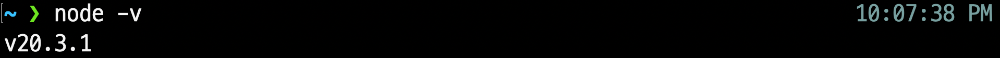

`node -v` 명령어를 통해 잘 설치되었는지 확인해본다.

### npx 설치하기

리액트를 공부하자는 글이 아니기 때문에 간단히만 알고 넘어가자

npx는 npm 사용시에 발생하는 발생할 수 있는 여러 문제점을 해결하기 위해 설계되었다고한다.
진행하는 과정에서 npx를 사용할 것이기 때문에 npx도 설치하고 넘어가자.

```shell
npm install npx -g
```

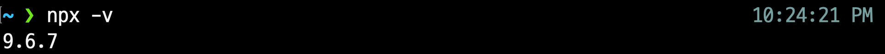

`npx -v` 명령어를 통해 잘 설치되었는지 확인해본다.

### gatsby-cli 설치하기

gatsby 명령어를 사용하기 위해 gatsby-cli를 설치한다.

```shell
npm install -g gatsby-cli
```

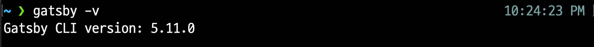

`gatsby -v` 명령어를 통해 잘 설치되었는지 확인해본다.

### Gatsby 사이트 생성

> 여기서부터는 [Hudi의 Gatsby 환경 구성하기](https://hoodie.gatsbyjs.io/quick-start-kr/)를 따라가는 내용입니다.

> 환경은 Pium의 프로젝트 환경에 맞게 진행됩니다.

gatsby를 이용하여 새로운 사이트를 생성한다.
이때 `gatsby-starter-hoodie`를 참고하여 구성한다.

```node
npx gatsby new pium-official.github.io https://github.com/devHudi/gatsby-starter-hoodie
```

### 프로젝트 시작해보기

``` shell
cd pium-official.github.io

npm run start
```

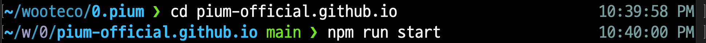

`localhost:8000`으로 프로젝트가 열리는 모습을 볼 수 있다.

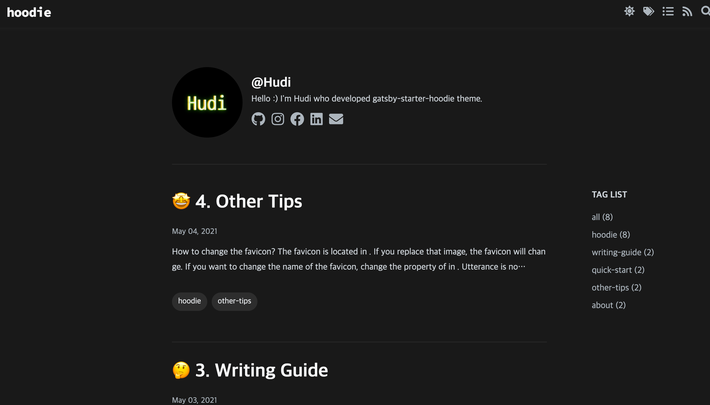

### 블로그 커스텀하기

해당 부분은 원작자의 [🚀 2.빠르게 시작하기](https://hoodie.gatsbyjs.io/quick-start-kr/)를 참고하여 진행하면 된다.

### GitHub Pages로 배포하기

이제 배포할 페이지를 다 만들었다!
GitHub Pages를 이용해 배포를 진행해보자.

우선 GitHub Repository를 생성한다.

> pium-official Organization에서 `pium-official.github.io` 레포지토리를 생성했다.

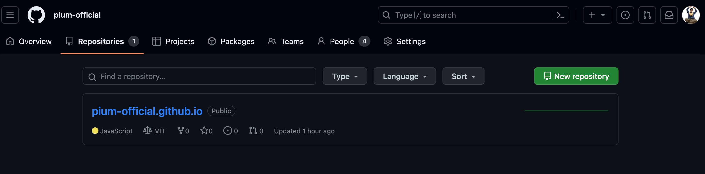

```shell
git remote add origin https://github.com/pium-official/pium-official.github.io
```

```node
npm run deploy-gh
```

위 명령어를 수행하면 팀 레포지토리에 gh-pages 브랜치가 생성되고 build된 결과물이 올라온다. 해당 파일을 기준으로 GitHub Pages에서 배포를 진행한다.

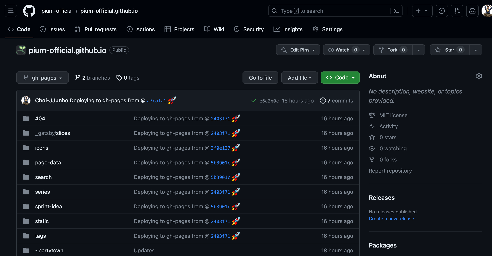

> GitHub Pages에서 배포 기준으로 잡는 브랜치를 확인 & 변경하고 싶다면 Settings - Pages 에서 다음 항목을 확인하면 된다.
> 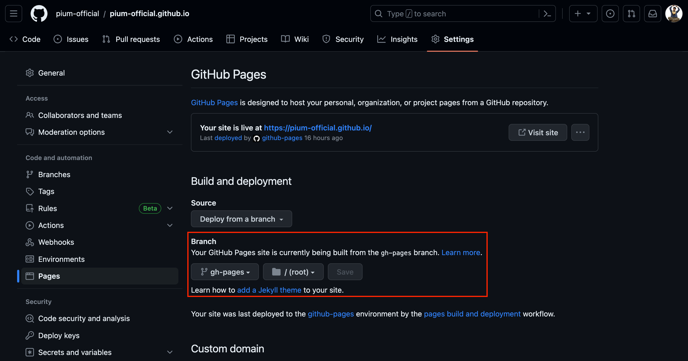

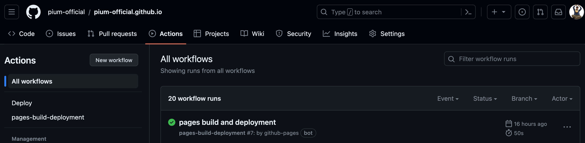

GitHub Actions 탭에서 `pages build and deployment` 작업이 완료된것을 확인하고 https://pium-official.github.io/ 로 접속해보면 페이지가 성공적으로 배포된것을 확인할 수 있다!!

> https:://{팀 레포명}.github.io

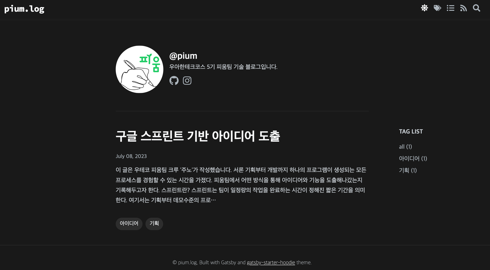

### 글 작성하기

해당 템플릿에 글을 작성하는 방식은 원작자의 [🤔 3. 작성 가이드](https://hoodie.gatsbyjs.io/writing-guide-kr/)를 참고하면 된다.

### GitHub Actions workflow

현재까지 진행한 작업으로는 다음과 같은 흐름으로 배포를 진행할 수 있다.

1. 로컬에서 글을 작성한다.
2. 글을 작성한 뒤 `npm run deploy-gh` 명령어를 수행해서 배포를 진행한다.

위 방식은 혼자서 작업할 때는 문제가 없으나 여러명이 함께 글을 작성하기에는 많이 번거롭다.

우리는 다음과 같은 방식으로 배포를 하는 방향을 기대하고 있다.

1. 로컬에서 글을 작성한다.
2. 글을 작성한 뒤 main 브랜치로 push한다.
3. main 브랜치에 작업내용이 push 되었을 때 빌드 및 배포가 자동적으로 이뤄진다.

위에서 3번 작업내용을 수행하기 위해 GitHub Actions의 workflow 기능을 이용할 수 있다.

### workflow 작성하기

`gatsby-starter-hoodie`에서 기본적으로 제공하고 있는 workflow는 다음과 같이 구성되어있다.

```yml
name: CI

on:
  pull_request:
    branches:
      - main

jobs:
  build:
    runs-on: ubuntu-latest
    steps:
      - uses: actions/checkout@v2
      - uses: actions/setup-node@v2
        with:
          node-version: 20.3.1

      - name: Install node packages
        run: yarn
        
      - name: Check lint
        run: yarn check:lint
        
      - name: Check prettier
        run: yarn check:prettier
      
      - name: Build
        run: yarn build
```

> 자세한 구문에 대한 설명 및 내용은 [공식문서](https://docs.github.com/ko/actions/using-workflows/workflow-syntax-for-github-actions)를 참고해보면 좋다.

기존에 존재하는 ci.yml 파일은 삭제하고 아래와 같은 deploy.yml을 작성해보자.

> workflow에 대한 yml파일의 경로는 반드시 `.github/workflows` 폴더 내부에 존재해야한다.
> 
 

```yml
name: Deploy

on: # 어떤 작업이 수행될 때 deploy.yml 작업이 수행된다. (트리거)
  push: # push 작업이 수행될 때
    branches: # 특정 브랜치를 대상으로
      - main

permissions: # github action이 수행되는 환경에서 특정 권한을 준다
  contents: write

jobs:
  build:
    runs-on: ubuntu-latest
    steps:
      - uses: actions/checkout@v2
      - uses: actions/setup-node@v2
        with:
          node-version: 20.3.1

      - name: Install node packages
        run: yarn

      - name: Build
        run: yarn build

      - name: Deploy 🚀
        uses: JamesIves/github-pages-deploy-action@v4
        with:
          folder: public
```

> `JamesIves/github-pages-deploy-action@v4` 작업에서 수행하는 내용 중 쓰기권한을 요구하는 작업이 있기 때문에 permissions 설정을 해야한다.
[관련 이슈 - Failed with exit code 128, Permission Denied](https://github.com/JamesIves/github-pages-deploy-action/issues/1110)

위 deploy.yml 파일을 작성했다면 프로젝트 내부에서 변경사항에 대한 commit을 수행하고 git push를 해본다.

``` shell
git branch -m main

git push origin main
```

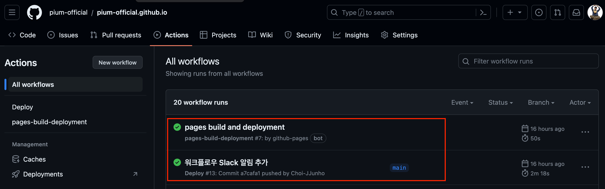

위 내용을 대략적으로 설명해보자면 다음과 같다.

main 브랜치에 대한 코드를 build해보고 성공한다면 결과물을 gh-pages 브랜치로 배포한다.

이제 글을 작성하고 main 브랜치로 push하기만 하면 배포까지 자동으로 수행된다.
로컬에서 `npm run deploy-gh`는 더이상 사용할 필요가 없다.

## 결론

블로그를 생성하고 배포하고 자동화하는 과정까지 차근차근 진행해봤다.

여러버 삽질을 거친 끝에 완성했기 때문에 더 애정이 많이 가는 것 같다. 👍

## Reference

- https://hoodie.gatsbyjs.io/
- https://docs.github.com/ko/actions/using-workflows/workflow-syntax-for-github-actions
- https://studium-anywhere.tistory.com/21
