> 이 글은 우테코 피움팀 크루 '[그레이](https://github.com/Kim0914)'가 작성했습니다.

이번 피움 서비스에서 CI/CD를 적용하기 위해 Jekins와 Github Webhook을 이용했습니다.


본 글에서는 Jenkins와 Github Webhook을 이용한 SpringBoot 서버 자동 빌드, 자동 배포 과정을 다루겠습니다.


Jenkins 설치 과정은 [피움 팀 젠킨스 설치하기](https://pium-official.github.io/jenkins-setting/) 를 참고하시면 됩니다 !


작업 환경

- 인스턴스: AWS EC2 t4g.small
- OS: Ubuntu 22.04.2 LTS
- RAM: 2GB


## Jenkins 접속
젠킨스를 접속하는 방법은 간단합니다. 젠킨스를 설치한 인스턴스 public IP와 port를 주소창에 입력하면 쉽게 접근할 수 있습니다.


정상적으로 접속하면 다음과 같은 화면을 만나게 됩니다.
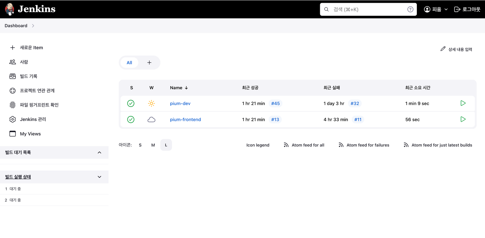

---

## Github Webhook 설정
먼저 Webhook을 설정하기 위해 현재 프로젝트의 깃허브 레포지토리로 이동합니다.


레포지토리의 Settings를 눌러서 접속할 수 있습니다. 이후 왼쪽 메뉴바에 Webhooks를 누르면 아래와 같은 화면을 볼 수 있습니다.
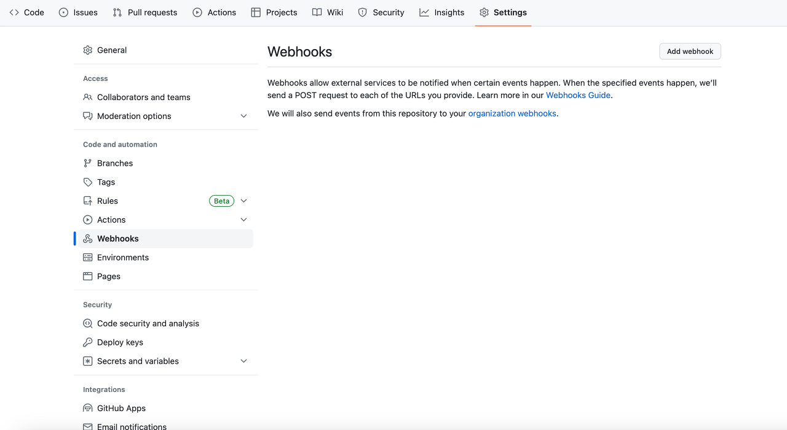

오른쪽 상단의 Add Webhook 버튼을 눌러 webhook을 추가하는 화면으로 이동합니다.


그러면 아래와 같은 Payload URL, Content Type, Secret을 입력하는 폼이 나타납니다.
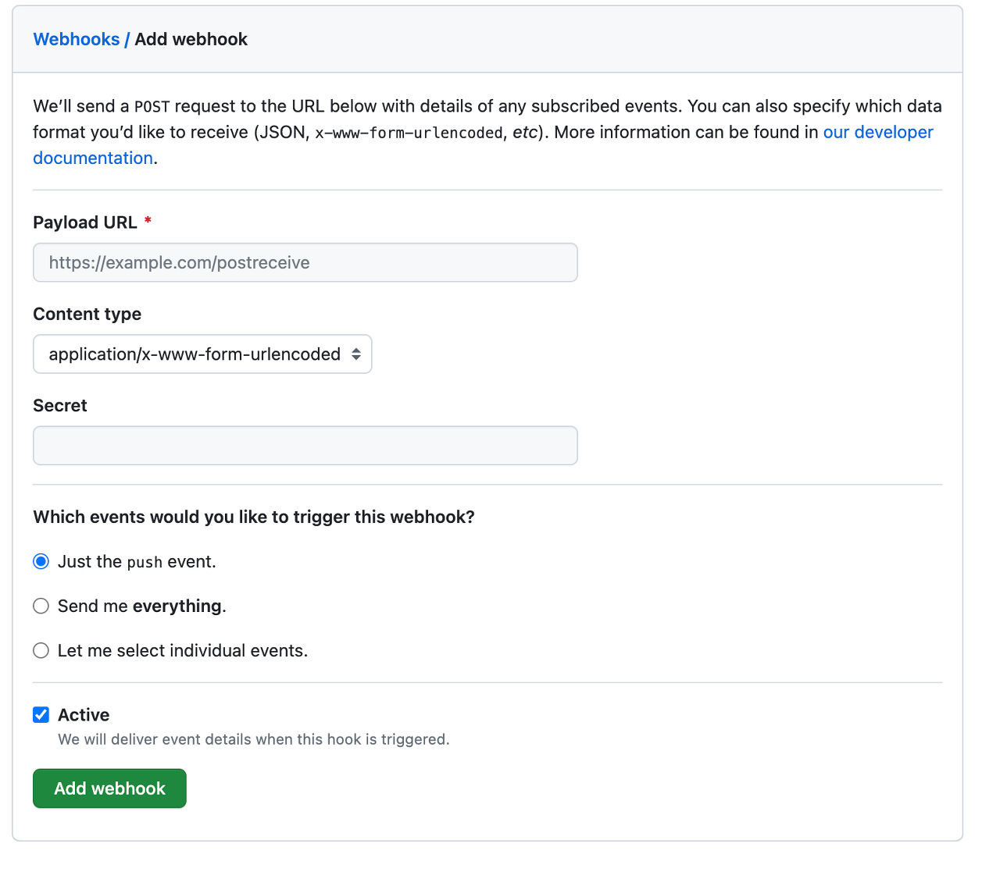

**Payload URL**은 젠킨스가 설치되어 있는 서버의 `도메인 주소:포트/github-webhook/` 을 입력합니다.

젠킨스의 기본 포트는 8080으로 설정되어 있습니다.

주소 마지막에 / 는 꼭 넣어주셔야 합니다.

/를 넣지 않으면 redirect URL로 인식해 정상적으로 동작하지 않습니다.


**Content-type**은 `application/json`을 선택합니다.


Secret은 비워두면 됩니다.


마지막으로 어떤 동작에서 webhook을 발생시킬지 선택하면 됩니다.

저희 팀의 경우에는 **Let me select individual events**를 눌러 **push**와 **pull request**가 발생했을 때 webhook이 동작하도록 선택했습니다.


모든 선택을 마친 후 **Add webhook 버튼을 누르면 토큰이 발행**됩니다.


토큰을 생성할 때 토큰 권한도 함께 설정할 수 있는데, 이 때 repo와 admin:repo_hook을 선택해주시면 됩니다.


만약 CI를 통해 PR에 comment를 남기는 등의 write가 필요없는 경우에는 wirte 권한을 빼줄 수 있을 것 같습니다.


해당 토큰은 생성 후 재발행되지 않기 때문에 따로 보관을 하는 것이 좋습니다.

---

## Credentials 생성
다시 젠킨스 화면으로 이동해서 Credentials를 등록하여 Github webhook을 연동 시켜야 합니다.


젠킨스 메인 화면에서 Jenkins 관리 페이지로 접속하면 Security 탭에 Credentials를 눌러 접속합니다.
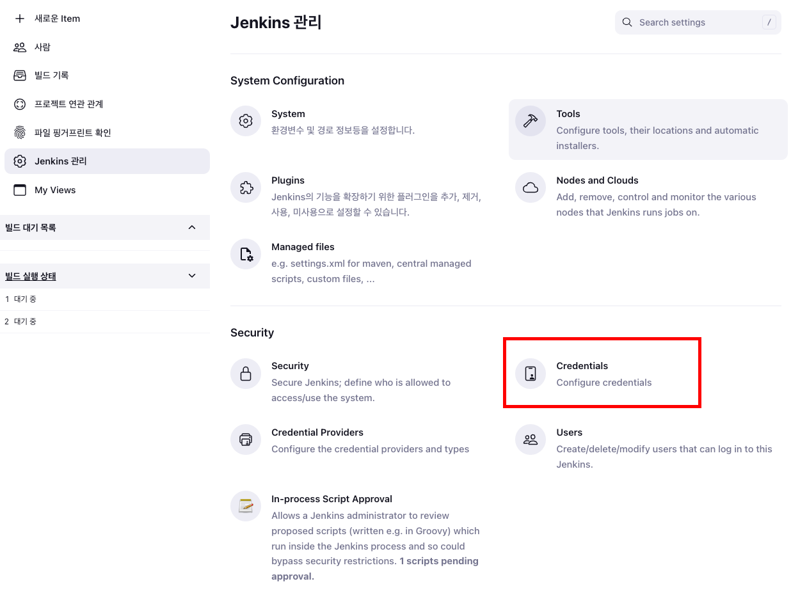

Add Credentials를 누릅니다.
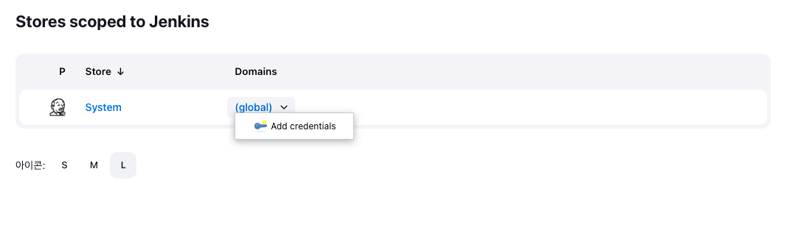

그러면 아래와 같은 화면을 볼 수 있습니다.


깃허브 webhook에서 발급받은 토큰을 이용해 크리덴셜 값을 생성합니다.
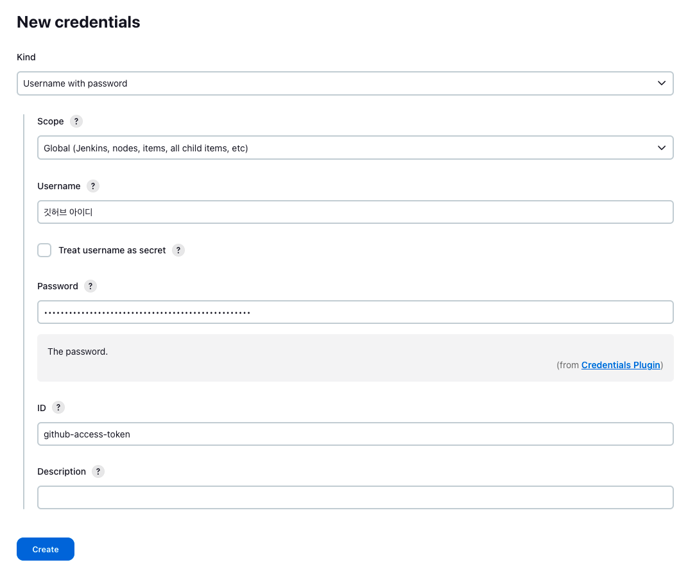

**kind**는 `Username with password`를 선택합니다.


**username**에는 깃허브 토큰을 발급받은 `깃허브 아이디`를 작성합니다.


**password**에는 `해당 토큰 값`을 넣으면 됩니다.


**ID**는 젠킨스에서 이 **크리덴셜을 식별하기 위한 이름이므로 크게 의미가 없는 값** 입니다.

---

### Gradle 설정
현재 우리 팀은 스프링 부트 서버를 빌드하기 때문에 gradle이 반드시 필요합니다.


젠킨스 메인 화면에서 대시보드 -> 젠킨스 관리 -> Tools를 누르면 아래와 같은 Gradle 설정 화면을 볼 수 있습니다.


Gradle 8.2.1 버전을 추가했습니다.

추가를 완료하고 바로 페이지를 나가면 안됩니다.

가장 아래에 있는 파란색 save 버튼을 눌러야 해당 설정이 저장됩니다 !!


Gradle 설정까지 마치면 빌드할 준비를 모두 마쳤습니다.


이제 CI를 자동으로 실행하기 위해서는 CI 스크립트를 작성해야 합니다.

---

## CI 스크립트 작성
드디어 CI를 담당하는 젠킨스 아이템을 생성할 시간입니다 !


대시보드에서 New Item을 누르면 아래와 같은 화면을 볼 수 있습니다.


상단에 아이템 이름을 설정하고 Pipeline을 구축할 것이기 때문에 Pipeline을 선택하고 OK를 누릅니다.


이후 아래와 같이 아이템을 설정할 수 있는 화면이 나옵니다.
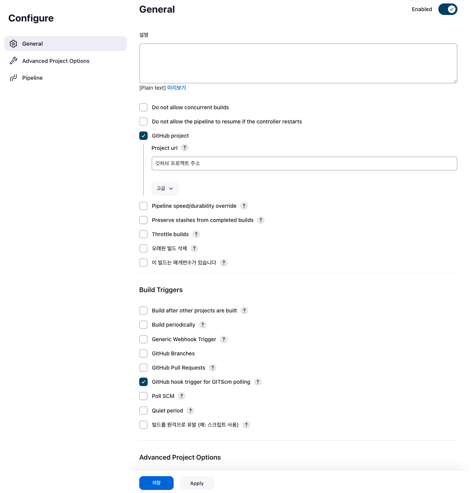

저희는 깃허브 프로젝트를 사용하고 있기 때문에 Github Project를 체크한 후 레포지토리의 url을 입력합니다.


다음으로 Build Trigger를 선택해야하는데, Github webhook을 사용할 계획이므로 Github hook triger for GITScm polling을 선택합니다. 해당 버튼을 클릭하면 아래에 스크립트를 작성하는 칸이 나옵니다.
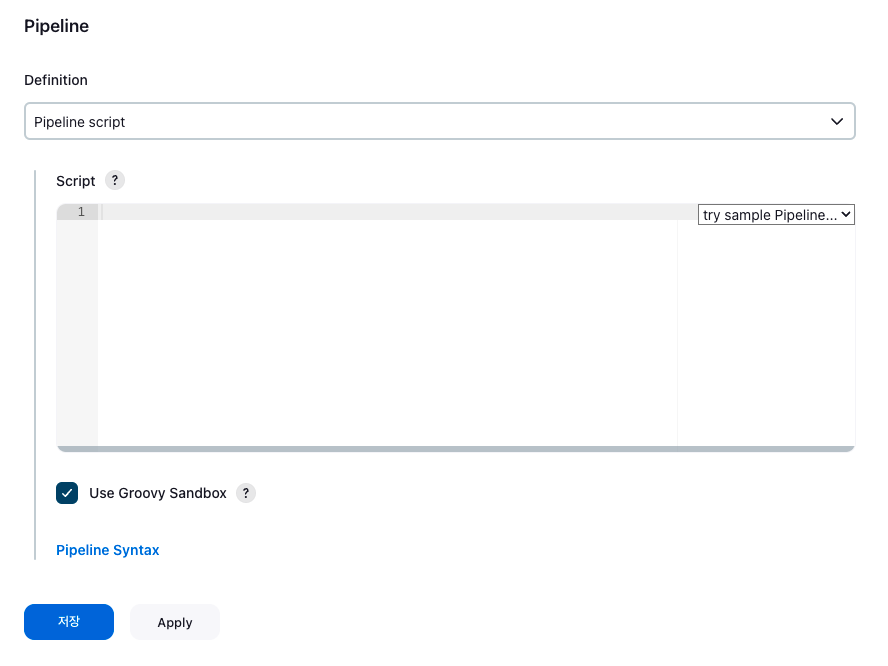


Script칸에 팀에서 필요로 하는 CI Script를 입력하면 됩니다.


여기서 저장 버튼 위에 보이는 Pipeline Syntax를 누르면 깃허브를 이용해 접근할 수 있는 스크립트를 생성하는 화면이 나옵니다.
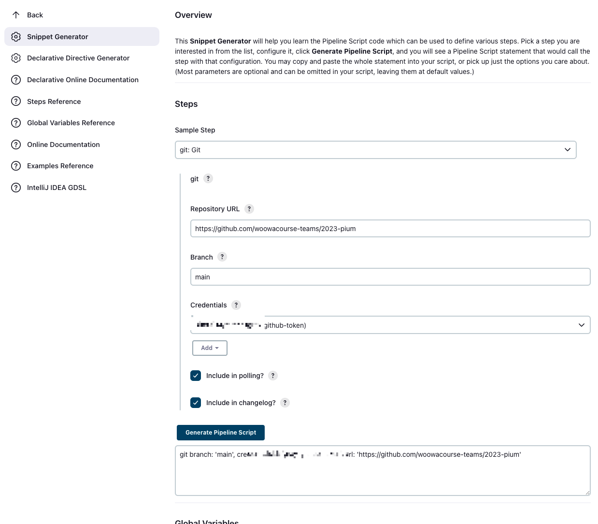

Sample Step을 Git으로 설정한 후 아래에 값을 입력하면 됩니다.


Credentials에는 좀 전에 생성했던 크리덴셜을 선택하면 됩니다. 해당 정보에 토큰 값이 있기 때문에 정확한 크리덴셜을 선택해야 합니다.

크리덴셜은 생성할 때 입력한 ID와 동일하게 보여집니다.


모두 입력했다면 Generate Pipeline Script를 눌러 완성된 스크립트를 확인합니다.


해당 스크립트를 만드는 이유는 빌드 과정에서 Github 저장소에서 저장소를 복제해야하기 때문입니다.

그러므로 저장소에 대한 접근 권한이 반드시 필요합니다.


전체 빌드 스크립트는 아래와 같습니다.

```shell
pipeline {
    agent any
    tools {
        gradle 'gradle'
    }
    triggers {
        githubPush()
    }
    stages {
        stage('저장소 복제') {
            steps {
                // 여기서 방금 생성된 깃허브 스크립트 넣기
        }
        
        stage('빌드') {
            steps {
                sh '''
                cd backend/pium
                ./gradlew clean build
                '''
            }
            post {
                failure {
                    slackSend (
                        channel: '#알림-젠킨스',
                        color: '#FF0000',
                        message: "백엔드 Build 실패...😢"
                    )
                }
            }
        }
    }
}
```


stages에서 깃허브 저장소에 있는 프로젝트를 가져온 후, 본인의 프로젝트 디렉토리로 이동해 build를 진행하도록 하면 됩니다.

디렉토리를 옮기는 부분에서 몇 번 에러가 있었는데, Jenkins 대시보드의 Console Output을 이용해 디버깅하면서 수정해나가면 쉽게 설정할 수 있습니다.


지금까지 올바르게 적용되었다면 CI 설정은 모두 정상적으로 마쳤습니다.


다음으로 CD(자동 배포) 설정 방법을 알아보겠습니다.

---

## SSH Agent 설치
현재 빌드 서버와 운영 서버가 서로 다른 인스턴스로 분리되어 있기 때문에, 젠킨스 빌드 서버에서 빌드한 파일을 운영서버로 전달해야

합니다. 이때 다른 인스턴스로의 접속이 필요하므로 SSH 연결 설정을 해야 합니다.


기존의 블로그나 여러 레퍼런스를 찾아보면 Publish Over SSH를 많이 사용하는데, 현재 접속 불가 이슈가 있습니다.

그러므로 SSH Agent를 사용해야 합니다.


Jenkins 관리의 Plugin 탭을 들어가서 설치할 수 있습니다.


Jenkins도 하나의 서버에서 동작하고 있기 때문에 운영서버로 접속하기 위한 pem 키가 필요합니다.


대시보드 -> 젠킨스 관리 -> Credentials 로 이동합니다.


깃허브 크리덴셜을 생성하는 것과 동일한 방법으로 pem 키를 크리덴셜로 설정합니다.
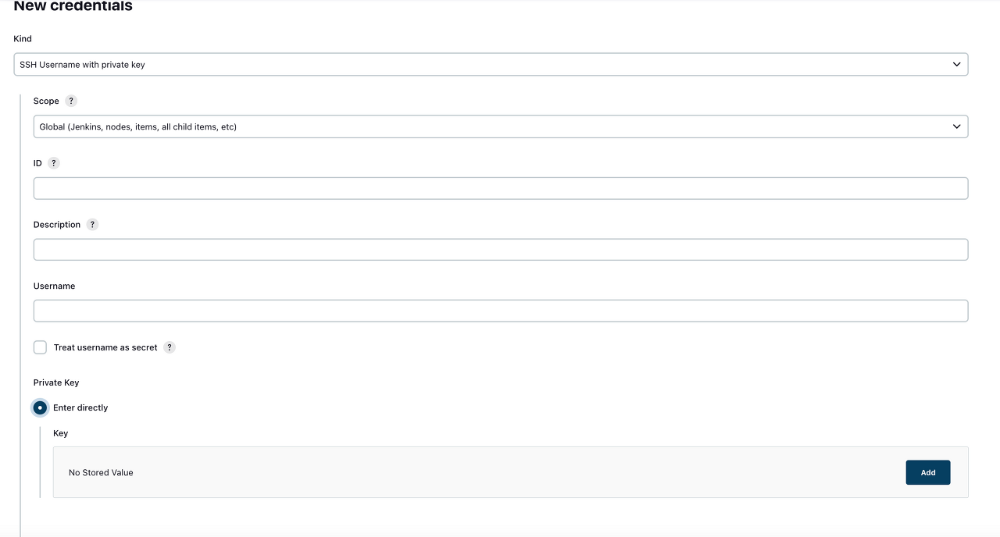

**kind**는 `SSH Username with private key`를 선택합니다.


**id**는 깃허브 크리덴셜과 마찬가지로 식별자이기 때문에 `원하는 값을` 입력하면 됩니다.


**username**은 인스턴스의 HostName ex) ubuntu@123-345-678-23의 `ubuntu` 를 입력하면 됩니다.


마지막으로 **인스턴스를 생성하면서 받았던 pem 키를 Add 버튼을 눌러 추가**합니다.

pem 키에 있는 모든 내용(Begin, End 포함)을 다 복사해서 넣어야합니다.

---

## CD 스크립트 작성
이제 젠킨스가 설치된 서버에서 빌드된 결과물을 운영 서버로 전달하는 스크립트를 작성해야 합니다.

이때 scp 라는 프로토콜을 사용하여 파일을 전달합니다.


저희 팀이 사용한 스크립트는 아래와 같습니다.

빌드 성공 유뮤, 배포 성공 유무를 슬랙과 연동해 사용하고 있습니다 !

```shell
pipeline {
    agent any
    tools {
        gradle 'gradle'
    }
    triggers {
        githubPush()
    }
    stages {
        stage('저장소 복제') {
            steps {
                // 깃허브 크리덴셜
            }
        }
        
        stage('빌드') {
            steps {
                sh '''
                cd //프로젝트 위치
                ./gradlew clean build
                '''
            }
            post {
                failure {
                    slackSend (
                        channel: '#알림-젠킨스',
                        color: '#FF0000',
                        message: "백엔드 Build 실패...😢"
                    )
                }
            }
        }
        stage('배포') {
            steps {
                sshagent(credentials: ['pem 키로 생성한 크리덴셜 ID']) {
                    sh '''
                        cd //프로젝트 위치
                        
                        ssh -o StrictHostKeyChecking=no {HostName}@{Private IP} uptime
                        cd build/libs
                        
                        scp {빌드된 Jar 파일명} {HostName}@{Private IP}:/home/ubuntu
                        ssh -t {HostName}@{Private IP} {운영서버 배포 스크립트 파일}
                    '''
                }
            }
            post {
                success {
                    slackSend (
                        channel: '#알림-젠킨스',
                        color: '#00FF00',
                        message: "백엔드 배포 성공! 🚀"
                    )
                }
                failure {
                    slackSend (
                        channel: '#알림-젠킨스',
                        color: '#FF0000',
                        message: "백엔드 배포 실패 🥲"
                    )
                }
            }
        }
    }
}
```


CI/CD 설정을 모두 마친 후 깃허브 프로젝트에 push, pull request와 같은 trigger가 발생하면 아래와 같이 빌드 결과를 볼 수 있습니다.
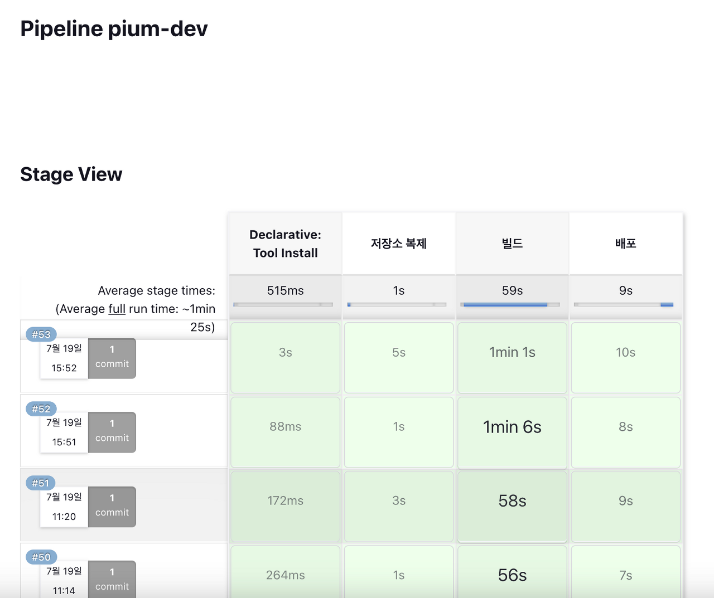

### Reference
[베베의 CI/CD 글](https://developer-nyong.tistory.com/47#article-7-1--ssh-%ED%94%8C%EB%9F%AC%EA%B7%B8%EC%9D%B8-%EC%84%A4%EC%B9%98)
