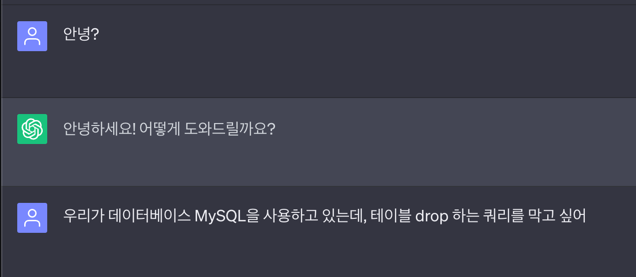
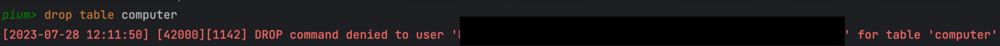
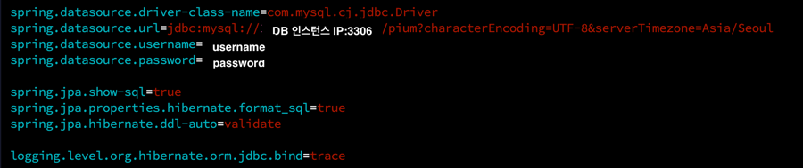

> 이 글은 우테코 피움팀 크루 '[주노](https://github.com/Choi-JJunho)', '[그레이](https://github.com/kim0914)', '[조이](https://github.com/yeonkkk)', '[하마드](https://github.com/rawfishthelgh)'가 작성했습니다.


## 서론

본 설명 글은 다음과 같은 환경에서 진행됩니다.
> - 배포서버 : Ubuntu 22.04.2 LTS
> - DB서버 : Ubuntu 22.04.2 LTS
> - 배포서버와 DB서버는 동일한 VPC를 사용하고 있습니다.
> - DB : MySQL 8.0.33
> - Application : SpringBoot 3.1.1

개발 과정에서 실수로 Application 단에서 DB 혹은 테이블을 Drop 해버리는 상황이 있을 수 있다.

테이블의 수정이 제한된 유저를 생성하여 해당 유저를 Application에서 사용하도록 구성해보자. 

> 도움을 주신 G선생님께 감사의 인사 올리며 시작하겠습니다.
> 
> 

## 유저 생성하기

> 이후 진행할 작업에서 권한 부여를 위해 root 권한이 필요합니다.

우선 root 권한을 가진 계정으로 MySQL에 로그인 한다.

```shell
# MySQL에 로그인
sudo mysql -u root -p
```

Application에서 사용할 유저를 생성한다.

```sql
CREATE USER 'pium'@'localhost' IDENTIFIED BY 'password';
```

> 만약 외부에서 접근해야하는 유저의 경우 다음 명령어를 참고하세요
> 
> ```sql
> # 외부 모든 IP에 대한 pium 이라는 유저 생성 
> CREATE USER 'pium'@'%' IDENTIFIED BY 'password';
> 
> # 특정 인스턴스에서만 접속가능한 pium 이라는 유저 생성 
> CREATE USER 'pium'@'접속할 인스턴스의 private ip' IDENTIFIED BY 'password';
> ```

## 권한 부여하기

MySQL에서 설정할 수 있는 권한은 아래와 같다.

| 권한                | 내용                     |
|-------------------|------------------------|
| CREATE, ALTER, DROP | 테이블 생성, 변경, 삭제  |
| SELECT, INSERT, UPDATE, DELETE | 테이블의 레코드 조회, 입력, 수정, 삭제 |
| RELOAD| 권한 부여된 내용을 리로드 |
| SHUTDOWN| 서버 종료 작업 실행 |
| ALL| 모든 권한 허용 |
| USAGE| 권한 없이 계정만 생성 |

우리는 `INSERT`, `UPDATE`, `SELECT`, `DELETE`만 사용하면 되기 떄문에, 새로 생성한 유저에게 해당 권한만 부여한다.

```sql
GRANT SELECT, INSERT, UPDATE, DELETE ON pium_db.* TO 'pium'@'localhost';
```

설정한 권한을 `flush` 명령어를 이용해 적용한다.

```sql
FLUSH PRIVILEGES;
```

## 확인하기



실제로 생성된 유저로 접속하여 Drop Table 명령어를 수행했을 때 권한 부족으로 수행되지 않음을 확인할 수 있다.

## Application properties 적용

Application의 설정파일에 생성한 유저의 정보를 작성한다.



이를 통해 Applicaiton에서는 Table의 생성, 수정, 삭제에 대한 조작을 할 수 없게 되었다.

만약 테이블의 생성, 수정, 삭제에 대한 작업이 필요할 경우 DBA 혹은 DB 담당자에게 요청하는 프로세스를 거쳐야만 한다.

## Reference

- Chat GTP 4
- 피움 백엔드 팀의 집단지성
