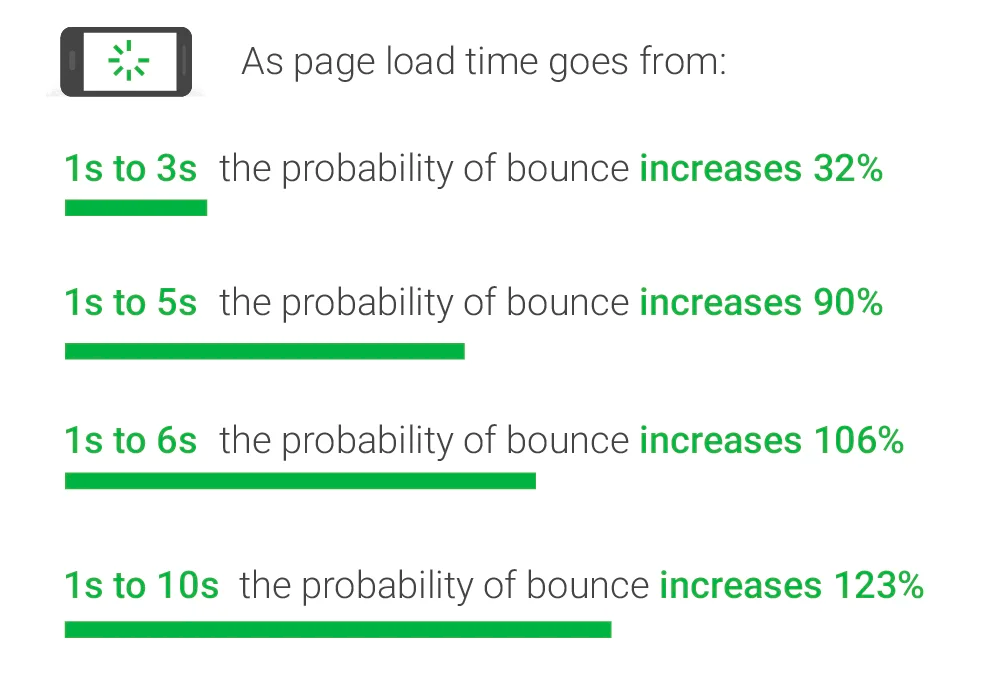
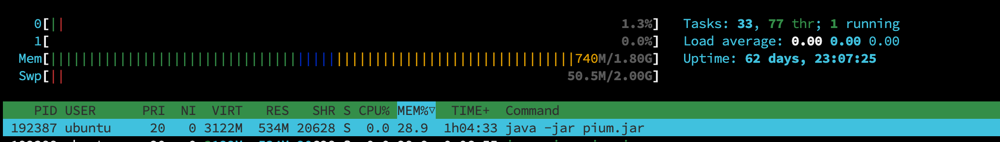
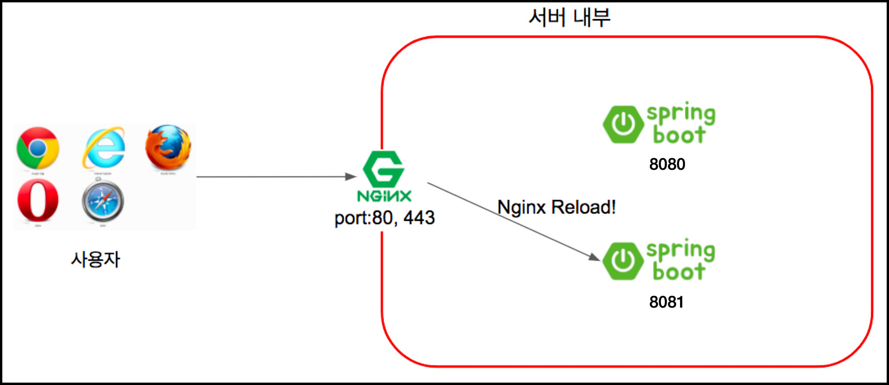
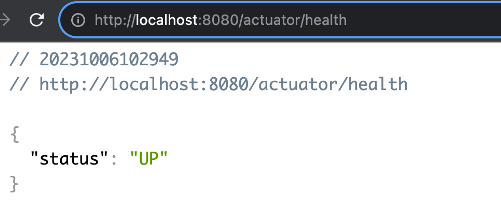

> 이 글은 우테코 피움팀
>
크루 '[주노](https://github.com/Choi-JJunho)', '[그레이](https://github.com/kim0914)', '[조이](https://github.com/yeonkkk)', '[하마드](https://github.com/rawfishthelgh)'
> 가 작성했습니다.

## 서론

> 다음 discussion으로부터 시작된 안건입니다.
> [discussion - 무중단 배포 환경 구성](https://github.com/woowacourse-teams/2023-pium/discussions/358)

우리가 서버 한 대로 서비스를 운영한다고 가정해보자.

새로운 기능이 추가되고 배포되기 위해서는 애플리케이션을 빌드한 뒤 구동이 완료되어야한다.

이 과정에서 기존의 실행 중인 서버 프로세스를 종료한 후 새롭게 실행해야 한다.

이 때 서비스를 이용 중인 사용자는 그 시간 동안 서비스를 이용할 수 없게 된다.

V1 버전이 종료되고 V2 버전이 실행되는 그 사이, 즉 유저가 서비스를 이용할 수 없는 시간을 **다운타임(downtime)** 이라고 한다.

### 고가용성

다음 자료는 페이지 로드 속도가 늦어짐에 따라 사용자의 이탈률이 증가한다는 지표다.


[출처 - Think with Google](https://www.thinkwithgoogle.com/marketing-strategies/app-and-mobile/mobile-page-speed-new-industry-benchmarks/)

애플리케이션이 아닌 배포 과정이 이러한 다운타임에 대한 영향을 미치는 것이 올바르지 못한 상황이라고 여겨진다.

### 무중단 배포 방식

무중단 배포는 말 그대로 **서비스가 중단되지 않은 상태**로, 새로운 버전을 사용자들에게 다운 타임 없이 배포하는 것을 의미한다. 무중단 배포를 하기 위해서는 최소 서버 2대 이상을 확보해야한다.

무중단 배포에는 크게 3가지 방식이 있다.

1. 롤링(Rolling) 배포
2. 블루/그린 배포
3. 카나리(Canary) 배포

#### 롤링 배포

- 트래픽을 점진적으로 구버전에서 새로운 버전으로 옮기는 방식이다.
- 점진적으로 트래픽을 어떻게 새로운 버전으로 옮길 수 있을까?
    - 방식 1
        - 기존에 V1 서버를 3대 운영 중이라고 하자.
        - 우선 V2 인스턴스를 하나 추가한다. 로드 밸런서에 이 인스턴스를 연결한 후 기존 3대의 V1 서버를 하나씩 삭제한다.
        - 서버 개수를 유연하게 조절할 수 있는 클라우드를 기반으로 서비스를 운영할 때 적합할 것 같다.
    - 방식 2
        - V1이 실행되고 있는 서버 하나를 로드 밸런서에서 떼어낸다.
        - 해당 서버에는 트래픽이 도달하지 않으므로 이 상태에서 해당 서버의 어플리케이션을 V2로 교체한다.
        - 이 과정을 반복하며 모든 서버를 V2로 교체한다.
- 장점
    - 롤링 배포 방식은 k8s, elastic beanstalk과 같은 많은 오케스트레이션 도구에서 지원하여 간편하다.
    - 또한 많은 서버 자원을 확보하지 않아도 무중단 배포가 가능하다.
- 단점
    - 방식 2와 같은 경우 **배포 도중 서비스 중인 인스턴스의 수가 줄어드게 되어 각각의 서버가 부담하는 트래픽의 양이 늘어날 수 있다.**
    - 구버전과 신버전의 어플리케이션이 동시에 서비스 되기 때문에 **호환성 문제**가 발생할 수 있다.

---

#### 블루/그린 배포

- 트래픽을 한 번에 구버전에서 신버전으로 옮기는 방법이다.
- 현재 운영 중인 서비스 환경을 블루라고 부르고, 새롭게 배포할 환경을 그린.
- 블루와 그린의 서버를 동시에 나란히 구성해둔 상태로 배포 시점에 로드 밸런서가 트래픽을 블루에서 그린으로 일제히 전환시킨다.
- 그린 버전 배포가 성공적으로 완료 되었고, 문제가 없다고 판단할 때 블루 서버를 제거할 수 있다.

- 장점
    - 롤링 배포와 달리 한번에 트래픽을 모두 새로운 버전으로 옮기기 때문에 호환성 문제가 발생하지 않는다.
- 단점
    - 실제 운영에 필요한 서버 리소스 대비 2배의 리소스를 확보해야 한다.

#### 카나리(Canary) 배포

- 점진적으로 구버전에 대한 트래픽을 신버전으로 옮기는 것은 롤링 배포 방식과 동일
- 하지만 카나리 배포의 핵심은 새로운 버전에 대한 **오류를 조기에 감지**하는 것이다.
- 소수 인원에 대해서만 트래픽을 새로운 버전에 옮겨둔 상태에서 서비스를 운영한다.
- A/B 테스트를 진행할 수 있다.

- 장점
    - 새로운 버전으로 인한 위험을 최소화할 수 있다.
- 단점
    - 롤링 배포와 마찬가지로 호환성 문제가 발생할 수 있다.

롤링 배포와 카나리 배포의 경우 서버의 자원을 많이 필요로 한다는 점이 적용하기 어려운 부분으로 다가왔다.

따라서 현재 사용할 수 있는 자원을 고려해봤을 때 합당하다고 생각되는 **블루/그린 배포** 방식을 채택한다.

### 서버 사양 확인

무중단 배포 환경을 구성하기 이전에 서버 사용중인 리소스를 먼저 확인해보자.



메모리는 (스왑메모리 제외) 총 1.8 GB 중 742MB를 상시 사용중이고 이 중 애플리케이션은 534MB만큼의 메모리를 사용중이다.

여유있게 애플리케이션은 상시 약 600MB 정도의 메모리를 사용한다고 생각해볼 수 있다.

이에 새로운 애플리케이션을 서버에 한 대 더 띄울경우 약 600MB를 더 사용하게되어 1.4GB 메모리를 상시 사용할 것으로 예상된다.

### 무중단 배포 시나리오 구성

> `[블루, 그린 배포방식으로 진행한다]`



> [이미지 출처](https://github.com/jojoldu/springboot-webservice/blob/master/tutorial/7_NGINX_SSL_%EB%AC%B4%EC%A4%91%EB%8B%A8%EB%B0%B0%ED%8F%AC.md)

- 8080, 8081 포트에 WAS를 구성한다.
- 새롭게 배포될 때 nginx가 가리키는 포트를 정해준다.

### 무중단 배포 스크립트 작성

무중단 배포환경을 구성하기 위해 쉘 스크립트를 작성해보자. 보통 새롭게 배포할 PORT를 GREEN, 구버전 포트를 BLUE로 지칭하는데, 조금 더 이해하기 쉽게 GREEN을 NEW PORT, BLUE를
CURRENT PORT로 지칭하도록 하겠다.

#### 1. CURRENT PORT, NEW PORT 설정

8080, 8081 포트가 살아있는지 확인한다.

살아있는 포트를 `CURRENT_PORT`, 그렇지 않은 포트를 `NEW_PORT`로 판별한다.

이 때 `NEW_PORT`로 지정하려는 포트에 이미 애플리케이션이 있으면 프로세스를 종료시켜 자리를 비워준다

```bash
#!/bin/bash

echo "> 현재 구동중인 Port 확인"

# CURRENT & NEW 포트 확인
if lsof -Pi :8080 -sTCP:LISTEN -t >/dev/null; then
    echo "현재 8080 포트가 사용 중입니다."
    CURRENT_PORT=8080
    NEW_PORT=8081
elif lsof -Pi :8081 -sTCP:LISTEN -t >/dev/null; then
    echo "현재 8081 포트가 사용 중입니다."
    CURRENT_PORT=8081
    NEW_PORT=8080
else
    echo "8080과 8081 포트 모두 사용 중이지 않습니다."
    exit 1
fi
# NEW 포트 사용중일 경우 종료
if lsof -Pi :$NEW_PORT -sTCP:LISTEN -t >/dev/null; then
  echo "NEW_PORT가 사용중입니다."
  PID=$(lsof -Pi :$NEW_PORT -sTCP:LISTEN -t)
  kill -9 $PID
  echo "사용 중인 NEW_PORT 종료했습니다.."
  sleep 3
else
  echo "NEW_PORT가 사용 중이지 않습니다."
fi
```

#### 2. NEW PORT에 프로젝트 구동

NEW PORT에 새로운 프로젝트를 구동한다.

```bash
#!/bin/bash
#Spring ON
nohup java -jar "pium.jar" --spring.profiles.active=dev --server.port=$NEW_PORT > log.txt 2>&1 &

echo 백그라운드 모드로 애플리케이션 실행 성공 !!
```

### 3. Health Check 수행

애플리케이션이 구동 완료되기까지의 시간을 고려하여 15초간 sleep을 실행한다.

sleep 이후, NEW PORT 애플리케이션의 정상 실행을 확인하기 위해 열 번의 health check를 수행하도록 한다.(UP 문자열이 응답되지 않으면 배포 종료)

> **health check**
> 프로젝트 의존성에 스프링부트 actuator를 추가하여 health check를 수행할 수 있다.
> `implementation('org.springframework.boot:spring-boot-starter-actuator')`
> 
> 의존성만 추가하면 위와 같은 응답을 받을 수 있다.

```bash
#!/bin/bash

# 새로 가동하는 서버 상태 확인
sleep 15

for retry_count in {1..10}
do
  response=$(curl -s http://localhost:$NEW_PORT/actuator/health)
  up_count=$(echo $response | grep 'UP' | wc -l)

  if [ $up_count -ge 1 ]
 then # $up_count >= 1 ("UP" 문자열이 있는지 검증)
      echo "> Health check 성공"
      break
  else
      echo "> 새롭게 가동하는 서버의 상태가 UP이 아닙니다."
      echo "> Health check: ${response}"
  fi

  if [ $retry_count -eq 10 ]
  then
    echo "> Health check 실패. "
    echo "> Nginx에 연결하지 않고 배포를 종료합니다."
    exit 1
  fi

  echo "> Health check 연결 실패. 재시도..."
  sleep 10
done
```

#### 3. nginx 포트 변경

nginx 포트를 변수로 변경해준다.

**nginx 포트를 동적으로 구성하기**

nginx 설정은 현재 8080 포트에 대해서만 프록시를 구성하고있다.

8080, 8081 포트를 동적으로 변경할 수 있도록 개선해보자.

쉘 스크립트로 `/etc/nginx/conf.d/service-url.inc;` 파일을 생성한다.

`sudo vim /etc/nginx/nginx.conf`

```bash
# service-url.inc 파일 내용
set $service_url http://127.0.0.1:8080;
```

기존 nginx 설정에는 proxy pass 설정을 `http://127.0.0.1:8080` 로 구성했다면, 이제는 `$service_url` 환경변수가 proxy pass가 될 수 있도록 변경, 배포 시마다 이
값이 동적으로 8080, 혹은 8081로 변경되도록 한다.

- 기존 설정

```bash
# /etc/nginx/sites-available/backend
server {

        server_name dev.api.pium.life;

        location / {
                if ($request_method = 'OPTIONS') {
                        add_header 'Access-Control-Allow-Origin' 'https://dev.pium.life';
                        add_header 'Access-Control-Allow-Methods' 'GET, POST, DELETE, PATCH, OPTIONS';
                        add_header 'Access-Control-Allow-Headers' 'Content-Type, Authorization';
                        add_header 'Access-Control-Max-Age' 86400;
                        add_header 'Access-Control-Allow-Credentials' 'true';
                        add_header 'Access-Control-Expose-Headers' 'Set-Cookie';
                        return 204;
                }
                add_header 'Access-Control-Allow-Credentials' 'true' always;
                add_header 'Access-Control-Allow-Origin' 'https://dev.pium.life' always;
                add_header 'Access-Control-Expose-Headers' 'Set-Cookie' always;

                proxy_set_header Host $host:$server_port;
                proxy_set_header X-Real-IP $remote_addr;
                proxy_set_header X-Forwarded-For $proxy_add_x_forwarded_for;

                proxy_pass http://127.0.0.1:8080;
        }

        location /docs {
                proxy_pass http://127.0.0.1:8080;
        }

        location /admin {
                proxy_pass http://127.0.0.1:8080;
        }

    listen 443 ssl; # managed by Certbot
    ssl_certificate /etc/letsencrypt/live/dev.pium.life/fullchain.pem; # managed by Certbot
    ssl_certificate_key /etc/letsencrypt/live/dev.pium.life/privkey.pem; # managed by Certbot
    include /etc/letsencrypt/options-ssl-nginx.conf; # managed by Certbot
    ssl_dhparam /etc/letsencrypt/ssl-dhparams.pem; # managed by Certbot

}

server {
    if ($host = dev.api.pium.life) {
        return 301 https://$host$request_uri;
    } # managed by Certbot

    server_name dev.api.pium.life;
    listen 80;
    return 404; # managed by Certbot
}
```

- 개선 설정

```bash
# /etc/nginx/sites-available/backend
server {

        server_name dev.api.pium.life;

        # include 파일 추가하기
        include /etc/nginx/conf.d/service-url.inc;

        location / {
                if ($request_method = 'OPTIONS') {
                        add_header 'Access-Control-Allow-Origin' 'https://dev.pium.life';
                        add_header 'Access-Control-Allow-Methods' 'GET, POST, DELETE, PATCH, OPTIONS';
                        add_header 'Access-Control-Allow-Headers' 'Content-Type, Authorization';
                        add_header 'Access-Control-Max-Age' 86400;
                        add_header 'Access-Control-Allow-Credentials' 'true';
                        add_header 'Access-Control-Expose-Headers' 'Set-Cookie';
                        return 204;
                }
                add_header 'Access-Control-Allow-Credentials' 'true' always;
                add_header 'Access-Control-Allow-Origin' 'https://dev.pium.life' always;
                add_header 'Access-Control-Expose-Headers' 'Set-Cookie' always;
                # add_header 'Content-Type' 'application/json' always;

                proxy_set_header Host $host:$server_port;
                proxy_set_header X-Real-IP $remote_addr;
                proxy_set_header X-Forwarded-For $proxy_add_x_forwarded_for;

                # 이걸 변수로 지정
                # proxy_pass http://127.0.0.1:8080;
                proxy_pass $service_url;
        }

        location /docs {
                # proxy_pass http://127.0.0.1:8080;
                proxy_pass $service_url;
        }

        location /admin {
                # proxy_pass http://127.0.0.1:8080;
                proxy_pass $service_url;
        }

    listen 443 ssl; # managed by Certbot
    ssl_certificate /etc/letsencrypt/live/dev.pium.life/fullchain.pem; # managed by Certbot
    ssl_certificate_key /etc/letsencrypt/live/dev.pium.life/privkey.pem; # managed by Certbot
    include /etc/letsencrypt/options-ssl-nginx.conf; # managed by Certbot
    ssl_dhparam /etc/letsencrypt/ssl-dhparams.pem; # managed by Certbot

}

server {
    if ($host = dev.api.pium.life) {
        return 301 https://$host$request_uri;
    } # managed by Certbot

    server_name dev.api.pium.life;
    listen 80;
    return 404; # managed by Certbot
}

```

이제 쉘 스크립트에서 배포 시마다 해당 `NEW_PORT`에 맞춰 `$service_url` 환경변수를 변경하고, nginx를 재시작한다.

```bash
#!/bin/bash

echo "> 전환할 Port: $NEW_PORT"

echo "> Port 전환"
echo "set \$service_url http://127.0.0.1:${NEW_PORT};" | sudo tee /etc/nginx/conf.d/service-url.inc
echo "> NGINX Reload"
sudo service nginx reload
```

#### 4. CURRENT PORT 내리기

nginx reload (포트포워딩 완료)가 완료되면 `CURRENT_PORT`를 내린다.

```bash
echo "> CURRENT_PORT를 종료합니다"
CURRENT_PID=$(lsof -Pi :$CURRENT_PORT -sTCP:LISTEN -t)
kill -9 $CURRENT_PID
```

### 최종 배포 스크립트 형태

```bash
#!/bin/bash

echo "> 현재 구동중인 Port 확인"

# CURRENT & NEW 포트 확인
if lsof -Pi :8080 -sTCP:LISTEN -t >/dev/null; then
    echo "현재 8080 포트가 사용 중입니다."
    CURRENT_PORT=8080
    NEW_PORT=8081
elif lsof -Pi :8081 -sTCP:LISTEN -t >/dev/null; then
    echo "현재 8081 포트가 사용 중입니다."
    CURRENT_PORT=8081
    NEW_PORT=8080
else
    echo "8080과 8081 포트 모두 사용 중이지 않습니다."
    exit 1
fi
# NEW 포트 사용중일 경우 종료
if lsof -Pi :$NEW_PORT -sTCP:LISTEN -t >/dev/null; then
  echo "NEW_PORT가 사용중입니다."
  PID=$(lsof -Pi :$NEW_PORT -sTCP:LISTEN -t)
  kill -9 $PID
  echo "사용 중인 NEW_PORT 종료했습니다.."
  sleep 3
else
  echo "NEW_PORT가 사용 중이지 않습니다."
fi

#Spring ON
nohup java -jar "pium.jar" --spring.profiles.active=dev --server.port=$NEW_PORT > log.txt 2>&1 &

echo 백그라운드 모드로 애플리케이션 실행 성공 !!

# 새로 가동하는 서버 상태 확인
sleep 15

for retry_count in {1..10}
do
  response=$(curl -s http://localhost:$NEW_PORT/actuator/health)
  up_count=$(echo $response | grep 'UP' | wc -l)

  if [ $up_count -ge 1 ]
 then # $up_count >= 1 ("UP" 문자열이 있는지 검증)
      echo "> Health check 성공"
      break
  else
      echo "> 새롭게 가동하는 서버의 상태가 UP이 아닙니다."
      echo "> Health check: ${response}"
  fi

  if [ $retry_count -eq 10 ]
  then
    echo "> Health check 실패. "
    echo "> Nginx에 연결하지 않고 배포를 종료합니다."
    exit 1
  fi

  echo "> Health check 연결 실패. 재시도..."
  sleep 10
done

# 새로 가동하는 서버로 전환

echo "> 전환할 Port: $NEW_PORT"

echo "> Port 전환"
echo "set \$service_url http://127.0.0.1:${NEW_PORT};" | sudo tee /etc/nginx/conf.d/service-url.inc

echo "> NGINX Reload"
sudo service nginx reload

echo "> CURRENT_PORT를 종료합니다"
CURRENT_PID=$(lsof -Pi :$CURRENT_PORT -sTCP:LISTEN -t)
kill -9 $CURRENT_PID
```

### 시나리오 정리

1. 현재 구동중인 포트(CURRENT)와 새롭게 배포할 포트(NEW)를 확인한다.
2. NEW를 점유중인 프로세스가 있을 시 강제 종료한다.
3. NEW에 애플리케이션을 구동한다
4. 애플리케이션의 정상 작동을 확인한다(health check)
5. nginx의 포트 포워딩 설정을 NEW PORT로 변경 후, nginx를 재가동한다.
6. 기존 사용하전 구버전 포트(CURRENT)를 내린다.
