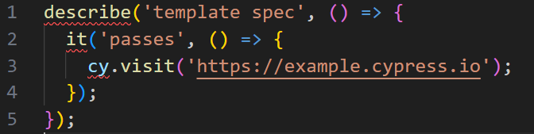

> 이 글은 우테코 피움팀 크루 '[참새](https://github.com/WaiNaat)'가 작성했습니다.
 

## 우리는 왜 Cypress를 사용하게 되었나

tanstack query의 `useQuery`에서 기존에는 `suspense` 설정을 사용하지 않았었어요. 
근데 이 함수를 리팩터링하면서 `suspense: true` 설정을 추가했습니다. 하지만 해당 함수를 사용하는 모든 곳에서 `<Suspense>`를 적용하지 않았고, 결국 개발 서버에 올라간 어플리케이션이 터지는 사고가 생겼습니다.

이러한 문제를 예방하기 위해서 리팩터링 이후에도 Cypress로 기존에 돌아가던 다른 기능이 돌아감을 보장하고자 했어요.

이 글은 Cypress의 기본적인 사용법은 알고 있다는 가정 하에 쓰여졌습니다.

## 설치와 실행

Cypress 설치는 간단하게 넘어갈게요.

```shell
npm install --save-dev cypress
```

package.json에 Cypress 실행 스크립트도 넣어줍니다.

```json
scripts: {
    "cypress": "cypress open"
}
```

실행해볼까요?

```shell
npm run cypress
```

맨 처음 실행했을 때는 설정이 되지 않은 상태입니다.
저희는 E2E 테스트를 할 거니까 `E2E Testing`을 눌러요.


그러면 자동으로 설정이 됩니다.


만약 `cy.visit`을 편하게 하고 싶다면 `cypress.config.ts`에 아래 설정을 추가해주세요!

```ts
export default defineConfig({
  e2e: {
    baseUrl: 'http://localhost:8282',
  },
});
```

## 타입스크립트 오류 해결하기

설레는 마음으로 첫 테스트를 쓰려고 했는데


이런! 벌써 느낌이 좋지 않네요..



저한테 왜 이러는 걸까요? 살펴봅시다.


타입스크립트 문제네요. [같은 문제를 겪으신 분들의 해결책](https://github.com/vuejs/vue-cli/issues/4239#issuecomment-1214261721)으로 금방 처리할 수 있었습니다. `tsconfig.json`에 Cypress를 이해할 수 있다는 용기를 불어넣어 주세요.

```json
"compilerOptions": {
		"types": ["cypress"]
},
"include": ["cypress/**/*"]
```


좋아요 좋아요

## 테스트 작성

이제 테스트를 열심히 만들어 줍니다.

```ts
describe('피움 메인 페이지', () => {
  beforeEach(() => {
    cy.visit('http://localhost:8282');
  });

  it('피움 소개 문구가 보인다.', () => {
    cy.contains('식물을 쉽게')
      .get('img[alt="logo"]')
      .contains('피움에 등록된 식물을 검색해 보세요');
  });

  it('검색창을 이용해 식물을 검색할 수 있다.', () => {
    cy.get('input')
      .type('아카시')
      .wait(300)        // 검색창에 디바운스가 되어 있어서 기다림
      .contains('아카시')
      .contains('아카시아');
  });
});
```

## Github Actions 적용

이제 Github Actions를 이용해 PR이 올라올 때마다 작성한 테스트를 돌려서 성공/실패 여부를 확인해봅시다.

사실 기본적인 방법은 [Cypress 공식 홈페이지](https://docs.cypress.io/guides/continuous-integration/github-actions)에 잘 나와 있어요!
`cypress-io/github-action@v5`를 사용하면 자동적으로 Cypress를 열어서 안에 있는 모든 spec들을 한 번씩 돌려봅니다. 결과 요약도 나중에 Actions 로그를 확인해보면 알 수 있어요.

```yml
name: Frontend E2E Test

on:
  # develop과 main branch에 push되었을 경우 테스트 진행
  # PR 머지 후에 혹시 깨지는지 확인 가능
  push:
    branches:
      - develop
      - main
    # 피움 레포지토리 구조 상 프론트엔드 코드는 `{root}/frontend`에 존재
    paths:
      - frontend/**
  # PR이 열렸을 경우 확인
  # branch 설정을 통해 테스트가 통과하지 않으면 머지 불가 설정도 가능
  pull_request:
    branches:
      - develop
      - main
    paths:
      - frontend/**

defaults:
  run:
    working-directory: frontend

permissions:
  checks: write

jobs:
  cypress:
    runs-on: ubuntu-latest
    steps:
      - name: Set up repository
        uses: actions/checkout@v3

      - name : Set up Node 18.16.0 
        uses: actions/setup-node@v3
        with:
          node-version: 18.16.0

      # package-lock.json이 바뀌지 않았을 경우 캐시한 node_module 사용
      # npm install 시간 절약
      - name: Cache node_modules
        id: cache
        uses: actions/cache@v3
        with:
          path: '**/node_modules'
          key: ${{ runner.os }}-node-${{ hashFiles('**/package-lock.json') }}
          restore-keys: | 
            ${{ runner.os }}-node-
          
      - name: Install dependencies
        run: npm ci
        if: steps.cache.outputs.cache-hit != 'true'

      # 테스트 자동 진행
      - name: Run Cypress
        uses: cypress-io/github-action@v5
        with:
          start: npm run start
```

이 파일을 `{repo_root}/.github/workflows/` 안에 넣어주시면 됩니다.

## 경로 설정 문제!

사실 이렇게 세팅하니까 Github Action을 실행할 때 아래와 같은 오류가 생기더라구요. 피움 레포지토리 구조 상 프론트엔드 코드는 `{repo_root}/frontend`에 있는데 자꾸 루트 폴더에서 `package-lock.json`을 찾아서 나오는 문제였습니다.


아래 코드처럼 cypress를 돌릴 때 시작점을 정해 주니까 해결됐어요.

```yml
      - name: Run Cypress
        uses: cypress-io/github-action@v5
        with:
	  working-directory: frontend
          start: npm run start
```

## 완료


지금 이 순간에도 피움 팀의 레포지토리에서는 Cypress가 돌아가고 있다는 괴담이 들려옵니다..


## Reference

[Cypress typings not recognized. Cannot find name 'cy'](https://github.com/vuejs/vue-cli/issues/4239#issuecomment-1214261721)

[Cypress 공식 홈페이지: GitHub Actions](https://docs.cypress.io/guides/continuous-integration/github-actions)