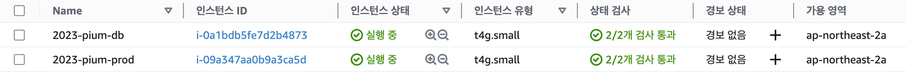
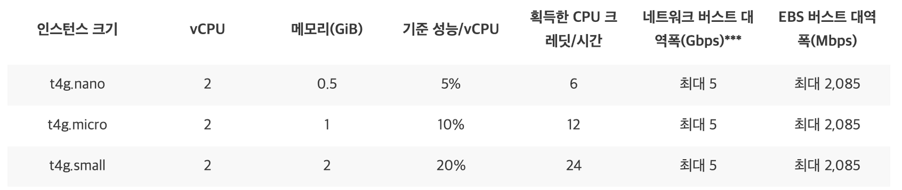

> 이 글은 우테코 피움팀
>
크루 '[주노](https://github.com/Choi-JJunho)', '[그레이](https://github.com/kim0914)', '[조이](https://github.com/yeonkkk)', '[하마드](https://github.com/rawfishthelgh)'
> 가 작성했습니다.

## 서론

Connection Pool 개수 설정에 대해 알아보고 최적의 개수를 설정하기까지의 과정을 정리해보자.

### Connection Pool 크기

10,000명의 사용자가 동시에 요청을 보내는 웹 사이트가 있다고 하자. TPS 목표는 20,000인 상황에서 커녁센 풀 크기는 얼마나 하면 좋을까?

생각보다 많은 pool이 필요하지 않다.

보유한 CPU 코어보다 과도하게 많은 Connection Pool을 생성할 경우 컨텍스트 스위칭이 빈번하게 발생하여 처리속도가 더 느려질 것이다.

10,000명의 사용자가 있을 때 10,000개의 커넥션 풀을 유지하는건 자원 낭비가 심하다.

#### 최적의 커넥션 풀을 구하는 공식

hikariCP 문서에서 다음과 같은 공식을 설명하고있다.

**connections = ((core_count * 2) + effective_spindle_count)**

> [출처 - About Pool Sizing](https://github.com/brettwooldridge/HikariCP/wiki/About-Pool-Sizing#connections--core_count--2--effective_spindle_count)

또한 커넥션 풀이 deadlock 상태에 빠지지 않기 위한 개수를 구하는 공식은 다음과 같이 구성된다.

> 자세한 내용은 아래 글을 참고
> [HikariCP Dead lock에서 벗어나기 (이론편)](https://techblog.woowahan.com/2664/)
> [HikariCP Dead lock에서 벗어나기 (실전편)](https://techblog.woowahan.com/2663/)

**pool size = Tn x (Cm- 1) + 1**

- **Tn: 최대 스레드 수**
- **Cm: 단일 스레드에서 사용하는 최대 커넥션 수**

## 하나의 쿼리가 실행되는 과정

```java

...

	Connection connection = null;
	PreparedStatement preparedStatement = null

try {
  connection = hikariDataSource.getConnection();
  preparedStatement = connection.preparedStatement(sql);
  preparedStatement.executeQuery();
} catch(Throwable e) {
  throw new RuntimeException(e);
} finally {
  if (preparedStatement != null) {
    preparedStatement.close();
  }
  if (connection != null) {
    connection.close(); // 여기서 connection pool에 반납됩니다.
  }
}
```

## Hikari CP에서 connection을 리턴하는 방법

- HikariPool에서 getConnection() 로직은 총 3단계를 통해 Connection을 리턴한다.
- HikariCP에서는 내부적으로 ConcurrentBag이라는 구조체를 이용해 Connection을 관리한다.

```java
HikariPool.getConnection() -> ConcurrentBag.borrow()
```

라는 메서드를 통해 사용 가능한(idle) Connection을 리턴하도록 되어있다.

## 스레드가 Connection을 획득하는 과정

> [출처 : HikariCP Dead lock에서 벗어나기 (실전편)](https://techblog.woowahan.com/2663/)

시나리오: 스레드 1이 커넥션을 얻으러 왔다.. 히카리는 어떤 커넥션을 줄 수 있을까?

**스레드 1**: 히카리님, 커넥션 하나 주세요

히카리: 스레드 1님은 이전에 커넥션을 가져간 적이 있네요. 저희는 사용한 커넥션이 있으면 해당 커넥션을 주는게 원칙이라 확인해볼게요

히카리: 죄송한데, 그 커넥션은 스레드 3님이 사용중이에요.

**스레드 1**: 그럼 딴거 주세요

히카리: 지금 사용가능한 커넥션이 없어요 ^^

**스레드 1**: 그럼 기다릴게요. 30초 까지는 기다릴 수 있어요. 없으면 그냥 예외 터트릴게요

히카리: 네 그럼 사용가능한 커넥션 나오는대로 바로 드릴게요 ~

**스레드 1**: handofffQueue에서 다른 스레드가 쓰고 반납한 커넥션을 얻었다.

## Hikari CP에서 Connection을 회수하는 과정

- HikariCP에서 얻은 Connection은 Connection.close()를 하게 되면 HikariPool에 반납이 된다.
- 정상적으로 transactional이 commit 되거나, 에러로 인해 rollback이 호출 되면 connection.close()가 호출되어 Connection을 Pool에 반납한다.
- getConnection()과 마찬가지로 아래 명령어가 실행되며 Connection 반납

```java
connection.close() -> concurrentBag.requite()
```

## 스레드가 Connection을 반납하는 과정

**스레드 1**: 아 트랜잭션 드디어 끝났네. 커넥션 반납할게요

**스레드 1**: `connection.close()`

히카리: 커넥션 반납 도와드리겠습니다. 일단 idle Connection으로 바꿀게요

히카리: handoffQueue에서 기다리는 스레드 있나보네요

히카리: handoffQueue에 반납받은 커넥션 추가할게요

**스레드 2**: 감사합니다. 오래기다렸어요.

히카리: 스레드 1님 감사합니다. 이번에 사용한 Connection 정보 등록해드릴게요 ~

## ConnectionPool 최적화 하기

적절한 Connection Pool 개수를 설정하기 위해 몇가지 내용을 확인해보자.

### Ec2의 코어 수 확인

> vCPU는 가상 머신 또는 서버가 가상 머신에 대해 파티션되지 않은 경우 실제 프로세서 코어에 지정된 가상 코어다.

인스턴스 유형 t4g.small






vCPU가 2이므로 위에서 이야기한 `connections = ((core_count * 2) + effective_spindle_count)` 공식에 의하면 적절한 스레드풀의 개수는 4 ~ 5개정도로 예상할 수
있겠다.

## 부하 테스트 진행

위 코어수는 이론적인 내용이므로 실제로 부하테스트를 진행하여 실제 값을 비교해보자.

```yaml
spring:
  datasource:
  ...
  hikari:
  ...
  maximum-pool-size: 1 # 커넥션 풀의 최대 크기 <- 해당 값을 조절하며 테스트를 진행한다.
  connection-timeout: 3  # 커넥션 타임아웃 설정 (ms) <- 커넥션 타임아웃의 기본값이 30초다. 너무 길기 때문에 3초로 줄인다.
``` 

 Pool Size    | Thread | loop | timeout | TPS   | err (%) | tomcat max thread 
--------------|--------|------|---------|-------|---------|-------------------
 1            | 100    | 1    | 3       | 1.6   | 4       | 10                
 1            | 200    | 1    | 3       | 3.3   | 3       | 10                
 1            | 500    | 1    | 3       | 4.9   | 8.2     | 10                
 1            | 1000   | 1    | 3       | 5.7   | 25.6    | 10                
 3            | 100    | 1    | 3       | 12.22 | 7       | 10                
 3            | 200    | 1    | 3       | 11.77 | 4.5     | 10                
 3            | 500    | 1    | 3       | 11.39 | 0       | 10                
 3            | 1000   | 1    | 3       | 12.4  | 8.4     | 10                
 4            | 100    | 1    | 3       | 11.15 | 0       | 10                
 4            | 200    | 1    | 3       | 11.1  | 0       | 10                
 4            | 500    | 1    | 3       | 11.4  | 0       | 10                
 4            | 1000   | 1    | 3       | 12.44 | 0.5     | 10                
 5            | 100    | 1    | 3       | 10.63 | 0       | 10                
 5            | 200    | 1    | 3       | 11.46 | 0       | 10                
 5            | 500    | 1    | 3       | 11.44 | 0       | 10                
 5            | 1000   | 1    | 3       | 12.03 | 5.2     | 10                
 10 (default) | 100    | 1    | 3       | 11.2  | 0       | 10                
 10 (default) | 200    | 1    | 3       | 11.4  | 0       | 10                
 10 (default) | 500    | 1    | 3       | 11.49 | 0       | 10                
 10 (default) | 1000   | 1    | 3       | 11.49 | 0       | 10                

위 결과로부터 스레드 Pool Size가 4일 때 부터 비슷한 결과를 내고 있는 것을 볼 수 있다.

공식과 비교했을 때 4~5가 가장 적절한 값이라는 원리와 유사한 결과가 나온다.

## 결론

Connection Pool이 많아도 CPU 코어상으로 처리할 수 없으므로 특정 수치에서부터 동일한 결과가 나오는 현 상황에서는 많아봐야 의미가 없다.

따라서 Connection Pool의 개수를 가장 유의미한 지표를 보인 4로 설정한다.

## Reference

> [HikariCP Dead lock에서 벗어나기 (이론편)](https://techblog.woowahan.com/2664/)
> [HikariCP Dead lock에서 벗어나기 (실전편)](https://techblog.woowahan.com/2663/) 
