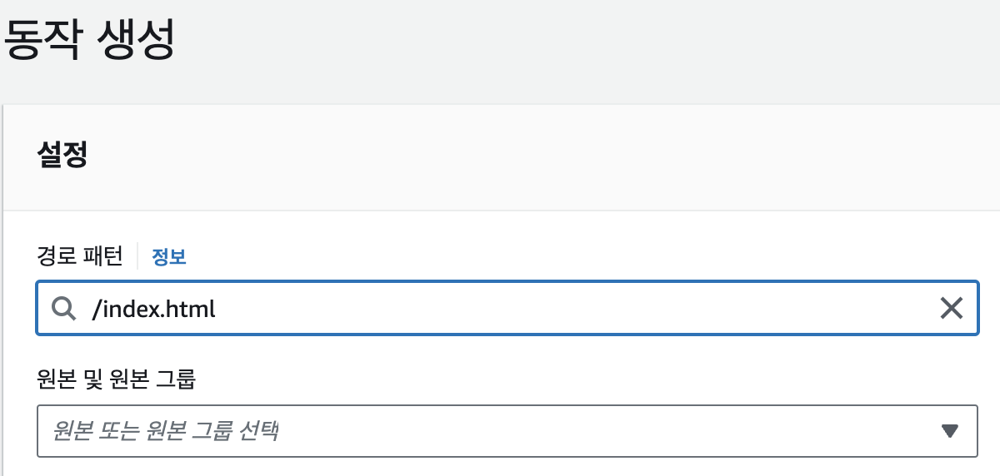

> 이 글은 우아한테크코스 5기, 피움팀 크루 '[쵸파](https://github.com/bassyu)'가 작성했습니다.

## 서론

피움 서비스는 기존에 EC2 + Nginx로 FE 정적 파일 서빙과 백엔드 API 응답을 하나의 EC2에서 하고 있었습니다.

백엔드와의 **관심사 분리**를 위해 EC2에서 **S3**로 FE 정적 파일을 옮기고,
**보안과 CDN 캐시**를 적용하기 위해 **CloudFront**를 통해 배포하였습니다.

더 나아가서, 같은 리소스는 더 빠르게 접근하고 네트워크 트래픽을 줄이기 위해 **HTTP 캐시**를 적용했습니다.

해당 과정을 어떻게 적용하였는지 공유하고자 합니다.

## S3 + CloudFront 배포

이미 S3와 CloudFront로 배포하는 방법은 [피움 블로그](https://blog.pium.life/aws-s3-apply/)에 잘 기록되어 있습니다!
이외의 프론트엔드 배포를 위한 차이점만 다루었습니다.

### S3 업로드 자동화 하기

#### aws cli 설치

가장 좋은 방법은 [공식 문서의 설치 방법](https://docs.aws.amazon.com/ko_kr/cli/latest/userguide/getting-started-install.html)을 그대로 따라 하는 것이었습니다.
피움의 빌드 EC2 환경은 Linux ARM 이어서 해당 명령어를 그대로 따라 해 설치했습니다.

#### 파이프라인 구성

아래의 명령어는 빌드 후 dist 폴더의 파일들을 S3 버킷에 동기화하는(옮기는) 명령어입니다.

```
aws s3 sync ./dist s3://{프로젝트 S3 버킷 경로} --delete
```

이 1줄만 젠킨스 파이프라인에서 실행하면 됩니다.

#### 빌드 EC2에 권한 주기

이때, 빌드 EC2에서 S3에 업로드할 수 있도록 권한을 줘야 합니다.
인스턴스 > 작업 > 보안 > IAM역할 수정
에서 권한을 줄 수 있습니다.

### CloudFront

#### 오류 페이지

SPA로 정적 페이지를 배포하면 최상위뿐만 아니라 다른 path로 이동할 때가 많습니다.
다른 path에 접근하더라도 index.html을 받을 수 있도록 오류 페이지를 설정해 줍니다.


## HTTP 캐시를 위한 응답 헤더 정책

FE 배포는 성공적으로 마무리되었습니다.
이제 더 나은 사용자 경험을 위해 **HTTP 캐시**를 적용하고자 합니다.

### HTTP 캐시를 적용하는 이유

똑같은 리소스는 웹페이지에 들어갈 때마다 새로 요청할 필요가 없습니다.
디스크에 저장해 두었다가 새로운 버전만 요청하면 훨씬 더 빠르지 않을까요?
네트워크 통신 비용도 크게 줄일 수 있습니다.

[HTTP 캐시](https://developer.mozilla.org/ko/docs/Web/HTTP/Caching)를 활용하면 같은 리소스는 네트워크를 거치지 않고 디스크나 메모리에서 바로 사용할 수 있습니다!

### Cache-Control 헤더

리소스 **응답 헤더의 Cache-Control 필드**를 통해 HTTP캐시를 설정할 수 있습니다.
그중 Cache-Control: "max-age=<second>" 값으로 몇 초간 캐시 할지 설정할 수 있습니다.

피움 서비스에서는 '같은 리소스에 대해 한 달은 캐싱한다'는 정책을 주기 위해 아래와 같이 CloudFront의 응답 헤더 정책을 만들었습니다.


그리고 동작에 추가합니다.


이제 CDN이 보내주는 리소스 헤더에 Cach-Control이 더해져서 HTTP 캐시가 적용됩니다! 🎉

### 캐시 버스팅

클라이언트는 설정해 준 시간이 지나지 않으면 동일한 URL의 GET 요청에는 항상 캐시가 적용됩니다.
새로운 버전이 업데이트되면 원래의 캐시를 어떻게 지울까요?

피움은 **새로운 버전의 URL이 바뀔 수 있도록 번들에 해시**를 줘서 캐시 버스팅을 적용했습니다.

아래는 번들 파일에 해시를 주는 webpack.config 설정입니다.

```
// webpack.config.js

output: {
  path: path.join(__dirname, 'dist'),
  filename: '[name].[contenthash].bundle.js',
  chunkFilename: '[name].[chunkhash].chunk.bundle.js',
}
```

이후 빌드된 번들에 해시가 들어간 모습입니다.


그런데 webpack.config를 자세히 보면 chunkhash와 contenthash가 있는 것을 알 수 있습니다.
둘은 어떤 차이일까요?

#### webpack 해시의 종류

우선 하나의 엔트리 포인트에서 나온 파일들을 청크라고 부릅니다.
webpack 설정으로 청크를 어떻게 나눌지는 커스텀할 수 있습니다.

chunkhash는 청크를 기준으로 해시값을 주고, contenthash는 청크가 같더라도 각 파일의 내용을 기준으로 해시값을 줍니다.

만약 하나의 청크에 하나의 파일이 나온다면 chunkhash를 줘도 무방합니다.
하나의 청크에서 .js .css 처럼 여러 파일이 나온다면 contenthash로 더욱 뾰족하게 해싱할 수 있습니다.

### index.html은 예외

index.html 파일은 해시를 주면 안됩니다.
유저가 저희의 서비스를 들어올 때 'www.pium.life/index.hash.html'이런 식으로 요청하지 않기 때문입니다.

다른 리소스와는 달리 파일이 신선하지 않음을 URL로 판단하기 힘들기 때문에
CloudFront의 동작으로 예외처리해서 해결했습니다.

#### 새로운 동작 생성

index.html을 위한 동작을 위해 경로 패턴에 '/index.html'을 적어줍니다.



캐시 정책은 CachingDisabled를 사용합니다.
그리고 응답 헤더 정책은 주지 않습니다.


완성된 모습입니다.


이제 index.html도 최신 버전으로 잘 받아옵니다. 🎉🎉

#### s-maxage + 무효화

HTML에 캐시를 안주는 방법만 있는 것은 아닙니다.
응답 헤더 정책에서 Cache-Control의 s-maxage를 통해 CDN에서만 캐싱을 적용하고, 배포할 때 무효화를 해줄 수 있습니다.

다만 무효화를 자동으로 하기 위해서는 추가적인 IAM 권한이 필요하고, 속도 차이가 크지 않음을 확인해서 아직 적용하지 않았습니다.

### HTTP 캐시를 한 달로 설정한 이유

설정을 한 달로 하면 한달 후에는 같은 리소스도 다시 검증해야합니다.
왜 캐싱하는 시간을 최댓값인 1년으로 하지 않았을까요?

HTTP 캐시는 사용자의 디스크나 메모리에 리소스를 저장합니다.
만약 max-age를 최댓값인 1년으로 설정하면 새로운 버전의 해시가 배포되어도 사용자는 이전 버전의 리소스를 1년간 가지고 있게 됩니다.

그래서 서비스 배포 주기에 맞는 적절한 기간을 논의하여 한 달로 설정하였습니다.
소중한 고객님이 불필요한 리소스를 1년간 저장할 필요는 없으니까요!

## 정리

HTTP 캐시는 처음 접해보는 분야이고 index.html은 예외를 줘야 한다는 점이 흥미로웠습니다!
캐시 기간도 길다고 무조건 좋은 게 아니었습니다.
결과적으로 네트워크 트래픽을 줄이고 더 빠른 사용자 경험을 줄 수 있어서 뿌듯한 경험이 되었습니다.

### 참고한 자료

[웹 서비스 캐시 똑똑하게 다루기](https://toss.tech/article/smart-web-service-cache)
