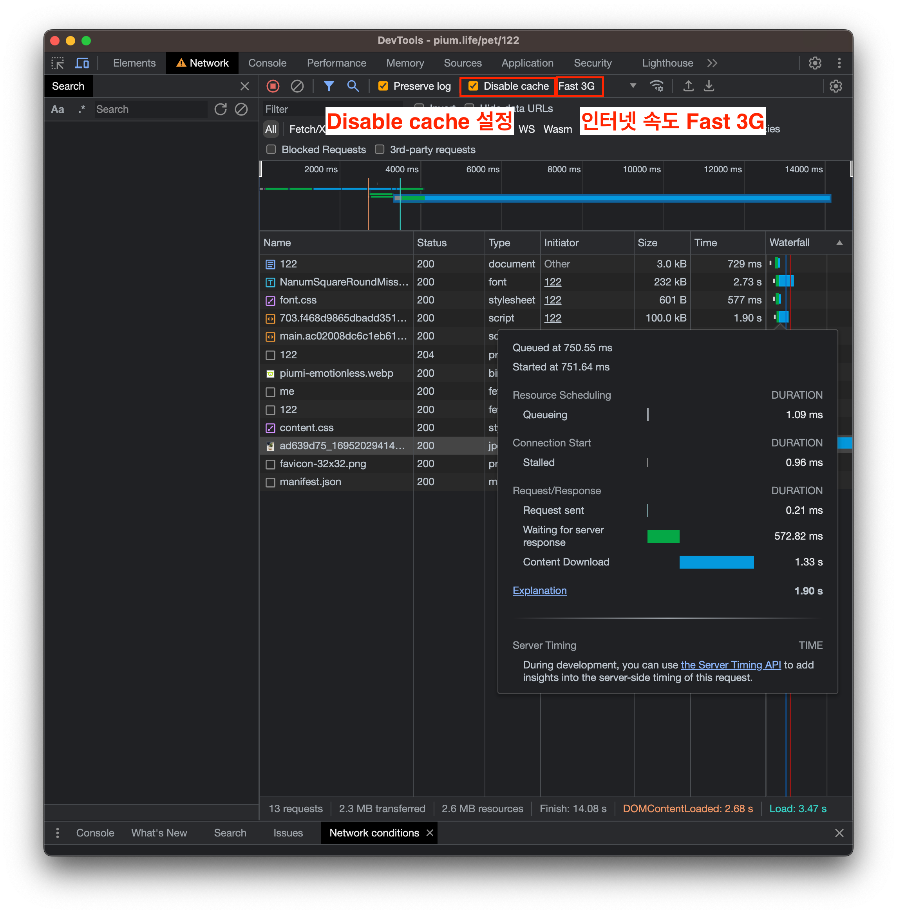
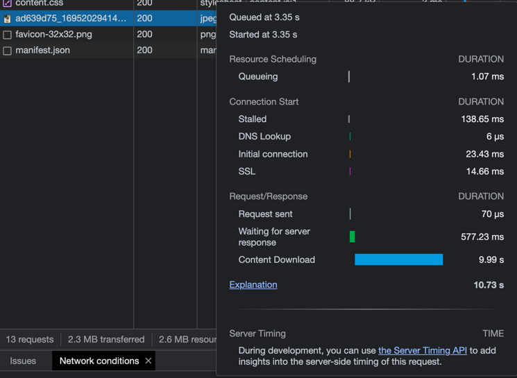
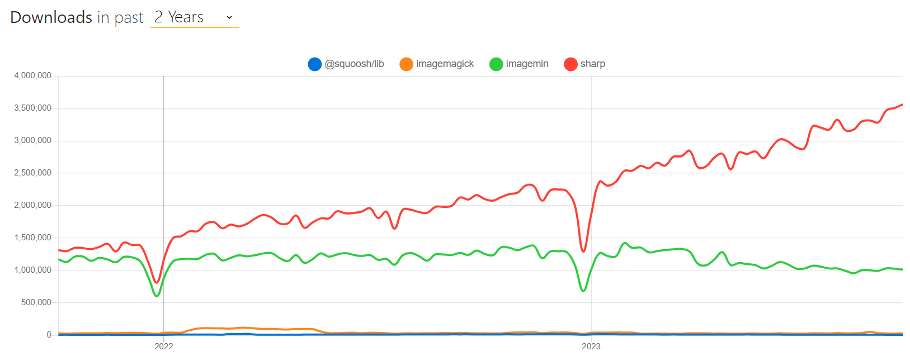

> 이 글은 우테코 피움팀 크루 '[주노](https://github.com/Choi-JJunho), [참새](https://github.com/WaiNaat)'가 작성했습니다.

## 서론

피움 서비스를 이용하는 과정에서 불러오는 이미지의 크기가 너무 커서 사용자가 이미지 로드할 때 시간이 오래 걸린다.

> 
> 위와 같은 환경에서 이미지 로드 시간을 책정해봤다.
>  
> 사용자가 인터넷 환경이 느린 경우 1.8MB 사진을 로드하는 데 9.99초 이상의 로드시간이 걸린다.

피움 서비스는 사진 업로드가 유의미할 정도로 많이 일어나지 않는다.

따라서 다음과 같은 시나리오로 이미지를 압축하려고한다.

```markdown
1. S3에서 이미지 불러오기
2. 이미지 압축
3. S3로 이미지 보내기
```

서버에서 특정 시간마다 이미지 압축을 수행하고 이를 S3에 업로드하는 과정을 통해 이미지 최적화를 진행해보자.

## 시작하기

> WebP(웹피)는 손실/비손실 압축 이미지 파일을 위한 이미지 포맷이다.
> [위키백과](https://ko.wikipedia.org/wiki/WebP)

이미지 압축을 진행하기에 앞서 다음 두가지 방식을 고려했다.

- `1. 서버에서 cwebp 프로그램을 이용해 이미지를 webp 형태로 변환하는 방법`
- `2. node, python과 같은 언어를 이용해 이미지를 변환하는 방법`

1번의 경우 서버에 직접 프로그램을 설치하고 관리해야하는 관리 소요가 있다

현재 빌드서버에서 배치로 작업을 수행할 것이기 때문에 npm이 이미 설치되어있다는 가정하에 javascript로 개발하는 것이 적합하다고 판단하여 node.js로 이미지 최적화 코드를 작성헀다.

추가로 해당 코드를 주기적으로 실행시키기 위한 쉘 스크립트도 함께 작성했다.

## 코드

코드를 하나씩 살펴보자.

### 자바스크립트

이미지 변환에는 [sharp](https://sharp.pixelplumbing.com/) 라이브러리를 사용하였다. [npm trends](https://npmtrends.com/@squoosh/lib-vs-imagemagick-vs-imagemin-vs-sharp)를 이용해 비교했을 때 다른 패키지들과의 다운로드 수 차이가 많이 나서 정보를 찾아봤었다. sharp는 [libvips](https://github.com/libvips/libvips)를 사용하기 때문에 다른 라이브러리에 비해서 속도가 훨씬 빠르고, 컴퓨터의 자원 자체를 최대한 조금만 사용하도록 설계했다는 이야기를 듣게 되었다. 이는 아마존 aws라는 굉장히 한정된 자원을 가진 서버에서 이미지 최적화를 해야 한다는 우리의 문제 해결에 가장 적합할 것이라는 생각이 들어 최종적으로 sharp를 선택하였다.



사진은 압축률이 가장 좋은 최신 기술인 webp를 기본적으로 제공하되, 지원하지 않는 브라우저를 고려해 png 확장자로도 바꿔서 저장한다. 아래는 변환 함수 부분만 담은 코드이다. `outputPath`의 파일 이름을 정하는 방식은 피움 팀 프론트엔드의 회의를 통해 나온 규칙이며, [Github Discussions](https://github.com/woowacourse-teams/2023-pium/discussions/384)에서 확인 가능하다.

```javascript
import { join } from 'path';
import sharp from 'sharp';

const convertImageTo = async (dir, filename, width, type, format) => {
  const filenameWithoutExt = filename.split('.')[0];
  const inputPath = join(dir, filename);
  const outputPath = join(dir, `${filenameWithoutExt}.${type}.${format.toLowerCase()}`);

  const image = sharp(inputPath);
  const { width: imageWidth } = await image.metadata();
  
  // 이미지가 목표보다 이미 작을 경우 굳이 조정하지 않음
  if (imageWidth <= width) {
    await image
      .withMetadata()
      .toFile(outputPath);

    return false;
  }

  await image
    .resize(width)
    .withMetadata()
    .toFormat(format.toLowerCase(), { quality: 100 })
    .toFile(outputPath);

  return true;
};
```

변환 이후 똑바로 일어나 있던 사진이 눕는 현상이 생겼었다. 이는 사진 파일들이 `orientation`이라는 메타데이터를 갖고 있는데 변환을 하면서 해당 자료를 잃어버려 생기는 현상이었다. sharp의 `withMetadata()`를 사용하면 간단하게 해결이 가능하다.

커맨드 라인에서 받은 정보들을 갖고 이 함수를 이용해 하나씩 파일을 변환하는 방식이다.

### 쉘 스크립트

파일을 탐색하여 자바스크립트로 작성된 함수를 수행한다.

```shell
# 전처리

convert_image() {
    local count_success=0
    local count_failure=0
    local count_skip=0

    local target_dir=$1
    local size=$2
    
    local total_files=$(find "$target_dir" -type f -iname "*.jpeg" -o -iname "*.jpg" -o -iname "*.png" -o -iname "*.gif" | wc -l)

    echo "$total_files 개의 파일에 대한 작업 시작"

    # 대, 소문자 구분 없이 탐색 활성화
    shopt -s nocaseglob
    for file in "$target_dir"/*.{jpeg,jpg,png,gif}; do
	    # 대, 소문자 구분 없이 탐색 비활성화
	    shopt -u nocaseglob

	    if [ -f "$file" ]; then # 파일인 경우에만 처리
		    filename_full=$(basename "$file")
		    extension="${filename##*.}" # 확장자 추출
		    extension=$(echo "$extension" | tr '[:upper:]' '[:lower:]')  # 확장자 소문자로 변환
		    filename="${filename_full%.*}"

		    output_file="$target_dir/${filename}.${nick_name}.webp"
		    if [ -e "$output_file" ]; then # 이미 존재하는 파일이라면 생략
			    ((count_skip+=1))
		    else
			    # 여기에 이미지 압축!
			    node resize.js -d "$target_dir" -i "$filename_full" -s "$size" -n "$nick_name"

			    if [ $? -ne 0 ]; then
				    echo "변환 실패: $file -> $output_file" >> "$error_log"
				    ((count_failure++))
			    else
				    ((count_success++))
			    fi
		    fi
	    fi
    done
    echo ""
    echo "SIZE $width 변환 실패 파일 개수: $count_failure"
    echo "SIZE $width 변환 성공 파일 개수: $count_success"
    echo "SIZE $width 변환 생략 파일 개수: $count_skip"
}

# 함수 실행
```

### crontab

아래 쉘 스크립트를 crontab에 등록하여 이미지 저장 - 압축 - 등록 과정을 수행한다.

```shell
#!/bin/bash

# S3에서 이미지를 받아온다
aws s3 sync s3://{S3 이미지 경로} {로컬 이미지 경로}

# 최적화를 진행한다.
/home/ubuntu/resize-image/bash.sh -s 512 -n "small" -d "{로컬 이미지 경로}"
/home/ubuntu/resize-image/bash.sh -s 128 -n "x-small" -d "{로컬 이미지 경로}"

# 최적화가 완료된 파일을 S3로 업로드한다.
aws s3 sync {로컬 이미지 경로} s3://{S3 이미지 경로}
```

## 정리

간단하게 배포 시나리오와 별개로 이미지 리사이징을 수행해봤다.

개발 일정이 이미 어느정도 잡혀있고 코드상으로 추가하기 어려운 부분이라면 서버에서 배치로 돌리는것도 고려해보면 좋을 것 같다.

- [github 이미지 리사이징을 위한 코드](https://github.com/pium-official/resize-image)

## Reference

- https://certbot.eff.org/instructions
- https://sharp.pixelplumbing.com
