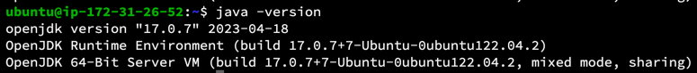
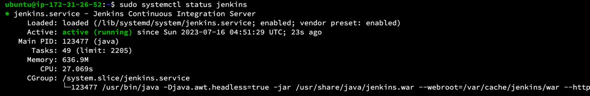
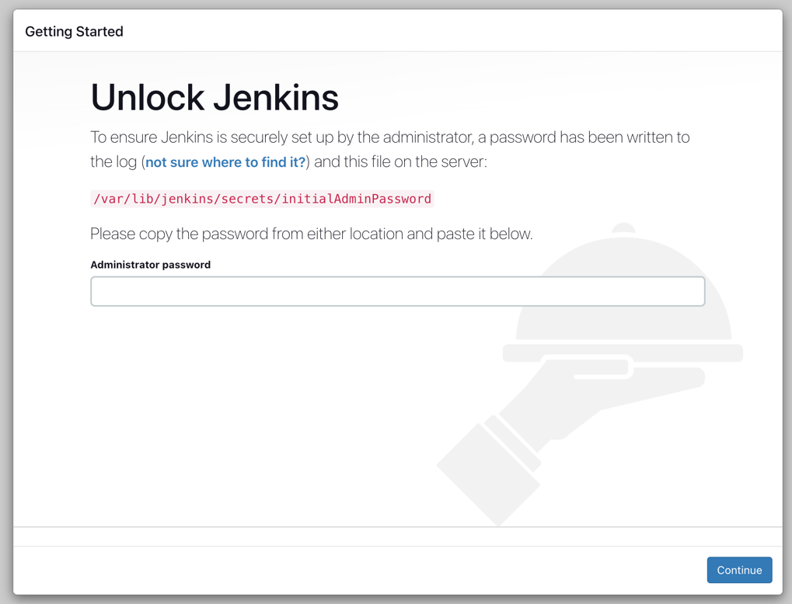
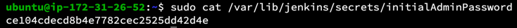
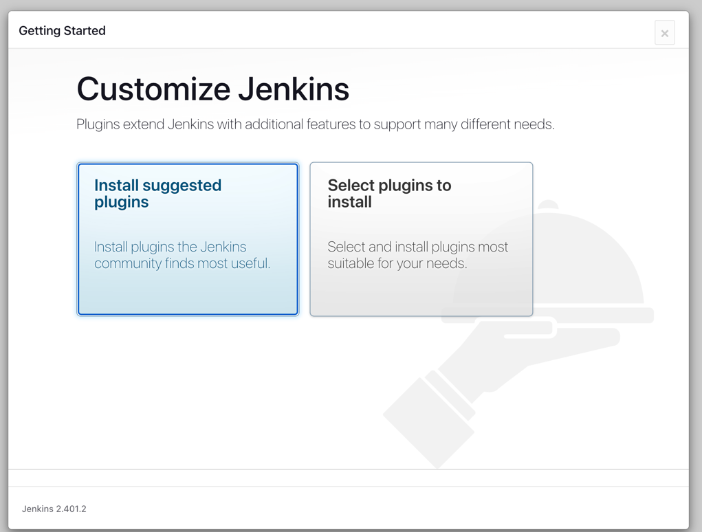
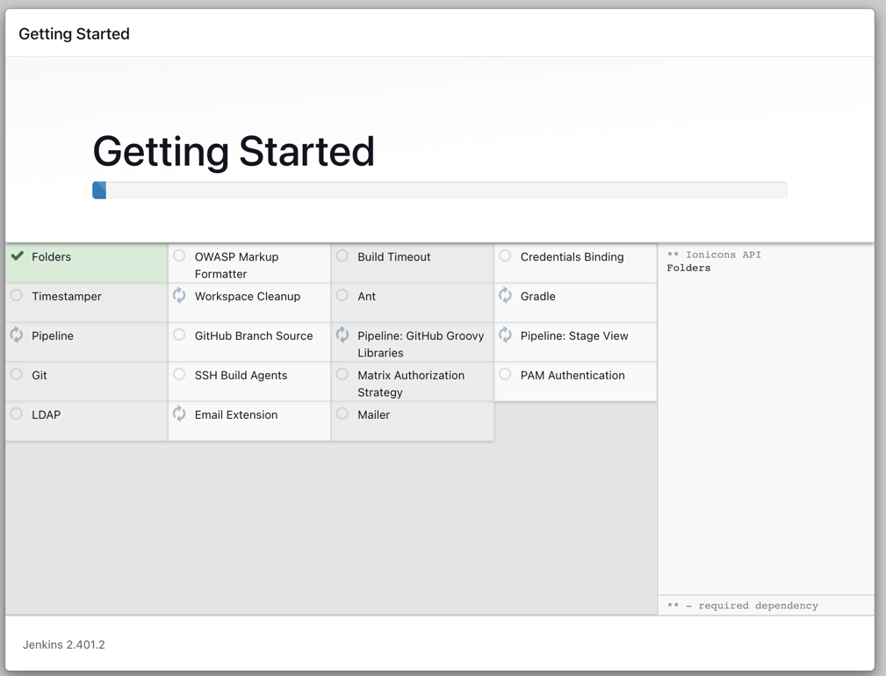
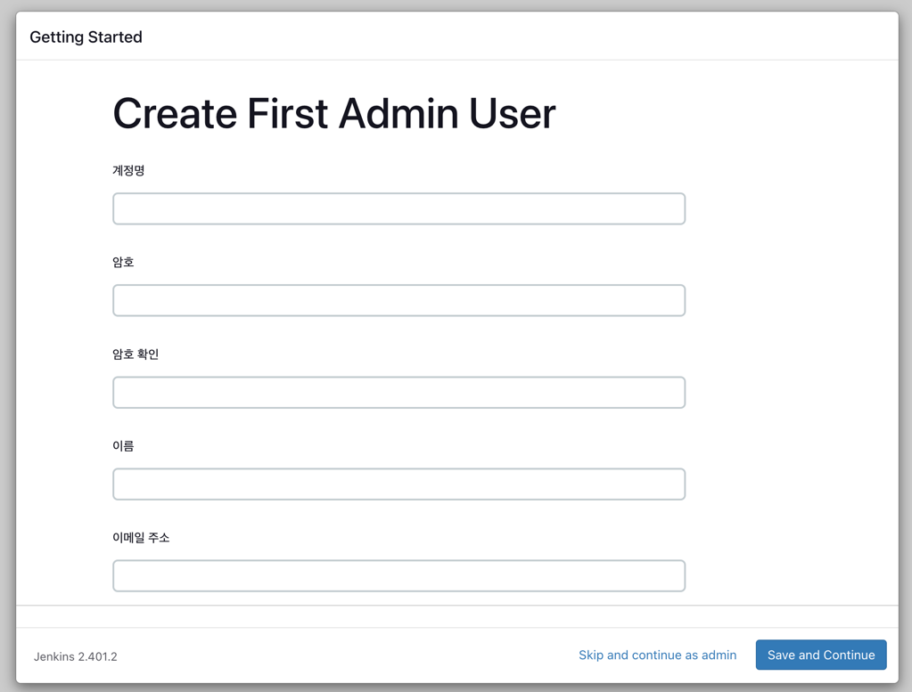
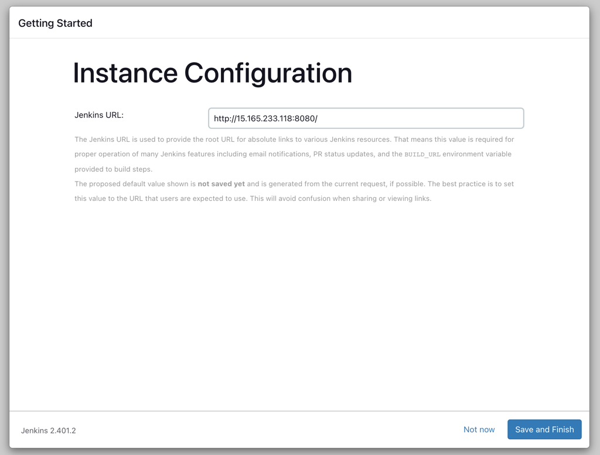
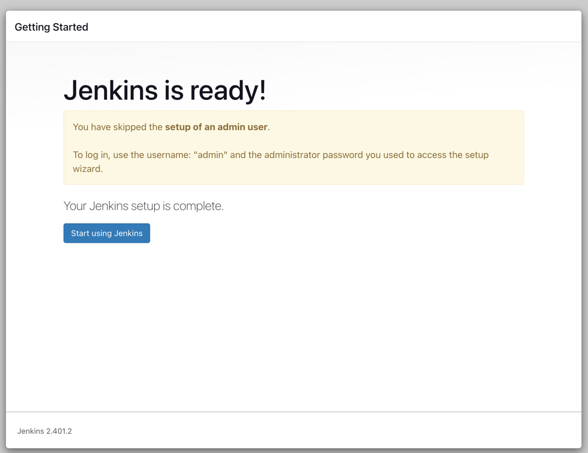

> 이 글은 우테코 피움팀 크루 '[주노](https://github.com/Choi-JJunho)'가 작성했습니다.
 

## 서론

피움팀에서 Jenkins를 도입하고 적용하는 과정을 거쳤다.

정확한 동작과정을 몰랐기 때문에 헤매는 상황이 빈번하게 있었다.
이에 Jenkins를 설치하고 환경설정을 빌드서버 환경을 구축한 일련의 과정을 기록해두려고한다.

> 작업 환경 : Ubuntu 22.04.2 LTS

## 공식문서 살펴보기

[젠킨스 공식문서](https://www.jenkins.io/doc/book/installing/linux/)를 확인하면 설치 방법이 친절하게 나와있다.

아무것도 없는 EC2 환경에서 Jenkins를 설치하고 구동하는 과정을 따라가보자.

## (Optional) Swap 메모리 설정하기

프리티어환경에서 Jenkins를 사용하면 자칫 메모리가 부족한 상황이 발생할 수도 있다.
2GB의 메모리는 젠킨스와 빌드를 모두 견디기 어려울 수도 있다.

다음 명령어를 통해 서버에 Swap 메모리를 할당하자.

```shell
sudo fallocate -l 2G /swapfile
sudo chmod 600 /swapfile
sudo mkswap /swapfile
sudo swapon /swapfile

free -h # 확인명령어
```

> [Swap 메모리 할당하기](https://velog.io/@junho5336/Swap-%EB%A9%94%EB%AA%A8%EB%A6%AC-%ED%95%A0%EB%8B%B9%ED%95%98%EA%B8%B0)를 참고

## java 설치하기

> 설치 방법은 [공식문서](https://www.jenkins.io/doc/book/installing/linux/)를 확인하면서 진행하고있습니다.

현재 사용할 jenkins의 버전은 java 17을 사용한다.
java 17버전을 설치하자

```shell
sudo apt update
sudo apt install openjdk-17-jre
java -version
```



## jenkins 설치하기

다음 명령어를 수행하여 jenkins를 설치한다.

```shell
curl -fsSL https://pkg.jenkins.io/debian-stable/jenkins.io-2023.key | sudo tee \
  /usr/share/keyrings/jenkins-keyring.asc > /dev/null
echo deb [signed-by=/usr/share/keyrings/jenkins-keyring.asc] \
  https://pkg.jenkins.io/debian-stable binary/ | sudo tee \
  /etc/apt/sources.list.d/jenkins.list > /dev/null
sudo apt-get update
sudo apt-get install jenkins

sudo systemctl status jenkins # 실행상태 확인
```




## jenkins 접속하기 & 초기설정

> jenkins는 기본적으로 8080포트를 사용한다.
> jenkins의 포트를 변경하는 방법에 대해서는 본 글에서 다루지는 않는다.

`{인스턴스-public-ip}:8080` 으로 접속하면 다음과 같은 화면을 볼 수 있다.



다시 EC2 화면으로 넘어와서 다음 명령어를 수행하여 `initialAdminPassword`를 알 수 있다.

```shell
sudo cat /var/lib/jenkins/secrets/initialAdminPassword
```



확인한 암호를 화면에 입력한 뒤 Continue 버튼을 눌러 계속 진행한다.


초기 플러그인 세팅 화면이 나오는데 `Install suggested plugins` 를 눌러 초기 플러그인 설정을 진행한다. 





초기 Admin 유저를 생성할 수 있다.



jenkins의 기본 URL을 설정할 수 있다. 기본값을 권장한다. 



여기까지 했으면 초기 설정은 완료했다고 볼 수 있다.

만약 위 과정에서 admin 유저를 생성하지 않았다면 `admin` 이라는 기본 유저로 로그인 할 수 있다고 설명하고 있다.
비밀번호는 `initialAdminPassword` 과정에서 입력했던 값으로 설정되어있다.



이렇게 Jenkins를 설치할 수 있다.

## Reference

- https://www.jenkins.io/doc/book/installing/linux/
