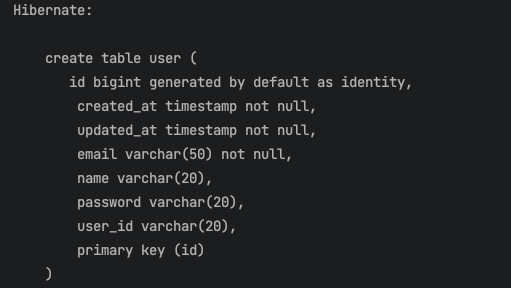
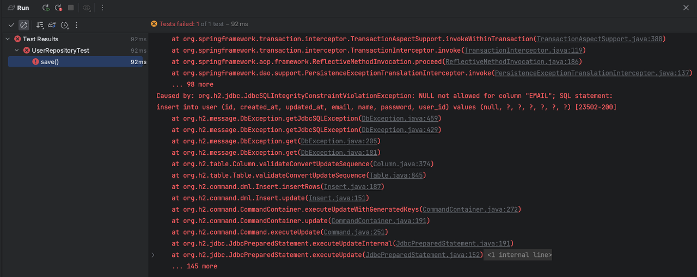
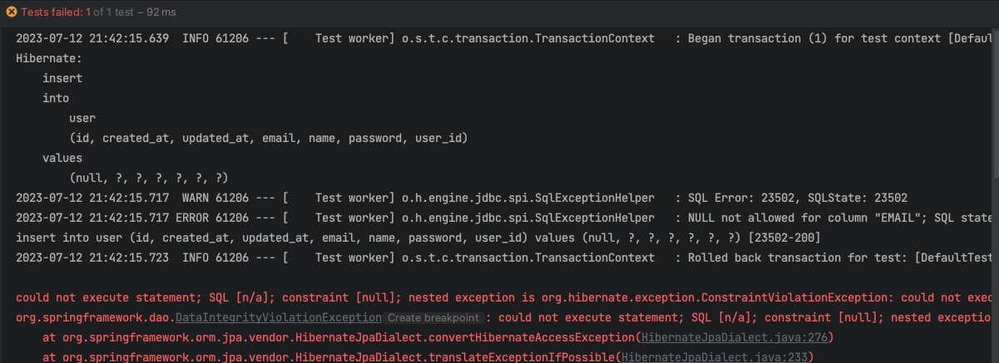
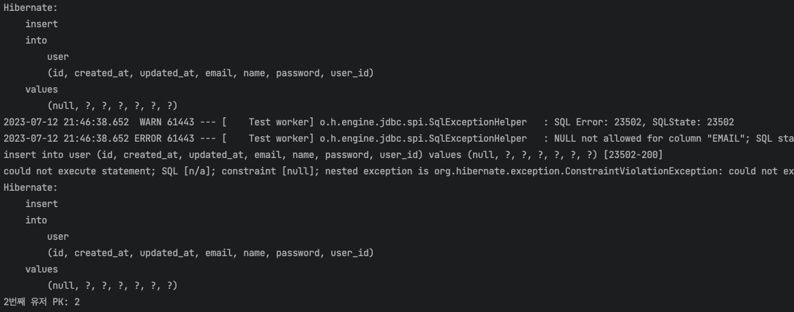
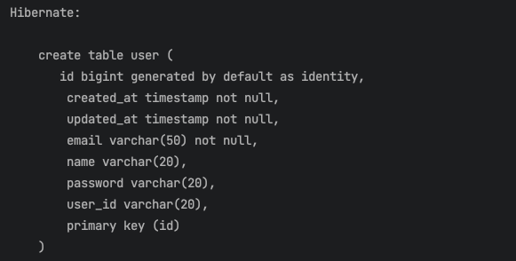
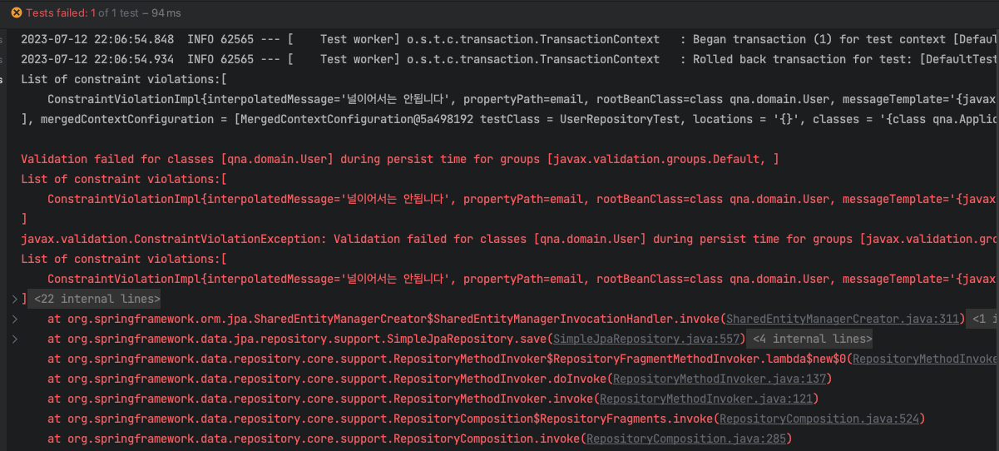
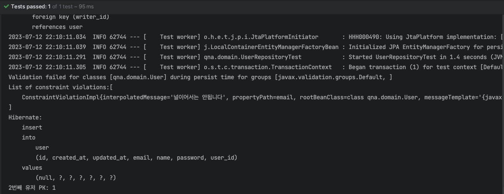
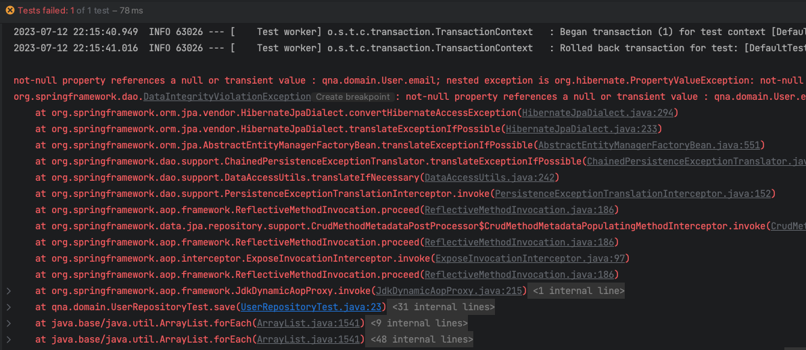

> 이 글은 우테코 피움팀 크루 '[그레이](https://github.com/Kim0914)'가 작성했습니다.


## 서론

JPA를 이용해 엔티티를 설계하다가 `@NotNull` 어노테이션과 @Column의 `nullable=false`의 차이점이 궁금해져 알아보았습니다.


## nullable = false ??

JPA는 엔티티를 매핑하고 설계하면 자동으로 DDL을 생성해 주는 기능을 제공합니다. 
또한 엔티티의 각 컬럼들에 대해 NOT NULL, UNIQUE 등과 같은 제약 조건이 포함되는 경우에도 자동으로 DDL을 생성해 줍니다.


엔티티를 설계할 때 일반적으로 @Column 어노테이션을 활용합니다. 
@Column 어노테이션에서 해당 컬럼의 NOT NULL 제약을 설정할 수 있는데 `@Column(name = "email", nullable = false)`와 같이 nullable=false 설정을 걸어주면, 해당 제약 조건을 명시할 수 있습니다. 
따로 명시하지 않으면 nullable의 기본 값은 true입니다.


간단한 User 엔티티를 생성해 보겠습니다.

```java
@Entity
@Table(name = "user")
public class User extends AuditingEntity {

    @Id
    @GeneratedValue(strategy = GenerationType.IDENTITY)
    @Column(name = "id", updatable = false)
    private Long id;

    @Column(name = "user_id", length = 20)
    private String userId;

    @Column(name = "password", length = 20)
    private String password;

    @Column(name = "name", length = 20)
    private String name;

    @Column(name = "email", nullable = false, length = 50)
    private String email;
}
```

User 테이블의 email 필드는 반드시 값이 존재해야 합니다. 
즉, **NOT NULL 제약 조건이 필요**합니다. 
여기서 JPA가 자동으로 생성하는 DDL을 확인해 보겠습니다.



`email varchar(50) not null` 과 같이 not null 제약 조건이 자동으로 명시됨을 알 수 있습니다.


하지만 DDL은 애플리케이션 내부가 아닌 데이터베이스 컬럼의 속성에 대한 조건이므로, 스프링(자바) 애플리케이션 내 User 엔티티의 email 필드는 null이 허용됩니다.


테스트 코드로 확인해 보겠습니다.

```java
@TestConstructor(autowireMode = TestConstructor.AutowireMode.ALL)
@DataJpaTest
class UserRepositoryTest {

    private final UserRepository userRepository;

    public UserRepositoryTest(UserRepository userRepository) {
        this.userRepository = userRepository;
    }

    @Test
    void save() {
        User user = new User("gray1234", "password", "gray", null);

        User savedUser = userRepository.save(user);

        assertThat(savedUser).isEqualTo(user);
    }
}
```



테스트가 실패함을 확인할 수 있습니다.


하지만 여기서 주의 깊게 살펴볼 점이 있습니다. 예외 메시지를 따라 올라가 보면 insert 쿼리가 한 번 발생한 것을 알 수 있습니다. 또한 발생한 예외 타입이 JdbcSQL.... Exception입니다.


즉 애플리케이션 내부가 아닌, 데이터베이스 내에서 예외가 발생했다는 것입니다.



애플리케이션 내에서는 email 컬럼의 null을 체크하지 못하고, 데이터베이스에 쿼리가 실행될 때 예외가 발생한다는 것입니다. 또한 insert 쿼리가 데이베이스에서 실행되므로 Auto Increment인 PK가 증가합니다.



첫 번째 유저를 저장할 때는 email 값을 null로 할당한 후 try - catch를 이용해 예외를 삼키고, 두 번째 유저는 정상적으로 저장한 후 PK를 출력해 봤습니다. 예상한 것처럼, 두 번째 유저의 PK는 2 임을 확인할 수 있습니다.


**그렇다면, 애플리케이션 내 엔티티에서는 null을 어떻게 막을 수 있을까요?**


## @NotNull과 함께라면?

`@NotNull`은 java validation에 속하며 `@Valid`를 이용한 요청을 처리하는 단계에서 예외를 잡을 수도 있고, bean validation을 통해 예외를 검증할 수도 있습니다.


우리가 DTO와 같이 클래스의 필드를 검증하는 방법과 동일하게 엔티티의 필드도 검증할 수 있습니다. 당연히 같은 자바 객체이고 도메인이기 때문에 동일하게 적용할 수 있습니다.


@Valid 어노테이션도 없이 어떻게?라고 생각할 수 있는데요, Hibernate는 엔티티에 적용된 Bean Validation 어노테이션 역시 DDL로 변환합니다. 
@NotNull은 nullable=false와 마찬가지로 DDL 상에서 해당 컬럼이 NOT NULL 제약조건을 가짐을 명시합니다.


스프링 공식문서인 밸덩에서도 이를 명확히 언급하고 있습니다. [밸덩 바로가기](https://www.baeldung.com/hibernate-notnull-vs-nullable)


이전 User 테이블에 nullable=false를 제거한 후 @NotNull 어노테이션만 붙여준 후 생성되는 DDL을 살펴보겠습니다.

```java
@Entity
@Table(name = "user")
public class User extends AuditingEntity {

    @Id
    @GeneratedValue(strategy = GenerationType.IDENTITY)
    @Column(name = "id", updatable = false)
    private Long id;

    @Column(name = "user_id", length = 20)
    private String userId;

    @Column(name = "password", length = 20)
    private String password;

    @Column(name = "name", length = 20)
    private String name;

    @NotNull
    @Column(name = "email", length = 50)
    private String email;
}
```



동일하게 **email varchar(50) not null** 과 같이 not null 제약 조건이 자동으로 명시됨을 알 수 있습니다.

Hibernate에 의해 DDL이 자동으로 생성되는 기능을 끄고 싶다면 아래와 같이 설정하면 됩니다.

```properties
spring.jpa.properties.hibernate.validator.apply_to_ddl=false
```

그렇다면 nullable = false와 어떤 차이가 있을까요?

차이점을 알아보기 위해 이전에 User의 email 필드에 null을 세팅한 후 저장하는 테스트 코드를 실행해보겠습니다.



다음과 같이 `javax.validation.ConstraintViolationException` 예외가 발생한다는 것을 알 수 있습니다. 또한 nullable=false 방식 때 발생하던 **insert 쿼리가 발생하지 않는다**는 점도 함께 볼 수 있습니다.


`javax.validation.ConstraintViolationException` 예외가 발생했다는 것은 스프링(자바) 애플리케이션 내에서 예외를 잡았다는 것입니다. 그러므로 데이터베이스에 쿼리가 실행될 일이 없습니다.


좀 더 정확하게 말하면 객체가 생성되는 시점이 아닌 **엔티티가 영속화되는 시점에 예외가 발생**합니다.


확실하게 알아보기 위해 동일한 User1, User2 저장 테스트를 실행해 보면 2번째로 저장한 유저의 PK가 1 임을 알 수 있습니다.



또한 @NotNull을 어노테이션을 사용하게 되면 예외 메시지를 직접 작성할 수 있는 장점도 존재합니다.

---

여담으로, @NotNull 없이 nullable=false 만 설정한 경우에도 NULL 검증을 진행하고 싶다면 아래와 같이 설정하면 됩니다.
```properties
spring.jpa.properties.hibernate.check_nullability=true
```


스프링(자바) 애플리케이션 단에서 예외가 잡히는 것을 볼 수 있습니다. 하지만 예외 타입이 hibernate.PropertyValueException으로 다릅니다.


굳이 추천하는 방법은 아닌 것 같습니다.


또한 `@NotBlank`나 `@NotEmpty`는 자동으로 DDL을 생성해주지 않습니다.

그러므로 @NotBlank나 @NotEmpty를 사용하는 경우에는 `@Column(nullable=false)`를 반드시 추가해야 DDL에 NOT NULL 제약조건이 반영됩니다.

---

## 정리
**@Column(nullable = false)**
DDL을 자동으로 생성하지만, 애플리케이션의 영속성 컨텍스트에서 엔티티 필드에 null이 들어가는 것을 막지 못한다.

또한 데이터베이스에 쿼리가 실행된 후 예외가 발생한다.


**@NotNull**
DDL을 자동으로 생성하고 애플리케이션의 영속성 컨텍스트에서 엔티티 필드에 null이 들어가는 것을 막는다.

잘못된 제약 조건인 경우 데이터베이스에 불필요한 쿼리를 날리지 않는다.

추가적으로 Bean Validation 방식은 예외 메세지를 직접 작성할 수 있다.

또한 @Size와 같이 다른 validation을 통해 엔티티 필드 값을 검증할 수 있다.


단점으로는 코드가 지저분해지고, JPA를 이용한 엔티티화 시킨 것이 아닌 객체라면 @NotNull 어노테이션을 해석하지 못한다.


하이버네이트에서는 nullable=false보다 @NotNull 사용을 조금 더 권장하고 있다.


## 레퍼런스
https://www.baeldung.com/hibernate-notnull-vs-nullable

https://kafcamus.tistory.com/15

