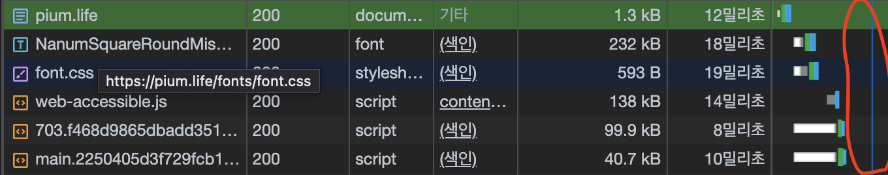
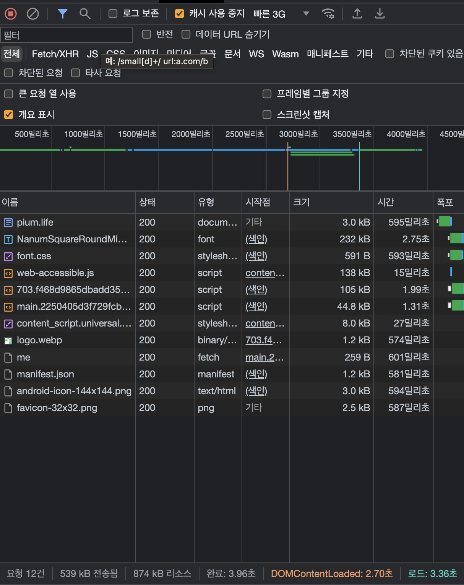

> 이 글은 우테코 피움팀 크루 '[클린](https://github.com/hozzijeong)'가 작성했습니다.


# 피움 최적화 하기

어찌어찌 서비스를 론칭하긴 했지만, 여러가지로 문제가 있었습니다. 첫 페이지 로드시에 미리 이미지 크기를 설정해 놓지 않아서 layout shift가 발생하기도 하고 전체적인 번들 사이즈가 400kb가 넘기도 하며, 페이지 로드 후에 폰트가 적용되어서 깜빡이는 현상이 발생하기도 했습니다. http 헤더 설정도 의도적으로 되어 있지 않아서 캐시 기간도 모르고, CDN 적용도 되어있지 않아서 캐시 역시 제대로 되지 않았습니다. 이러한 문제점들이 모여서 결국 사용자의 데이터를 많이 잡아먹고 폰트나 버벅거림 등은 분명한 사용자 경험 저해 요소이기 때문에 이를 해결하기 위한 방안을 세웠습니다.

우선적으로 명시적인 문제를 먼저 해결해야 했습니다. Lighthouse를 통해서 측정을 해본 결과는 다음과 같습니다.


생각보다 성능이 높게 나와서 놀랐습니다. 이제부터 세부 항목들을 찬찬히 살펴보겠습니다. 

1. 번들의 크기가 너무 크다. 
2. 폰트 로딩에 많은 시간이 소요된다.
3. 파일들이 캐시되지 않는다


위 이미지에서 볼 수 있듯이, `bundle.js`의 파일 크기가 무려 444kib이고, 폰트의 크기 역시 합치면 1mb에 달합니다. 또한 캐시 + TTL에서 보면 알 수 있듯이 캐시를 전혀 사용하지 않고, 매번 새 파일을 요철하고 있습니다. 이는 사용자의 데이터를 그만큼 사용하고, 느린 네트워크 환경에서 속도를 저하시키는 요인이 됩니다. 

추가적으로 하나의 큰 문제로, 피움 서비스 내부에서 사용하는 아이콘들에 문제가 있습니다. 피움에서는 모든 아이콘들을 SVG-in-JS방식으로 사용하고 있는데, [SVG-in-JS와 결별 이라는 글](https://kurtextrem.de/posts/svg-in-js)에서 이 방법은 자바스크립트 컴파일 하는 코드의 양을 오히려 늘리는 안티 패턴이라는 글을 봤습니다. 해당 글에서 제안하는 해결 방법은 색 변화 등 props들의 영향을 받지 않는 이미지의 경우에 img태그를 통해 이미지를 로드하고, 그게 아닌 경우에는 `SVGSprite`라는 기술을 사용해서 이미지를 로드 하는 것을 추천하고 있습니다.

따라서 피움은 아래 4가지를 개선함으로써 최적화를 진행했습니다.

- 요청 크기 줄이기
- 같은 요청 두번 하지 않기
- 이미지 최적화
- SVG-in-JS 개선

## 요청 크기 줄이기

### 정적 배포 방식 변경하기

현재 `EC2`를 통해서 전달 받는 bundle의 크기는 444KB입니다. 문제는 이 파일을 어떻게 줄일 수 있을까? 입니다. webpack을 사용하면서 자동으로 압축을 해주기 때문에 analyze로 분석했을 때 줄일 수 있는 부분은 크게 보이지 않았습니다.


 
현재 받는 parsed size가 pium에서 받는 444kb와 같다는 것을 알 수 있습니다. 아래 있는 Gzipped size가 있는데 이 사이즈는 141kb로 3배 좀 넘게 차이가 나는 크기입니다. 그렇다면 어떻게 Gzipped로 파일을 압축할 수 있을까요?

> **gzip**은 [파일 압축](https://ko.wikipedia.org/wiki/%ED%8C%8C%EC%9D%BC_%EC%95%95%EC%B6%95)에 쓰이는 [응용 소프트웨어](https://ko.wikipedia.org/wiki/%EC%9D%91%EC%9A%A9_%EC%86%8C%ED%94%84%ED%8A%B8%EC%9B%A8%EC%96%B4)이다. gzip은 GNU zip의 준말이며, 초기 [유닉스](https://ko.wikipedia.org/wiki/%EC%9C%A0%EB%8B%89%EC%8A%A4) 시스템에 쓰이던 [압축](https://ko.wikipedia.org/wiki/%EB%8D%B0%EC%9D%B4%ED%84%B0_%EC%95%95%EC%B6%95) 프로그램을 대체하기 위한 [자유 소프트웨어](https://ko.wikipedia.org/wiki/%EC%9E%90%EC%9C%A0_%EC%86%8C%ED%94%84%ED%8A%B8%EC%9B%A8%EC%96%B4)이다. - [위키 백과](https://ko.wikipedia.org/wiki/Gzip)
> 

피움은 Gzipped로 변경하는 방법을 서비스 정적 배포 방식의 변경으로 선택했습니다. 기존 배포 방식은 EC2에 빌드한 파일을 올리고 주소창에 도메인을 입력하면 DNS에서 일치하는 도메인을 찾은 뒤 Nginx에서 EC2 서버 인스턴스에 있는 프론트엔드 정적 파일을 배포하는 방식을 사용했었습니다. 


(빌드 후에 폴더와 파일들을 gzip으로 압축해서 배포하는 방법도 있었지만, 이때는 생각하지 못했습니다.)

정적 배포 방식을 EC2에서 S3 + cloudfront로 변경하는 데에는 단순히 gzip만 있는 것도 아닙니다. s3를 사용했을때 장점을 요약하자면 아래와 가습니다.

- 자동 확장, 축소하기 때문에 특정 크기 할당 필요가 없음
- 서버리스이기 때문에 파일이 저장되는 서버를 관리할 필요가 없음
- 애플리케이션에 서버가 필요하더라도 정적 콘텐츠에 대한 요청 처리 필요가 없기 때문에 해당 서버의 크기 줄이기 가능.

EC2는 결국 컴퓨터이기 때문에 만약에 메모리 초과가 발생하거나 모종의 이유로 서버가 다운된다면 피움 페이지로 들어온 사용자들은 흰 화면만 보게 됩니다. 아무것도 모르는 사용자는 어떠한 에러 페이지도 보지 못한채 서비스를 떠나게 될 가능성이 있습니다. 또한, 단순히 정적 파일만을 제공하고 있는데 굳이 컴퓨터 한대를 사용할 필요도 없습니다. 

s3 + cloudfront를 사용한다면 CDN 캐시를 통해 사용자에게 좀 더 빠르게 서비스 제공이 가능하고, http 캐시 설정이 가능합니다. 또한 앞에서 얘기한 gzip으로 자동 압축도 해주기 때문에 굳이 압축된 파일을 저장하고 있을 필요도 없습니다. (아래와 같이 cloudfront 설정할 때 자동으로 객체 압축을 설정해 주면 됩니다)


> CDN(Contents Delivery Network)은 콘텐츠 전송 네트워크를 나타내는 약자로, 웹 콘텐츠와 웹 애플리케이션을 효율적으로 제공하기 위한 분산 네트워크입니다. CDN은 전 세계의 다양한 위치에 위치한 서버와 캐시 노드를 사용하여 웹 콘텐츠를 저장하고 전송함으로써 웹 성능을 최적화하고 가용성을 향상시킵니다.
> 

### 코드 스플리팅

다운로드 하는 번들의 크기를 줄인다고 해도 그 다운로도 된 번들의 코드 중에서 사용하지 않는 코드가 있다면 이 역시 불필요하게 번들의 크기를 늘리는 요인이 됩니다. `React`를 통해서 서비스를 개발한 피움은 `[SPA](https://en.wikipedia.org/wiki/Single-page_application)`라는 특징을 갖고 있기 떄문에 하나의 번들에 모든 JS 코드가 들어있습니다. 이 때문에 첫 로딩이 상대적으로 오래걸린다는 단점이 있는데, `l[azy`를 통한 동적 `import`](https://react-ko.dev/reference/react/lazy)를 통해서 url에 알맞는 컴포넌트만 동적으로 불러올 수 있습니다.

여기서 “어떤 페이지를 동적으로 불러 올까?” 라는것에 대해서 여러 이야기를 나눴습니다. 저는 모든 페이지를 동적 `import`를 통해서 파일을 불러오는게 맞다라고 생각했습니다. 그 이유는 사용자들이 어떤 페이지를 들어갈 지 모르는데, 굳이 불필요한 리소스 다운이 될 수 있다는 것이었습니다. 하지만 다른 팀원은 그렇게 전부 나눠버리면 `SPA`의 장점이 사라지지 않는가, 결국 처음에 로딩이 좀 걸리더라도 다른 페이지에서는 빠르게 이동하는게 장점인데 오히려 모두 나눠버린다면 페이지 로드에 시간이 걸려서 사용자 경험을 해칠 수도 있고, `React`를 사용하는 이유가 없지 않나? 였습니다. 

따라서 사용자가 많이 접근할 것 같이 않은 페이지를 동적으로 불러오고, 핵심 페이지라고 생각되는 부분들은 `bundle`에 한번에 넣어서 오기로 했습니다. 아직 페이지 방문 횟수에 대한 믿을만한 데이터가 존재하지 않아서 사용자가 많이 왔다 갔다 할 것 같지 않은 `login`, `loginAuth`, `myPage` 페이지 만을 동적으로 불러오도록 설정했습니다.

```tsx
// router.tsx
const Login = lazy(() => import(/* webpackChunkName: "Login" */ 'pages/Login'));
const Authorization = lazy(
  () => import(/* webpackChunkName: "Authorization" */ 'pages/Login/Authorization')
);
const MyPage = lazy(() => import(/* webpackChunkName: "MyPage" */ 'pages/MyPage'));
```

### 폰트 용량 줄이기

그 다음 용량을 많이 차지하는 파일이 폰트 용량이었습니다. 2가지 폰트([GmarketSans, GmarketSansBold](https://corp.gmarket.com/fonts/))를 사용했는데, 두 개 합쳐서 거의 1MB에 육박했습니다. 원래 폰트는 [NanumSquareRound](https://hangeul.naver.com/font) 였는데, 해당 폰트는 뒑, 뿗, 똟과 같이 사용되지 않는 한글을 지원하고 있지 않았습니다. 따라서 실제로 입력하게 된다면 공백이 나오기 때문에 사용성이 좋지 않다는 생각에 차선책이었던 GmarketSans를 적용했었습니다.


하지만, GmarketSans가 자주 사용하지 않는 한글을 지원한다는 것 자체가 쓸데없는 리소스가 많다는 의미기도 했습니다. 그래서 기본 폰트를 사용하되, `font-display:swap`을 사용해서, 폰트 로드를 했을 때 해당 폰트가 존재하지 않는다면 대체 폰트를 보여주는 방식을 사용했습니다. 

font-display 속성은 폰트를 선언하는 @fontface 블록 안에서만 유효한 속성입니다. 따라서 사용자가 @fontface를 선언하는 css 파일에서 별도로 지정해줘야 합니다. 피움에서는 처음에 `cdn`으로 제공하는 폰트를 사용했었는데, 해당 폰트에 불필요한 폰트들도 존재하고 개인적으로 사용되는 폰트들도 아니어서 새로운 `.css`파일을 만들고 그 안에서 [폰트 확장자 설정](https://github.com/woowacourse-teams/2023-pium/pull/375/commits/a86981e758f85325cafede6cf315208daaa1da26#diff-48658425b08ff6807ec0e40ecb127dd74d3497168f1805453435d99baf78da1b)을 했습니다. 

하지만 `NanumSquareRound`에 큰 문제(?)가 있었습니다. `font-display:swap`을 설정했는데도 지원하지 않는 문자를 설정했는데 적용되지 않았습니다. 이게 무슨일인가… 내가 어떤 잘못을 했나? 라는 생각을 하면서 문제를 찾고 있었는데 옆에 있던 참새가 아주 엄청난 것을 알려줬습니다. 바로, 나눔 스퀘어 라운드에서는 지원하지 않는 글자들의 경우에 공백을 나타낸다는 것입니다…!!


(둘, 둠, 둡 등의 사용되는 단어들은 존재하는데, 제공하지 않는 단어는 존재하긴 하지만 공백을 제공합니다. [fontdrop](https://fontdrop.info/#/?darkmode=true))

 `NanumSquare`에도 같은 문제가 있었고, 그것을 해결한 방법이 있는 [블로그에서](https://github.com/blood72/NanumSquare) 제공한 방식을 따라서 참새가`NanumSquareRound`에서 제공하지 않는 공백들을 개인적으로 제거한 커스텀 폰트를 만들어서 사용할 수 있었습니다. (참새 고맙습니다.)


참새 덕분에 지원하지 않는 폰트의 경우에 대체 폰트로 지정할 수 있었고, 용량이 더 작고 원래 선택 했었던 폰트로 되돌아 갈 수 있었습니다.

### 폰트 preload 하기


용량과는 큰 상관이 없지만, 폰트 다운로드가 페이지 로드가 완료된 다음에 실행 되었기 때문에 영상과 같이 처음 로드 했을때 혹은 새로고침 했을 때 폰트가 깜빡하는 문제가 있었습니다. 이는 사용자 경험에 매우 좋지 못하다는 생각에 어떻게든 해결을 해야 하는 문제 중 하나 였습니다. 

폰트 `preload`설정은 생각보다 쉬웠습니다.(끝나고 보니 쉬웠습니다…) 처음에는 단순히 `link`태그에 `preload`만 추가하면 되는 줄 알았는데, css로 폰트를 다운 받고, 해당 폰트에 `preload`를 적용하면 되는 것이었습니다. 처음에는 폰트 CDN을 통해서 다운로드 받는 방식을 했었는데, 폰트의 캐시 설정도 되지 않고 저희의 통제를 벗어난 외부 폰트라는 생각에 한번에 처리할 수 있으면 좋겠다는 생각에 사용하는 폰트 자체를 다운받고, 해당 .css 확장자에 폰트 url을 설정함으로써 preload를 구현할 수 있었습니다.

```html
// index.html
<link
  href="/fonts/NanumSquareRoundMissingGlyph.woff2"
  rel="preload"
  as="font"
  type="font/woff2"
  crossorigin
/>
<link href="/fonts/font.css" rel="stylesheet" type="text/css" />
```

```css
@font-face {
  font-family: 'NanumSquareRound';
  font-weight: 500;
  font-style: normal;
  font-display: swap;
  src: url('/fonts/NanumSquareRoundMissingGlyph.woff2') format('woff2');
}
```

<vedio>


대체 폰트 설정과 폰트 `preload`를 통해서 용량을 줄이고 사용자 경험을 좀 더 끌어 올릴 수 있었습니다. 궁극적으로 gzip압축, 코드 스플리팅, 폰트 용량 줄이기 이 3가지를 통해서 압축한 용량은 다음과 같습니다.




455 + 487 + 658 = `1542` → 99.9 + 40.7 + 232 = `372.2`

거의 4배 가까이 되는 용량을 줄 일 수 있었습니다. 여기에 추가적으로 `preload`를 통해서 사용자 경험 향상까지 시킬 수 있었습니다.

## 같은 요청 두번 하지 않기

짐을 한번 가져왔는데, 그 짐을 다시 가져오는 것 만큼 비효율적인 것은 없습니다. 이는 데이터 통신에도 똑같이 적용됩니다. 한번 데이터(짐)을 가져오고 나면 해당 데이터를 어딘가에 저장해 둘 수 있으면 리소스를 그만큼 줄일 수 있습니다. 그리고 프로그래밍에서는 이것을 캐시라고 합니다.

> **캐시**(cache, [문화어](https://ko.wikipedia.org/wiki/%EB%AC%B8%ED%99%94%EC%96%B4): 캐쉬, 고속완충기, 고속완충기억기)는 [컴퓨터 과학](https://ko.wikipedia.org/wiki/%EC%BB%B4%ED%93%A8%ED%84%B0_%EA%B3%BC%ED%95%99)에서 데이터나 값을 미리 복사해 놓는 임시 장소를 가리킨다. 캐시는 캐시의 접근 시간에 비해 원래 데이터를 접근하는 시간이 오래 걸리는 경우나 값을 다시 계산하는 시간을 절약하고 싶은 경우에 사용한다. 캐시에 데이터를 미리 복사해 놓으면 계산이나 접근 시간없이 더 빠른 속도로 데이터에 접근할 수 있다.
> 

저희는 캐시 설정을 할 수 있습니다. 코드 용량을 줄이기 위해 적용했던 s3+cloudFront를 통한 정적 배포에서 CDN 캐시 설정과 http 캐시 설정이 가능합니다.

> **HTTP 캐시**는 `Cache-Control`에 값을 설정해 줌으로써 해당 리소스 파일의 캐시 주기를 설정해 줄 수 있습니다. HTTP 캐시에서는 `max-age`라는 설정 값을 통해 해당 리소스의 유효기간을 정할 수 있습니다. (Expires 역시 동일하지만, max-age가 우선시 됩니다.)만약에 설정한 캐시 만료 전에 같은 요청이 들어온다면, 메모리에 저장되어 있는 기존 값을 보여줌으로써 서버 요청을 최소화 할 수 있습니다.
> 

여기서 **같은 요청**이란 같은 DNS에서 같은 파일 명을 요청하는 것을 의미합니다. 하지만, 버전을 업데이트 하거나 새롭게 배포하는 경우에 동일한 이름의 파일이 업로드 될 수 있는데, 저희는 배포를 할 때 `index.html`파일을 제외하고 모든 파일명과 확장자 사이에 랜덤한 해시값을 넣음 으로써 서로 다른 파일임을 알려주는 캐시 버스팅을 사용했습니다.

```jsx
// webpack.config.js
output: {
  path: resolve(__dirname, 'dist'),
  filename: '[name].[contenthash].bundle.js',
  chunkFilename: '[name].[chunkhash].chunk.bundle.js',
  assetModuleFilename: 'assets/[name][ext]',
}
```

HTTP 캐시 정책은 각자 서비스에 맞춰서 설정하면 됩니다. 피움에서는 이 HTTP 캐시 설정일을 한 달로 설정했습니다. 즉, 한 달 동안은 브라우저에서 메모리에 파일들을 저장해 뒀다가 한 달 뒤에는 다시 CDN으로 부터 정적 파일 정보를 받아오는 것입니다. 모든 파일에 대해서 HTTP 캐시 설정을 했지만 `index.html`파일에 대해서는 캐시 설정을 하지 않았습니다. 

왜냐하면 `index.html`파일에는 해시 값을 추가할 수 없기 때문입니다. 따라서 데이터 요청을 할 때 `index`파일은 매번 S3에서 가져오고, 나머지 파일들은 HTTP 캐시를 통해 최적화를 했습니다. index파일의 경우에 CDN 캐시도 설정할 수 있었지만, 현재 I AM 권한이 없어서 CDN 캐시 자동 무효화를 할 수 없습니다. 따라서 CDN 캐시 설정을 하는 대신에 배포할 때마다 수동으로 무효화하기 vs 매번 S3에서 새로운 요청 하기 둘 중 하나를 선택했어야 했는데, `index`파일의 경우 성능상 문제가 있지 않아서 매번 S3에서 받아오는 형식을 선택했습니다.




빠른 3G환경에서 캐시를 사용하지 않았을 때는 로드되는데 까지 3.36초가 걸린 반면에, 캐시를 사용했을 때 로드되는데 까지 0.752초가 걸리는 것을 볼 수 있습니다.

## 이미지 최적화

## SVG-in-JS 개선
