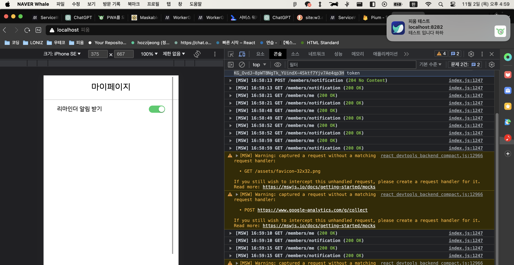
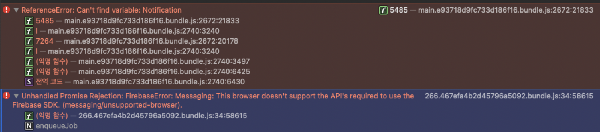
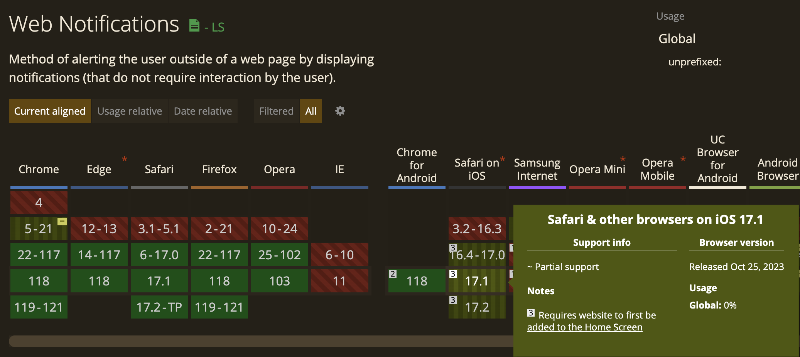

> 이 글은 우테코 피움팀 크루 '[클린](https://github.com/hozzijeong)'가 작성했습니다.


# 피움의 PWA 적용기

웹 어플리케이션인 피움은 ‘식집사들의 관리 주기를 찾기 어렵다’ 라는 문제를 해결하기 위해 기획을 시작했습니다. 그리고 사용자의 문제를 해결하기 위해 식물의 관리 주기를 기록하는 ‘히스토리’와 관리 일정이 되면 알림을 주는 ‘리마인더’를 통해 해결할 수 있다고 생각했습니다. 기획 초기에는 웹 브라우저의 한계로 인해 알림이나 어플 설치가 불가능 하다고 생각했고 오히려 AOS나 IOS와 같이 모바일에 특화된 기획이라 명백한 한계가 보였습니다. 하지만 PWA와 서비스 워커에 대해 알고 그 한계를 극복할 수 있다는 생각을 했습니다.

그렇다면 피움에서는 어떻게 PWA를 적용했는지에 대해 한번 알아보겠습니다. 목차는 크게 3개로 나뉘게 됩니다.

- manifest.json
- Service Worker
- FCM
- Trouble Shooting

## manifest.json

[이전 포스팅](https://blog.pium.life/pwa/)에서도 언급했지만 웹 어플리케이션을 PWA로 만들기 위해서는 `manifest.json`파일을 작성해야 합니다. 이 파일에는 어플로 만들어 졌을 때 들어갈 앱 이름, 아이콘 사이즈, 바로가기 등의 설정을 할 수 있습니다. 

```json
{
  "name": "피움",
  "short_name": "pium",
  "icons": [
    {
      "src": "/assets/android-icon-48x48.png",
      "sizes": "48x48",
      "type": "image/png",
      "density": "1.0",
      "purpose": "any"
    },
    {
      "src": "/assets/android-icon-72x72.png",
      "sizes": "72x72",
      "type": "image/png",
      "density": "1.5",
      "purpose": "any"
    },
    {
      "src": "/assets/android-icon-96x96.png",
      "sizes": "96x96",
      "type": "image/png",
      "density": "2.0",
      "purpose": "any"
    },
    {
      "src": "/assets/android-icon-144x144.png",
      "sizes": "144x144",
      "type": "image/png",
      "density": "3.0",
      "purpose": "any"
    },
    {
      "src": "/assets/android-icon-192x192.png",
      "sizes": "192x192",
      "type": "image/png",
      "density": "4.0",
      "purpose": "maskable"
    },
    {
      "src": "/assets/android-icon-512x512.png",
      "sizes": "512x512",
      "type": "image/png",
      "density": "5.0",
      "purpose": "maskable"
    }
  ],
  "display": "standalone",
  "theme_color": "#1bcc66",
  "background_color": "#ffffff",
  "id": "pium",
  "description": "피움은 여러분의 반려 식물 관리 경험을 기록할 수 있도록 도와주고 각자에게 알맞은 관리법을 빠르게 찾도록 도와주고 있어요.",
  "start_url": "/",
  "dir": "auto",
  "lang": "ko",
  "orientation": "portrait",
  "scope": "/",
  "categories": ["lifestyle", "plant", "indoor-garden"],
  "display_override": ["window-controls-overlay"]
}
```

안드로이드 아이콘에 사용될 파일들을 같은 폴더에 위치시키고 사이즈 별로 이미지 파일을 생성했습니다. 아이콘 생성 사이트는 [maskable](https://maskable.app/editor)를 통해 만들었습니다. 하지만 여기서는 144x144사이즈를 export해주지 않기 때문에 144x144는 따로 만들었습니다… `manifest.json`의 파일 설정은 [여기](https://developer.mozilla.org/en-US/docs/Web/Manifest)를 통해서 자세히 알 수 있습니다. 단, `name`, `icons`, `start_url`, `display` and/or `display_override` 는 필수로 작성해야 하는 멤버들 입니다.

이렇게 작성하고자 하는 내용들을 작성하고 난 다음에 `link`태그를 통해서 `index.html`에 포함시킬 수 있습니다.

```html
<link rel="manifest" href="/assets/manifest.json" />
```

## Service Worker

오프라인 환경에서 최적화된 경험을 제공하기 위해 서비스 워커를 설치했습니다. 사실 피움에서는 오프라인 환경으로 어떤 것을 제공해야 되나 라고 생각했을 때 크게 제공할 만한 것이 떠오르지 않았습니다. 오프라인 상태에서 검색을 할 수 있는 것도 아니고 값을 등록할 수 있는 것도 아니기 때문입니다. 물 주기를 기록하는 행위 역시 좀 애매했습니다. 

~~ps. 문득 이렇게 적다보니 오프라인 상태에서 제공할만한 서비스가 떠오르긴 합니다. 식물 검색 기능과 식물 기록은 볼 수 있지 않을까 하는 생각이 들긴 하네요.~~

오프라인 상태에서 어떤 경험을 제공할지 몰라도 `push` 메세지를 받는 역할은 서비스 워커에서 가능하기 때문에 서비스 워커를 설치하고 활성화 하는 것 까지는 작성해야 했습니다. 따라서 `install`과 `activate` 관련 이벤트를 등록했습니다.

```jsx
self.addEventListener('install', (event) => {
  event.waitUntil(
    caches.open(assetCacheName).then((cache) => {
      // 캐시로 저장할 파일을 지정. 어떤 파일을 넣을지는 차후 얘기해 보며 좋을 듯.
			// 캐시 버스팅이 발생하는 ㅍ
      cache.addAll([
        '/main.43e3611a6c9133f38206.bundle.js',
        '/vendors-node_modules_react-dom_client_js-node_modules_react-router-dom_dist_index_js-node_mod-cccd04.261f3e9fe64cb376e09d.bundle.js',
        '/assets/logo.webp',
        '/index.html',
        '/',
      ]);
    })
  );

  // 제어중인 서비스 워커가 존재해도 대기 상태 건너 뜀
  self.skipWaiting();
});

// 기존에 있던 cache 삭제
self.addEventListener('activate', (event) => {
  event.waitUntil(
    caches.keys().then((cacheNames) => {
      return Promise.all(
        cacheNames.map((cacheName) => {
          if (cacheName !== assetCacheName) {
            return caches.delete(cacheName);
          }
        })
      );
    })
  );

  // 활성화 즉시 클라이언트를 제어한다.(새로고침 불필요)
  self.clients.claim();
});

// 오프라인 상태라면, 캐시에 저장되어 있는 파일들 fetch로 받아옴
self.addEventListener('fetch', (event) => {
  if (!navigator.onLine) {
    event.respondWith(caches.match(event.request).then((result) => result && result));
  }
});
```

## FCM

기본적으로 `web-push`를 구현하는데 있어서는 `Notifications API`와 `Push API`를 사용하지만 `FCM`을 사용한다면 손쉽게(?) 구현할 수 있습니다. 정통적인 방법은 `permission`을 받은 뒤 `subscribe`를 통해 `pushSubscription`객체를 서버에 넘기는 방식으로 구현이 되어 있습니다. 하지만 `FCM`에서는 `token`을 주고 받는 형태로 변경되었습니다. 이제부터 그 과정을 한번 보겠습니다.

먼저 `firebase` 패키지를 먼저 설치해 줍니다. 

```bash
npm i firebase
```

그리고 `FCM` 콘솔로 이동해서 프로젝트를 설치하면서 얻은 `config` 정보가 필요합니다. 프로젝트를 처음 세팅할 때 `config`파일이 자동으로 생성됩니다. 상세 정보를 확인하기 위해서는 프로젝트 설정 > 일반 에서 확인할 수 있습니다.

```jsx
// Import the functions you need from the SDKs you need
import { initializeApp } from "firebase/app";
import { getAnalytics } from "firebase/analytics";
// TODO: Add SDKs for Firebase products that you want to use
// https://firebase.google.com/docs/web/setup#available-libraries

// Your web app's Firebase configuration
// For Firebase JS SDK v7.20.0 and later, measurementId is optional
const firebaseConfig = {
  apiKey: "",
  authDomain: "pium-.firebaseapp.com",
  projectId: "pium-",
  storageBucket: "pium-.appspot.com",
  messagingSenderId: "",
  appId: "12",
  measurementId: "G-"
};

// Initialize Firebase
const app = initializeApp(firebaseConfig);
const analytics = getAnalytics(app);
```

해당 코드를 `FCM`을 처음 사용할 때 작성해면 됩니다. 이제 초기화된 `app` 변수를 `firebase/messaging`에서 제공하는 메세지 관련 메서드들을 통해 푸시 알림을 구현할 수 있습니다.

```jsx
import { Messaging, deleteToken, getMessaging, getToken, onMessage } from 'firebase/messaging';

const message = getMessaging(this.app);
```

이제 모든 초기 세팅이 끝이 났습니다. 이제부터는 알림 설정과 그 단계까지 한번 보겠습니다.

### 토큰 받기 (Push Subscription 만들기)

```jsx
import {getToken} from 'firebase/messaging';
import {message} from './'

// 알림 구독 메서드
const subscribeAlert = async () => {
		// 사용자에게 권한 알림 요청 권한을 받는다.
    const permission = await Notification.requestPermission();

		// 알림이 허락되지 않았다면 return;
    if (permission !== 'granted') {
	    addToast({ type: 'info', message: '알림을 허용하지 차단했습니다', time: 3000 });
      return;
    }
	
		// VAPID키를 통해 토큰을 얻는다
    const token = await getToken(message, {
      vapidKey: process.env.VAPID_PUBLIC_KEY ?? '',
    });

    if (token !== null) {
			// 토큰이 있다면 서버에 해당 토큰을 전달한다.
      subscribe(token);
      return;
    }
    addToast({ type: 'error', message: '구독중에 에러가 발생했습니다', time: 3000 });
  };
```

### 서버에 토큰 보내기

위 코드에서 생성한 (또는 기존에 존재하는) 토큰을 인자로 받아서 DB로 전달하는 코드를 한번 보겠습니다. (`Tanstack-Query`를 사용한 코드입니다) 

```jsx
const subscribe = useMutation({
    mutationFn: async (token: string) => {
      const response = await WebPushSubscribeAPI.subscribe(token);
      throwOnInvalidStatus(response);

      return null;
    },
});
```

사실 이게 끝입니다. 정말 간단하게 구현이 가능하고 원래는 `pushSubscription`이지만 `firebsae` 패키지를 사용한다면 token으로 대체될 수 있습니다.

### 메세지 수신하기

서비스 워커와 웹 워커는 서로 다른 환경이기 떄문에 `firebase` 초기화를 또다시 해줘야 합니다. 그리고 `firebase` 패키지를 사용하는 서비스 워커의 이름은 반드시 `firebase-messaging-sw.js`여야 합니다.

```jsx
// firebase-messaging-sw.js
importScripts('https://www.gstatic.com/firebasejs/8.10.1/firebase-app.js');
importScripts('https://www.gstatic.com/firebasejs/8.10.1/firebase-messaging.js');

// Initialize the Firebase app in the service worker by passing in
// your app's Firebase config object.
// https://firebase.google.com/docs/web/setup#config-object

const firebaseConfig = {
  apiKey: '',
  authDomain: 'pium-.firebaseapp.com',
  projectId: 'pium-',
  storageBucket: 'pium-.appspot.com',
  messagingSenderId: '',
  appId: '',
  measurementId: 'G-8SL2D547VW',
};

firebase.initializeApp(firebaseConfig);

// Retrieve an instance of Firebase Messaging so that it can handle background
// messages.
const messaging = firebase.messaging();
```

`importScripts`를 통해 `firebase-app`과 `fireabse-messaging` 코드를 받아옵니다.

```jsx
// firebase-messaging-sw.js

messaging.onBackgroundMessage((payload) => {
  const {
    notification: { title, body },
  } = payload;
  // Customize notification here
  const notificationTitle = title;

  const notificationOptions = {
    body: body,
    icon: './assets/favicon-32x32.png',
    badge: './assets/favicon-16x16.png',
    data: '/reminder',
    tag: 'reminder-alert',
    vibrate: [200], // 짝수 인덱스는 진동 시간, 홀수 인덱스는 휴식 시간
  };

  self.registration.showNotification(notificationTitle, notificationOptions);
});
```

`onBackgroundMessage`메서드를 통해 `push`이벤트를 감지할 수 있습니다. 인자로 넘겨받는 `payload`에는 서버에서 보낸 정보가 들어있습니다. 이제 서버에서 보내온 정보와 사용자에게 알맞은 알림을 보내주기 위한 데이터들을 `options`에 설정하고 `showNotification`메서드를 통해 알림을 보여준다면 푸시 알림 구현이 끝나게 됩니다. `notificationOptions`에 대해서 자세히 보기는 [여기](https://developer.mozilla.org/en-US/docs/Web/API/ServiceWorkerRegistration/showNotification#examples)에 자세히 있습니다.

`FCM`에서 사용자 토큰을 입력하고 테스트 알림을 날리면 다음과 같이 받을 수 있습니다.



## Trouble Shooting

### 서비스 워커 등록이 하나밖에 안되는데요

푸시 알림을 받기 위해 서비스 워커를 등록했지만 서비스 워커 등록관련해서 문제가 터졌습니다.  바로 MSW의 서비스 워커가 먼저 등록되어 있어서 중복 등록이 되지 않는다는 것 이었습니다. MSW로 API를 모킹하고 사용자들의 행동을 확인해보려 했지만 두 개가 겹쳐서 완벽한 푸시 알림을 확인하지 못하는 문제를 직면했습니다.

> **범위당 서비스 워커 *하나*만 허용**됩니다. 활성 및 실행 중인 경우 메모리에 있는 클라이언트 수 (예: PWA 창 또는 브라우저 탭)에 관계없이 일반적으로 하나의 인스턴스만 사용할 수 있습니다.
> 

따라서 구동 환경에 따라 다른 서비스 워커를 등록할까 생각을 했지만 그렇게 된다면 무의미한 PR이 너무 늘어날 것 같고 효율성 역시 떨어지기 때문에 정말 최후의 보루라고 생각을 했습니다. 옆에 있던 참새에게 물어보니 하나의 파일에 2개의 서비스 워커를 [importScripts](https://developer.mozilla.org/en-US/docs/Web/API/WorkerGlobalScope/importScripts)로 등록해서 사용하는 방법을 얘기해 줬습니다. 

> `importScripts`는 웹 워커(WorkerGlobalScope)에서 사용되는 함수로, 웹 워커에서 다른 스크립트 코드를 가져오는 역할을 하고 있습니다. 이 함수를 통해 백그라운드 병렬 처리 및 백그라운드 계산을 하는데 사용됩니다.

```jsx
// devLocalServiceWorker.js
/* eslint-disable no-undef */
importScripts('/firebase-messaging-sw.js');
importScripts('/mockServiceWorker.js');
```

그리고 이 서비스 워커를 `local`환경에서만 등록하고 `local`환경이 아닌 경우에는 `firebase-messaging-sw`를 등록하도록 코드를 작성했습니다.

```jsx
// index.tsx

if (process.env.NODE_ENV === 'development') {
  // eslint-disable-next-line @typescript-eslint/no-var-requires
  const { worker } = require('./mocks/browser');
  registerServiceWork('/devLocalServiceWorker.js');

  worker.start({
    serviceWorker: {
      url: 'http://localhost:8282/devLocalServiceWorker.js',
    },
  });
}

if (process.env.NODE_ENV === 'production') {
  registerServiceWork('/firebase-messaging-sw.js');
}
```

```jsx
// registerServiceWorker.js
const registerPwaServiceWorker = async (workerPath: string) => {
//...
}
```

MSW의 서비스 워커와 FCM의 서비스 워커에서 크게 충돌이 발생하는 이벤트가 없었기에 별 문제가 없다고 생각을 했고 실제로도 문제 없이 동작을 했기 때문에 일단은 넘어가긴 했습니다. 

(좀 더 좋은 방법이 있으시다면 알려주신다면 감사하겠습니다…ㅎ)

### FCM의 가이드와 web.dev의 가이드가 다른데요?

위에서도 언급했지만 FCM을 통해 구현한 웹 푸시에는 `pushManager`나 `pushSubscription`이 존재하지 않습니다. `web.dev`를 통해 학습했을 때 분명히 푸시 서비스와 구독하는 과정이 필요한걸로 알고 있는데 그 과정에 대한 의문이 계속 머릿속에 남아있었습니다. 결론은 “`firebase` 패키지 내부에서 추상화가 잘 되어있기 때문에 필요가 없다” 라고 할 수 있습니다.

firebase를 통해 알림을 구현할 때는 토큰을 받고 해당 토큰을 서버에 저장하는 방식으로 사용자 구분을 하고 있습니다. 그리고 웹 푸시 프로토콜에 필요한 VAPID키를 토큰 등록할 때 사용하는 것을 보고 거기서 부터 찾아보자 하고 방향을 잡았습니다.

```jsx
// https://github.dev/firebase/firebase-js-sdk
// api.ts
export async function getToken(
  appCheckInstance: AppCheck,
  forceRefresh?: boolean
): Promise<AppCheckTokenResult> {
  const result = await getTokenInternal(
    appCheckInstance as AppCheckService,
    forceRefresh
  );
  if (result.error) {
    throw result.error;
  }
  return { token: result.token };
}
```

`getToken`이라는 메서드에서 `getTokenInternal`이라는 메서드를 호출해서, 해당 결과 값의 token을 반환하는 코드를 작성하고 있습니다. 그래서 `getTokenInternal` 메서드를 들어가 봤습니다.

```jsx
// https://github.dev/firebase/firebase-js-sdk
// token-manager.ts
export async function getTokenInternal(
  messaging: MessagingService
): Promise<string> {
  const pushSubscription = await getPushSubscription( // 여기서 pushSubscription을 얻음
    messaging.swRegistration!,
    messaging.vapidKey!
  );
//...
}

async function getPushSubscription(
  swRegistration: ServiceWorkerRegistration,
  vapidKey: string
): Promise<PushSubscription> {

  const subscription = await swRegistration.pushManager.getSubscription();
  if (subscription) {
    return subscription;
  }

	// 이 단락에서 PushManager를 통해 subscribe를 하고 있습니다.
  return swRegistration.pushManager.subscribe({
    userVisibleOnly: true,
    // Chrome <= 75 doesn't support base64-encoded VAPID key. For backward compatibility, VAPID key
    // submitted to pushManager#subscribe must be of type Uint8Array.
    applicationServerKey: base64ToArray(vapidKey)
  });
}
```

결론적으로 `getToken` > `getTokenInternal` > `getPushSubscription`을 통해 `pushSubscription`을 반환하는 것을 알 수 있었습니다. 즉 `getToken` = `pushSubscription` 인 것입니다.

그 다음 구독을 해제하는 과정 역시 토큰을 삭제함으로써 구독 취소가 된다는 것을 알 수 있습니다.

```jsx
export async function deleteTokenInternal(
  messaging: MessagingService
): Promise<boolean> {
  const tokenDetails = await dbGet(messaging.firebaseDependencies);
  if (tokenDetails) {
    await requestDeleteToken(
      messaging.firebaseDependencies,
      tokenDetails.token
    );
    await dbRemove(messaging.firebaseDependencies);
  }

  // Unsubscribe from the push subscription.
  const pushSubscription =
    await messaging.swRegistration!.pushManager.getSubscription();
  if (pushSubscription) {
    return pushSubscription.unsubscribe();
  }

  // If there's no SW, consider it a success.
  return true;
}
```

`pushSubscription`이 존재하는 경우, `unsubscribe`를 통해 구독 취소하는 것을 알 수 있습니다. 따라서 `firebase`패키지를 사용할 때 `pushManager`와 `pushSubscription`을 통한 푸시 서비스와의 통신은 `token`을 생성하고 삭제하는 과정에 추상화 되어 있습니다.

서비스 워커에서 `messag.onBackgroundMessage` 를 통해 `push` 이벤트를 핸들링 하는 것 역시 `message` 객체 안에 이미 `push`이벤트를 추가해 놓고 있습니다.

```jsx
const SwMessagingFactory: InstanceFactory<'messaging'> = (
  container: ComponentContainer
) => {
  const messaging = new MessagingService(
    container.getProvider('app').getImmediate(),
    container.getProvider('installations-internal').getImmediate(),
    container.getProvider('analytics-internal')
  );

  self.addEventListener('push', e => {
    e.waitUntil(onPush(e, messaging as MessagingService));
  });
  self.addEventListener('pushsubscriptionchange', e => {
    e.waitUntil(onSubChange(e, messaging as MessagingService));
  });
  self.addEventListener('notificationclick', e => {
    e.waitUntil(onNotificationClick(e));
  });

  return messaging;
};
```

### 외부 API와 JS 코드의 분리

배포를 끝마치고 핸드폰(아이폰)으로 서비스에 접속해보니 아예 렌더링 되지 않는 문제가 있었습니다. 디버깅을 해보니 아래와 같이 에러를 던졌습니다.



변수 `Notification`을 찾을 수 없고, 그에따라 `request premission`이 적용되지 않은 상태에서 `firebase message`에 접근하는 것 자체가 잘못된 접근이라는 이유였습니다. 

```jsx
// Example: wrapping permission request call inside a button click
const myButton = document.querySelector("button");
myButton.addEventListener("click", async () => {
  let permission = await Notification.requestPermission();
  if (permission === "granted") {
    console.log("Notification permission granted. Requesting for token.");
    let token = await messaging.getToken({
      vapidKey: "<YOUR_PUBLIC_VAPID_KEY_HERE>",
    });
    // do something with the FCM token
  } else {
    console.log("Notification permission denied");
    // Handle denied permission
  }
});
```

[firebase 공식 블로그](https://firebase.blog/posts/2023/08/fcm-for-safari/#initialize-fcm)에서도 `permission`이 허용된 상태에서 messaging 메서드 처리를 하라고 권장을 하고 있으니 `Notification` 을 지원하지 않는 상황에서 FCM을 사용할 수 없는 것은 당연했습니다.

하지만, 분명히 블로그를 봤을 때 iSO에서 FCM을 지원한다고 했고 Mac Safari에서 확인했을 때도 알림이 잘 왔기 때문에 이해가 되지 않았습니다. (Can I Use 에서도 지원하는 범위를 확인했습니다)

혹시 몰라서 다시 [Can I Use에 Notifications API를 검색](https://caniuse.com/?search=Notification)해 봤는데 다음과 같은 문장이 있었습니다.

> ***Requires website to first be add to the Home Screen***
> 

Mac Safari에서는 완벽하게 지원을 하지만 iOS의 Safari에서는 홈 화면에 바로가기를 추가해야지만 Notifications API를 사용할 수 있었습니다.



그렇다면 문제는 무엇이었을까요? 바로 다음 코드에 있습니다.

```jsx
const initialPushStatus = {
	permission: Notification.permission
}
```

제일 처음에 서비스 워커를 등록할 때 pushStatus에 대한 값도 업데이트를 하면서 초기 값을 설정을 했습니다. 그 과정에서 아무런 방어 코드 없이 `Notifications API`를 사용했고 iOS입장에서는 지원하지 않는 API를 사용하려고 하니까 처음부터 에러를 던지게 된 것이었습니다. 위에서 언급했던 것처럼 처음부터 에러가 먹히니, FCM을 초기화 하는 파일에서 역시 에러가 발생하게 된 것이었습니다.

***즉, 렌더링하는 React의 로직 안에 외부 API(Notifications API, FCM)가 함께 존재했던 것이고 외부 API의 에러 발생으로 인해 원래 React가 작동하지 않고 결과적으로 흰 화면만 보게 되는 최악의 상황이 나온 것이었습니다.***

이를 해결하기 위해 서로 얼키고 설켜있는 React의 코드와 외부 API를 분리하는 작업을 진행했습니다. (사실 분리 라고 보기에는 좀 애매하지만…)

바로 FCM을 다루는 메서드들을 하나의 클래스로 분리한 다음에 해당 클래스의 인스턴스를 전역으로 export 하는 방식을 선택했습니다.

```jsx
import { Analytics, getAnalytics } from 'firebase/analytics';
import { FirebaseApp, FirebaseOptions, initializeApp } from 'firebase/app';
import { Messaging, deleteToken, getMessaging, getToken, onMessage } from 'firebase/messaging';

const firebaseConfig = {
//... content
};

class FCMMessaging {
  private app: FirebaseApp | null = null;
  private messaging: Messaging | null = null;

  constructor(config: FirebaseOptions) {
    this.app = initializeApp(config);
    this.analytics = getAnalytics(this.app);
  }

  registerMessaging() {
    if (!this.app) throw new Error('메세지 등록을 위해서는 FCM 초기화가 필요합니다.');
    this.messaging = getMessaging(this.app);
  }

  setOnMessaging() {
    if (!this.messaging) return;
    onMessage(this.messaging, (payload) => {
      const { notification } = payload;

      const notificationTitle = notification?.title ?? '피움 알림';
      const notificationOptions = {
        body: notification?.body ?? '내용이 없습니다',
        icon: notification?.icon ?? './assets/favicon-32x32.png',
      };
      const foregroundNotification = new Notification(notificationTitle, notificationOptions);

      foregroundNotification.onclick = function (event) {
        event.preventDefault();
        foregroundNotification.close();
      };
    });
  }

  async getCurrentToken() {
    if (!this.messaging) throw new Error('등록된 메세지가 없어서 토큰을 반환할 수 없습니다');
    const permission = Notification.permission;

    if (permission !== 'granted') return null;

    return await getToken(this.messaging, {
      vapidKey: process.env.VAPID_PUBLIC_KEY ?? '',
    });
  }

  async deleteCurrentToken() {
    if (!this.messaging) throw new Error('등록된 메세지가 없어서 토큰을 삭제할 수 없습니다');
    return await deleteToken(this.messaging);
  }
}

export default new FCMMessaging(firebaseConfig);
```

그리고 `Notification.permission`을 알림 구독을 하는 `toggle`의 `handler`에 추가함으로써 화면 렌더링이 끝난 다음에 에러가 발생하든, 아니면 지원하지 않는 브라우저라는 안내를 할 수 있도록 설정했습니다.

```jsx
if (!PushStatus.getIsSupport()) {
    addToast({ type: 'warning', message: '지원하지 않는 브라우저입니다', time: 3000 });
    return;
  }

  // subscribe를 하지 않으려면 해당 토큰을 제거해야 한다.

  const permission = await Notification.requestPermission();
  PushStatus.setPermission(permission); // 전역 pushStatus를 알 수 있는 객체
```

아쉬운 점은 React에서 [useSyncExternalStore](https://react-ko.dev/reference/react/useSyncExternalStore)를 사용하면 별도의 객체로 생성하지 않고 외부 API를 분리할 수 있다는 것을 알았습니다. 그래서 이번 포스팅 이후에 한번 적용해 볼 생각입니다. (조금만 더 일찍 알았더라면…)

### 너무 오래걸리는 Toggle

`Notification.permission`을 전역으로 설정한 것은 `FCM`에서 `token`을 미리 받기 위함이었습니다. 하지만, 해당 방법이 구조상 불가능 하다는 것을 깨닫고 나서 `permission`이후에 `token`을 받는 방식으로 코드를 변경했는데, `token`을 새로 발급 받는데는 1~2초의 지연 시간이 있다는 것을 알게되었습니다.


https://github.com/pium-official/pium-official.github.io/assets/50974359/e5a00fb5-5055-49c8-9632-71f68ecc5e88

사용자 경험에 매우 좋지 않을 것이라고 생각을 하고 Suspense를 통한 대체 UI를 보여줌으로써 사용자에게 이 사실을 알리는 것이 좋다고 생각했습니다. 

이 작업을 하기 위해서는 다음과 같은 단계가 필요했습니다.

- ReminderToggle 컴포넌트의 분리 (토글 그 자체만을 Suspense로 감싸야 하기 때문에)
- 대체 UI 생성
- FCM으로 부터 token을 받을 때 promise를 throw

**Toggle 컴포넌트 분리**

```tsx
<Suspense fallback={<Spinner/>}>
  <PushToggle />
</Suspense>
```

**대체 UI 생성**

사실 이것은 GPT에게 Spinner 작성해 달라고하면 정말 잘 짜주기 때문에… GPT에게 물어봤습니다.

**FCM으로 부터 token을 받을 때 promise를 throw**

핵심 기능입니다. 결국 컴포넌트를 분리하는 이유도, 대체 UI를 생성하는 이유도 전부 이 작업에서 시작됩니다.

일단 `PushToggle` 내부에서 알림 구독,취소 관련 로직을 훅으로 분리했습니다. 그리고 그 훅에서 현재 `token`을 받고 있는지 아닌지를 확인하기 위해 `pending`이라는 상태 역시 추가로 받습니다.

```tsx
const { currentSubscribe, subscribeAlert, unSubscribeAlert, pending } = usePushAlert();

if (pending){
  // eslint-disable-next-line @typescript-eslint/no-empty-function
  throw new Promise(() => {});
}
```

그리고 구독 과정에서 현재 토큰 여부에 따라 `pending`의 상태를 변경해줍니다.

```jsx
const [isTokenPending, setIsTokenPending] = useState(false);

const subscribeAlert = async () => {
//...
  const permission = await Notification.requestPermission();
  PushStatus.setPermission(permission);

  if (permission !== 'granted') {
    addToast({ type: 'info', message: '알림이 허용되지 않았습니다', time: 3000 });
    return;
  }
  const token = PushStatus.getCurrentToken();

  if (token !== null) {
    subscribe(token);
    return;
  }

  try {
    setIsTokenPending(true);
    const result = await FCMMessaging.getCurrentToken();
    if (result === null) throw new Error();
    setIsTokenPending(false);
    subscribe(result);
  } catch (error) {
    addToast({ type: 'error', message: '구독중에 에러가 발생했습니다', time: 3000 });
  }
};
```


https://github.com/pium-official/pium-official.github.io/assets/50974359/6a5e3cc6-7b31-4c7d-930b-e4af74e344b1

토큰을 다 받고 난 다음에 좀 자연스럽게 변경이 되면 좋겠다는 생각이 있긴 합니다. 

이렇게 `Notifications API` 분리와 그에 따른 지연상태 문제와 해결을 할 수 있었습니다

---

### 참조

https://firebase.blog/posts/2023/08/fcm-for-safari/#initialize-fcm
