> 이 글은 우테코 피움팀 크루 '[주노](https://github.com/Choi-JJunho)'가 작성했습니다.
 

## 서론


http://pium.life 로 접속하면 피움의 홈페이지가 나오기까지의 과정을 기록으로 남겨보려고 한다.

> 본 과정은 서버 구축을 처음 하면서 과정을 이해하기위해 작성된 글입니다.
> 
> 빠르게 따라할 수 있는 설정 기반 글을 원한다면 마지막 목차인 정리를 확인해보시길 바랍니다.

> 본 과정에서는 소량의 과금(?)이 존재합니다.
> (도메인 구입비용 : 약 4000원)

## 도메인 정하기

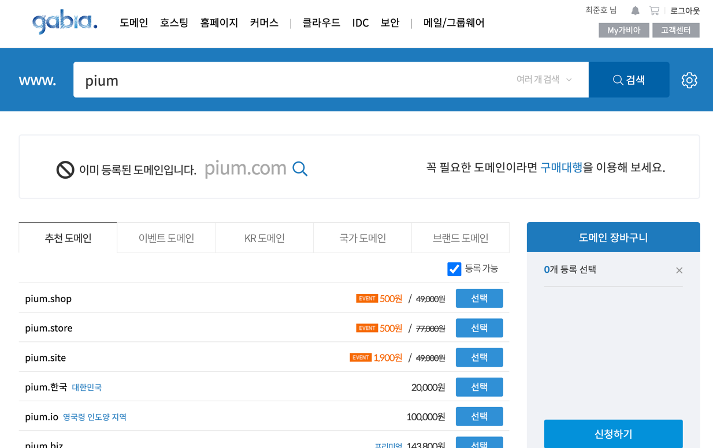

> 도메인을 구입하기 위해 도메인 호스팅 사이트 [가비아](https://www.gabia.com/)를 이용했다.

`pium.com` `pium.co.kr` `pium.net` 등등.
서비스의 이름으로 자주 사용하는 도메인을 생성하고싶었으나 이미 존재하거나 가격이 너무 비싸다는 문제가 있었다.

적당한 가격에 서비스의 이름을 가진 도메인인 `pium.life`를 선택했다. (1년 4000원)

## 도메인 설정하기

> 가비아 서비스를 기준으로 과정이 진행됩니다.

`3.123.123.123`과 같은 인스턴스 public ip 주소를 `pium.life`로 별칭을 지정해주자.

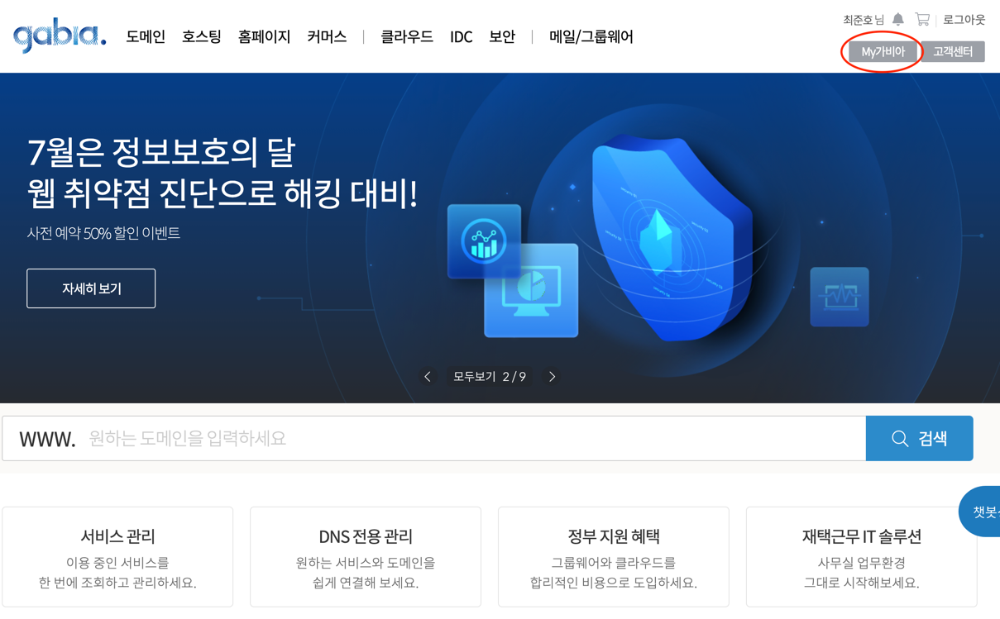

우측 상단의 `My 가비아` 탭으로 들어간다.

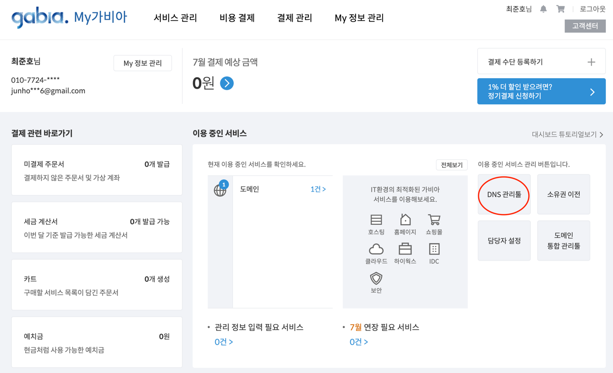

우측의 `DNS 관리툴` 탭으로 들어간다.

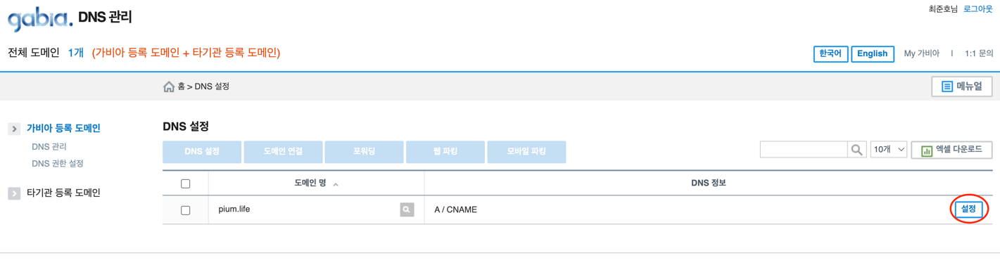

도메인의 `설정` 탭으로 들어간다.

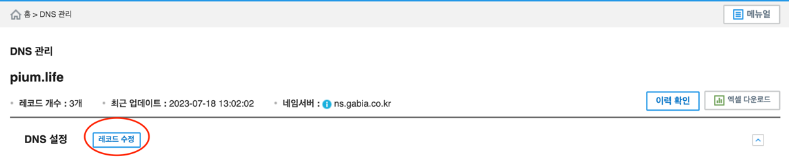

DNS 관리 탭의 `설정` 혹은 `레코드 수정`에 들어간다.

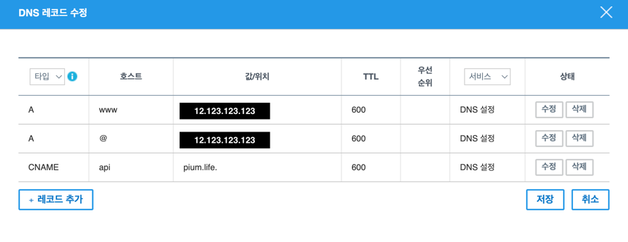

위와 같이 레코드를 추가하고 저장한다.

> CNAME 설정은 향후 서브도메인 설정을 위한 설정입니다.

이제 http://pium.life 로 접속하면 서버로 바로 접속할 수 있게된다. (SSH 접속이 아닌 HTTP 접속을 의미한다.)

## 환경 살펴보기

피움은 하나의 EC2에 프론트엔드, 백엔드의 배포를 모두 진행하려고한다.

이를 위해서라면 서로 다른 포트에 서비스를 띄워둔 뒤 각 요청별로 포트를 분산시킬 필요가 있다.

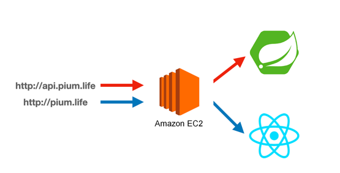

때문에 위와 같은 흐름으로 요청이 진행되는 것이 최종 목표다!

### EC2 보안규칙

우아한테크코스 과정에서 제공되는 EC2의 보안규칙은 다음과 같다.

- 사내에서만 22번 포트 접속 가능
- 80, 443은 열려있음
- 이외의 포트는 열려있지 않음.

우리가 흔히 개발을 하면서 사용하는 3000번 포트 혹은 8080번 포트를 통해 해당 서버에 접근하지 못한다는 이야기다.

즉, 다시말해 pium.life:8080과 같은 접근이 안된다는 이야기다.

인바운드 규칙에서 8080 혹은 3000번 포트를 열어버리는 방법도 있겠지만 보안 규칙에 손대지 않으면서 해결할 수 있는 방법을 찾아보자.

## nginx로 포트포워딩하기

linux에 존재하는 `iptables` 명령어를 통해 서버 자체적으로 포트포워딩 환경을 구성할 수도 있지만 현재 피움은 하나의 서버에서 두개의 어플리케이션을 배포하고 있고, 도메인도 하나다.

따라서 후에 설명할 서브도메인을 적용하기 위해서라도 nginx를 이용하기로 한다.

### nginx 설치하기

```shell
sudo apt install nginx
```

```shell
systemctl status nginx
```

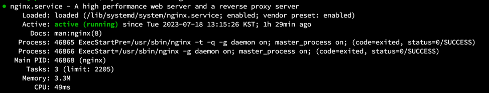

이제 주소창에 인스턴스 ip 를 치고 접속하면 다음과 같이 nginx default 페이지를 볼 수 있다. 

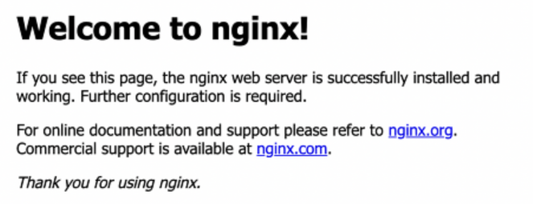

### 80 포트 접속을 8080 포트로

> 해당 과정은 8080포트에 애플리케이션이 구동중인 상태에서 진행됩니다. 
> 다음 명령어로 8080포트에서 애플리케이션이 구동중인지 확인한다.
>
> ```shell
> lsof -i tcp:8080
> ```
> 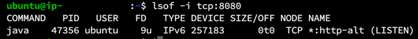

이제 nginx 설정파일을 작성하여 80포트로 오는 요청을 8080포트로 전환시켜본다.

```shell
cd /etc/nginx/sites-available/

sudo vi default
```

> 주석처리 되어있는 부분은 제외하고 코드로 표현합니다.

```shell
# 변경 전 파일내용
server {
        listen 80 default_server;
        listen [::]:80 default_server;

        root /var/www/html;

        index index.html index.htm index.nginx-debian.html;

        server_name _;

        location / {
                try_files $uri $uri/ =404;
        }
}
```

처음 파일을 열어보면 위와같이 설정되어있을 것이다.

최대한 간략하게 포트를 변경한다는 목적만 달성해보기 위해 다음 내용들을 수정해보자.

- `root /var/www/html;` 주석처리
- `index index.html index.htm index.nginx-debian.html;` 주석처리
- `location / { ... }` 내부 내용에 다음 내용 추가
  - `proxy_set_header Host $host:$server_port;`
  - `proxy_set_header X-Real-IP $remote_addr;`
  - `proxy_set_header X-Forwarded-For $proxy_add_x_forwarded_for;`
  - `proxy_pass http://127.0.0.1:8080;`

```shell
# 변경된 파일내용
server {
        listen 80 default_server;
        listen [::]:80 default_server;

        # root /var/www/html;

        # index index.html index.htm index.nginx-debian.html;

        server_name _;

        location / {
                proxy_set_header Host $host:$server_port;
                proxy_set_header X-Real-IP $remote_addr;
                proxy_set_header X-Forwarded-For $proxy_add_x_forwarded_for;
                proxy_pass http://127.0.0.1:8080;
        }
}
```

위와같이 설정파일을 수정했다면 다음 명령어를 수행해 nginx를 다시 시작한다.

```shell
sudo systemctl restart nginx
```

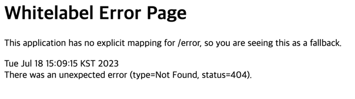

스프링부트 애플리케이션을 실행중이였다면 위와같은 Whitelabel Error Page를 확인할 수 있을것이다.

## 서브도메인 구성하기

이제 80포트에서 8080포트로 요청을 변환하는 과정은 성공했다.

하나의 서버에 프론트엔드, 백엔드 코드가 같이 띄워져야하므로 서브도메인을 통해 페이지와 API를 구분해줘야한다.

### index 파일 지정하기 - default 파일 수정

프론트에서 빌드 산출물로 나온 index.html을 기본 페이지로 참고하도록 설정하자.

```shell
cd /etc/nginx/sites-available/

sudo vi default
```

```shell
# 변경 전 설정내용
server {
        listen 80 default_server;
        listen [::]:80 default_server;

        # root /var/www/html;

        # index index.html index.htm index.nginx-debian.html;

        server_name _;

        location / {
                proxy_set_header Host $host:$server_port;
                proxy_set_header X-Real-IP $remote_addr;
                proxy_set_header X-Forwarded-For $proxy_add_x_forwarded_for;
                proxy_pass http://127.0.0.1:8080;
        }
}
```

기존에 80포트를 8080포트로 포워딩시켜주는 설정을 바꿔준다.

```shell
# 변경 후 설정내용
server {
        listen 80 default_server;
        listen [::]:80 default_server;

        root /var/www/html;

        index index.html;

        server_name pium.life;

        location / {
        }
}
```

이제 pium.life로 접속하면 `/var/www/html` 경로에 있는 `index.html`을 참조하도록 설정되었다.

위 설정에 따르면 `index.html` 및 `bundle.js`, `assets` 등의 프론트 리소스들은 서버의 `/var/www/html`를 기준으로 위치시키면 된다.

> 빌드 산출물 및 CD와 관련된 내용은 본 게시글에서 다루지 않습니다.

### API 서버 지정하기 - api_config 파일 만들기

http://api.pium.life 로 API를 호출하도록 구성해보자.

nginx는 기본적으로 `/etc/nginx/sites-enabled` 경로에 있는 파일들을 참고하여 설정파일에 적용한다.

> `/etc/nginx/nginx.conf` 파일의 60번째 줄 참고
> 
> 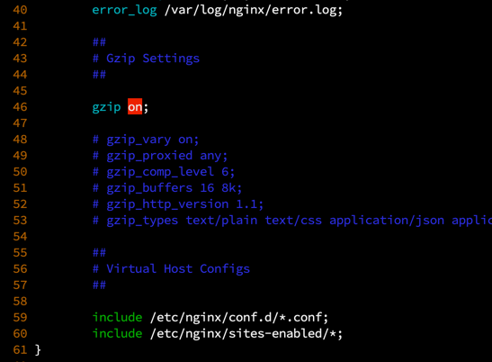

다음 과정을 통해 서브도메인 설정을 해보자.

```shell
cd /etc/nginx/sites-available

sudo vi api_config
```

```shell
# api_config 파일 내용
server {
        listen 80;
        listen [::]:80;

        server_name api.pium.life;
        
        location / {
                proxy_set_header Host $host:$server_port;
                proxy_set_header X-Real-IP $remote_addr;
                proxy_set_header X-Forwarded-For $proxy_add_x_forwarded_for;

                proxy_pass http://127.0.0.1:8080;
        }
}
```

`server_name` 옵션을 통해 api.pium.life 라는 도메인으로 접근하는 요청을 확인하고, 맞다면 8080 포트로 변경한다.

위와 같이 파일을 작성했으면 `sites-enabled` 경로에 soft link(바로가기)를 생성한다.

```shell
ln -s /etc/nginx/sites-available/api_config /etc/nginx/sites-enabled/api_config
```

이제 nginx를 재시작하여 설정을 적용해보자.

> 💡 Tip : `nginx -t` 명령어를 통해 현재 설정파일이 정상적으로 작성되었는지 확인할 수있다.
> 
> 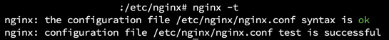

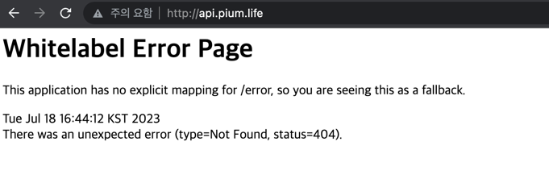

http://api.pium.life 로 접속하면 API로 연결되는것을 확인할 수 있다.

## 정리

- 8080 포트에 API 애플리케이션을 실행한다.
- 도메인 구입 및 A 레코드, CNAME을 설정한다.
- nginx를 설치한다.
- 프론트 빌드 산출물을 `/var/www/html` 경로에 준비한다. (index.html, bundle.js, assets 등)
- 서브도메인 및 포트포워딩 설정한다.

### nginx 설정 명령어 따라가기

```shell
# nginx 설치
sudo apt install nginx

# default 파일 수정
sudo vi /etc/nginx/sites-available/default
```

```shell
# /etc/nginx/sites-available/default 파일 내용
server {
        listen 80 default_server;
        listen [::]:80 default_server;

        root /var/www/html;

        index index.html;

        server_name pium.life;

        location / {
        }
}
```

```shell
# api_config 파일 작성
sudo vi /etc/nginx/sites-available/api_config
```

```shell
# api_config 파일 내용
server {
        listen 80 default_server;
        listen [::]:80 default_server;

        root /var/www/html;

        index index.html;

        server_name pium.life;

        location / {
        }
}
```

```shell
# nginx 재시작 및 설정적용
sudo systemctl restart nginx
```

## Reference

- https://jminie.tistory.com/110
- https://customer.gabia.com/manual/domain/287/1201