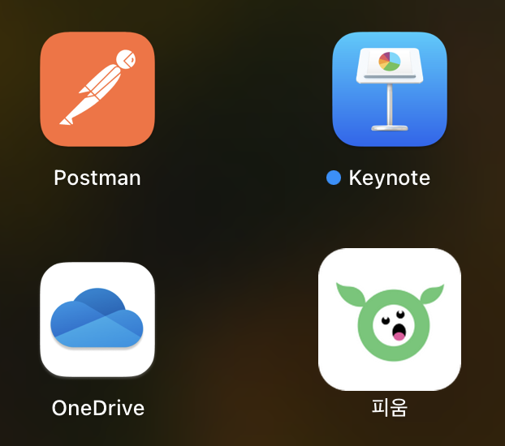
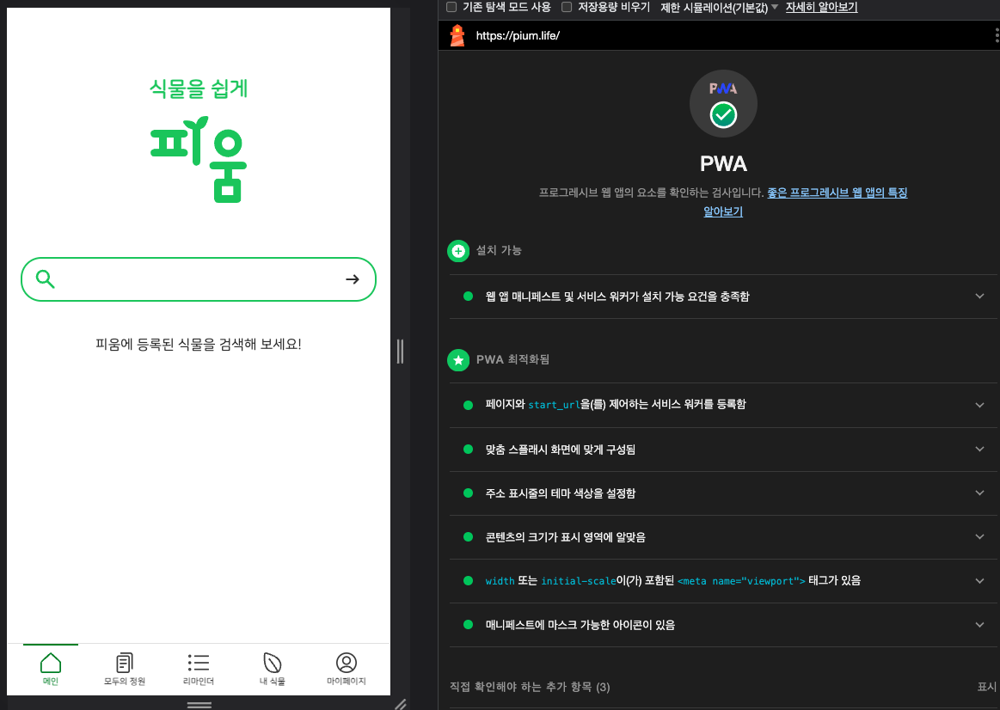

> 이 글은 우테코 피움팀 크루 '[클린](https://github.com/hozzijeong)'가 작성했습니다.


# PWA

## PWA란?

> 프로그레시브 웹 앱 (PWA)은 점진적 개선을 사용하여 사용자에게 더 안정적인 환경을 제공하고, 새로운 기능을 사용하여 보다 통합된 환경을 제공하며, 설치할 수 있는 웹 앱입니다. 또한 웹 앱이기 때문에 단일 코드베이스로 언제 어디서나 **모든 기기에서 누구에게나 도달할 수 있습니다**. 설치된 PWA는 다른 앱과 모양이 같습니다.
> 

PWA를 통해 기존에 사용자에게 제공하는 웹 뷰와는 다르게 좀 더 다양한 기능을 제공할 수 있습니다. PWA를 통해서 추가적으로 제공하는 기능은 다음과 같습니다.

- 홈 화면, 앱 런처, 런치패드 또는 시작 메뉴에 아이콘이 있습니다.
- 이 아이콘은 기기에서 앱을 검색하면 표시됩니다.
- 이 버튼은 브라우저의 사용자 인터페이스와 완전히 분리된 독립형 창에서 열립니다.
- URL 처리 또는 제목 표시줄 맞춤설정 등 더 높은 수준의 OS 통합에 액세스할 수 있습니다.
- 오프라인으로 작동합니다.

 즉, 브라우저를 통해 주소창 으로 접근하는게 아니라 앱처럼 바로가기 이동이 가능하기에 접근성이 더 좋고 오프라인 알림을 통해 사용자와 인터렉션이 가능합니다. 범용성이 강점이고, 디바이스 처럼 많은 기능을 제공하지 못했던 단점이 PWA를 통해서 극복이 가능해진 것입니다. 

실제로 PWA 런처를 통해서 플레이 스토어에 PWA를 배포할 수 있습니다. 그렇게 된다면 항상 최신 버전을 바라봐야 했던 웹 브라우저에서 버전에 따른 업그레이드가 가능해집니다.

## PWA 시작하기

일반적으로 PWA를 시작하기 위해서는 몇 가지 사전 작업이 필요합니다.

- [ ]  manifest.json 작성
- [ ]  https 설정
- [ ]  service worker

manifest 파일은 PWA를  통해 홈 화면에 추가했을 때 설정되는 값들 입니다. 이 값들은 아이콘, 앱 이름 등등 사 용자들이 직접적으로 확인했을 때 보여지는 값들 입니다. PWA는 Service Worker가 필수인데, 이 Service Worker는 보안적으로 안전한 컨텍스트에서만 작동하게 됩니다. 따라서 https는 필수입니다. (단 localhost에서는 사용이 가능합니다.)

Service Worker란 브라우저와 네트워크 사이의 가상 프록시로 웹 사이트 리소스 캐싱 및 오프라인인 경우에 콜백 메서드를 통해서 오프라인 상태에서의 함수 처리가 가능합니다. 즉, 브라우저가 닫힌 상태에서 알림이 오는 기능을 Service Worker를 통해서 구현이 가능합니다. 

### manifest.json 설정

`manifest`를 설정하게 된다면 “홈 화면에 바로가기”를 추가할 수 있습니다. 즉, 매번 브라우저에 접속해서 데이터를 확인하는 것이 아니라 바로가기를 추가함으로써 어플처럼 사용이 가능한 것입니다. 



위 처럼 `manifest` 설정을 하게 된다면 바로가기 어플을 설치할 수 있습니다. 그렇다면 이제부터 어떻게 구성되어 있고 어떤 항목을 넣어야 하는지 확인해 보겠습니다.

```json
/* mainfest.json */
{
  "name":"", // required. 어플이 화면에 나타나는 이름을 표기
  "short_name": "", //required (12자 이하 권장, 3자 이상 필수). 이름과 유사한 기능을 하지만 응용프로그램이 일반 이름을 표시할 수 문자 공간이 부족할 때 사용.
  "icons": [
    {
      "src": "/assets/android-icon-48x48.png",
      "sizes": "48x48",
      "type": "image/png",
      "density": "1.0",
      "purpose": "any"
    },
    {
      "src": "/assets/android-icon-72x72.png",
      "sizes": "72x72",
      "type": "image/png",
      "density": "1.5",
      "purpose": "any"
    },
    {
      "src": "/assets/android-icon-96x96.png",
      "sizes": "96x96",
      "type": "image/png",
      "density": "2.0",
      "purpose": "any"
    },
    {
      "src": "/assets/android-icon-144x144.png",
      "sizes": "144x144",
      "type": "image/png",
      "density": "3.0",
      "purpose": "any"
    },
    {
      "src": "/assets/android-icon-192x192.png",
      "sizes": "192x192",
      "type": "image/png",
      "density": "4.0",
      "purpose": "maskable"
    },
    {
      "src": "/assets/android-icon-512x512.png",
      "sizes": "512x512", // 512x512는 필수입니다
      "type": "image/png",
      "density": "5.0",
      "purpose": "maskable"
    }
  ],
  "display": "standalone", // 기본적으로 나타나는 모드를 의미함.
  "theme_color": "#1bcc66",
  "background_color": "#ffffff",
  "id": "", // optional. id를 통해 브라우저나 다른 manifest파일 값 변경에 관계없이 특정 설치를 할 때 앱 id를 사용
  "description": "", // optional. 
  "start_url": "/", // required. 설치 후 처음 열리는 url을 의미.
  "dir": "auto",
  "lang": "ko",
  "orientation": "portrait",// optional. display 방향 결정 가능
  "scope": "/",
  "categories": ["lifestyle", "plant", "indoor-garden"],
  "display_override": ["window-controls-overlay"]
}
```

[여기](https://www.pwabuilder.com/)에 설정하고자 하는 주소를 넣고, 보완해야 할 점을 확인할 수 있습니다. 아이콘들은 필수적으로 설정을 해야합니다. 주로 하나의 아이콘 파일을 받고 [maskable](https://maskable.app/) 사이트에서 원하는 형태와 사이즈로 아이콘을 추출할 수 있습니다. 

`manifest`의 파일의 위치는 public 안에 위치하게 됩니다. 그리고 `html`에서 한번 해당 파일을 호출해야 합니다.

```html
<link rel="manifest" href="/assets/manifest.json" />
```

`manifest` 파일을 보면 ios에 관련한 설정이 따로 존재하지 않는 것을 알 수 있습니다. 따라서 하나하나 각자 설정해 줘야 합니다. `index.html`에 아래와 같이 설정할 수 있습니다.

```html
// IOS 앱 웹 관련 설정을 적용하기 위한 코드 
<meta name="apple-mobile-web-app-capable" content="yes" />
// IOS에서 앱 이름을 지정하기 위한 설정
<meta name="apple-mobile-web-app-title" content="Pium" />
// IOS에서 상단바 스타일을 서정하기 위한 코드
<meta
    name="apple-mobile-web-app-status-bar-style"
    content="black-translucent"
/>
// manifest에서 색상을 지원하지 않는 브라우저에 적용하기 위한 코드
<meta name="theme-color" content="#1bcc66" />

// IOS 아이콘 크게에 맞는 파일 설정
<link rel="apple-touch-icon" sizes="57x57" href="/assets/apple-icon-57x57.png" />
<link rel="apple-touch-icon" sizes="60x60" href="/assets/apple-icon-60x60.png" />
<link rel="apple-touch-icon" sizes="72x72" href="/assets/apple-icon-72x72.png" />
<link rel="apple-touch-icon" sizes="76x76" href="/assets/apple-icon-76x76.png" />
<link rel="apple-touch-icon" sizes="114x114" href="/assets/apple-icon-114x114.png" />
<link rel="apple-touch-icon" sizes="120x120" href="/assets/apple-icon-120x120.png" />
<link rel="apple-touch-icon" sizes="144x144" href="/assets/apple-icon-144x144.png" />
<link rel="apple-touch-icon" sizes="152x152" href="/assets/apple-icon-152x152.png" />
<link rel="apple-touch-icon" sizes="180x180" href="/assets/apple-icon-180x180.png" />
```

위와 같이 설정을 하게 된다면 IOS 브라우저 에서도 `manifest`를 설정한 것 같이 지정할 수 있습니다.

최종적으로 현재 페이지가 PWA 설치가 가능한지 여부를 확인하기 위해서는 검사 > Lighthouse를 통해서 PWA가 가능한지 확인할 수 있습니다. 



하지만 Lighthouse는 대략적인 값들만 확인이 가능할 뿐 좀 상세적인 옵션 및 문서에서 제공하는 [좋은 PWA의 조건](https://web.dev/articles/pwa-checklist?utm_source=lighthouse&utm_medium=devtools&hl=ko)을 확인하면서 부족한 점을 채워볼 수 있습니다.

## 참조

**pwa**

https://web.dev/learn/pwa/progressive-web-apps?hl=ko

**manifest**

https://developer.mozilla.org/en-US/docs/Web/Manifest

https://docs.pwabuilder.com/#/builder/manifest?id=name-string

https://wonsss.github.io/PWA/web-app-manifest/
