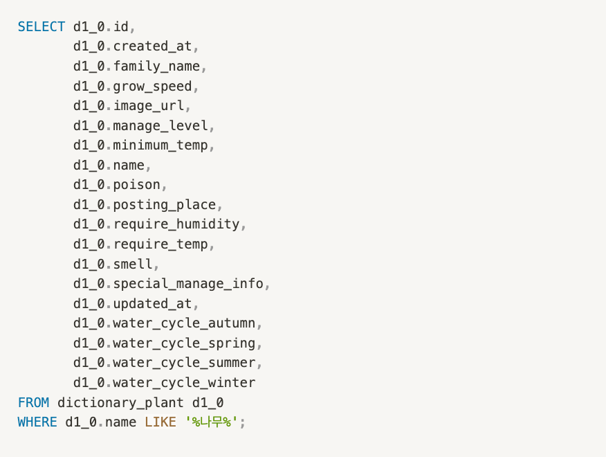
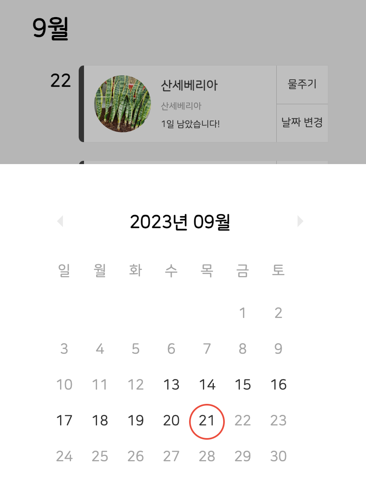

> 이 글은 우테코 피움팀 크루 '[그레이](https://github.com/kim0914)'가 작성했습니다.


## 서론
피움 서비스의 런칭 페스티벌을 무사히 마쳤습니다.


런칭 일정에 맞춰 빠르게 개발을 진행하다 보니 꼼꼼하지 못한 부분이 존재했고, 다음 개발에 착수하기 전 부족한 부분을 개선하고 넘어가기로 했습니다.


먼저 서비스 내에서 발생하는 모든 쿼리를 정리해보았습니다.

현재 서비스의 모든 기능을 인수 테스트로 작성했기 때문에 인수 테스트를 하나씩 돌려보며 발생하는 쿼리를 추적했습니다.


JPA를 사용하는 환경에서 스프링 properties 설정 중 아래 옵션을 설정하면 쿼리를 확인할 수 있습니다.

```properties
spring.jpa.show-sql=true
spring.jpa.properties.hibernate.format_sql=true
```


현재 서비스에서 사용하고 있는 API에서 발생하는 쿼리를 위와 같이 정리하였고 개선이 필요한 부분, 개선이 불필요한 부분을 먼저 구분했습니다.


개선이 필요한 원인들은 아래와 같습니다.


- batch로 진행할 수 있는 작업을 단건 질의 여러 번 실행

- DB 인덱스를 적절히 사용하고 있지 않음

- PK를 이용해 조회/삭제/수정을 할 수 있음에도 PK를 사용하지 않고 다른 컬럼을 이용해 질의

- N+1 발생

- Pagable 사용 시 불필요한 count 쿼리 발생

- 애플리케이션 단에서 처리할 수 있는 로직을 DB로 질의


생각보다 개선할 수 있는 부분이 많았습니다.

개발 당시에 꼼꼼하게 코드 리뷰를 했다고 생각했었지만...!! 쿼리를 더 꼼꼼히 확인하지 못했던 점이 아쉬웠습니다.

위와 같은 문제가 발생한 이유를 하나씩 알아보았습니다.

##  batch로 진행할 수 있는 작업을 단건 질의 여러 번 실행

사용자가 서비스를 탈퇴하면 사용자의 반려 식물을 모두 삭제하고 있습니다. 반려 식물을 삭제하는데 반려 식물 개수만큼 delete 쿼리가 발생한다는 점을 파악했습니다. 또한 반려 식물이 삭제되는 경우 해당 반려 식물의 히스토리까지 함께 삭제하고 있기 때문에 히스토리 개수 만큼 delete 쿼리가 발생한다는 점도 함께 파악했습니다. 히스토리는 서비스 내에서 가장 많이 생성되는 정보이고 생성 주기가 짧은 만큼 많은 데이터가 저장되기 때문에 반드시 개선이 필요한 부분입니다.


이 문제의 원인은 JPA의 deleteAll 메서드에 있었습니다. JPA의 deleteAll은 iterator 방식으로 동작하며 엔티티를 삭제하기 전 DB에 조회 쿼리를 실행한 후 삭제합니다. 즉, 50개의 데이터를 삭제한다고 했을 때 50개의 조회 쿼리, 50개의 삭제 쿼리가 발생한다는 것입니다. 또한 히스토리도 함께 삭제하고 있기 때문에 훨씬 더 많은 쿼리가 발생하고 있습니다.


삭제 시 조회가 발생하는 이유는 영속성 컨텍스트와 관련 있다는 생각이 들었습니다. 만약 엔티티가 cascade나 orphanRemoval과 같은 다른 엔티티의 생명 주기와 관련이 되어 있는 경우, 해당 엔티티의 영속화가 필요하기 때문에 조회를 한다고 생각합니다.


현재 반려 식물 엔티티는 다른 엔티티의 생명 주기와 관련이 없으므로 굳이 영속성 컨텍스트에 로드할 필요가 없습니다. 그러므로 **JPA에서 제공하는 delete를 사용하지 않고 queryDsl의 batch delete를 이용해 한번에 삭제하도록 쿼리를 개선**했습니다.

## DB 인덱스를 적절히 사용하고 있을까?
서비스 내에서 발생하는 쿼리들을 조사하며 인덱스는 적절히 타고 있는지도 함께 알아보았습니다.

EXPLAIN 명령어를 이용해 쿼리를 하나씩 실행해 보면 해당 쿼리의 실행 계획을 확인할 수 있습니다.

```sql
+--+-----------+-----+----------+----+-------------+----+-------+----+----+--------+-----------+
|id|select_type|table|partitions|type|possible_keys|key |key_len|ref |rows|filtered|Extra      |
+--+-----------+-----+----------+----+-------------+----+-------+----+----+--------+-----------+
|1 |SIMPLE     |d1_0 |null      |ALL |null         |null|null   |null|297 |11.11   |Using where|
+--+-----------+-----+----------+----+-------------+----+-------+----+----+--------+-----------+
```

위 실행 계획은 **사전 식물 검색 쿼리의 실행 계획**입니다.

사전 식물 검색 쿼리는 `like`를 이용해 다음과 같이 작성되고 있고 DB full scan을 하고 있습니다. 



Full scan을 하기 때문에 데이터가 많아지면 조회 성능이 느려질 수 있다고 판단했습니다. 또한 검색 서비스는 비로그인 사용자도 할 수 있고 서비스의 메인 페이지이기 때문에 개선이 필요하다고 생각했습니다.


검색 기능에서 적용할 수 있는 인덱스인 FullText 인덱스를 적용한 후 테스트를 진행했습니다.

```sql
CREATE FULLTEXT INDEX plant_name ON dictionary_plant(name) WITH PARSER ngram;
```

```sql
+----------------+----------+----------+------------+-----------+---------+-----------+--------+------+----+----------+-------+-------------+-------+----------+
|Table           |Non_unique|Key_name  |Seq_in_index|Column_name|Collation|Cardinality|Sub_part|Packed|Null|Index_type|Comment|Index_comment|Visible|Expression|
+----------------+----------+----------+------------+-----------+---------+-----------+--------+------+----+----------+-------+-------------+-------+----------+
|dictionary_plant|0         |PRIMARY   |1           |id         |A        |317        |null    |null  |    |BTREE     |       |             |YES    |null      |
|dictionary_plant|1         |plant_name|1           |name       |null     |317        |null    |null  |YES |FULLTEXT  |       |             |YES    |null      |
+----------------+----------+----------+------------+-----------+---------+-----------+--------+------+----+----------+-------+-------------+-------+----------+
```

인덱스를 적용하고 동일한 쿼리를 실행했습니다. 현재 사전 식물은 약 350개입니다.


위가 FULLTEXT `INDEX`로 조회한 결과이고, 아래가 `like` 쿼리로 조회한 결과입니다. 

인덱스를 설정했음에도 불구하고 like 쿼리의 실행 결과와 큰 차이가 나지 않음을 확인했습니다. 데이터 개수가 많지 않기 때문에 큰 차이가 발생하지 않았습니다.


`0.0002s`의 차이는 무의미한 차이라고 판단했고, **사전 식물의 경우 데이터가 아무리 많아도 1000개 이상 생길 수 없다고 판단**했습니다. 


또한 인덱스를 사용하는 경우 **DB 내에서 인덱스를 위한 별도의 페이지(저장 공간)가 필요하다는 오버헤드도 존재하기 때문에 like 쿼리를 그대로 사용하는 쪽으로 결정**했습니다.

## N+1


반려 식물을 조회하는 과정에서 사전 식물 정보를 함께 제공해주고 있습니다. 반려 식물이 사전 식물을 Lazy 하게 가지고 있기 때문에 반려 식물을 조회하고 정보를 응답하는 과정에서 사전 식물을 조회하는 추가적인 쿼리가 발생했습니다.


조회 기능이 다른 기능보다 압도적으로 많이 발생하는 저희 서비스에서는 반드시 해결하고 넘어가야 하는 문제였습니다. 
위와 같은 N+1이 발생했던 `히스토리 단건 조회-(기본, 필터링, 페이징)`, `반려 식물 조회`, `리마인더 조회` API에서 사용하는 조회 쿼리를 **fetch join을 이용해 한 번에 조회하여 가져올 수 있도록 변경**했습니다.


## PK를 사용하지 않고 다른 컬럼을 이용해 질의


회원을 삭제 기능에서 회원 ID로 삭제하지 않고 unique 컬럼인 kakaoId로 조회한 후 회원을 삭제하고 있음을 확인했습니다.


회원 객체가 이미 영속화되어 있는 상황에서 PK가 아닌 unique 컬럼으로 조회 후 삭제 질의를 날렸기 때문에 추가적인 select가 발생했고 **PK를 이용해 삭제하도록 변경**했습니다. (OSIV가 켜져 있기 때문에 withdraw 메서드가 호출되는 시점에 member는 영속화가 되어 있습니다)

## Pagable 사용 시 불필요한 count 쿼리 발생



피움 서비스의 물 주기 기능에서 validation을 진행하고 있습니다. 해당 반려 식물의 물주기 히스토리에서 마지막 물주기 이전, 즉 최신 물주기 히스토리 중 2번째 기록을 이용해 잘못된 요청을 하지 않도록 검증하고 있습니다. 그러므로 두 번째 히스토리를 조회하는 쿼리를 질의하고 있습니다. Pagable 객체를 이용해 이 쿼리를 질의하고 반환 타입을 Pagable로 반환받습니다.


그렇기 때문에 Pagable 객체에 필요한 총 데이터 수를 가져오는 count 쿼리가 발생합니다.

페이징이 필요 없는 기능에서 페이징 객체를 반환받고 있으므로 **Pagable 대신 Slice 객체를 반환받도록 변경하여 count 쿼리가 발생하지 않도록 개선**했습니다.

## 애플리케이션 단에서 처리할 수 있는 로직을 DB로 질의


반려 식물을 생성, 환경 변화, 물 주기 등 반려 식물과 관련된 이벤트가 발생했을 때 히스토리를 저장하고 있고, 한 동작에서 여러 히스토리가 생성되고 있습니다. 히스토리를 저장할 때 어떤 히스토리인지 히스토리 카테고리를 이용해 구분합니다. 이때 해당 카테고리가 DB에 존재하는지 확인하고 저장하기 때문에 카테고리 조회가 발생합니다. 현재 카테고리가 총 6개 존재하고 요구사항으로 카테고리가 추가적으로 생길 가능성이 많고 그에 따라 발생하는 쿼리는 증가할 것입니다.

```java
HistoryCategory historyCategory = historyCategoryRepository.findByHistoryType(
                historyEvent.getHistoryType())
        .orElseThrow(() -> new NoSuchElementException("일치하는 카테고리가 없습니다"));
```

그러므로 히스토리를 생성하는 시점에 모든 카테고리를 조회한 후, 애플리케이션 단에서 검증하도록 변경했습니다.
```java
List<HistoryCategory> categories = historyCategoryRepository.findAll();

HistoryCategory historyCategory = categories.stream()
                    .filter(it -> it.getHistoryType() == historyEvent.getHistoryType())
                    .findAny()
                    .orElseThrow(() -> new NoSuchElementException());
```


현재 서비스에서 사용하는 쿼리를 정리하고 개선이 필요한 쿼리는 모두 개선을 마쳤습니다.


또한 각 쿼리에서 사용하는 인덱스 설정을 확인하였고 인덱스 설정이 필요한 쿼리는 실행 계획을 통해 확인했습니다.