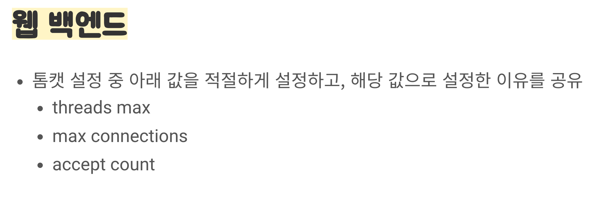
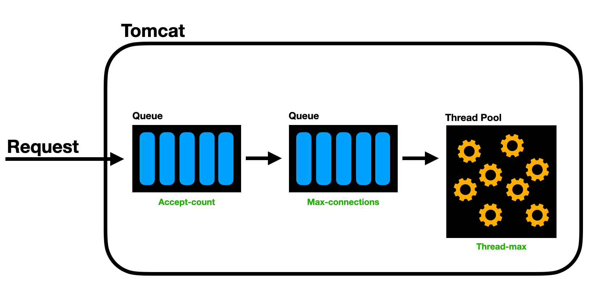
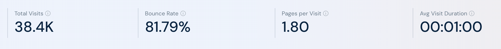
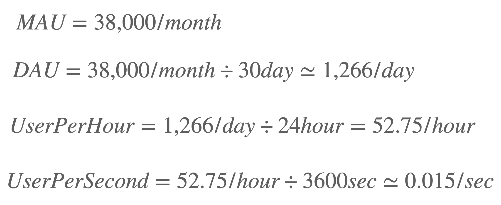
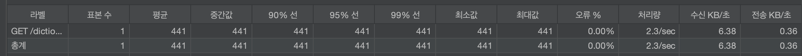
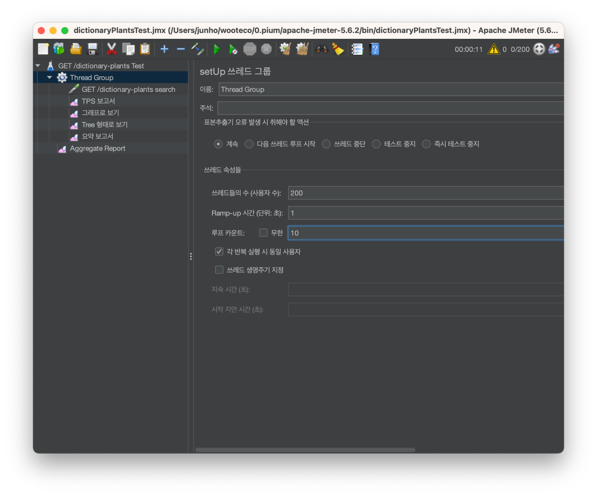
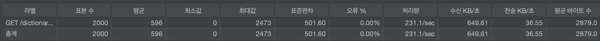

> 이 글은 우테코 피움팀 크루 '[주노](https://github.com/Choi-JJunho)'가 작성했습니다.

## 서론

우아한테크코스 레벨4 5차 데모데이 요구사항으로부터 Tomcat Thread의 적절한 설정값에 대해 고민하게 되었다.

현재 피움 서비스는 Tomcat의 Thread 값을 어느정도로 설정해야할까?

다양한 상황을 고려해보고 적절한 개수로 설정해보자.

## 알아보기

요구사항에서 주어진 Tomcat의 설정값이 각각 무엇을 의미하는지 알아보자.

### server.tomcat.threads.max

HTTP 요청을 처리하기 위해 사용할 수 있는 최대 작업 스레드 수를 설정한다.
기본값은 **200**으로 200개의 스레드를 사용하여 동시에 요청을 처리한다는 의미다.

### server.tomcat.max-connections

Tomcat이 동시에 처리할 수 있는 최대 클라이언트 연결 수를 정의한다.
기본값은 **8192**이다.

### server.tomcat.accept-count
모든 작업 스레드가 사용 중일 때 Tomcat이 수용 가능한 상태에서 대기 중인 TCP 연결의 최대 수를 나타낸다.
기본값은 **100**이다.

각 설정값이 어떤 부분인지 그림으로 표현하면 다음과 같다.

## 서비스 분석하기

피움 서비스는 트래픽이 몰리는 서비스가 아니다.
사용자의 개인화된 서비스를 제공하고 있기 때문에 다량의 데이터를 동시에 처리할 일이 거의 없다.

대량의 트래픽, 동시성에 대한 여지가 있는 커뮤니티 기능도 존재하지 않는다.

하지만 실제로 운영한다면 달라지지 않을까?

현재 운영중인 유사한 서비스를 분석해보자

### MAU 분석

> 이어지는 내용은 다음과 같은 용어를 사용합니다.
> 
> `MAU(Monthly Active User)`: 30일 동안 앱을 사용하는 순 유저 수
> 
> `DAU(Daily Active User)`: 하루동안 앱을 사용하는 순 유저 수
> 
> `MCU(Max Current User)`: 최대 동시 접속자
> 
> `ACU(Average Current User)`: 평균 접속자

[유사 서비스 MAU 참고 사이트](https://www.similarweb.com/website/groo.pro/#traffic)

해당 지표를 확인했을 때 월 평균 방문자수는 약 3만 8천명으로 책정된다.

분당, 초당 요청 횟수에 대해서는 자세하게 확인할 수 없으니 대략적으로 값을 판단해보자.

#### 추정값 계산

한달에 3만 8천명 정도의 트래픽이 발생한다고 가정했을 때 단순 계산을 해보면 초당 0.015개의 요청이 발생한다고 생각해볼 수 있다...

24시간 내내가 아니라 하루 12시간으로 쳐줘도 초당 0.03개의 요청이 발생한다고 유추해볼 수 있다.

## 분석하기

기존 서비스의 사용자 추이를 분석해봐도 초기에 생각한 것 처럼 많은 트래픽은 몰리지 않음을 확인할 수 있었다.

만약 위에서 계산했던 값을 토대로 하루 평균 요청량이 1분 내로 몰린다고 하더라도 초당 21건의 요청이 오는 꼴이다.

이 값은 현재 Tomcat의 기본 사양으로도 충분한 요청이다.
(maxThreads = 200)

그래도 실제로 요청이 왔을 때 정상적으로 처리하는지 확인해볼 필요는 있다.

## Jmeter

Apache jmeter를 사용하여 서버가 요청을 처리하는 성능을 알아보자.

피움 서비스에서 비로그인 상태로 이용할 수 있는 서비스로 식물 검색기능이 있다.

로그인 이후 수행되는 서비스 중에서 트래픽이 빈번하게 발생할 것으로 우려되는 기능은 없다고 판단했다. (반려 식물 등록, 수정, 삭제, 타임라인 확인, 물주기 등)

따라서 서비스에서 가장 빈번하게 일어날 것이라고 예상되는 식물 검색기능을 기준으로 처리량을 분석하고자 한다.

### TPS

> TPS란 Transaction per Second의 약자로서, 1초당 처리할 수 있는 트랜잭션의 개수를 의미한다.
다시말해 1초에 서비스가 처리할 수 있는 요청의 양의 개수를 의미한다.

현재 가장 직관적으로 판별할 수 있는 값이라고 판단하여 TPS를 성능의 지표로 사용하기로 했다.

1건의 요청에 대해 TPS가 2.3/sec라는 결과가 나왔다.

TPS는 `요청개수 / 처리시간(초)` 로 계산되며 위 경우 요청 개수가 1개이므로 1개의 요청을 처리하는데 약 0.4초가 걸린다고 볼 수 있다.
(원래는 네트워크 상태에 의한 지연도 고려해야하지만 지금은 고려하지않는다)

#### TPS를 기준으로 목표 지표 생각해보기

현재 실 서비스의 접속량을 기반으로 다음과 같이 서비스에 요구되는 TPS를 생각해봤다.

- 1분당 접속자수: 0.3명
- 평균 접속 유지시간: 1분
- (예상) 트래픽이 몰릴 경우 1분에 1명 꼴로 예상

TPS = 동시 활성 사용자수 / 평균 응답 시간

동시 활성 사용자수 = 1

평균 응답 시간 = 0.4s

목표 TPS = 4

> 
> 위에서 이야기했다시피 현재 Tomcat의 기본 사양으로 충~분한 요청이다.

### What if..?

만약 서비스가 인기가 많아져서 요청이 많이 발생한다고 가정해보자

#### 시나리오

사용자 유치 목표 100명의 2배인 200명의 충성고객을 유치했다고 가정한다.
해당 고객들은 매일같이 서비스를 열정적으로 이용한다.
`스레드 수: 200`

검색기능의 접근성이 단순한 점과 트래픽이 몰리는 경우를 상정하여 1초에 최대 200건의 요청이 들어온다고 가정한다.
`Ramp up 시간: 1`

각 사용자는 10회 반복요청을 보낸다.
`루프 카운트: 10`

위 시나리오를 기준으로 요청을 보내본다.

TPS가 231.1/sec라는 결과가 나왔다.

NIO방식으로 동작하기 때문에 TPS가 200을 넘어가는 것으로 예상된다.

> NIO에 대한 자세한 이야기는 여기에서 다루지는 않겠다.

## 결론

Tomcat의 기본 설정값으로 사용자 트래픽을 충분히 감당할 수 있을 것으로 판단했기 때문에 현재로서는 Tomcat의 스레드 설정을 기본 값으로 유지한다.

## Reference

- https://junuuu.tistory.com/799
- https://hudi.blog/tomcat-tuning-exercise/