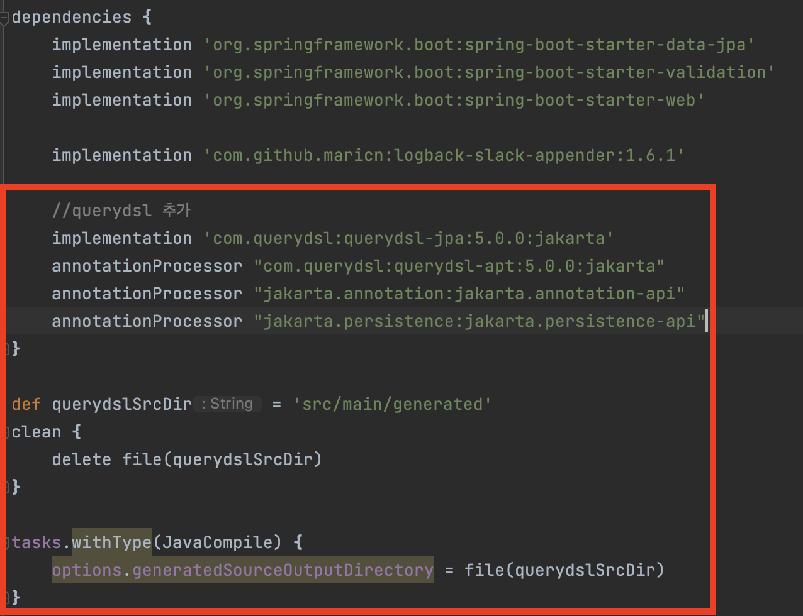
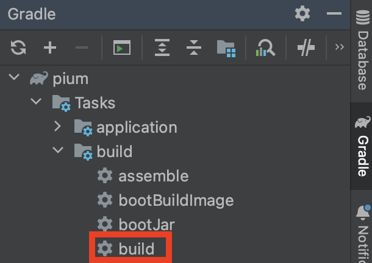
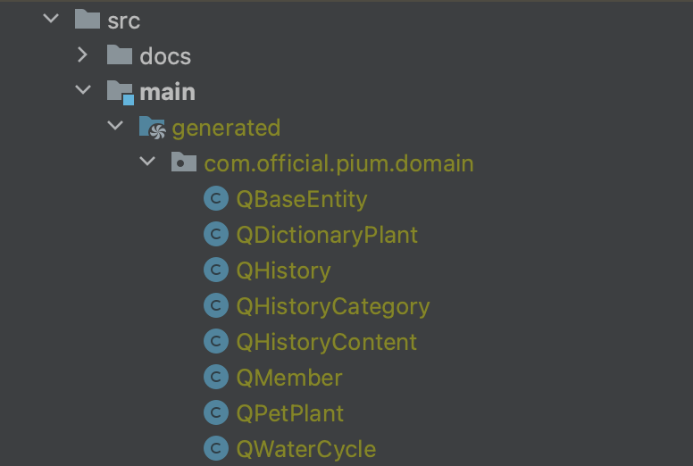
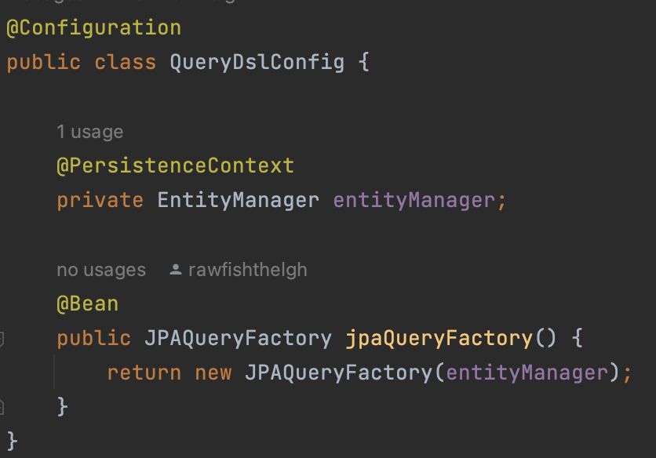
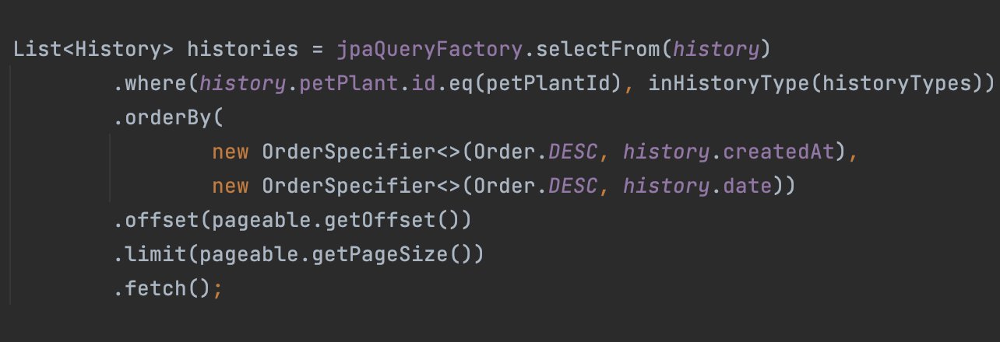
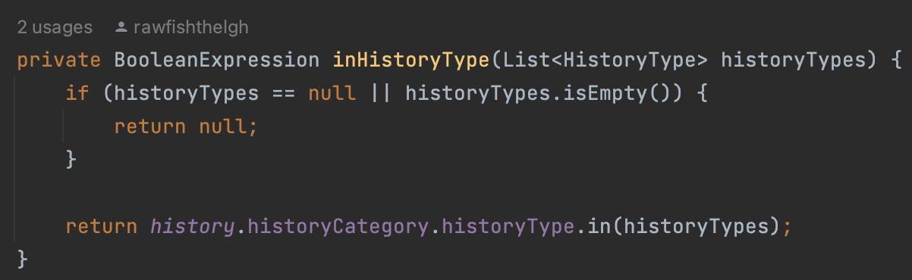
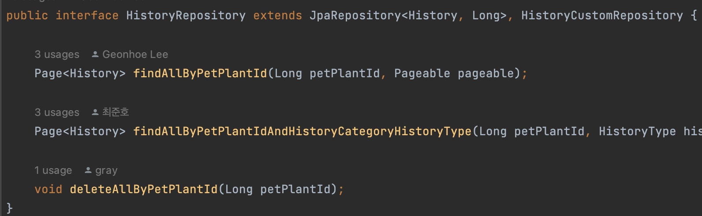
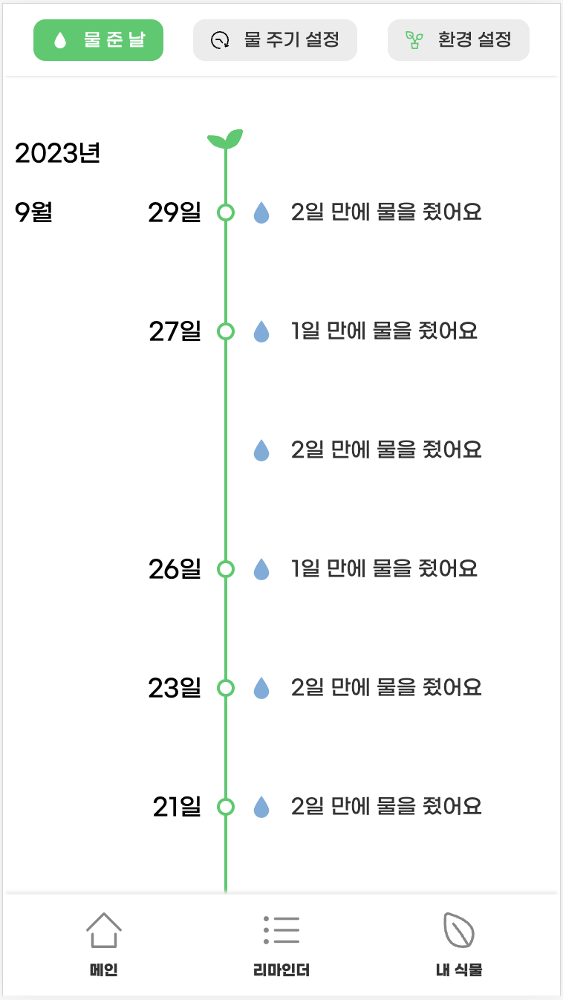
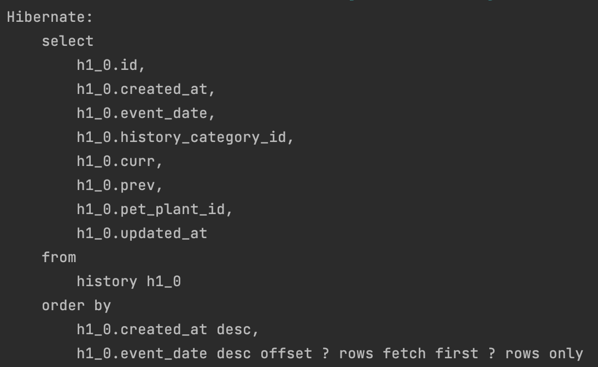

> 이 글은 우테코 피움팀 크루 '[하마드](https://github.com/rawfishthelgh)'가 작성했습니다.

## 개요
---
우아한테크코스 5기 피움 프로젝트를 진행하면서, 필터링 기능 구현을 위해 Querydsl을 적용한 과정을 정리한다

[이전글](https://pium-official.github.io/why_we_applied_querydsl/)

## 과정
---
> 본 프로젝트는 다음과 같은 환경에서 구성되었다
> 
> Springboot 3.1.1
> 
> JAVA 17

## Querydsl 설정
---
### build.gradle에 관련 코드 추가



```
dependencies {
    implementation 'org.springframework.boot:spring-boot-starter-data-jpa'
    implementation 'org.springframework.boot:spring-boot-starter-validation'
    implementation 'org.springframework.boot:spring-boot-starter-web'

    implementation 'com.github.maricn:logback-slack-appender:1.6.1'

    //querydsl 추가
    implementation 'com.querydsl:querydsl-jpa:5.0.0:jakarta'
    annotationProcessor "com.querydsl:querydsl-apt:5.0.0:jakarta"
    annotationProcessor "jakarta.annotation:jakarta.annotation-api"
    annotationProcessor "jakarta.persistence:jakarta.persistence-api"
}

//querydsl 추가
def querydslSrcDir = 'src/main/generated'

clean {
    delete file(querydslSrcDir)
}

tasks.withType(JavaCompile) {
    options.generatedSourceOutputDirectory = file(querydslSrcDir)
}
```
`build.gradle` 파일에 위 설정을 추가해 준다.
`dependencies` 하부의 옵션 설정은 아래와 같은 의미를 가진다.

`def querydslSrcDir = 'src/main/generated'`

Querydsl이 생성한 소스 코드를 저장할 디렉토리를 정의한다. 여기서는 'src/main/generated'로 디렉토리 경로를 지정하고, 이를 querydslSrcDir 변수에 할당한다.

`clean { delete file(querydslSrcDir) }`

Gradle의 clean 태스크를 정의하고, 해당 태스크가 실행될 때 querydslSrcDir 디렉토리를 삭제하도록 한다. 즉, 프로젝트를 clean 하면 Querydsl이 생성한 소스 코드도 삭제된다.

`tasks.withType(JavaCompile) { options.generatedSourceOutputDirectory = file(querydslSrcDir) }`

JavaCompile 태스크 유형을 가진 모든 태스크에 대해, 컴파일 옵션 중에서 생성된 소스 코드의 출력 디렉토리를 querydslSrcDir로 설정한다. Querydsl이 생성한 소스 코드가 지정한 디렉토리에 컴파일되도록 보장한다.
### build 수행 및 Q Class 생성



이제 바뀐 설정 파일로 `build`를 수행하면 우리가 지정한`src/main/generated` 경로에 위와 같은 Q Class가 생성된다.

QueryDsl은 빌드 시점에 애플리케이션의 도메인 중 `@Entity`와 `@Embeddable` 어노테이션이 포함된 클래스를 찾아 Q Class를 생성한다. 이 Q class를 가지고 애플리케이션 내부에서 QueryDsl 관련 로직을 적용해야 한다.

## 적용
---
### JPAQueryFactory Bean 등록

```java
@Configuration
public class QueryDslConfig {

    @PersistenceContext
    private EntityManager entityManager;

    @Bean
    public JPAQueryFactory jpaQueryFactory() {
        return new JPAQueryFactory(entityManager);
    }
}
```
JPAQueryFactory는 Querydsl을 사용하여 JPA 쿼리를 생성하고 실행하기 위한 클래스다. `EntityManager`를 주입해 JPAQueryFactory가 db 상호 작용을 수행할 수 있도록 해주는 Config 파일을 작성한다.

### Querydsl 질의용 Repository 생성 및 적용
```java
public interface HistoryCustomRepository {

    Page<History> findAllByPetPlantIdAndHistoryTypes(Long petPlantId, List<HistoryType> historyTypes, Pageable pageable);
}
```
먼저 해당 기능을 추상화한 Repository 인터페이스를 정의한다.
```java
import static com.official.pium.domain.QHistory.history;

@Repository
@RequiredArgsConstructor
public class HistoryCustomRepositoryImpl implements HistoryCustomRepository {

    private final JPAQueryFactory jpaQueryFactory;

    @Override
    public Page<History> findAllByPetPlantIdAndHistoryTypes(Long petPlantId, List<HistoryType> historyTypes, Pageable pageable) {

        List<History> histories = jpaQueryFactory.selectFrom(history)
                .where(history.petPlant.id.eq(petPlantId), inHistoryType(historyTypes))
                .orderBy(new OrderSpecifier<>(Order.DESC, history.createdAt), new OrderSpecifier<>(Order.DESC, history.date))
                .offset(pageable.getOffset())
                .limit(pageable.getPageSize())
                .fetch();

        return new PageImpl<History>(histories, pageable, getCount(petPlantId, historyTypes));
    }

    private Long getCount(Long petPlantId, List<HistoryType> historyTypes) {
        return jpaQueryFactory.select(history.count())
                .from(history)
                .where(history.petPlant.id.eq(petPlantId), inHistoryType(historyTypes))
                .fetchOne();
    }

    private BooleanExpression inHistoryType(List<HistoryType> historyTypes) {
        if (historyTypes == null || historyTypes.isEmpty()) {
            return null;
        }

        return history.historyCategory.historyType.in(historyTypes);
    }
}
```
가장 중요한 부분이다. HistoryCustomRepository를 implements한 HistoryCustomRepositoryImpl를 작성한다.

여기서 **인터페이스명+impl 네이밍 규약을 반드시 지켜야** 향후 HistoryRepository에 extends 할 시 해당 구현체가 주입될 수 있다.

또 여기서 사용하려는 Q class(QHistory)를 위와 같이 static import하여 사용한다.

`import static com.official.pium.domain.QHistory.history;`

먼저, 우리가 수행하려는 동작과 도출하고자 하는 쿼리 형태는 아래와 같다.

> - 기능 : 리스트로 받은 히스토리 타입들에 해당하는 히스토리를 시간순으로 조회하고, 페이징 정보(size, page)에 해당하는 만큼 데이터를 가져온다.

```
select *
    from
        history h1_0 
    join
        history_category h2_0 
            on h2_0.id=h1_0.history_category_id 
    where
        h1_0.pet_plant_id=(반려식물_id) 
        and h2_0.history_type in (타입1,타입2...) 
    order by
        h1_0.created_at desc,
        h1_0.event_date desc 
        offset (페이지번호 * 페이지사이즈) rows fetch first (페이지사이즈) rows only
```



이제 위 코드를 천천히 파악해보자.

>**`jpaQueryFactory.selectFrom(history)`**

history를 대상으로 select 질의를 수행함을 의미한다

>**`.where(history.petPlant.id.eq(petPlantId), inHistoryType(historyTypes))`**

where 조건문을 사용하는 코드이다. `eq` 메소드를 통해 파라미터로 주입받은 `petPlantId`와의 비교를 수행한다.



위는 `in` 절을 수행하는 `inHistoryType` 메소드다. 여기서 반환 타입을 `BooleanExpression`으로 사용한 것에 주목하자. **`BooleanExpression` 의 반환값이 null일 경우, 자동으로 조건절에서 제외된다.** 따라서 우리는 `historyTypes`가 들어오지 않았을 경우, in 절을 수행하지 않도록 지정했다.

> **`.orderBy(new OrderSpecifier<>(Order.DESC, history.createdAt), new OrderSpecifier<>(Order.DESC, history.date))`**

`order by`의 Sorting 조건을 지정하기 위한 부분이다.
**Sorting 조건은 `OrderSpecifier` 클래스로 정의해 지정해야 한다.**

첫 인자에 Sorting 방향 Enum(Order.DESC)을, 두 번째 인자에 Sorting 대상 필드(history.createdAt)를 지정한다. 우리는 Sorting 조건이 두 가지이므로, 두 개의 `OrderSpecifier` 를 정의해 정렬 순서대로 넣어주었다.

> **`.offset(pageable.getOffset().limit(pageable.getPageSize())`**

페이징 처리를 위한 offset, limit을 지정하는 부분이다. 이 부분은 그냥 Long 타입을 넣어주면 된다. 넘길 부분을 지정하는 offset 값과, 가져올 양을 지정하는 limit 값을 넣어준다.(해당 애플리케이션에서 offset 값은 Pageable 객체에 미리 계산되어 있다)

> **`.fetch()`**

`.fetch()` 를 활용하면 결과를 리스트로 반환할 수 있다. 

여기서 주의할 점은 **`.fetch()`를 사용한다고 `fetch join`을 수행하는 것이 아니다**. 결과 반환 방법은 아래 블로그에 자세히 설명되어 있어 첨부하겠다.
[참고](https://devocean.sk.com/blog/techBoardDetail.do?ID=163915)

```java
private Long getCount(Long petPlantId, List<HistoryType> historyTypes) {
return jpaQueryFactory.select(history.count())
.from(history)
.where(history.petPlant.id.eq(petPlantId), inHistoryType(historyTypes))
.fetchOne();
}
```

조건에 해당하는 레코드의 총 개수를 전달하는 Count 쿼리를 날리는 메소드다. 간단하게 `.select()` 메소드의 Qclass에 `.count()` 만 추가하면 count 쿼리를 생성해준다. 
`.fetchOne()` 을 통해 단건으로 `Long`을 반환할 수 있다.
  
### 생성한 CustomRepository를 기존 사용하던 Repository에 extends



  이제 만든 CustomRepository를 기존 사용하던 Repository에 extends 하기만 하면 기존 Service에 새로운 인터페이스 필드를 선언하지 않고도 사용할 수 있다.

**HistoryService.java**
 ```java
@Service
@Transactional(readOnly = true)
@RequiredArgsConstructor
public class HistoryService {

    private final HistoryRepository historyRepository;
    private final PetPlantRepository petPlantRepository;

    public HistoryResponse read(Long petPlantId, Pageable pageable, Member member, List<String> filters) {
        PetPlant petPlant = petPlantRepository.findById(petPlantId)
                .orElseThrow(() -> new NoSuchElementException("일치하는 반려 식물이 존재하지 않습니다. id :" + petPlantId));

        if (petPlant.isNotOwnerOf(member)) {
            throw new IllegalArgumentException("요청 사용자와 반려 식물의 사용자가 일치하지 않습니다. id :" + member.getId());
        }

        List<HistoryType> historyTypes = new ArrayList<>();

        if (filters != null) {
            historyTypes = filters.stream()
                    .map(HistoryType::from)
                    .toList();
        }

        Page<History> historyPageByPetPlantId = historyRepository.findAllByPetPlantIdAndHistoryTypes(petPlantId, historyTypes, pageable);

        return HistoryMapper.toHistoryResponse(historyPageByPetPlantId);
    }
}
```
기존에 주입받은 `historyRepository`를 활용해, 새로 생성한 `findAllByPetPlantIdAndHistoryTypes` 메소드를 사용하는 것을 확인할 수 있다.

## 결과
---
  ```
    select
        h1_0.id,
        h1_0.created_at,
        h1_0.event_date,
        h1_0.history_category_id,
        h1_0.curr,
        h1_0.prev,
        h1_0.pet_plant_id,
        h1_0.updated_at 
    from
        history h1_0 
    join
        history_category h2_0 
            on h2_0.id=h1_0.history_category_id 
    where
        h1_0.pet_plant_id=? 
        and h2_0.history_type in (?,?) 
    order by
        h1_0.created_at desc,
        h1_0.event_date desc offset ? rows fetch first ? rows only
2023-08-16 17:10:47.907 [main] TRACE org.hibernate.orm.jdbc.bind - binding parameter [1] as [BIGINT] - [1]
2023-08-16 17:10:47.907 [main] TRACE org.hibernate.orm.jdbc.bind - binding parameter [2] as [VARCHAR] - [FLOWERPOT]
2023-08-16 17:10:47.907 [main] TRACE org.hibernate.orm.jdbc.bind - binding parameter [3] as [VARCHAR] - [LOCATION]
2023-08-16 17:10:47.907 [main] TRACE org.hibernate.orm.jdbc.bind - binding parameter [4] as [INTEGER] - [0]
2023-08-16 17:10:47.907 [main] TRACE org.hibernate.orm.jdbc.bind - binding parameter [5] as [INTEGER] - [5]
Hibernate: 
    select
        count(h1_0.id) 
    from
        history h1_0 
    join
        history_category h2_0 
            on h2_0.id=h1_0.history_category_id 
    where
        h1_0.pet_plant_id=? 
        and h2_0.history_type in (?,?)
2023-08-16 17:10:47.919 [main] TRACE org.hibernate.orm.jdbc.bind - binding parameter [1] as [BIGINT] - [1]
2023-08-16 17:10:47.919 [main] TRACE org.hibernate.orm.jdbc.bind - binding parameter [2] as [VARCHAR] - [FLOWERPOT]
2023-08-16 17:10:47.919 [main] TRACE org.hibernate.orm.jdbc.bind - binding parameter [3] as [VARCHAR] - [LOCATION]
```
테스트 코드를 통해 실제 어떤 쿼리가 실행되는지 확인해 보니,
우리가 위에서 구현하고자 했던 sql 쿼리와 정확히 일치하는 것을 볼 수 있다.




클라이언트 화면에서도 필터링이 잘 수행 된다. 기분이 좋다.
### 어떻게 join이 걸렸을까?
위 예시를 보면 join을 통해 연관관계가 있는 테이블 정보를 한 번에 가져와 n+1 문제가 발생하지 않는다. 그런데, 우리는 select where 설정만 했을 뿐, join 처리를 따로 하지 않았다. 그런데 어떻게 연관관계를 파악하고 Querydsl이 join을 생성해 준 걸까?

**Where 조건에 추가된 연관 관계 정보를 확인하고 join 쿼리 생성**

아까 where 조건에서 사용했던 `inHistoryTypes` 메소드를 다시 파악해볼 필요가 있다.


`history.historyCategory.historyType.in(historyTypes)` 와 같은 형태로 객체의 연관관계를 탐색하여 `in`절을 실행시키는 모습을 볼 수 있다. 따라서 해당 연관관계 정보가 필요함을 querydsl이 파악하고 join 쿼리를 실행시켜주는 것이다.

**Where을 생략한 경우**


만약 where을 생략했을 때는 연관 관계 정보가 필요하지 않음을 파악하므로 join 쿼리가 날아가지 않는 모습을 볼 수 있다.
