> 이 글은 우테코 피움팀 크루 '[주노](https://github.com/Choi-JJunho)'가 작성했습니다.

## 사건의 발단


3차 스프린트를 진행하기 하루 전날 프론트가 배포되었다.


그런데 배포된 사이트에 들어가보니 반려 식물의 타임라인을 보는 페이지가 404를 띄우고있었다.

당황하지 않고 침착하게 f12를 눌러 개발자도구를 열고 네트워크탭을 확인해보니 API가 이상하게 호출되고있었다.

평소 프론트분들을 굉장히 신뢰하던 주노는 설마 하는 마음에 Notion을 열어봤다. 아니나다를까 Notion에 API 명세가 이상하게 작성되어있었다.

범인은 바로 이것저것 끄적이다가 되돌리기를 하지 않은 주노...

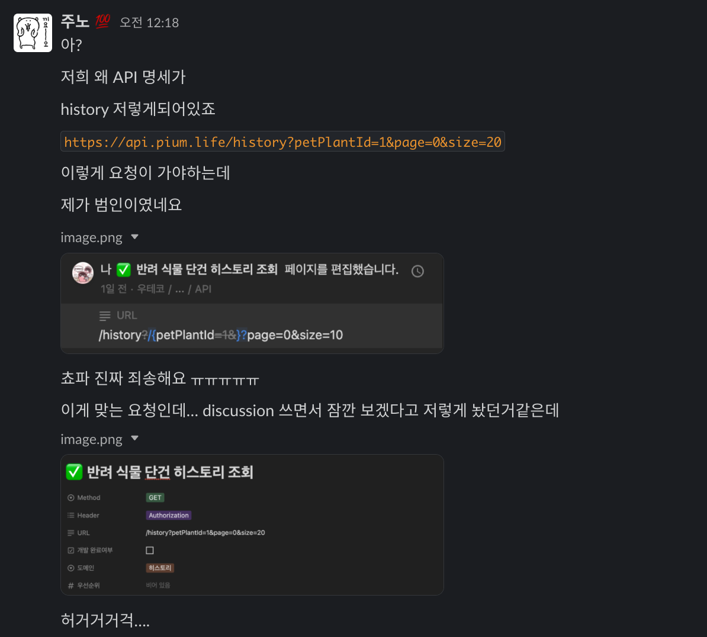

위와 같은 사건을 겪으면서 사람 손으로 작성되는 문서의 신뢰도 문제를 인지했고, API 문서화를 자동화할 수 있는 기술의 필요성을 느꼈다.

## 서론

API 문서화 방식에 대해 찾아본 결과 크게 두가지 방법을 알 수 있었다.

### 알아보기

1. Spring RestDocs

Spring Rest Docs는 Spring에서 제공하는 문서화 도구다.

- 테스트 작성이 강제된다는 특징이 있따.
- 테스트를 통해 도출된 결과를 문서로 작성하기 프로덕션 코드에 영향이 없다는 특징이 있다.
- 아래 설명할 Swagger와 비교했을 때 설정이 약간 번거롭다는 단점이 있다. 

2. Swagger

Swagger는 API 문서화를 돕는 오픈소스 툴이다.

- 테스트 작성이 필수가 아니라는 특징이 있다.
- swagger 이용 시 실제 API가 호출된다는 특징이 있다.
- 테스트 작성을 안하는 대신 프로덕션 코드에 문서ㅘ와 관련된 코드가 작성된다. (DTO, Controller 등)

### Spring RestDocs

피움 팀은 RestDocs를 사용하기로 결정했고 이유는 다음과 같다.

- 현재 피움팀은 각 계층별 테스트를 꼼꼼하게 작성하고있고 인수테스트까지 작성하고 관리하고있으므로 테스트가 강제된다는 점은 큰 단점으로 다가오지 않았다.
- 코드리뷰가 필수적으로 이뤄지는 현 스프린트 단계에서 프로덕션 코드의 가독성을 해치는 방향이 오히려 큰 단점이 될 수 있다.
- 성공하는 테스트에 대해서만 문서화가 이뤄지기 때문에 문제상황에서 필요했던 문서의 신뢰성을 충족시킨다.
- (프론트 쵸파가 RestDocs를 좋아한다 🦌)

> [피움🌱 문서화 도입 관련 discussion](https://github.com/woowacourse-teams/2023-pium/discussions/181)

## 시작하기

RestDocs를 설정하는 과정을 정리하려고한다.

### RestAssured vs MockMvc?

RestDocs를 적용하는 방법은 RestAssured를 기반으로 문서를 생성하는 방법과 MockMvc를 기반으로 문서를 생성하는 방법으로 크게 두가지가 있다.

피움팀은 현재 인수테스트도 작성되어있기 때문에 RestAssured를 사용해도 충분히 문제가 없다.

하지만 여러 계층이 협업하는 인수테스트 환경에 문서화와 관련된 코드가 작성된다면 안그래도 복잡한 인수테스트 코드의 가독성을 해칠 것이라고 우려되었다.

슬라이스 테스트를 수행하여 비교적 코드의 무게가 가벼운 Controller 테스트가 MockMvc로 작성되어있었기 때문에 MockMvc를 기반으로 RestAssured를 적용하기로 결정했다.

### Gradle 설정

> TIP : `asciidoctor`는 adoc 파일을 html 등으로 변환해주는 도구입니다

```gradle
plugins {
    ...
    id "org.asciidoctor.jvm.convert" version "3.3.2" // asciidoctor 플러그인 추가
}

configurations {
    asciidoctorExt // asciidoctorExt에 대한 선언
    ...
}


dependencies {
    ...
    asciidoctorExt 'org.springframework.restdocs:spring-restdocs-asciidoctor' // asciidoctorExt에 spring-restdocs-asciidoctor 의존성 추가
    testImplementation 'org.springframework.restdocs:spring-restdocs-mockmvc' // mockMvc 사용
}

ext {
    snippetsDir = file('build/generated-snippets') // 스니펫이 생성되는 디렉터리 경로를 설정
}

test {
    outputs.dir snippetsDir // 스니펫이 생성되는 디렉터리를 설정
}

asciidoctor { // Gradle이 asciidoctor Task를 수행하는 설정 (함수 선언)
    configurations 'asciidoctorExt' // asciidoctor 확장 설정
    baseDirFollowsSourceFile() // .adoc 파일을 include 하면서 사용하기 위한 설정
    inputs.dir snippetsDir // 스니펫을 불러올 위치 설정
    dependsOn test // Gradle의 test Task 이후 asciidoctor를 수행
}

asciidoctor.doFirst { // asciidoctor Task가 수행될 때 가장 먼저 수행
    delete file('src/main/resources/static/docs')
}

task copyDocument(type: Copy) { // 생성된 html 파일을 옮긴다
    dependsOn asciidoctor // Gradle의 asciidoctor Task 이후 수행
    from file("${asciidoctor.outputDir}")
    into file("src/main/resources/static/docs")
}

build {
    dependsOn copyDocument // build 이후 html 파일 복사
}

bootJar {
    dependsOn asciidoctor // asciidoctor 이후 bootJar 수행
    from ("${asciidoctor.outputDir}") {
        into 'static/docs'
    }
    ...
}
```

### 테스트 코드 작성하기

우선 다음과 같은 방식으로 코드를 작성할 수 있다.

```java
@AutoConfigureRestDocs
@WebMvcTest(controllers = PetPlantController.class)
class PetPlantControllerTest {

    @Autowired
    private MockMvc mockMvc;

    @MockBean
    private PetPlantService petPlantService;
    
    @Test
    void 반려_식물_단건_조회_정상_요청시_200을_반환() throws Exception {
        PetPlantResponse response = RESPONSE.피우미_응답;
        given(petPlantService.read(anyLong(), any(Member.class)))
                .willReturn(response);
    
        mockMvc.perform(get("/pet-plants/{id}", 1L)
                        .header("Authorization", "pium@gmail.com")
                        .contentType(MediaType.APPLICATION_JSON)
                        .characterEncoding(StandardCharsets.UTF_8))
                .andDo(document(
                            "petPlant/findById/",
                            Preprocessors.preprocessRequest(Preprocessors.prettyPrint()),
                            Preprocessors.preprocessResponse(Preprocessors.prettyPrint()),
                            requestHeaders(
                                    headerWithName("Authorization").description("사용자 인증 정보")
                            ),
                            pathParameters(
                                    parameterWithName("id").description("반려 식물 ID")
                            )
                        )
                )
                .andExpect(status().isOk())
                .andDo(print());
    }
}
```

`andDo(document(...))` 부분이 문서화와 관련된 내용들이다.

`document()` 내부의 파라미터를 하나씩 살펴보자

- `"petPlant/findById/"`

스니펫이 생성되는 대상 디렉터리 명이다. 

해당 테스트가 완료되면 문서화 대상으로 지정한 값들에 대해 `.adoc` 문서가 생성된다.

생성 흐름과정은 뒤에서 설명한다.

우선 각 파라미터가 어떤 결과물을 도출하는지 확인해보자.

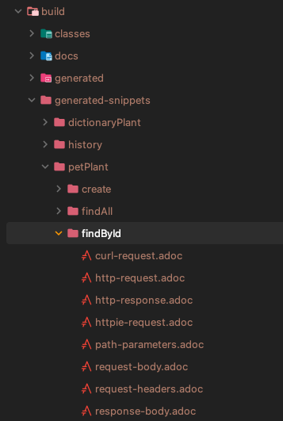

- `Preprocessors.preprocessRequest(prettyPrint())`

요청값을 읽기 쉬운 서식으로 지정한다.


- `Preprocessors.preprocessResponse(prettyPrint())` 

응답값을 읽기 쉬운 서식으로 지정한다.

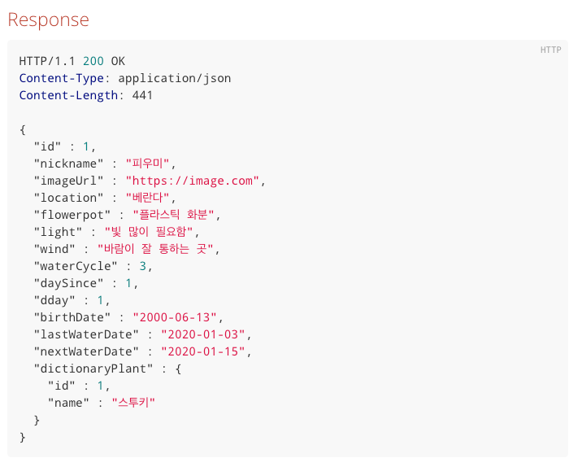

> [Preprocessors 관련 공식문서](https://docs.spring.io/spring-restdocs/docs/current/reference/htmlsingle/#customizing-requests-and-responses-preprocessors)

- `requestHeaders(headerWithName("Authorization").description("사용자 인증 정보"))` : RequestHeader에 대한 명세를 한다.

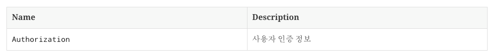

- `queryParameters(parameterWithName("name").description("사전 식물 검색 파라미터"))`

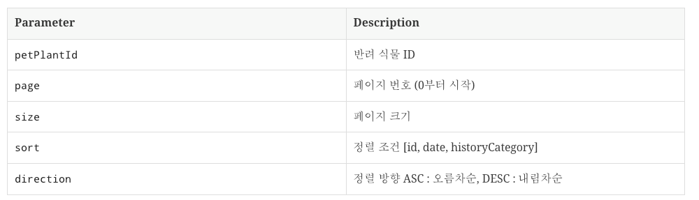

- `pathParameters(parameterWithName("id").description("반려 식물 ID"))`

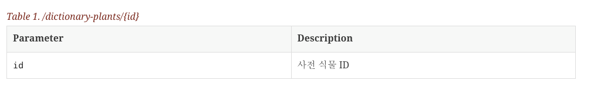

> `pathParameters`를 사용하기 위해
> 
> mockMvc.perform(`get`("/pet-plants/{id}", 1L) 에서
> 
> `RestDocumentationRequestBuilders`의 `get()` 메서드를 사용해야한다는 부분을 신경써야한다.
> 
> 자세한 내용은 [공식문서 참고](https://docs.spring.io/spring-restdocs/docs/current/api/org/springframework/restdocs/mockmvc/RestDocumentationRequestBuilders.html)
> 
> 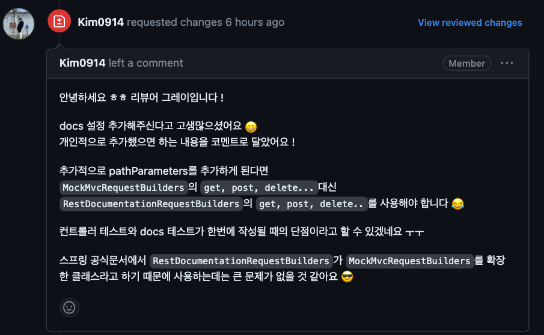
> 고마워요 ! 리뷰어 그레이 ! 

문서화를 수행하고자 하는 나머지 테스트들에도 동일한 방법으로 작성해준다. 

### adoc 스니펫 생성하기

> Snippet : 단편, 부분적, 작은 조각이라는 뜻으로 여기서는 `문서 조각` 정도로 이해하면 된다.
> 
> 문서 조각을 모아서 하나의 문서를 만들게 된다.

이렇게 작성한 테스트들을 수행해보자.

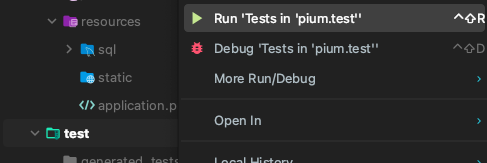

그러면 `build/generated-snippets/{파라미터에서 설정한경로}`에 adoc 파일이 생성된 것을 확인 할 수 있다.

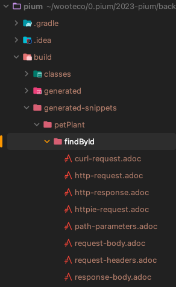

```adoc
// http-request.adoc 파일
[source,http,options="nowrap"]
----
GET /pet-plants/1 HTTP/1.1
Content-Type: application/json;charset=UTF-8
Authorization: pium@gmail.com
Host: localhost:8080

----
```

### asciidoc 문서 생성하기

위에서 생성한 adoc 스니펫들을 모아 하나의 API 문서를 만든다.

`src > docs > asciidoc` 디렉터리를 생성하고 `.adoc` 파일을 생성한다.

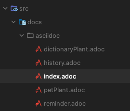

API가 여러개인 경우 각각을 파일로 관리한 뒤 하나의 adoc 파일로 include하여 합칠 수도 있다.

#### index.adoc

다음과 같이 adoc 파일을 작성할 수 있다.

```adoc
// index.adoc
= Pium Application API Document
:doctype: book
:source-highlighter: highlightjs
:sectlinks:
:toc: left
:toclevels: 3

include::dictionaryPlant.adoc[]
include::petPlant.adoc[]
include::reminder.adoc[]
include::history.adoc[]
```

```adoc
// petPlants.adoc
== 반려 식물(PetPlants)

=== 반려 식물 단건 조회

==== Request

include::{snippets}/petPlant/findById/http-request.adoc[]
include::{snippets}/petPlant/findById/request-headers.adoc[]
include::{snippets}/petPlant/findById/path-parameters.adoc[]

==== Response

include::{snippets}/petPlant/findById/http-response.adoc[]
...
```

adoc 파일의 자세한 문법은 [asciidoctor 공식문서 참고](https://docs.asciidoctor.org/asciidoc/latest/syntax-quick-reference/)

### HTML 문서 생성하기

이제 웹 페이지가 읽을 수 있도록 HTML 문서를 생성해보자.

HTML 문서는 `src > docs > asciidoc`에 생성된다.

다음 명령어를 수행해보자.

```shell
./gradlew asciidoctor
```

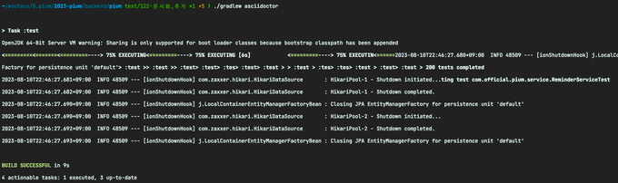

그러면 `build > docs > asciidoc` 경로에 문서가 생성된다.

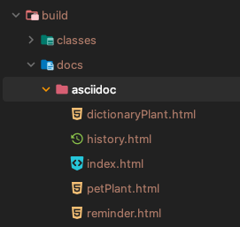

### 애플리케이션에서 확인해보기

http://localhost:8080/docs/index.html 으로 접속해서 문서를 확인해보자.

우선 gradle build를 수행한다.

```shell
./gradlew build
```

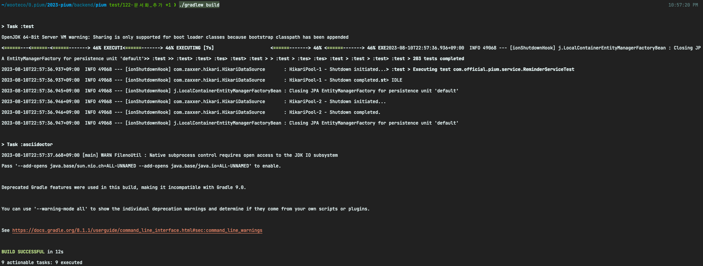

이전에 Gradle에서 작성했던 스크립트 내용 중 copyDocument Task가 build가 일어난 뒤 수행되기 때문이다.

```gradle
task copyDocument(type: Copy) { // 생성된 html 파일을 옮긴다
    dependsOn asciidoctor // Gradle의 asciidoctor Task 이후 수행
    from file("${asciidoctor.outputDir}")
    into file("src/main/resources/static/docs")
}

build {
    dependsOn copyDocument // build 이후 html 파일 복사
}
```

그러면 `src > main > resources > static > docs` 경로에 HTML 문서가 생성된다.

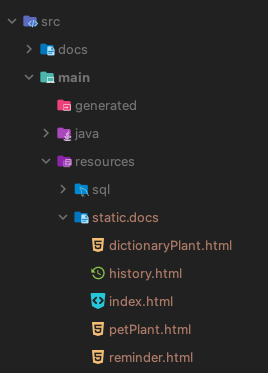

로컬에서 구동되는 애플리케이션은 해당 경로를 참조하기 때문에 파일을 복사해줬다.

이제 어플리케이션을 구동하고 http://localhost:8080/docs/index.html 로 접속하면 다음과 같이 문서를 확인할 수 있다.

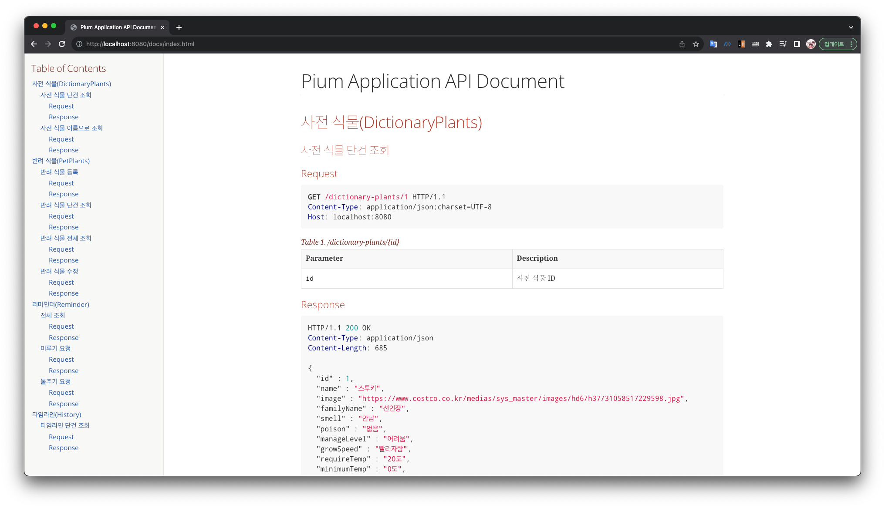

## Reference

- https://spring.io/projects/spring-restdocs
- https://hudi.blog/spring-rest-docs/
- https://techblog.woowahan.com/2597/
- https://dallog.github.io/apply-rest-docs/