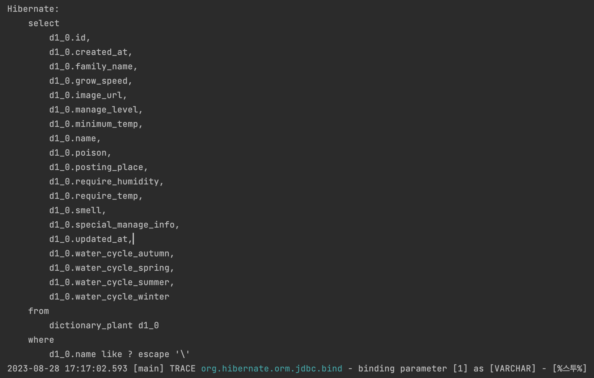

> 이 글은 우테코 피움팀 크루 '[하마드](https://github.com/Choi-JJunho)'가 작성했습니다.

## 개요
---
피움 서비스 개발을 진행하면서, JPA Method Naming 기능을 활용하여 `%Like%` 쿼리를 생성해 검색 기능을 개발한 과정을 기록한다.
## 과정
---
먼저 개발하려는 기능은 다음과 같다
> 식물사전 데이터베이스에 포함된 식물의 이름을 기준으로, 해당 검색어를 포함한 식물의 목록을 조회해 온다.

따라서 나는 다음과 같은 쿼리를 생성하고자 했다.

```sql
select *
    from
        dictionary_plant
    where
        dictionary_plant.name like '%검색어%'
```
현재 dictionary_plant의 entity는 다음과 같다.

```java
@Entity
@Getter
@Table(name = "dictionary_plant")
@NoArgsConstructor(access = AccessLevel.PROTECTED)
public class DictionaryPlant extends BaseEntity {

    @Id
    @GeneratedValue(strategy = GenerationType.IDENTITY)
    private Long id;

    @Column(name = "name")
    private String name;

    @Column(name = "image_url")
    private String imageUrl;

    @Column(name = "family_name")
    private String familyName;

    @Column(name = "smell")
    private String smell;

    @Column(name = "poison")
    private String poison;

    @Column(name = "manage_level")
    private String manageLevel;

    @Column(name = "grow_speed")
    private String growSpeed;

    @Column(name = "require_temp")
    private String requireTemp;

    @Column(name = "minimum_temp")
    private String minimumTemp;

    @Column(name = "require_humidity")
    private String requireHumidity;

    @Column(name = "posting_place")
    private String postingPlace;

    @Column(name = "special_manage_info")
    private String specialManageInfo;

    @Embedded
    private WaterCycle waterCycle;
}
```

### Like 기능을 하는 Repository 메소드 생성

spring data jpa는 메소드 네이밍만으로 Like 쿼리를 생성할 수 있는 기능을 제공한다.

자세한 내용은 [이곳](https://www.baeldung.com/spring-jpa-like-queries) 을 참고하자.

`Like` 쿼리는 총 네 가지의 네이밍으로 생성할 수 있다.
예를 들어
`SELECT * FROM movie WHERE title LIKE '%in%';` 라는 쿼리를 생성하려 한다면,
```java
List<Movie> findByTitleContaining(String title);
List<Movie> findByTitleContains(String title);
List<Movie> findByTitleIsContaining(String title);
```
위와 같이 `Containing`, `Contains`, `IsContaining` 이라는 네이밍을 활용해 생성할 수 있다. 세 가지 네이밍이 동작한 결과는 완전히 같다.

스프링은 또한 메소드에`Like` 키워드를 활용해 적용하도록 할 수도 있는데,이 경우 와일드카드 키워드(%)를 문자열에 포함시켜야 한다.

```java
List<Movie> findByTitleLike(String title);
```
위와 같이 메소드를 작성한다면
```java
results = movieRepository.findByTitleLike("%in%");
```
위처럼 % 를 포함한 문자열을 파라미터로 넣어야 한다는 뜻이다.

본인의 경우 Contains 키워드가 가장 가독성이 높다고 판단하여 이를 적용하였다.

**DictionaryPlantRepository.java**

```java
public interface DictionaryPlantRepository extends JpaRepository<DictionaryPlant, Long> {

    List<DictionaryPlant> findDictionaryPlantsByNameContains(String name);
}
```
따라서 위와 같이 이름에 파라미터로 들어온 검색값(name)이 포함된 사전식물을 검색하는 메소드를 만들었다.

## 결과
---

테스트를 진행시켜보니 원하는 검색어가 포함된 Like 쿼리 (여기서는 "%스투%")가 날아가는 모습을 볼 수 있다.