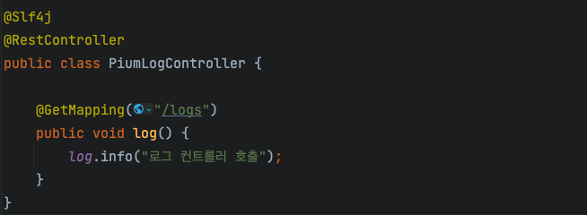

> 이 글은 우테코 피움팀 크루 '[그레이](https://github.com/Kim0914)'가 작성했습니다.

## 로깅이란 ?

우리가 처음 개발을 할 때 System.out.println(), cout << "hello world" << endl, print() 등으로 원하는 대로 동작하고 있는지 출력하곤 했을 것입니다. 또한 스프링 부트와 같은 프레임워크를 사용하면서 Log 객체를 이용해 로그를 남겨본 경험이 있을 것입니다.


이런 과정을 로깅이라고 할 수 있는데, 쉽게 말해 프로그램 동작시 발생하는 모든 일을 기록하는 행위를 말합니다.


로깅을 통해 시스템 내부에 문제가 발생한 경우 쉽게 파악할 수 있고, 사용자 로그의 경우 분석의 도구로 사용될 수 있습니다.


하지만 인터넷에서 발생하는 모든 요청에 대해 로그를 남기면 어떻게 될까요?

로그의 양이 너무나 방대해지며 원하는 로그를 찾는 비용이 점점 커질 것입니다.


어떻게 로깅을 효율적으로 할 수 있을까요?


개발자가 원하는 정보를 알맞은 수준의 로그로 남길 수 있다면 효율적으로 로깅을 할 수 있습니다.

또한 가용하고 있는 서버의 환경에 따라 적절한 로깅 전략을 가져간다면, 개발 과정에서도 로깅을 효율적으로 사용할 수 있을 것입니다.


## Logback vs Log4j2

스프링 환경의 대표적인 로깅 프레임워크는 `Logback`과 `Log4j2`가 있습니다.
각각의 장단점이 있지만 현재 스프링 부트에서는 기본적으로 logback을 사용하기 때문에 주어진 기간 내에 빠르게 적용할 수 있고, 
현재 프로젝트의 규모에서는 logback과 log4j2 성능 차이가 크지 않을 것이라고 판단해 `logback`을 사용하기로 결정했습니다.


## 스프링 부트에서 로그 남기기

스프링 부트에서는 로그를 쉽게 남길 수 있도록 편의를 제공합니다.

초기의 스프링은 JCK(Jakarta Commons Logging)을 사용해서 로깅을 구현했는데, 요즘에는 Log4j, Logback으로 스프링 부트의 로그 구현체를 사용합니다.


스프링 부트는 기본적으로 Logback 설정이 되어 있습니다. 라이브러리를 살펴보면 slf4j를 사용하고 있음을 확인할 수 있습니다.

Slf4j는 Simple Logging Facade for Java라는 뜻으로 다양한 로깅 프레임워크에 대한 추상화(인터페이스) 역할을 합니다.

Logback은 Slf4j의 구현체이며 Log4j를 토대로 만든 프레임워크입니다.

스프링 프레임워크에서도 slf4j와 Logback을 채택해서 사용하고 있습니다.


컨트롤러에서 LoggerFactory를 직접 생성해 로그를 남길 수도 있고



롬복에서 제공해 주는 @Slf4j 어노테이션을 통해 log 객체를 사용할 수 있습니다.


롬복으로 @Slf4j 어노테이션을 사용하면 컴파일 타임에 다음과 같은 코드를 생성해 준다.

```java
private static final org.slf4j.Logger log = org.slf4j.LoggerFactory.getLogger(LogExample.class);
```

지금까지 설명한 방법으로 로그를 남기면 실행 중인 애플리케이션의 콘솔에 로그가 남게 됩니다.

즉 애플리케이션을 껐다 켜게 되면 별도의 output으로 빼서 처리하지 않는 한 해당 로그들이 사라지게 됩니다.


또한 원하는 레벨 별로 로그를 확인하기 제한이 있고, 별도의 파일로 저장해 로그를 관리하기에도 제한이 있습니다.


이런 상황을 해결할 수 있는, logback을 활용한 효과적으로 로깅할 수 있는 방법을 알아봅시다.

## Logback을 활용해 효과적으로 로깅하기
스프링 부트에서 콘솔 로그의 수준을 변경하는 방법은 application.properties나 logback-spring.xml 에서 설정하는 방법이 있습니다.

application.properties로 설정하는 방법이 있지만 세세한 설정을 하는데 제한이 있습니다.

그러므로 logback-spring.xml로 관리하여 세부적인 설정을 할 수 있습니다.


스프링 부트는 로깅 설정 파일의 네이밍에 관한 규칙을 가지고 있습니다.


스프링 부트가 로딩되는 시점에 로그 설정 파일이 프로젝트 내에 존재하는지 스캔하는데


1. logback-spring.xml

2. logback-spring.groovy

3. logback.xml

4. logback.grooby


등의 파일을 스캔하고 발견하면 해당 파일에 정의된 로그 설정을 적용합니다.


여기서 logback-spring.xml은 Spring Boot에 특화된 설정 파일입니다.

이 파일을 사용하면 Spring Boot의 로깅 확장 기능을 활용할 수 있습니다. 예를 들면, 프로파일에 따른 로그 레벨 설정이나 Spring 환경 변수를 로깅 설정에 사용하는 것 같은 기능들을 활용할 수 있습니다.


만약 다른 파일 이름으로 된 로그 설정 파일을 사용하고 싶으면 logging.config 값을 변경한 후 프로그램 실행 시 JVM 인자로 설정하면 됩니다.


Logback 설정을 하기 전, 구조를 간단하게 살펴보면 Logback은 크게 3가지 Logger, Appender, Layout의 구성 요소를 가지고 있습니다.


Logger는 로깅을 수행하는 주요 객체입니다. 
로거는 이름을 가지며 주로 패키지 이름 또는 클래스 이름과 일치하게 설정합니다. 
또한 로거는 계층 구조를 가지는데 ROOT 로거는 모든 로거의 상위 로거입니다.


Appender는 로깅 이벤트를 특정 출력 대상으로 전송하는 구성 요소입니다. 
쉽게 말해 로그 메세지가 출력할 대상을 결정한다고 할 수 있습니다. 
콘솔에 출력할지, 파일에 출력할지 등등.

각 로거는 하나 이상의 Appender에 연결될 수 있습니다.


Layout은 로깅 이벤트가 어떻게 포맷되어 출력될지 결정하는 구성 요소입니다. 
사용자가 지정한 형식으로 로그 메세지를 변환한다는 것을 의미합니다. 
예를 들어 자바에서 문자열 포맷팅과 비슷하다고 할 수 있습니다.
  
  
이제 로그를 남기는 방법을 알아보겠습니다.

## logback-spring.xml 작성 & 환경 별 로그 작성

### 1. **logback-spring.xml 생성**
```html
<?xml version="1.0" encoding="UTF-8"?>
<configuration>
 <!-- 추가할 기능을 작성할 곳. -->
</configuration>
```
### 2. **appender와 pattern을 이용해 로그 출력 위치와 출력되는 형식 지정**
```html
<?xml version="1.0" encoding="UTF-8"?>
<configuration>
    <conversionRule conversionWord="clr" converterClass="org.springframework.boot.logging.logback.ColorConverter"/>

    <property name="CONSOLE_LOG_PATTERN"
              value="%d{yyyy-MM-dd HH:mm:ss.SSS} [%thread] %clr(%5level) %cyan(%logger) - %msg%n"/>

    <appender name="CONSOLE" class="ch.qos.logback.core.ConsoleAppender">
        <encoder>
            <pattern>${CONSOLE_LOG_PATTERN}</pattern>
        </encoder>
    </appender>

    <root level="INFO">
        <appender-ref ref="CONSOLE"/>
    </root>
</configuration>
```

property를 이용해 변수처럼 선언할 수 있습니다. 마치 자바에서 상수화를 시키는 것과 같습니다.

콘솔에는 색을 포함해 이쁘게 출력하기 위해 스프링 부트에서 제공하는 Logback 컨버터 ColorConverter 태그를 선언합니다.


작성한 로그 패턴 "%d{yyyy-MM-dd HH:mm:ss.SSS} [%thread] %clr(%5level) %cyan(%logger) - %msg%n"을 살펴보면


- %d{yyyy-MM-dd HH:mm:ss.SSS}: 로그 이벤트가 발생한 날짜와 시간을 yyyy-MM-dd HH:mm:ss.SSS 형식으로 표시.


- [%thread]: 현재 로그 이벤트를 발생시킨 스레드의 이름을 표시.


- %clr(%5level): clr 변환 키워드를 사용하여 로그 레벨 (INFO, ERROR 등)을 적절한 색상으로 출력.


- %cyan(%logger): 로거 이름 (%logger)을 시안색 (cyan)으로 출력.


- %msg: 로그 메시지의 내용을 표시.


- %n: 줄 바꿈 문자.


  
appender의 이름은 CONSOLE로 지정하고 pattern은 앞서 property에서 정의한 CONSOLE_LOG_PATTERN을 사용합니다.


마지막으로 로거 레벨을 INFO로 설정하고 사용할 appender를 appender-ref 태그를 이용해 명시합니다.


위와 같이 출력됨을 확인할 수 있습니다.

  
   
### 3. **환경 별로 로그 남기는 방법 나누기**
   
현재 저희 팀은 운영 서버, 개발 서버를 나누어 가용 중에 있고 팀원들이 로컬로 개발하는 환경까지 총 3개의 환경에서 서버를 운영하고 있습니다.


로컬 서버의 경우 DB로 날아가는 쿼리를 모두 확인할 필요가 있고, 필요한 경우 DEBUG 수준의 로그도 확인하는 상황이 생깁니다.

개발 서버의 경우 실제 사용자를 기반으로 한 로그가 아닌, 개발 단계에서 필요한 쿼리 확인, 개발자가 의도한 예외가 발생하는지 등의 정보가 필요합니다.

운영 서버의 경우 쿼리나 의도한 예외를 확인하는 로그보다는, 예상하지 못한 에러(NPE, ISE)등이 발생했을 때 에러에 대한 로그가 필요합니다.


또한 개발 서버, 운영 서버는 콘솔 output이 아닌 별도의 파일에 로그를 저장해야 합니다.


그러므로 각 환경마다 로그 전략을 다르게 가져가야 합니다.

```html
<?xml version="1.0" encoding="UTF-8"?>
<configuration>
    <conversionRule conversionWord="clr" converterClass="org.springframework.boot.logging.logback.ColorConverter"/>

    <property name="CONSOLE_LOG_PATTERN"
              value="%d{yyyy-MM-dd HH:mm:ss.SSS} [%thread] %clr(%5level) %cyan(%logger) - %msg%n"/>
    <property name="FILE_LOG_PATTERN" value="%d{yyyy-MM-dd HH:mm:ss.SSS} [%thread] %5level %logger - %msg%n"/>
    
    <appender name="CONSOLE" class="ch.qos.logback.core.ConsoleAppender">
        <encoder>
            <pattern>${CONSOLE_LOG_PATTERN}</pattern>
        </encoder>
    </appender>
    
    <appender name="FILE-INFO" class="ch.qos.logback.core.rolling.RollingFileAppender">
        <encoder>
            <pattern>${FILE_LOG_PATTERN}</pattern>
        </encoder>
        <rollingPolicy class="ch.qos.logback.core.rolling.SizeAndTimeBasedRollingPolicy">
            <fileNamePattern>./log/pium-dev-%d{yyyy-MM-dd}.%i.log</fileNamePattern>
            <maxFileSize>50MB</maxFileSize>
            <maxHistory>30</maxHistory>
            <totalSizeCap>1GB</totalSizeCap>
        </rollingPolicy>
    </appender>

    <appender name="FILE-ERROR" class="ch.qos.logback.core.rolling.RollingFileAppender">
        <filter class="ch.qos.logback.classic.filter.LevelFilter">
            <level>ERROR</level>
            <onMatch>ACCEPT</onMatch>
            <onMismatch>DENY</onMismatch>
        </filter>
        <encoder>
            <pattern>${FILE_LOG_PATTERN}</pattern>
        </encoder>
        <rollingPolicy class="ch.qos.logback.core.rolling.SizeAndTimeBasedRollingPolicy">
            <fileNamePattern>./log/pium-prod-%d{yyyy-MM-dd}.%i.log</fileNamePattern>
            <maxFileSize>50MB</maxFileSize>
            <maxHistory>30</maxHistory>
            <totalSizeCap>3GB</totalSizeCap>
        </rollingPolicy>
    </appender>
    
    <root level="INFO">
        <appender-ref ref="CONSOLE"/>
    </root>
</configuration>
```

우선 파일로 출력하기 위한 property와 appender를 추가합니다. 
Property는 콘솔에서 지정한 방법과 동일하지만 파일에 저장하는 경우에는 색이 들어갈 필요가 없고, 색 코드가 들어가면 글자가 깨지는 현상이 발생합니다. 
그러므로 색을 제거한 패턴을 작성했습니다.

Appender의 경우 File로 로그를 남기기 위해 RollingFileAppender를 사용했습니다. 
INFO와 ERROR로 appender를 구분해 레벨 수준에 따라 별도의 appender로 분리했습니다. 
RollingFileAppender는 maxFileSize와 maxHistory, totalSizeCap 설정을 통해 한 로그 파일의 최대 크기, 며칠 동안 보관할지, 모든 로그 파일(./logs/..)의 크기를 설정할 수 있습니다.


환경 별로 분리하기에 앞서, 각 appender 들은 분리 하여 설정 파일로 저장해 두면 재사용을 할 수 있습니다.

위에서 작성한 console, file-info, file-error appender 들을 각각의 xml 파일로 분리합니다.

자바에서 클래스로 분리하는 것과 동일한 맥락입니다.

**console-appender.xml**
```html
<included>
    <appender name="CONSOLE" class="ch.qos.logback.core.ConsoleAppender">
        <encoder>
            <pattern>${CONSOLE_LOG_PATTERN}</pattern>
        </encoder>
    </appender>
</included>
```

**file-info-appender.xml**
```html
<included>
    <appender name="FILE-INFO" class="ch.qos.logback.core.rolling.RollingFileAppender">
        <encoder>
            <pattern>${FILE_LOG_PATTERN}</pattern>
        </encoder>
        <rollingPolicy class="ch.qos.logback.core.rolling.SizeAndTimeBasedRollingPolicy">
            <fileNamePattern>./log/pium-dev-%d{yyyy-MM-dd}.%i.log</fileNamePattern>
            <maxFileSize>50MB</maxFileSize>
            <maxHistory>30</maxHistory>
            <totalSizeCap>1GB</totalSizeCap>
        </rollingPolicy>
    </appender>
</included>
```

**file-error-appender.xml**
```html
<included>
    <appender name="FILE-ERROR" class="ch.qos.logback.core.rolling.RollingFileAppender">
        <filter class="ch.qos.logback.classic.filter.LevelFilter">
            <level>ERROR</level>
            <onMatch>ACCEPT</onMatch>
            <onMismatch>DENY</onMismatch>
        </filter>
        <encoder>
            <pattern>${FILE_LOG_PATTERN}</pattern>
        </encoder>
        <rollingPolicy class="ch.qos.logback.core.rolling.SizeAndTimeBasedRollingPolicy">
            <fileNamePattern>./log/pium-prod-%d{yyyy-MM-dd}.%i.log</fileNamePattern>
            <maxFileSize>50MB</maxFileSize>
            <maxHistory>30</maxHistory>
            <totalSizeCap>3GB</totalSizeCap>
        </rollingPolicy>
    </appender>
</included>
```

이제 환경별로 로그 전략을 분리하겠습니다.

```html
<?xml version="1.0" encoding="UTF-8" ?>
<configuration>
    <include resource="org/springframework/boot/logging/logback/defaults.xml"/>
    <conversionRule conversionWord="clr" converterClass="org.springframework.boot.logging.logback.ColorConverter"/>

    <property name="CONSOLE_LOG_PATTERN"
              value="%d{yyyy-MM-dd HH:mm:ss.SSS} [%thread] %clr(%5level) %cyan(%logger) - %msg%n"/>
    <property name="FILE_LOG_PATTERN" value="%d{yyyy-MM-dd HH:mm:ss.SSS} [%thread] %5level %logger - %msg%n"/>

    <!--local-->
    <springProfile name="local">
        <include resource="console-appender.xml"/>

        <root level="INFO">
            <appender-ref ref="CONSOLE"/>
        </root>
    </springProfile>

    <!--dev-->
    <springProfile name="dev">
        <include resource="file-info-appender.xml"/>

        <root level="INFO">
            <appender-ref ref="FILE-INFO"/>
        </root>

        <logger level="DEBUG" name="org.hibernate.SQL">
            <appender-ref ref="FILE-INFO"/>
        </logger>

        <logger level="TRACE" name="org.hibernate.type.descriptor.sql.BasicBinder">
            <appender-ref ref="FILE-INFO"/>
        </logger>
    </springProfile>

    <!--prod-->
    <springProfile name="prod">
        <include resource="file-error-appender.xml"/>

        <root level="ERROR">
            <appender-ref ref="FILE-ERROR"/>
        </root>
    </springProfile>

</configuration>
```

springProfile 태그를 이용해 local, dev, prod로 분리할 수 있습니다.

include 태그를 이용해 어떤 appender를 사용할지 추가합니다. 자바에서 import와 동일하다고 생각하면 됩니다.

이후 각 profile 별로 로그 레벨을 설정하고 필요한 appender를 appender-ref 태그에 추가하면 됩니다.


개발 서버의 경우 쿼리와 쿼리에 바인딩되는 파라미터를 확인하기 위해 DEBUG, TRACE 레벨의 appender를 추가해 줬습니다.


로컬은 local로 profile을 구분해도 되고, 아무런 profile을 선언하지 않으면 default로 해당 설정을 읽기 때문에 구분하지 않아도 됩니다.

만약 local로 profile을 설정한 경우에는 인텔리제이에서 아래와 같이 설정해야 콘솔 로그를 확인할 수 있습니다.


dev, prod 환경에서의 로깅을 인텔리제이로 확인하고 싶은 경우에는 동일하게 profiles에 입력하고 RUN 하면 됩니다.

### Reference
https://www.baeldung.com/logback

https://www.youtube.com/watch?v=1MD5xbwznlI

https://www.youtube.com/watch?v=JqZzy7RyudI 

