> 이 글은 우테코 피움팀 크루 '[그레이](https://github.com/Kim0914)'가 작성했습니다.

## 사건의 발단
현재 구동 중인 개발 서버와 운영 서버를 캠퍼스외의 장소에서 빌드해 배포했을 때, 내부 로그를 확인할 수 없는 문제가 있었습니다.

인스턴스 내부에 발생한 로그나, nginx에 남겨진 로그를 확인하기 위해서는 캠퍼스에서 직접 ssh 연결을 통해 접속해서 확인해야 합니다.

서버 외부에서도 인스턴스 상태를 확인해야 하는 필요성이 느껴졌고, 모니터링 툴을 도입하기로 결정했습니다.


CloudWatch는 AWS에서 제공하는 모니터링 툴입니다.


기존에 프로메테우스와 그라파나를 활용해 모니터링을 할 수 있었지만, 현재 보유 중인 서버가 모두 가용 중이고 가용 중인 서버에 모니터링 툴을 설치하는 경우 다른 서버들이 영향을 받을 수 있기 때문에 별도의 툴이 필요했습니다.


그래서 EC2 인스턴스를 추가로 생성해 모니터링용 서버를 구축할 수 있었으나, 비용(금전)적으로 cloud watch를 사용하는 것이 훨씬 비용 절감이 되고 적용과정도 비교적 간편하기 때문에 AWS CloudWatch를 사용하기로 결정했습니다.


## CloudWatch 적용 과정
클라우드 와치를 인스턴스에 적용하기 위해서는 권한이 필요합니다.


IAM을 발급 받는 방법은 다른 블로그에서 쉽게 찾을 수 있기 때문에 생략하고, 적용하는 방법부터 알아보겠습니다.


*1. 인스턴스 대시보드로 이동해  인스턴스 우클릭 -> 보안 -> IAM 역할 수정을 누르고 발급받은 IAM을 추가합니다.**

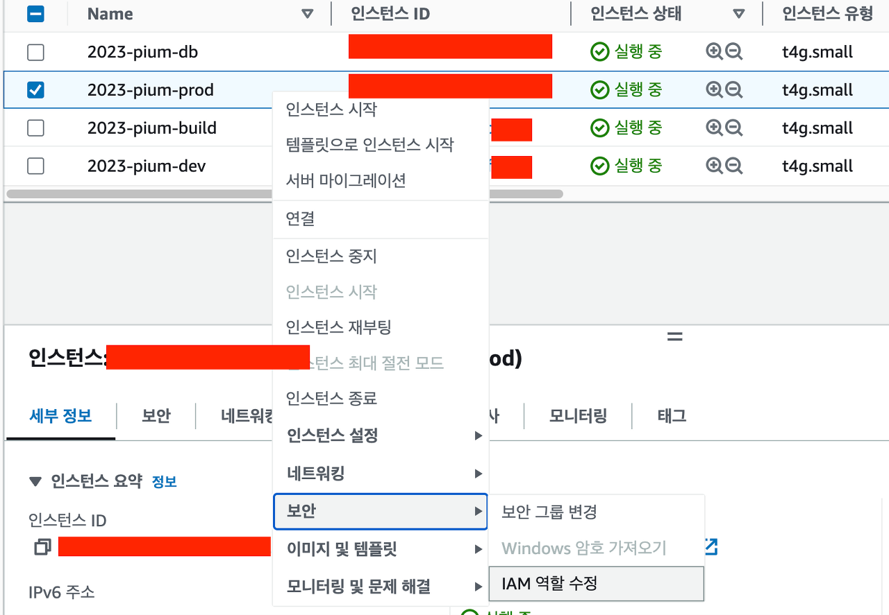

**2. CloudWatch 탭으로 이동해 대시보드 생성을 누르고 원하는 이름을 자유롭게 설정하면 됩니다.**


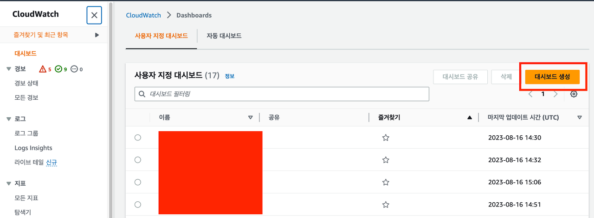


대시보드가 처음 생성되면 아래와 같은 화면을 확인할 수 있습니다.

여기서 왼쪽 하단에 있는 로그, 지표를 활용하여 인스턴스의 상태를 확인할 수 있습니다.

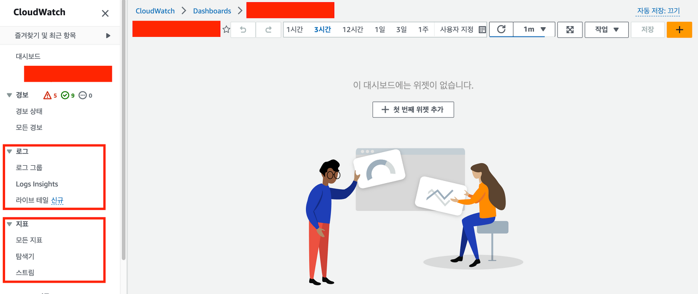

*3. 지표 추가하기**

지표 -> 모든 지표를 누르면 아래와 같이 인스턴스 탭을 확인할 수 있습니다. 인스턴스 이외에도 다른 탭도 확인할 수 있습니다.
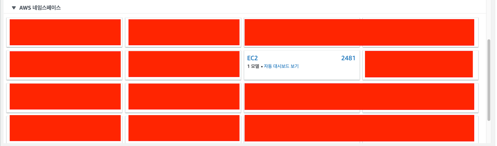

EC2 탭을 누르고 들어오면 아래와 같은 화면을 볼 수 있고 인스턴스별 지표를 확인해야 하기 때문에 인스턴스별 지표를 누릅니다.

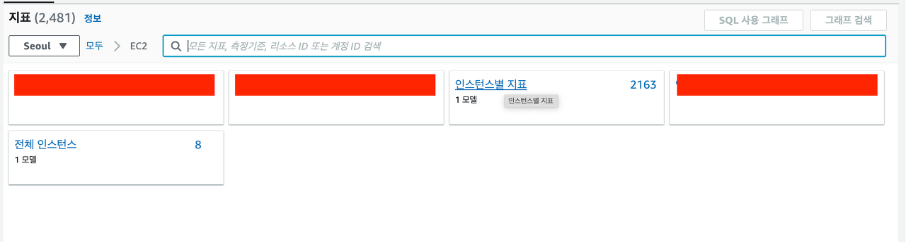

인스턴스 지표를 누르면 현재 AWS에 가동 중인 모든 인스턴스를 확인할 수 있습니다.

상단에 있는 검색 탭에 관측하고 싶은 인스턴스의 ID를 입력합니다. 예를 들면 i-0123456789 가 됩니다.

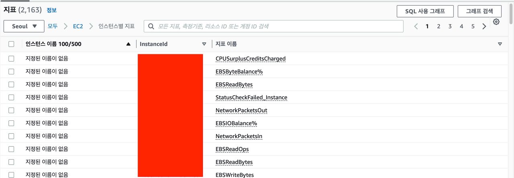

**4. 원하는 지표 확인하기**

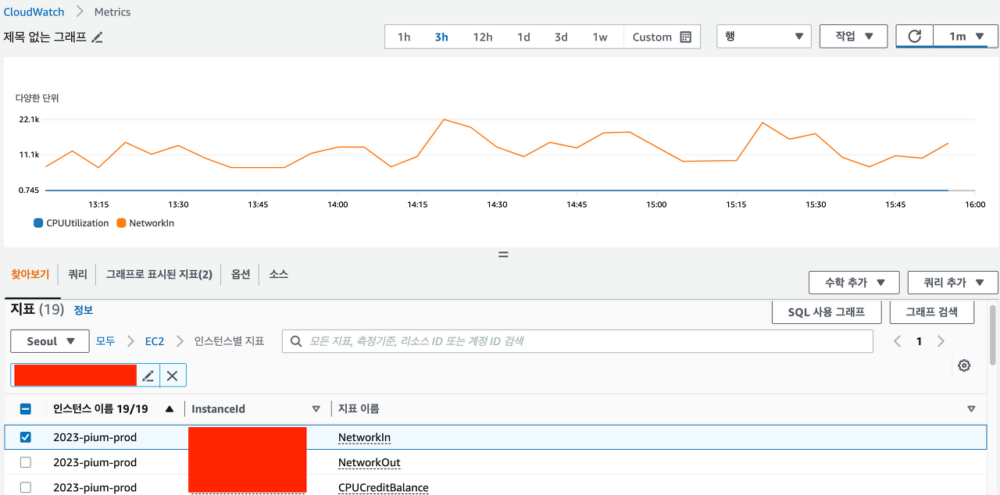

**5. 대시보드에 지표 추가하기**

다시 대시보드로 돌아와서 관측하고 싶은 지표를 추가합니다.

우측 상단에 있는 + 버튼을 누르면 지표나 로그를 추가하는 화면을 볼 수 있습니다.


어떤 그래프로 확인할 지 그래프를 선택한 후 다음을 눌러 앞 서 모든 지표에서 확인했던 방법과 동일하게 지표를 선택합니다.

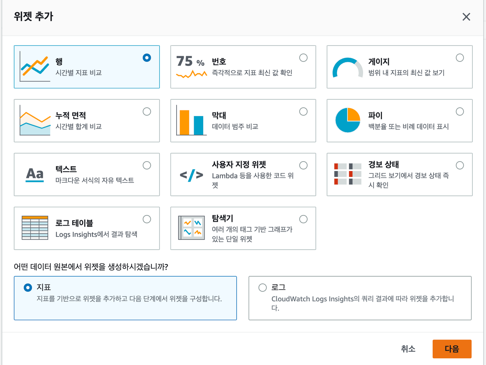

위젯 생성 버튼을 눌러 위젯을 생성합니다.

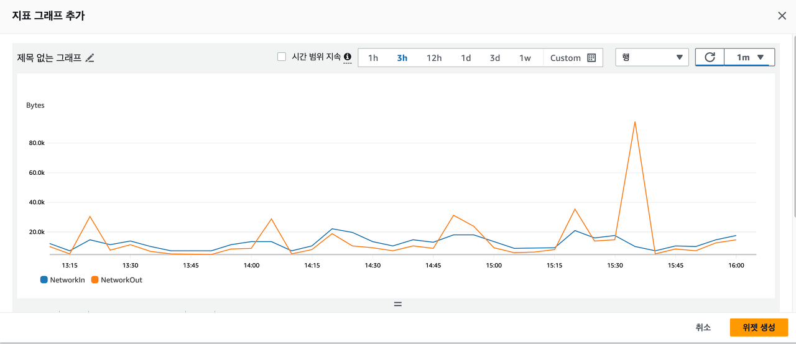

추가된 위젯을 확인하고 저장버튼을 눌러 저장합니다.

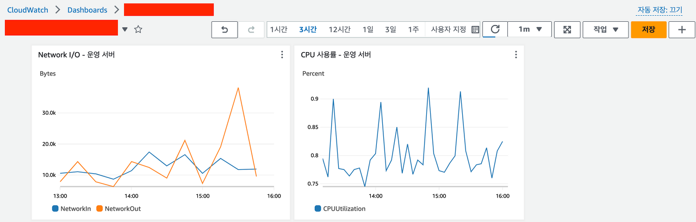

## CloudWatch Agent 설치
CloudWatch에서 기본적으로 제공하는 정보는 CPU, Network I/O 등과 같은 기본적인 정보만 제공합니다.

인스턴스의 메모리, 스왑 메모리, 디스크 I/O 등 보다 자세한 정보를 확인하기 위해서는 `CloudWatch Agent`를 설치해야 합니다.


AWS CloudWatch 공식 문서에 설치 방법이 자세히 잘 나와있습니다.


저희 팀은 `Ubuntu22.04 ARM`을 사용 중이므로, Ubuntu22.04 ARM 기준의 설치 방법을 알려드리겠습니다.

CloudAgent 패키지를 다운로드하는 과정 이외에는 다른 환경도 동일하게 적용됩니다.

**1.ARM or AMD 확인**


우선 사용하고 있는 인스턴스의 아키텍처를 확인합니다.

```java
lscpu | grep "Vendor ID"
```


**2. Cloudwatch Agent 다운**


다음 명령어를 통해 Agent를 다운로드합니다.

```shell
sudo wget https://s3.amazonaws.com/amazoncloudwatch-agent/ubuntu/arm64/latest/amazon-cloudwatch-agent.deb
```

**여기서 주의할 점 !**


클라우드 와치를 다운받은 후 설정을 마치고 적용하는 과정에서 알 수 없는 **403 예외가 발생**했었습니다.


[processors.ec2tagger] ec2tagger: unable to describe ec2 tags for initial retrieval: unauthorizedoperation: you are not authorized to perform this operation.


구글링을 해보니 IAM 권한과 관련된 예외인 것 같았는데, IAM에 접근할 수 있는 권한이 없어서 몇 시간 동안 헤매었습니다..


결론은 `sudo`와 함께 패키지를 설치하니 해결되었습니다. sudo ! 

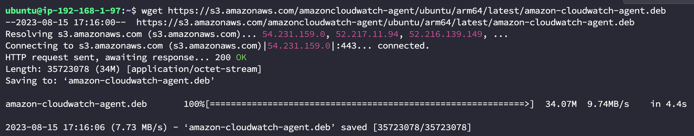


**3. 패키지를 디렉토리로 압축 해제**


```shell
sudo dpkg -i -E ./amazon-cloudwatch-agent.deb
```

**4. CloudWatch Agent시작**


압축 해제까지 모두 마치면 클라우드 와치를 적용하는 일만 남았습니다.

여기서 클라우드 와치를 적용할 수 있는 방법은 2가지가 있는데 직접 config.json 파일을 생성하거나 wizard를 이용하여 시작할 수 있습니다. Wizard로 시작하게 되면 기본 config.json 파일을 생성해 주기 때문에 저는 wizard로 시작했습니다.


`Wizard`를 실행하는 명령어입니다.

```shell
sudo /opt/aws/amazon-cloudwatch-agent/bin/amazon-cloudwatch-agent-config-wizard
```

명령어를 입력하면 아래와 같이 질문에 대한 답을 입력하는 문구가 나옵니다.

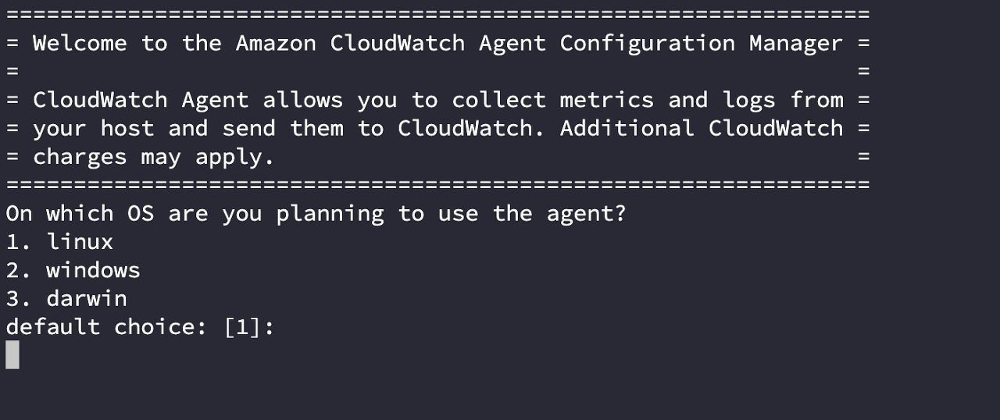

웬만한 설정은 default 설정을 따라기시면 됩니다.

한 번씩 읽어보고 상황에 맞는 설정을 해주는 것이 좋습니다.

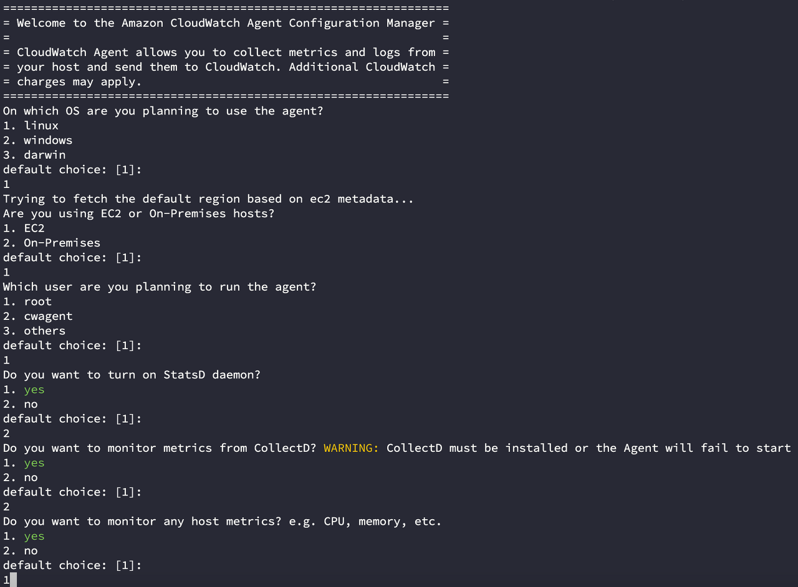

설정을 진행하다 보면 **현재까지 작성된 config 파일 정보를 확인할 수 있습니다.**

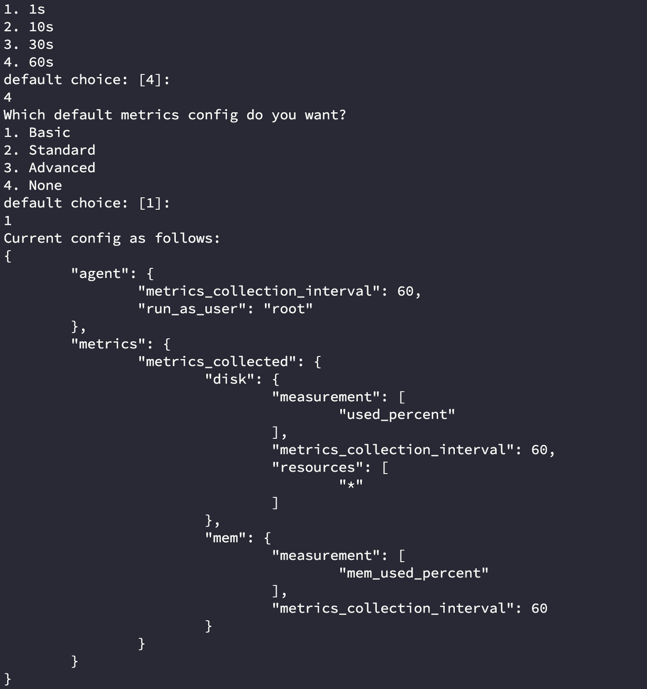

계속해서 진행하다 보면 `Do you want to monitor any log files?`이라는 질문이 나옵니다.

인스턴스 내에 **로그를 클라우드 워치로 전송하기를 원하면 1, 그렇지 않으면 2**를 누르면 됩니다.


**지금 설정하지 않아도, 이후에 파일로 가서 직접 수정할 수 있기 때문에 크게 중요하지 않습니다 !!**


Do you want to store the config in the SSM parameter store?


질문에는 `2. no` 를 선택하시면 됩니다.


설정이 끝나면 `/opt/aws/amazon-cloudwatch-agent/bin/` 위치에 `config.json` 파일이 생성됩니다.


config.json 파일을 열어봅시다.

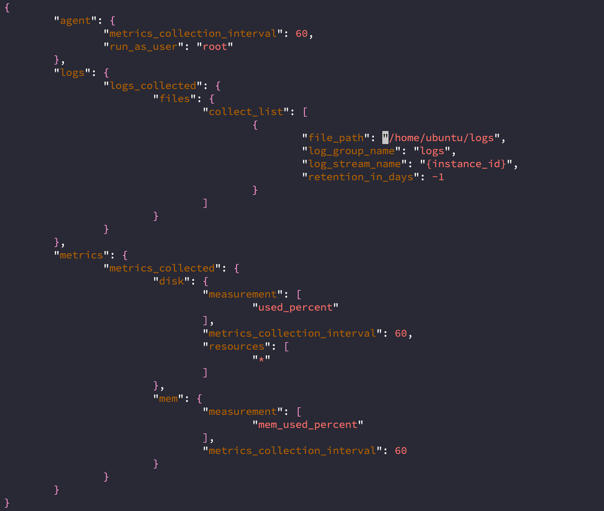

크게 `agent`, `logs`, `metrics`로 나뉘는데 agent는 계정과 권한에 관련된 부분이고 logs는 로그와 관련된 부분, metrics는 인스턴스 내의 모니터링과 관련된 부분입니다. 자세한 설정은 CloudWatch docs를 참고하시면 됩니다 !


metrics에는 mem 이외에 cpu, disk, swap 등이 있습니다.


https://docs.aws.amazon.com/ko_kr/AmazonCloudWatch/latest/monitoring/CloudWatch-Agent-Configuration-File-Details.html#CloudWatch-Agent-Configuration-File-Metricssection

관측하고 싶은 자원에 대한 설정을 모두 마친 후 아래의 명령어를 실행해 CloudWatch Agent를 실행합니다.

```shell
sudo /opt/aws/amazon-cloudwatch-agent/bin/amazon-cloudwatch-agent-ctl -a fetch-config -m ec2 -c file:/opt/aws/amazon-cloudwatch-agent/bin/config.json -s
```

/opt/aws/amazon-cloudwatch-agent/logs에 있는 amazon-cloudwatch-agent.log를 확인하면 정상적으로 실행되는지 로그를 확인할 수 있습니다.

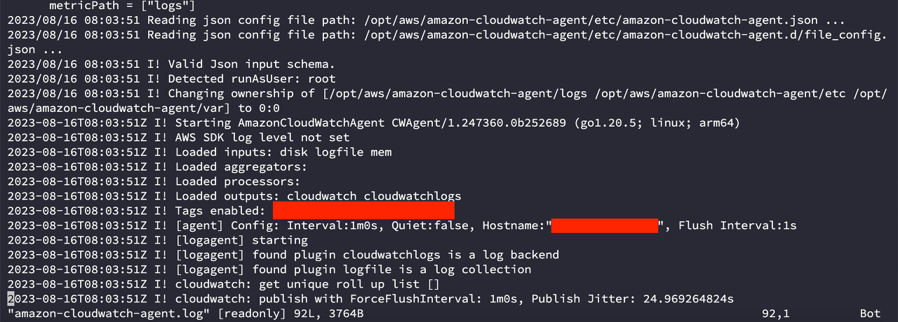

**5. 대시보드에 추가**


대시보드로 돌아와 위젯 추가를 눌러 지표를 확인합니다.

아래와 같이 사용자 지정 네임스페이스 구역을 확인합니다. 저는 config.json을 설정할 때 네임스페이스를 따로 설정하지 않았으므로 기본인 CWAgent에 추가됩니다.

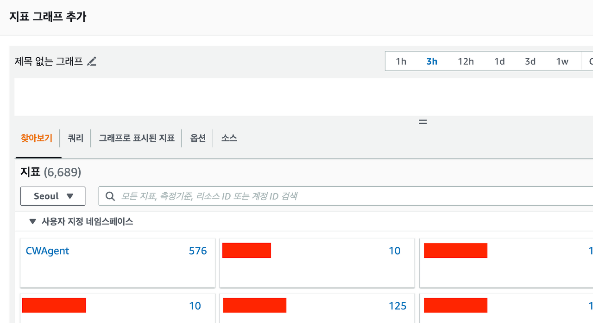

CWAgent -> host로 이동해 hostname을 보면 인스턴스 아이디로 설정되어 있습니다.

본인의 인스턴스 아이디를 찾아서 위젯으로 추가하면 됩니다.

**6. CloudWatch로 로그 관측하기**

인스턴스 내에서 남기고 있는 로그를 클라우드 워치를 이용해 관측할 수 있습니다. 예를 들어 스프링 서버에서 남기고 있는 로그, NginX에서 남기고 있는 로그등을 클라우드 워치로 관측할 수 있습니다.


지표를 설정했던 것과 동일하게 config.json 파일에 원하는 로그 파일을 설정하면 됩니다.

logs -> logs_collected -> files -> collect_list의 value 값에 로그 파일 위치, 로그 그룹 이름, 로그 스트림 이름을 설정합니다.

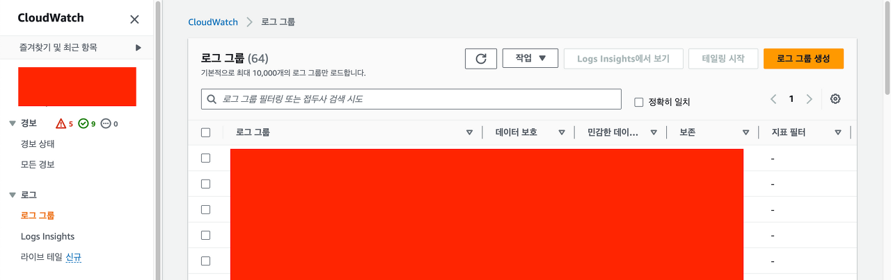
로그 그룹은 클라우드 워치 왼쪽의 로그 -> 로그 그룹에서 생성할 수 있습니다.

로그 스트림 이름은 config.json 파일에 명시한 log_stream_name이 로그 그룹에 존재하지 않으면 자동으로 생성합니다.


- file_path: 인스턴스 내에 로그 파일의 경로

- log_group_name: CloudWatch에서 생성한 로그 그룹 이름

- log_stream_name: 원하는 로그 스트림 이름. 로그 스트림으로 클라우트 와치에서 필터링할 수 있습니다.

```json
{
        "agent": {
                "metrics_collection_interval": 60
        },
        "logs": {
                "logs_collected": {
                        "files": {
                                "collect_list": [
                                        {
                                                "file_path": "/home/ubuntu/log/pium-prod-**.log",
                                                "log_group_name": "2023-pium-prod",
                                                "log_stream_name": "spring-prod-log"
                                        },
                                        {
                                                "file_path": "/var/log/nginx/access.log",
                                                "log_group_name": "2023-pium-prod",
                                                "log_stream_name": "nginx-access-log"
                                        },
                                        {
                                                "file_path": "/var/log/nginx/error.log",
                                                "log_group_name": "2023-pium-prod",
                                                "log_stream_name": "nginx-error-log"
                                        }
                                ]
                        }
                }
        }
}
```

config.json 파일을 수정한 후 다시 **에이전트 실행 명령어를 입력해 수정된 config 파일 내용을 적용시킵니다.**

```shell
sudo /opt/aws/amazon-cloudwatch-agent/bin/amazon-cloudwatch-agent-ctl -a fetch-config -m ec2 -c file:/opt/aws/amazon-cloudwatch-agent/bin/config.json -s
```

정상적으로 적용되면 로그 그룹 내에 로그 스트림이 생성되는 것을 확인할 수 있습니다.

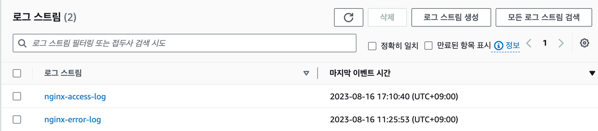

**생성된 로그 스트림을 바탕으로 대시보드에 로그 위젯을 추가할 수 있습니다.**

지표 대신 로그를 선택해서 추가할 수 있습니다.

**로그 별로 위젯을 구분하려면 쿼리를 실행할 때 filter 옵션을 추가**해 주시면 됩니다.

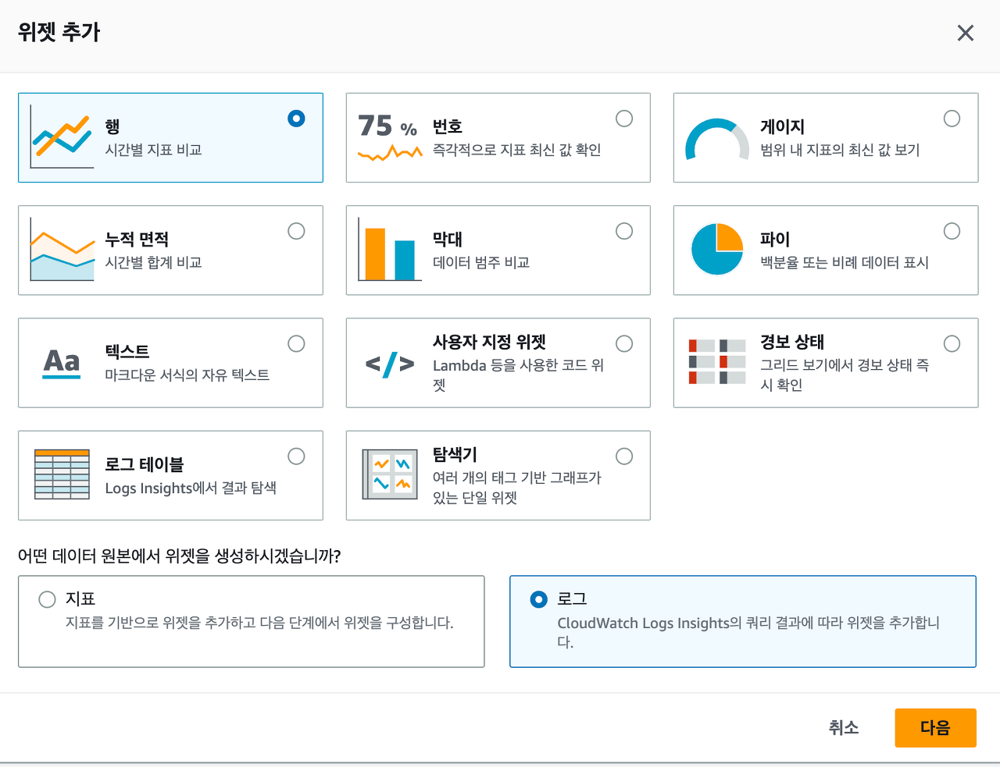
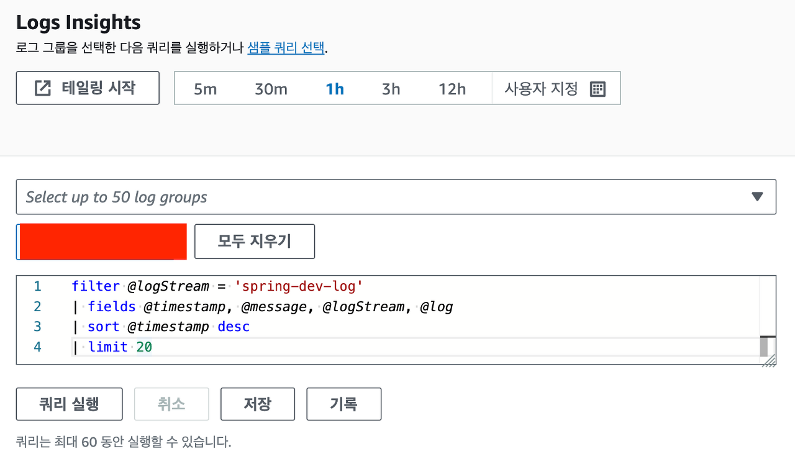
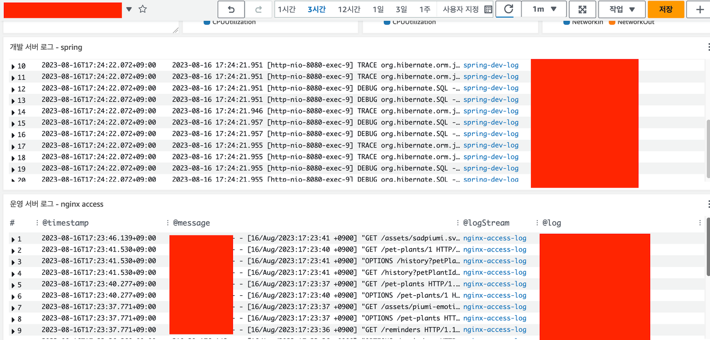

로그가 정상적으로 출력되는 것을 확인할 수 있습니다.

