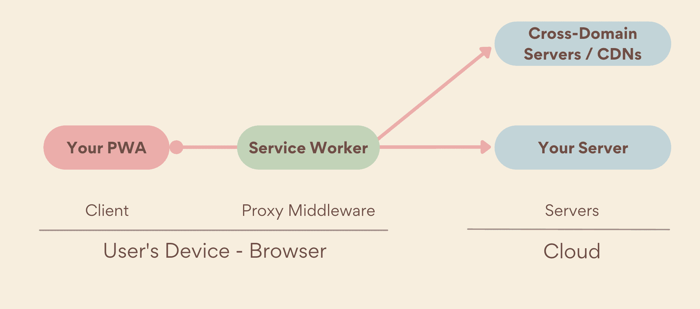
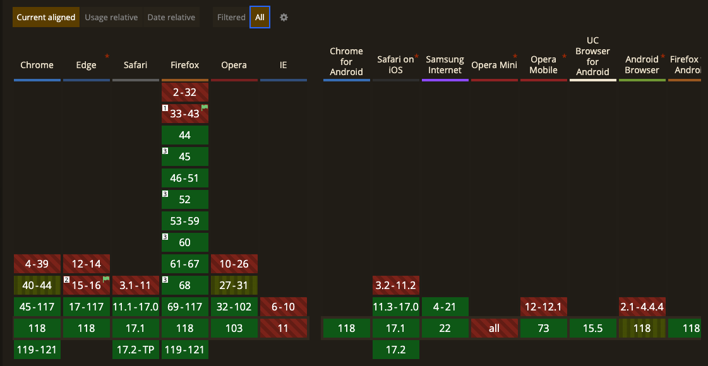
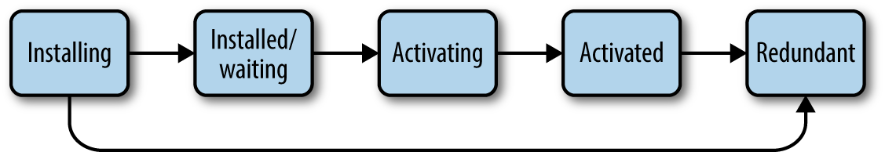
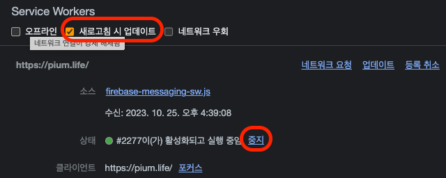

> 이 글은 우테코 피움팀 크루 '[클린](https://github.com/hozzijeong)'가 작성했습니다.

# Service Worker

서비스 워커는 웹 어플리케이션과 브라우저, 네트워크 사이에 위치한 프록시 서버 역할을 하고 있습니다. 서비스 워커의 주 목적은 **효과적인 오프라인 경험을 만드는 것입니다.** 서비스 워커는 보안이 중요하기 때문에 로컬 호스트를 제외한다면 https 통신이 가능한 상태에서만 동작합니다.

서비스 워커는 웹과는 다른 독립적인 환경 레이어에서 동작하기 때문에 DOM객체나 window 객체에 접근 할 수 없습니다. 또한 캐시 저장소를 통해 저장된 리소스 사용이 가능합니다. 이에 따라 일부 기능에는 제한이 있지만 어느정도 동작 구현이 가능합니다.




> 사용자가 오프라인 상태일 때를 포함하여 앱이 서비스 워커 범위에 포함되는 리소스를 요청하면 서비스 워커가 네트워크 프록시 역할을 하여 요청을 가로챕니다. 그런 다음, 일반적으로 서비스 워커가 없는 경우와 마찬가지로 Cache Storage API를 통해 캐시로부터 리소스를 제공할지, 아니면 로컬 알고리즘에서 리소스를 생성할지 결정할 수 있습니다. 이를 통해 플랫폼 앱에서 제공하는 것과 유사한 환경을 제공할 수 있으며 완전히 오프라인으로 작동할 수도 있습니다. - [web.dev](https://web.dev/learn/pwa/service-workers?hl=ko)
> 

## 범위

서비스 워커의 범위는 폴더에 따라 결정됩니다. 만약 `example.com/pwa/sw.js`에 있는 서비스 워커는 pwa 경로 이하에 있는 모든 탐색에 대해 프록시 제어를 하고 있습니다. 또한 범위당 하나의 서비스 워커만을 제공하고 있기 때문에 활성화 및 실행중인 탭에 관계 없이 하나의 인스턴스만 사용 가능합니다. *위와 같은 특성때문에 PWA와 관련된 모든 요청을 가로챌수 있도록 서비스 워커의 범위는 앱 루트에 최대한 가깝게 설정하는 것이 좋습니다.* 

## 등록

서비스 워커를 등록하기 전에 우선 서비스를 PWA에 먼저 등록해야 합니다. 만약 PWA에 처음 방문한 것이라면 네트워크 요청을 서비스 워커가 아닌 실제 서버와 합니다.

Service Worker API를 사용하는지를 먼저 확인한 다음에 등록을 할 수 있습니다. 모든 브라우저에서 Service Worker API를 제공하는 것이 아니기 때문에 필요한 조치입니다.




```jsx
if ('serviceWorker' in navigator) {
   navigator.serviceWorker.register("/serviceworker.js");
}
```

Service Worker API를 통해 서비스 워커를 등록한다면 [ServiceWorkerGlobalScope](https://developer.mozilla.org/en-US/docs/Web/API/ServiceWorkerGlobalScope)가 형성이 됩니다. 이것은 기본적으로 DOM 없이도 main script execution thread를 실행할 수 있는 작업자입니다.

## 생명 주기

서비스 워커의 생명주기는 브라우저와는 다르게 동작합니다. 그렇기 때문에 브라우저가 닫혀도 백그라운드에서 데이터를 다운 받을 수 있고 푸시 알림을 전송받을 수 있습니다. 즉, 사용자가 같은 브라우저로 재접속 해도 이전에 사용하던 서비스 워커는 그대로 존재합니다. 

브라우저가 닫혀 있는 상태에서도 서비스 워커는 계속해서 돌아간다면 과연 그 리소스 낭비는 어떻게 관리할까요? 서비스 워커는 사용하지 않을때는 잠시 중지되어 있습니다. 잠시 중지되어 있다가 요청이 들어온다면 그 때 잠에서 깬 다음 자신이 할 일을 하는 것 뿐입니다. 

그렇다면 서비스 워커의 생명 주기에 대해서 한번 알아보겠습니다.




### Installing

서비스 워커를 `register`할 때 설정한 ServiceWorker 파일은 이제 본격적으로 서비스 워커를 설치합니다. 여기서 `install`이벤트를 통해 설치하게 되는데, 이 이벤트는 서비스 워커가 받는 첫 번째 이벤트이면서 단 한번만 발생합니다. 

```jsx
// serviceworker.js

self.addEventListener("install", (event) => {
	event.waitUntil(
    caches.open(assetCacheName).then((cache) => {
      cache.addAll([
        '/',
      ]);
    })
})
```

> 여기서 self는 `register`할 때 생성된 `ServiceWorkerGlobalScope`를 의미합니다.
> 

`waitUntill`이라는 메서드는 프라미스 형태로, 설치 성공 또는 실패를 나타냅니다. 해당 값이 반환되기 전까지는 서비스 워커는 설치되지 않습니다. 만약에 `waitUntill`이 거절되게 된다면 설치는 실패하게 되고 그 뒤로는 아무것도 할 수 없게됩니다. 

### Installed/waiting

성공적으로 `install`됐다면 설치된 상태로 진입됩니다. 다른 서비스 워커가 이 앱을 제어하지 않는한 즉시 activating 상태로 변경됩니다. 

waiting 상태는 서비스 워커 업데이트 에서 주로 다루게 됩니다.

### Activating

서비스 워커가 클라이언트를 제어할 수 있고, `push` 및 `sync` 등 서비스 워커의 기능을 할 수 있는 함수 이벤트를 처리할 준비가 된다면 `activate`이벤트가 발생됩니다.  `activate`이벤트에서는 현재 활성화 된 캐시에서 필요 없는 캐시들은 지울 필요가 있습니다. (현재 활성화 된 기준을 보기 위해서는 결국 서비스 워커에 버저닝이 필요한 것을 알 수 있습니다.)

```jsx
const assetCacheName = `assets-${version}`;

self.addEventListener('activate', (event) => {
  event.waitUntil(
    caches.keys().then((cacheNames) => {
      return Promise.all(
        cacheNames.map((cacheName) => {
          if (cacheName !== assetCacheName) {
            return caches.delete(cacheName);
          }
        })
      );
    })
  );

  // 활성화 즉시 클라이언트를 제어한다.(새로고침 불필요)
  self.clients.claim();
});
```

<aside>
💡 서비스 워커가 처음 등록될 때 페이지는 다음 로드까지 사용이 되지 않는데, `clients.claim()`메서드를 사용하게 된다면 클라이언트를 즉시 제어할 수 있도록 합니다.

</aside>

`activate`이벤트는 활성화 되기 전에 처리가 되고 있으므로 `waitUntill` 함수를 통해서 해당 서비스 워커가 제대로 동작하기 전에 사전 작업을 할 수 있습니다. 이제 `waituntill`함수가 성공한다면 activated로 넘어가게 됩니다.

### Activated

활성화가 되고 난 다음에는 페이지 제어와 `fetch`, `push`, `sync`와 같은 기능 이벤트 사용이 가능합니다. 서비스 워커는 페이지 로드가 되기 전에만 페이지 제어가 가능합니다. 즉, 서비스 워커가 활성화되기 전에 로드가 시작된 페이지는 제어할 수 없습니다. (항상 뒤에서만 움직이는 다크나이트 같은 존재랄까…?)

<aside>
💡 **서비스 워커가 로드가 시작된 후에 페이지를 제어할 수 없는 이유**
비디오 파일 로드가 너무 오래걸려서, 미리 비디오가 호스팅 된 서버에서 링크를 제공하도록 하는 app-sw.js가 있다고 가정을 해봅시다. 이 서비스 워커는 모든 비디오 요청을 가로채고, 비디오나 미러 사이트 링크를 포함하는 JSON 파일 중 하나를 반환합니다. app-sw.js는 비디오에 대한 요청 처리나 미러 사이트에 대한 요청처리 둘 모두를 알고 있습니다. 
하지만, 페이지가 로드된 다음에 app.js에서 똑같이 비디오를 받는다는 가정을 했을 때 만약에 app-sw.js에서 이 통신을 가로채서 값을 받아버린다 면 app.js는 이 요청이 미러 사이트에 대한 요청인지 원래 비디오 파일들을 요청한 것인지에 대해 알 수 가 없습니다. **따라서 서비스 워커는 로드가 시작된 후에 페이지를 제어할 수 없습니다.**

</aside>

### Redundant

서비스 워커 등록 혹은 설치중에 실패한 경우나 좀 더 최신버전으로 대체된 서비스 워커는 이 상태로 이동하게 됩니다. 이 상태의 서비스 워커는 더 이상 앱에 영향을 주지 않습니다.

### 서비스 워커의 생명주기와 waitUntill

해당 메서드는 promise를 콜백으로 받습니다. 제일 처음에 서비스 워커는 항상 깨어있는 것이 아니라고 했습니다. 따로 등록한 이벤트들이 발생했을 때 잠깐 깨어났다가 해당 이벤트가 종료됨과 동시에 같이 잠들게 됩니다. 그렇다면 다음과 같은 경우에는 어떻게 될까요?

```jsx
self.addEventListener("push", () => {
  fetch("/mutate").then((response) => {
    return self.registeration.showNotification(response.text);
  });
});
```

`push` 이벤트가 발생했을 때 `mutate`에서 데이터를 받아서 해당 값을 `notification`하는 코드 입니다. 하지만 이 코드에는 아주 치명적인 문제가 있습니다. 바로 `fetch`를 시작함과 동시에  이벤트 콜백이 종료됩니다. 즉, 로 받아온 데이터를 처리하지 않고 바로 끝나버리는 문제가 발생합니다. 

이 문제를 해결하기 위해서 사용하는 것이 `waitUntill` 입니다. 서비스 워커의 실행 수명? 은 이벤트 리스너와 관련이 있습니다.  메서드를 통해서 해당 메서드의 콜백이 반환하는 `promise`가 `pending`이 아닐때까지 계속해서 이벤트 리스너 콜백 함수를 기다릴 수 있습니다. 

```jsx
self.addEventListener("push", (event) => {
	event.waitUntill(
		  fetch("/mutate").then((response) => {
		    return self.registeration.showNotification(response.text);
		  });
	)
});
```

### 서비스 워커 업데이트

위에서 얘기한 것 처럼 서비스 워커의 실행 코드가 달라질 수 있습니다. 하지만 브라우저를 종료한다고 해서 서비스 워커가 종료되지는 않습니다. 그렇다면 어떻게 바뀐 서비스 워커의 내용을 업데이트 해야할 까요?

서비스 워커 업데이트는 다음 중 하나라도 발생하면 업데이트가 트리거 됩니다.

- A navigation to an in-scope page.
- 24시간 내에 업데이트 확인이 없는 푸시 및 동기화 이벤트
- 서비스 워커 URL이 변경되었을 때 `register`메서드가 호출되었을 경우. ([하지만 이 경우는 피해야 합니다](https://web.dev/articles/service-worker-lifecycle#avoid-url-change))

대부분의 브라우저들은 서비스 워커 스크립트 업데이트를 확인할 때 캐싱 헤더를 무시합니다. 반면 `importScripts`를 통해 리소스를 가져올 때는 캐싱 헤더를 고려하고 있습니다. 서비스 워커는 브라우저에 이미 있는 것 과 바이트가 다르면 업데이트된 것으로 간주하는데, 업데이트된 서비스 워커는 기존 워커와 함께 시작되며 자체 `install`이벤트를 가져옵니다. 만약 업데이트 된 서비스 워커에 문제가 있다면 기존 작업자가 유지됩니다. 

설치가 정상적으로 완료된다면 기존에 있던 서비스 워커가 0개의 클라이언트를 제어할 때까지 업데이트된 서비스 워커는 `wait`(대기)상태에 있습니다. (0개의 클라이언트 제어란, 현재 구동중인 서비스 워커의 업데이트를 모든 페이지에 대해서 트리거가 발생한다면 대기중인 서비스 워커가 실행됩니다.) 하지만 `self.skipWaiting()`이라는 메서드를 사용하게 된다면 이 wait 상태를 방지하고 설치가 완료되는 즉시 서비스 워커가 활성화 됩니다.

```jsx
self.addEventListener("install", (event) => {
	self.skipWaiting();
//...
})
```

개발하는 입장에서는 다음과 같은 옵션들을 통해서 서비스 워커 즉시 활성화가 가능합니다. 




---

### 참조

https://web.dev/articles/service-worker-lifecycle?hl=ko#clientsclaim

https://developer.mozilla.org/en-US/docs/Web/API/ServiceWorkerGlobalScope

https://www.oreilly.com/library/view/building-progressive-web/9781491961643/ch04.html

[https://www.w3.org/TR/service-workers](https://www.w3.org/TR/service-workers/#service-worker-global-scope-install-event)
