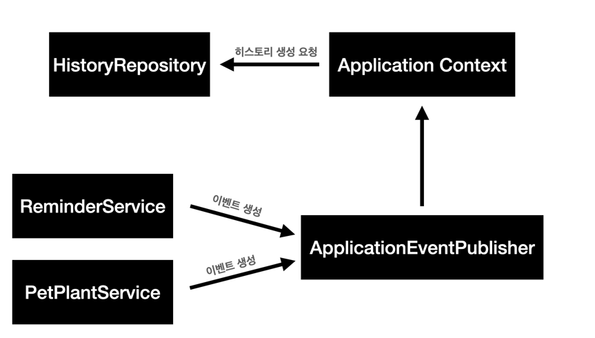

> 이 글은 우테코 피움팀 크루 '[주노](https://github.com/Choi-JJunho)'가 작성했습니다.

## 사건의 발단

물주기, 반려 식물 정보 등록 및 수정과 같은 행동에 대한 History를 기록해야한다.

이 과정에서 History를 기록하는 코드가 ReminderService, PetPlantService에 침투하는 상황이 발생했다.

History라는 도메인이 Reminder, PetPlant 그리고 앞으로 생겨날 히스토리가 필요한 로직들에 대해 강한 의존성을 가지게 될 것을 우려했다.

실제로 다음과 같은 코드가 작성되면서 그 심각성은 더욱 가깝게 다가왔다.

```java
@Transactional
public void water(ReminderCreateRequest reminderCreateRequest, Long petPlantId, Member member) {
    PetPlant petPlant = petPlantRepository.findById(petPlantId)
            .orElseThrow(() -> new NoSuchElementException("일치하는 반려 식물이 존재하지 않습니다. id: " + petPlantId));
    checkOwner(petPlant, member);
    LocalDate prevDate = petPlant.getLastWaterDate();
    petPlant.water(reminderCreateRequest.getWaterDate());

    HistoryCategory historyCategory = historyCategoryRepository.findByHistoryType(HistoryType.LAST_WATER_DATE)
            .orElseThrow(
                    () -> new NoSuchElementException("존재하지 않는 히스토리 타입입니다. type: " + HistoryType.LAST_WATER_DATE));

    History history = History.builder()
            .petPlant(petPlant)
            .date(reminderCreateRequest.getWaterDate())
            .historyCategory(historyCategory)
            .historyContent(HistoryContent.builder()
                    .previous(prevDate.toString())
                    .current(petPlant.getLastWaterDate().toString())
                    .build())
            .build();

    historyRepository.save(history);
}
```

이렇게 개발을 진행하다가는 모든 코드에 HistoryRepository, HistoryCategoryRepository들이 침투하게된다.

아무리 개발이 급해도 이건 아니다 싶어서 `History를 기록한다` 라는 행위에 대한 관심사를 분리하는 방법을 찾아봤다.

## 관심사 분리

관심사를 분리하는 방법으로 다음 두가지 방법을 찾았다.

`1. AOP를 사용한다.`

AOP의 `@Around`어노테이션을 이용하여 History 기록이 필요한 부분에 대해 기록하는 동작을 수행할 수 있다.

해당 방식은 다음과 같은 특징을 가진다.

- 포인트컷 표현식으로 대상 메소드 혹은 클래스를 지정할 수 있다.
- 메소드의 파라미터값, 반환값, 이름 등의 정보를 구할 수 있다.
- 내부에서 선언된 변수에 대해서는 접근할 수 없다.
- 선언된 메소드와 동일한 트랜잭션 주기를 가진다.

`2. Spring Event를 사용한다.`

Spring에서 제공하는 Event 기능을 사용할 수도 있다.

History와 관련된 Repository나 Service에 의존하지 않고 EventPublisher를 의존하게 하여 패키지간 의존성을 해결할 수 있다.

- 서비스간의 강한 의존성을 줄일 수 있다.
- 이벤트로 분리된 부분을 비동기 방식으로 처리할 수 있다.

AOP와 Event 두가지 방식을 알아봤다.

AOP를 사용하면 프로덕션 코드 내에서 History에 대해 아예 몰라도 된다는 이점이 있었지만 History 생성 간 내부 값이 필요한 경우 이에 대처하기 어렵다는 문제가 있었다.

이에 내부 값을 History에 맞는 양식으로 변환한 뒤 EventListener에게 위임하는 형태를 사용하기로 했다.

## Event 흐름

Event의 흐름 자체는 간단하다.


기존의 서비스 로직이 History라는 도메인에 대한 의존성을 가지게 되는 구조였다면



다음과 같이 History 도메인에 의존하지 않는 구조로 개선될 수 있다.

## Event 구현하기

Spring Event를 구현하기 위해서는 크게 3가지 요소가 필요하다.

### Event Class

> 해당 실습은 SpringBoot 3.1(Spring Framework 6) 환경에서 진행됩니다. 
> 
> (Spring Framework 4.2 이전 버전은 설정이 상이하니 이점 유의해주시기 바랍니다.)

우선 이벤트 클래스다.

이벤트 클래스는 이벤트를 처리하기 위해 필요한 데이터를 가지고있다.

```java
@Getter
@Validated
@RequiredArgsConstructor
public class HistoryEvent {

    @NotNull
    private final Long petPlantId;

    @NotNull
    private final String previous;

    @NotNull
    private final String current;

    @NotNull
    private final HistoryType historyType;
    
    @NotNull
    private final LocalDate date;
}
```

### Event Publisher

다음은 이벤트를 발행하는 publisher다.

Spring에서는 ApplicationEventPublisher의 publish() 메소드를 사용하여 Context에 이벤트를 발행할 수 있다.

```java
@Service
@Transactional(readOnly = true)
@RequiredArgsConstructor
public class ReminderService {
    ...
    private final ApplicationEventPublisher publisher;
    
    @Transactional
    public void water(ReminderCreateRequest reminderCreateRequest, Long petPlantId, Member member) {
        // 반려 식물 물주기 수행
        publisher.publishEvent(new HistoryEvent(...));
    }
    ...
}
```

### EventListener

마지막으로 이벤트 리스너다.

발행된 이벤트를 컨텍스트에서 잡아서 수행하는 역할을 한다.

```java
@Component
@RequiredArgsConstructor
public class HistoryEventListener {

    private final PetPlantRepository petPlantRepository;
    private final HistoryRepository historyRepository;
    private final HistoryCategoryRepository historyCategoryRepository;

    // 히스토리를 저장한다.
    @EventListener
    public void savePetPlantHistory(HistoryEvent historyEvent) {

        PetPlant petPlant = petPlantRepository.findById(historyEvent.getPetPlantId())
                .orElseThrow(() -> new NoSuchElementException("일치하는 반려 식물이 존재하지 않습니다. id: " + historyEvent.getPetPlantId()));

        HistoryCategory historyCategory = historyCategoryRepository.findByHistoryType(historyEvent.getHistoryType())
                .orElseThrow(() -> new NoSuchElementException("존재하지 않는 히스토리 타입입니다. type: " + historyEvent.getHistoryType()));

        History history = History.builder()
                .petPlant(petPlant)
                .date(historyEvent.getDate())
                .historyCategory(historyCategory)
                .historyContent(HistoryContent.builder()
                        .previous(historyEvent.getPrevious())
                        .current(historyEvent.getCurrent())
                        .build())
                .build();

        historyRepository.save(history);
    }
}
```

## 결론

Spring Event를 도입하여 도메인간의 결합도를 줄여봤다.

이벤트를 다루면 비동기 처리에 대한 이야기가 많이 보이는 것 같은데 아직 해당 작업이 비동기처리가 필요할 만큼 오래 걸리는 작업이라는 판단을 내리지 못했다.

비동기 처리는 나중에 추가로 다뤄보도록 하자.

## Reference

- https://wildeveloperetrain.tistory.com/217
- https://mangkyu.tistory.com/292