> 이 글은 우테코 피움팀 크루 '[주노](https://github.com/Choi-JJunho)'가 작성했습니다.

## 서론

기획부터 개발까지 하나의 프로그램이 생성되는 모든 프로세스를 경험할 수 있는 시간을 가졌다.

피움팀에서 어떤 방식을 통해 아이디어와 기능을 도출해나갔는지 기록해두고자 한다.

## 스프린트란?

스프린트는 팀이 일정량의 작업을 완료하는 시간이 정해진 짧은 기간을 의미한다.

여기서는 기획부터 데모수준의 프로그램이 나오는 단계까지를 하나의 스프린트라고 생각해볼 수 있겠다.

피움 팀은 구글 스프린트의 방법론을 차용해서 기능을 도출했다.

### 구글 스프린트

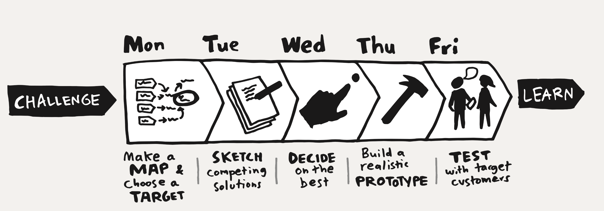

5일간 결과물을 도출하는 방법론으로 다음과 같은 17단계로 이어진다.

1. 현재 상황에 대한 구성원들의 생각과 문제 상황 공유
2. 스프린트를 통해 해결하고자 하는 목표 설정
3. 스프린트 질문 도출
4. 이해관계자의 구매 여정 Map 작성
5. 전문가 조언
6. HMW(어떻게 하면 ~할 수 있을까) 작성 및 선정
7. 스프린트 기간에 주력하고자 하는 1순위 타깃과 질문 선정
8. 번갯불 대화 및 솔루션 스케치
9. 고객 선정을 위한 설문지 작성
10. 프로토타입 제작을 위한 최종 솔루션 선정
11. 프로토타입 제작을 위한 스토리보드 만들기
12. 프로토타입 제작
13. 프로토타입 완성 및 시연
14. 고객 인터뷰용 질문 만들기 (인터뷰 담당자)
15. 타깃 고객 인터뷰 및 학습
16. 스프린트 이후의 개발 플랜 점검 및 향후 일정 논의
17. 성찰

### Figma - Figjam

오프라인 환경에서 종이, 캔버스, 포스트잇을 이용해서 각자의 의견을 종합해볼 수도 있지만 시간, 공간적 제약이 있을 때는 Figma를 사용해볼 수도 있다.

디자인 툴인 Figma에는 Figjam이라는 기능을 제공한다.

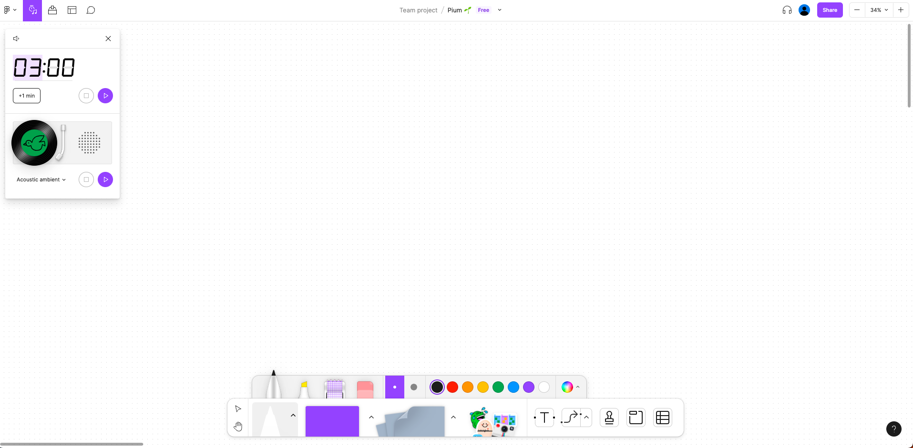

Figjam에서는 포스트잇, 연필그리기, 스티커붙이기, 타이머 등의 기능들을 제공한다.

> 개인적으로 타이머 기능을 적극 활용하는 것이 좋다고 생각했다.
위 [구글 스프린트](###구글-스프린트)의 `8. 번갯불 대화 및 솔루션 스케치` 항목에서 추구하는 목적이 무엇인지 생각해보면 정해진 시간내로 서로의 의견을 제시하여 회의가 늘어지지 않게 하기 위함임을 알 수 있다.
정해야할 내용이 많은 만큼 시간이 늘어지는 것만큼은 가장 경계해야한다고 생각한다.

## 서비스 주제

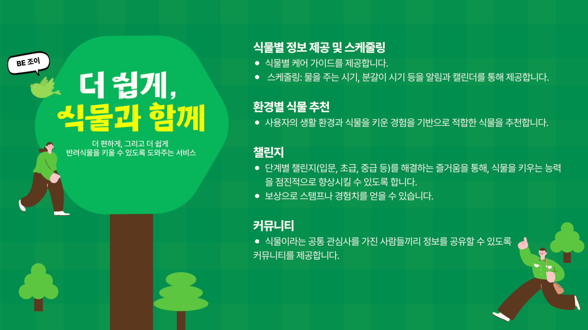

`식물을 잘 키울 수 있도록 도와주는 서비스`라는 주제로 팀이 이뤄졌다.

위 포스터를 확인했을 때 큰 주제로 추상적인 목표들이 즐비해있음을 확인할 수 있다.
주어진 시간이 짧기 때문에 핵심기능을 추려야할 필요가 있다.

> 💡 모든 과정을 진행할 때 이야기를 듣는 사람들은 형광펜 혹은 스티커 기능을 이용해 중요하다고 생각하는 부분에 색칠을 하며 듣는다. 형광펜과 스티커를 이용한 호응을 이용해 공통 관심사에 집중할 수 있으며 집중력이 분산되는 것도 예방할 수 있다.

> ⏰ 모든 과정에는 제한시간이 존재한다.
제한시간을 두고 회의가 루즈해지는 것을 막아야만한다!!

### 서비스의 목적과 가치

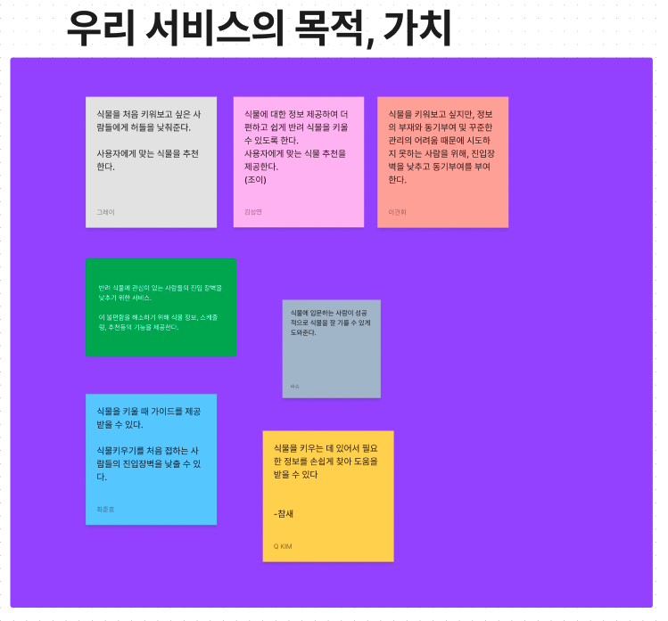

서비스의 목적과 가치에 대해 구상한다.

이 단계에서는 `서비스가 어떤 기능을 제공함으로서 어떤 문제를 해결한다`를 이야기하며 각자가 추상적인 목표를 어떤 방향으로 구체화하고 있는지 공유한다.

> ⏰ 제한시간 : 3분

### 서비스의 대상

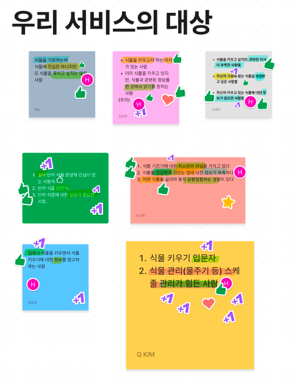

어떤 사용자가 이 서비스를 사용할 지 떠올리고 각자의 생각을 작성한다.

이후 각자가 자신의 생각을 이야기하는 시간을 가진다.

> ⏰ 제한시간 : 3분

### 어떻게 하면 ~문제를 해결할 수 있을까?

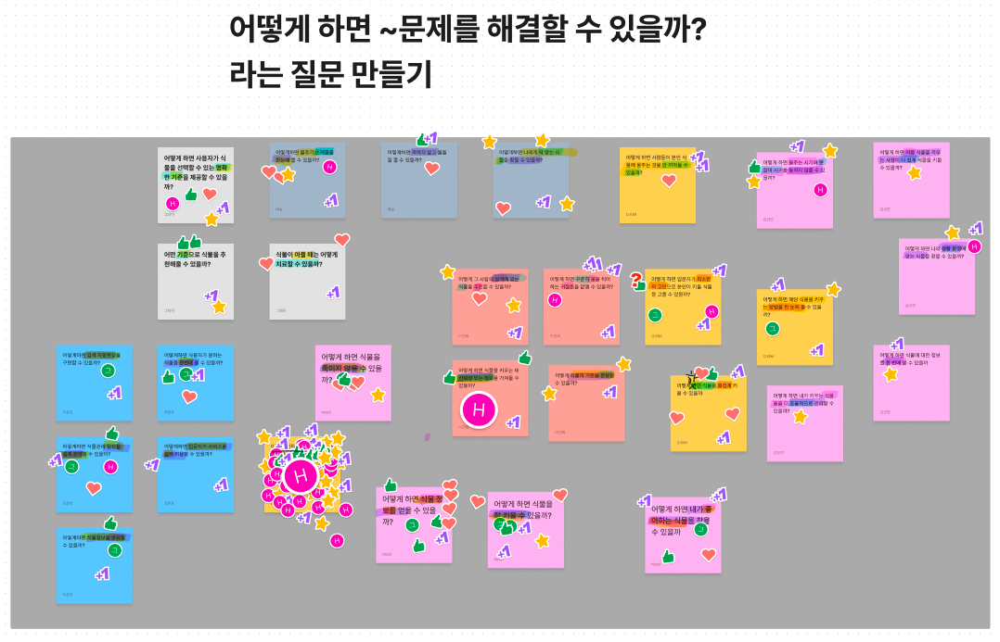

어떻게 하면 ~ 문제를 해결할 수 있을까? 라는 질문들을 작성하고 이야기한다.

이 과정을 통해 해결해야할 문제들을 인지할 수 있다.

이 때 기술적인 질문이 나오지 않도록 경계해야한다.
해당 과정을 수행하는 이유는 서비스의 목적을 구체화하기 위함이다.

- 어떻게 하면 제 시간에 식물에 물을 줄 수 있을까? (O)
- 어떻게 하면 무중단 배포를 할 수 있을까? (X)

> ⏰ 제한시간 : 5 ~ 8분

### 워드 클라우드

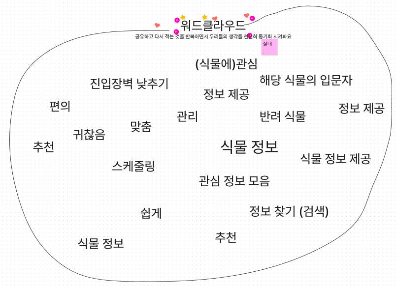

위 단계에서 나온 키워드들을 기준으로 단어들을 나열한다.
중요하게 생각되는 단어들은 크고 굵게 표기한다.

이 과정을 통해 키워드를 간략하게 추릴 수 있다.

> ⏰ 제한시간 : X

### (선택) 모바일 vs 데스크탑

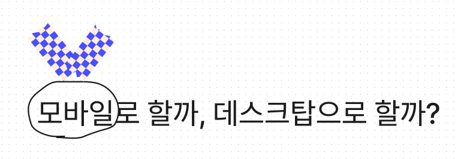

생각하는 서비스가 어떤 환경에서 운영될지 생각해본다.

이 과정을 통해 서비스가 어떻게 그려질지 대략적으로 생각해볼 수 있다.

> ⏰ 제한시간 : 2분

### 장치/요소/기능 브레인스토밍

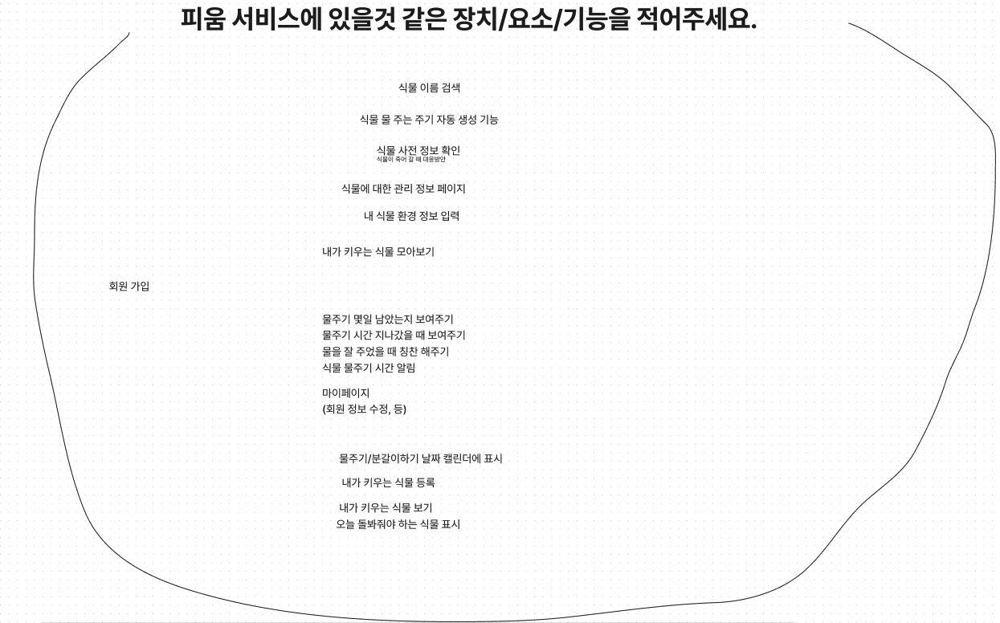

앞서 설정한 문제, 키워드 등을 참고하여 개발하고자 하는 서비스에 있을 것 같은 기능들을 브레인 스토밍 식으로 작성한다.

이 과정을 통해 서비스에 존재할 수 있는 기능들을 파악할 수 있다.

> ⏰ 제한시간 : 5 ~ 8분

### 지도 만들기

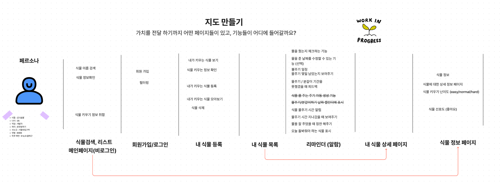

앞서 정의한 서비스 대상을 참고하여 구체적인 페르소나를 지정한다.
페르소나를 참고하여 어떤 페이지들이 존재할지 생각해본다.

위(`장치/요소/기능 브레인스토밍`)에서 도출된 기능들을 기반으로 각 페이지에 기능들을 작성한다.

이 과정을 통해 대략적인 서비스 흐름과 구성을 생각해 볼 수 있다.

> ⏰ 제한시간 : X

### 페이지 그려보기

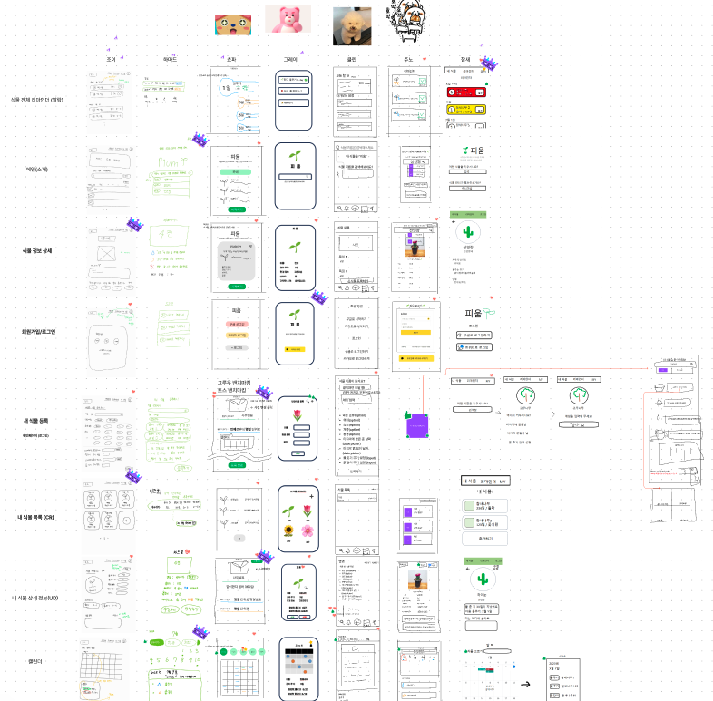

위 `지도 만들기` 활동에서 도출된 페이지들을 직접 그려보는 시간을 가진다.
팀원들 각자가 페이지가 어떻게 구성될지 대략적으로 그려본다.

잘 그릴 필요는 없다. 연필로 어떤 버튼이 어디에 위치할지, 어떤 기능이 존재하는지 정도만 알아볼 수 있을정도로 가볍게 스케치해도 좋다.

이 과정을 통해 각자가 생각하는 View를 공유하면서 서비스의 구현 방향성에 대한 싱크를 맞춰갈 수 있다.

> ⏰ 제한시간 : 각 페이지별 5분

### 결정권자 정하기 & 페이지 정하기

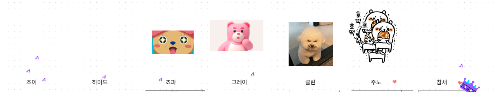

위 과정에서 작성한 페이지 중 하나의 페이지를 결정하기 위해 결정권자를 정한다.

결정권자는 팀원들의 투표로 정하고 페이지를 결정할 때 만큼은 결정권자의 권한이 가장 높은 수직적인 구조로 진행된다.
즉, 다시말해 페이지는 결정권자의 선택으로 정해진다.

결정권자를 뽑았다면 각 페이지를 정하는 시간을 가진다.

이 때 결정권자가 아닌 다른 팀원들은 자신의 페이지 혹은 자신이 마음에 드는 페이지에 대해 결정권자를 설득한다.

페이지를 결정 할 때 여러 페이지의 기능을 합칠 수도 있다.

> ⏰ 제한시간 : 각 페이지별 5분 
> 결정된 페이지들은 명예의전당👑 에 복사하여 올려둔다.
> 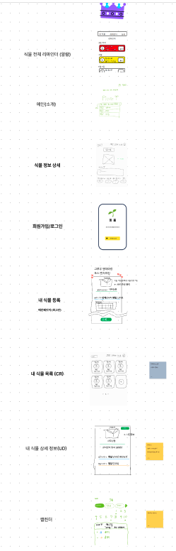

### BDD

BDD(Behavior Driven Development, 행위 주도 개발) 방법론을 차용한 방식으로 given - when - then 절로 해당 페이지에서 일어날 수 있는 모든 이벤트에 대해 정의한다.

이 과정을 통해 구체적인 기능 명세를 할 수 있다.

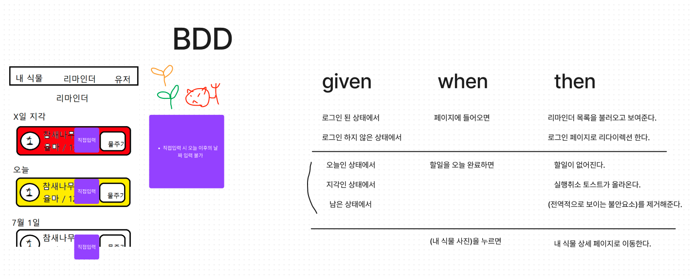

해당 방식은 UI 기반의 기능 명세에 치중할 수 있기 때문에 API 설계가 요구된다면 API 명세를 하는것을 추천한다.

> ⏰ 제한시간 : X

## 결론

구글 스프린트를 기반으로 피움 팀이 아이디어를 구체화하는 과정을 정리해봤다.

아이디어 도출 과정에 정답은 없지만 스프린트를 처음 해본 입장에서는 참고하면 좋은 방법이라고 생각되어 기록으로 남겨봤다.

## Reference

- [구글스프린트](https://brunch.co.kr/@brunchjwshim/90)
- [테오의 스프린트](https://velog.io/@teo/google-sprint-14)
- [Atlassian Sprint](https://www.atlassian.com/ko/agile/scrum/sprints)
- https://www.thesprintbook.com/the-design-sprint