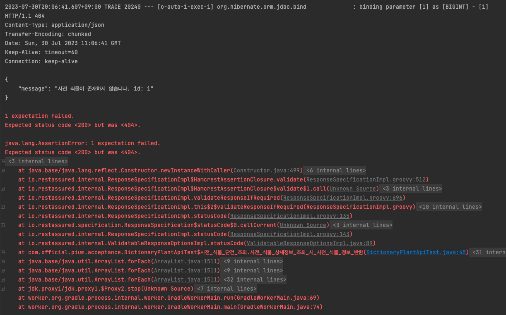

> 이 글은 우테코 피움팀 크루 '[하마드](https://github.com/rawfishthelgh)'가 작성했습니다.

## 개요
우아한테크코스 5기 피움 서비스의 인수 테스트를 작성하던 도중, 실제 포트에 애플리케이션을 구동시켜 테스트를 하는 `@SpringBootTest(webEnvironment = SpringBootTest.WebEnvironment.RANDOM_PORT)`
환경에서 테스트를 할 때, 테스트 메소드에서 분명히 해당 리소스를 저장했는데도 RestAssured의 GET 요청이 수행되지 않는 경우가 있었다. 이 이유를 파악하고 해결 과정을 정리한다
## 상황

당시 다음과 같은 인수 테스트 환경에서 테스트를 수행하고 있었다. 각 테스트 메소드가 끝난 후 트랜잭션을 롤백시켜 격리를 보장하기 위해 클래스 레벨에 `@Transactional` 어노테이션을 선언했었다.

AcceptanceTest 클래스를 상속받아 사전 식물의 조회를 테스트하는 인수 테스트를 작성했다.
37번째 줄의 `DictionaryPlant REQUEST = dictionaryPlantSupport.builder().build();` 는

다음과 같은 형태로 repository에 테스트용 엔티티 객체를 save하는 과정을 간편하게 하기 위해 작성된 DictionarySupport 클래스와 코드이다. 즉 37번 라인을 사용하면 임의의 객체 정보를 dB에 저장하는 insert 작업이 일어난다.

즉, 현재 테스트 메소드는 repository에 사전 식물 객체를 저장하고, 이를 RestAssured를 활용하여 실제 서버에서 요청을 보내 저장된 사전 식물이 조회되는지를 확인하는 과정이다.

그런데, 200 OK를 기대했던 테스트의 결과가 404 not found가 응답되고 사전 식물이 존재하지 않는다는 예외 메세지가 뜨는 것을 확인하게 되었다.

뭘까? insert 쿼리가 날아가지 않은 걸까? 로그를 확인해 보았다.

그러나, 로그에는 정확히 우리가 DictionarySupport에서 지정한 저장 메소드의 Insert 쿼리가 날아가는 것을 보고 있었다. 심지어 value 값도 모두 정확히 들어갔다.

select 쿼리가 잘못된게 아닌가? 확인해봤지만 예상한대로 나갔다.
여기까지 봐서는 이해가 안 간다. insert를 하고 select를 했는데 조회가 안 되니 말이다.
## RandomPort 환경에서의 스레드와 트랜잭션
이를 이해하기 위해서는 RandomPort 환경에서의 요청이 어떤 스레드를 갖는지를 알아야 한다. 이 내용은 스프링 공식 문서를 들여다볼 필요가 있다.
> If your test is @Transactional, it rolls back the transaction at the end of each test method by default. However, as using this arrangement with either RANDOM_PORT or DEFINED_PORT implicitly provides a real servlet environment, the HTTP client and server run in separate threads and, thus, in separate transactions. Any transaction initiated on the server does not roll back in this case.

> 테스트에 @Transactional이 붙어 있으면 롤백을 보장할 수 있다. 단, RANDOM_PORT 나 DEFINED_PORT 환경에서 테스트를 수행하면, 실제 서블릿 환경에서 테스트를 진행한다. 이 때 http 클라이언트(테스트)와 서버는 서로 다른 스레드를 갖는다. 즉 별개의 트랜잭션이 수행되는 것이다. 따라서 서버 쪽에서의 트랜잭션은 롤백되지 않는다.

쉽게 설명하자면, 랜덤 포트 환경에서 테스트를 수행하는 순간, localhost 포트 어딘가에 내장 서버를 띄운다. 그리고 그 서버에서 요청을 보내도록 하는 것이 RestAssured 이다. 따라서 RestAssured에서 보내는 요청은, 내가 해당 테스트 메소드에서 실행하는 스레드와 별개의 스레드를 갖는다. 따라서 트랜잭션도 각자 별개로 갖는다.

자, 아까 우리가 AcceptanceTest의 클래스 레벨에서 `@Transactional`을 선언했음을 기억할 것이다. 클래스 레벨에 이 어노테이션을 선언하면, 자동적으로 해당 클래스와 그를 상속한 메소드 레벨에 모두 트랜잭션이 걸린다.

따라서, 현재 테스트 메소드의 트랜잭션 범위는 다음 화살표와 같이 테스트가 끝날 때 까지 유지된다.

우리는 여기서 트랜잭션의 개념에 대해 다시 짚을 필요가 있다.
"트랜잭션이 끝나지 않았다"는 의미는 무엇인가?
내가 수행한 insert, update, delete 문이 커밋, 혹은 롤백되지 않았다는 뜻이다.

커밋되지 않았다는 뜻은 무엇인가?
데이터베이스의 갱신이 이뤄졌어도, 다른 스레드에서 확인할 수 없다는 뜻이다.
왜? 트랜잭션은 각자 격리되어 서로의 트랜잭션이 끝나기 전 까지는 연산 과정을 볼 수 없기 때문이다.(트랜잭션의 Isolation(격리성) 특징을 기억하자)

따라서, 현재 트랜잭션이 끝나기도 전에, 즉 반영되기도 전에 RestAssured를 통해 띄운 별개의 서버 스레드에서 GET 요청이 들어가니 해당 데이터를 확인할 수 없는 것이다.
정확히 말하면 트랜잭션이 커밋되지 않았을 때 까지의 데이터는, 다른 스레드 입장에서 그냥 없는 데이터다. 없는걸 조회하니 당연히 값이 안 나온다.

그래서 `@Transactional` 어노테이션을 제거하고 테스트를 수행했더니, 다음과 같이 통과하는 것을 볼 수 있다.

이해를 쉽게 하기 위해 바뀐 트랜잭션의 범위를 화살표로 표현하면, DictionaryPlant를 저장하는 과정에서 트랜잭션이 끝나고 커밋이 되어 db에 영속화가 완료된다.
따라서 이후 랜덤 포트의 스레드에서도 해당 데이터를 조회할 수 있다.

## 트랜잭션의 격리 이해하기

해당 동작에 대해 조금 더 설명하기 위해 별개의 스레드에 h2 database 콘솔을 띄워 확인해 보겠다. 위의 두 콘솔 화면은 세션 id가 다른 별개의 스레드를 갖는다. 편의상 위를 스레드A, 아래를 B라 하겠다

스레드 A에서 트랜잭션을 시작하기위해 Autocommit을 False로 변경한 후, 두 명의 member 데이터를 insert 했다.

이 때 A에서 select 문을 실행하면 데이터가 들어가 있는 것을 확인할 수 있다.

그러나, B에서 동일한 select문을 실행하면 데이터를 확인할 수 없다.
왜냐? 스레드 A의 트랜잭션은 끝나지 않았기 때문에 A에서 보이는 데이터는 "임시 반영"된 데이터일 뿐, "영속화"되지 않았기 때문이다.

만약 위와 같이 스레드 A에서 커밋을 하고 나면

이제는 스레드 B에서도 동일한 데이터를 확인할 수 있다.
## 결론
결국 메소드 레벨에 `@Transactional` 어노테이션이 붙은 탓에 save 메소드를 성공적으로 수행해도, 트랜잭션이 끝나지 않아(정확히 말하면 커밋되지 않아) 랜덤 포트 서버의 스레드에서 확인할 수 없는 것이다.
따라서 랜덤 포트 환경의 격리성을 보장하고자 할 때는 `@Transactional` 어노테이션을 사용하기 보다는, truncate를 하는 sql 스크립트를 사용하는 방법을 고려하는게 더 적절하다고 생각한다.

