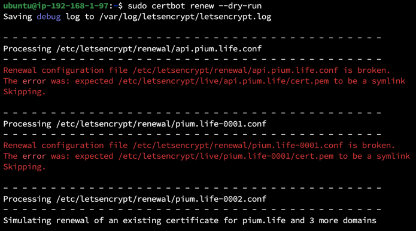
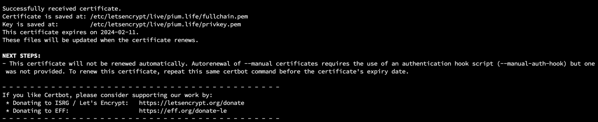

> 이 글은 우테코 피움팀 크루 '[주노](https://github.com/Choi-JJunho)'가 작성했습니다.

## 사건의 발단


https 인증서가 만료되어 https로 서비스 접근을 할 수 없게 되었다.


만료된 인증서를 어떻게 관리해야할 지 알아보자.

## 인증서 갱신 가능 확인

certbot을 이용한다면 `certbot renew` 명령어를 이용해 인증서를 갱신할 수 있다. 

```shell
sudo certbot renew --dry-run
```

위 명령어를 통해 certbot이 가지고 있는 SSL 인증서에 대한 갱신 시뮬레이션을 실행한다

> `--dry-run`을 붙이면 실제 실행하지 않고 시뮬레이션을 수행한다.




시뮬레이션 실행 결과 challenge 방식을 이용한 SSL 인증서가 갱신이 되지 않는 문제가 발생하고있다.

왜 이럴까?

### 배포방식 변경

초기 인증서 발급 시에는 pium.life라는 도메인을 서버에서 nginx를 이용해 정적 파일을 서빙하는 방식으로 구성했다.

실제 돌아가고 있는 웹 서버에 특정 파일 쓰기 작업을 통해 인증하는 webroot 방식을 사용하고 있었기 때문에 별도의 challenge를 수행하지 않아도 됐던 것이다.

> webroot 인증 방식 요약: 접근할 수 있는 특정 디렉터리를 제공해서 접근이 가능한지 확인하는 방식이다.


> [certbot docs - Getting certificates](https://eff-certbot.readthedocs.io/en/stable/using.html#getting-certificates-and-choosing-plugins)

하지만 중간에 S3를 이용해 프론트엔드를 배포하는 방식으로 변경하면서 더 이상 자체적인 웹 서버에서 정적 파일을 서빙하지 않는다.

자칫하면 설정이 꼬일 수 있으니 만료된 인증서를 모두 제거하고 새로 발급받도록 한다.
추가적으로 인증서 재발급을 어떻게 수행하는 지 과정을 정리해보자.

## 인증서 재발급

인증서를 재발급 받아보자.

### webroot 방식


우선 서버에서 관리중인 도메인 `api.pium.life`에 대해서 nginx 방식으로 인증서를 새롭게 발급받는다.

```shell
sudo certbot --nginx
```

### manual 방식

다음은 서버에서 관리하지 않고 있는 도메인에 대해서 인증서를 재발급 받도록 한다.

```shell
sudo certbot certonly --manual --preferred-challenges dns -d pium.life,dev.pium.life,static.pium.life
```


> https://toolbox.googleapps.com/apps/dig/#TXT/_acme-challenge.dev.pium.life 확인
> 
> 



발급 완료 후 manual 방식은 자동 갱신이 불가하다는 메시지가 나오는 것도 확인할 수 있다.

> - This certificate will not be renewed automatically. Autorenewal of --manual certificates requires the use of an authentication hook script (--manual-auth-hook) but one was not provided. To renew this certificate, repeat this same certbot command before the certificate's expiry date.


발급받은 인증서를 ACM에 올려준다.


cloudfront에 새로 발급받은 인증서를 적용해준다.

## 자동갱신에 대해

자동갱신을 적용하기에 앞서 다음 명령어를 통해 만료일을 인증서를 확인해보자

```shell
sudo certbot certificates
```


### webroot 방식

서버 자체에서 웹 서버를 이용해 배포중이라면 webroot 방식으로 인증을 할 수 있기 때문에 웹 서버에 crontab을 등록하여 자동갱신을 수행할 수 있다.

#### 날짜 확인


서버 시간이 어느나라를 기준으로 맞춰져있는지 확인한다.

피움은 KST로 맞춰져있다.

#### crontab 등록

```shell
sudo crontab -e
```

crontab에 다음 명령어를 등록한다.

매달 1일 자정에 인증서 갱신을 시도한다, 갱신 후 nginx 재시작한다.

`0 0 1 * * certbot renew --renew-hook="sudo systemctl restart nginx`

```shell
sudo service cron restart
```

crontab을 재시작하여 작성한 내용을 적용한다.

### manual 방식

manual 방식은 자동갱신을 할 수 없기 때문에 수동으로 갱신해줘야한다.

## 결론

manual 방식을 사용하고 있다면 SSL 인증서 갱신을 수행해야겠다.
